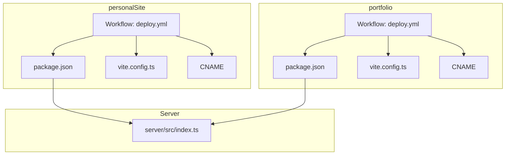
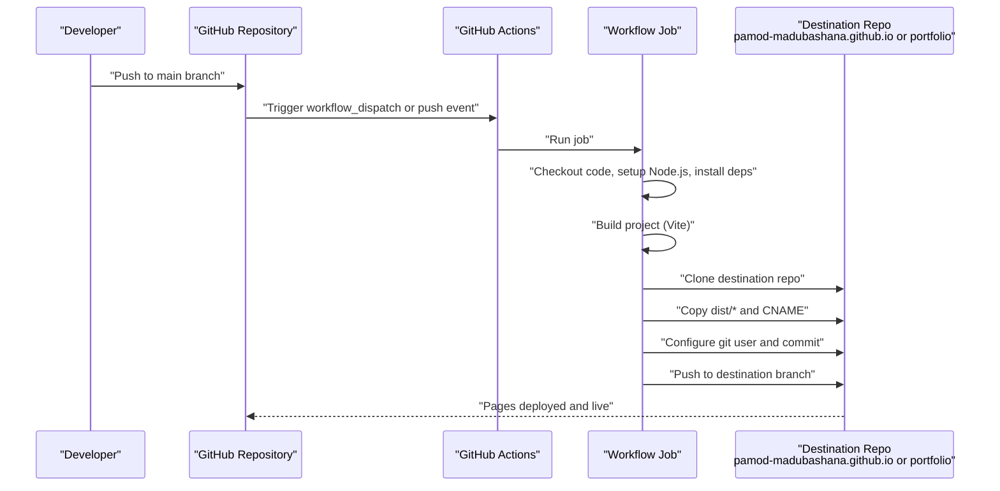
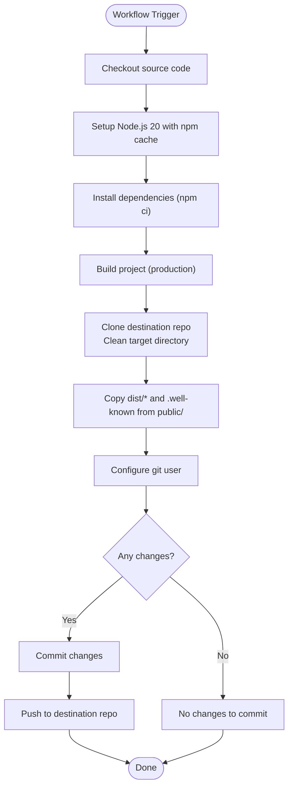
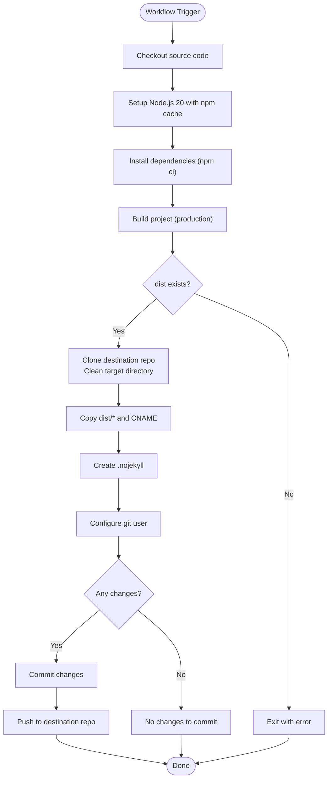
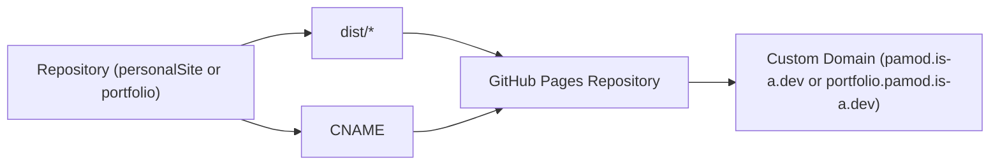
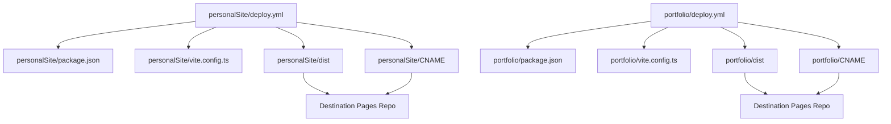

# Deployment Pipeline

<cite>
**Referenced Files in This Document**
- [personalSite/.github/workflows/deploy.yml](file://personalSite/.github/workflows/deploy.yml)
- [portfolio/.github/workflows/deploy.yml](file://portfolio/.github/workflows/deploy.yml)
- [personalSite/CNAME](file://personalSite/CNAME)
- [portfolio/CNAME](file://portfolio/CNAME)
- [CNAME](file://CNAME)
- [personalSite/package.json](file://personalSite/package.json)
- [portfolio/package.json](file://portfolio/package.json)
- [personalSite/vite.config.ts](file://personalSite/vite.config.ts)
- [portfolio/vite.config.ts](file://portfolio/vite.config.ts)
- [personalSite/.env.example](file://personalSite/.env.example)
- [portfolio/.env.example](file://portfolio/.env.example)
- [server/src/index.ts](file://server/src/index.ts)
</cite>

## Table of Contents
1. [Introduction](#introduction)
2. [Project Structure](#project-structure)
3. [Core Components](#core-components)
4. [Architecture Overview](#architecture-overview)
5. [Detailed Component Analysis](#detailed-component-analysis)
6. [Dependency Analysis](#dependency-analysis)
7. [Performance Considerations](#performance-considerations)
8. [Troubleshooting Guide](#troubleshooting-guide)
9. [Conclusion](#conclusion)
10. [Appendices](#appendices)

## Introduction
This document explains the deployment pipeline for two frontend applications: personalSite and portfolio. It covers the CI/CD process orchestrated via GitHub Actions workflows, build steps, environment variable management, artifact deployment, domain and DNS configuration, and operational practices for staging and production. It also provides guidance on customization, automated testing, notifications, rollback procedures, and advanced deployment strategies such as blue-green deployments.

## Project Structure
Both applications share a similar structure:
- Source code under each application’s root directory
- A GitHub Actions workflow under .github/workflows/deploy.yml
- Build artifacts placed into a dist directory after running the build script
- Domain configuration via a CNAME file at the repository root or inside the public directory

Key deployment-relevant files:
- personalSite/.github/workflows/deploy.yml
- portfolio/.github/workflows/deploy.yml
- personalSite/CNAME and portfolio/CNAME
- personalSite/package.json and portfolio/package.json
- personalSite/vite.config.ts and portfolio/vite.config.ts
- personalSite/.env.example and portfolio/.env.example
- server/src/index.ts (backend service used by the frontend builds)

**Diagram sources**
- [personalSite/.github/workflows/deploy.yml](file://personalSite/.github/workflows/deploy.yml#L1-L81)
- [portfolio/.github/workflows/deploy.yml](file://portfolio/.github/workflows/deploy.yml#L1-L89)
- [personalSite/package.json](file://personalSite/package.json#L1-L113)
- [portfolio/package.json](file://portfolio/package.json#L1-L74)
- [personalSite/vite.config.ts](file://personalSite/vite.config.ts#L1-L61)
- [portfolio/vite.config.ts](file://portfolio/vite.config.ts#L1-L16)
- [personalSite/CNAME](file://personalSite/CNAME#L1-L1)
- [portfolio/CNAME](file://portfolio/CNAME#L1-L1)
- [server/src/index.ts](file://server/src/index.ts#L1-L158)

**Section sources**
- [personalSite/.github/workflows/deploy.yml](file://personalSite/.github/workflows/deploy.yml#L1-L81)
- [portfolio/.github/workflows/deploy.yml](file://portfolio/.github/workflows/deploy.yml#L1-L89)
- [personalSite/package.json](file://personalSite/package.json#L1-L113)
- [portfolio/package.json](file://portfolio/package.json#L1-L74)
- [personalSite/vite.config.ts](file://personalSite/vite.config.ts#L1-L61)
- [portfolio/vite.config.ts](file://portfolio/vite.config.ts#L1-L16)
- [personalSite/CNAME](file://personalSite/CNAME#L1-L1)
- [portfolio/CNAME](file://portfolio/CNAME#L1-L1)
- [server/src/index.ts](file://server/src/index.ts#L1-L158)

## Core Components
- GitHub Actions Workflows: Two identical workflows named “Build and Deploy to Fronthost” trigger on pushes to main and allow manual dispatch. They install dependencies, build the project, and deploy the generated dist directory to target repositories.
- Build Scripts and Tooling:
  - personalSite uses a build script that generates SEO assets and prerenders content before building.
  - portfolio uses a standard Vite build script.
- Environment Variables:
  - personalSite defines VITE_API_BASE_URL and VITE_GITHUB_USERNAME in its .env.example.
  - portfolio defines VITE_API_BASE_URL and VITE_API_BASE_URL_PROD in its .env.example.
- Domain Configuration:
  - personalSite and portfolio include a CNAME file at the repository root or inside the public directory, pointing to pamod.is-a.dev and portfolio.pamod.is-a.dev respectively.
- Backend Service:
  - The backend exposes API routes and supports dynamic CORS configuration based on environment variables.

**Section sources**
- [personalSite/.github/workflows/deploy.yml](file://personalSite/.github/workflows/deploy.yml#L1-L81)
- [portfolio/.github/workflows/deploy.yml](file://portfolio/.github/workflows/deploy.yml#L1-L89)
- [personalSite/package.json](file://personalSite/package.json#L6-L13)
- [portfolio/package.json](file://portfolio/package.json#L5-L9)
- [personalSite/.env.example](file://personalSite/.env.example#L1-L10)
- [portfolio/.env.example](file://portfolio/.env.example#L1-L3)
- [personalSite/CNAME](file://personalSite/CNAME#L1-L1)
- [portfolio/CNAME](file://portfolio/CNAME#L1-L1)
- [server/src/index.ts](file://server/src/index.ts#L38-L62)

## Architecture Overview
The deployment pipeline follows a CI/CD pattern:
- On push to main or manual dispatch, the workflow checks out the code, sets up Node.js, installs dependencies, and builds the project.
- The workflow clones the destination repository, cleans it, copies the built artifacts, and commits/pushes changes using a personal access token.
- The frontend applications are served from GitHub Pages repositories configured with CNAME records for custom domains.

**Diagram sources**
- [personalSite/.github/workflows/deploy.yml](file://personalSite/.github/workflows/deploy.yml#L24-L79)
- [portfolio/.github/workflows/deploy.yml](file://portfolio/.github/workflows/deploy.yml#L25-L86)

## Detailed Component Analysis

### Personal Site Workflow
- Triggers: push to main branch and manual workflow_dispatch.
- Permissions: read for contents and statuses.
- Concurrency: grouped by workflow and ref, cancel in progress.
- Steps:
  - Checkout source code.
  - Setup Node.js 20 with npm caching.
  - Install dependencies using npm ci.
  - Build project with production environment and inject VITE_API_BASE_URL and VITE_GITHUB_USERNAME from secrets.
  - Deploy to the GitHub Pages repository for the personal site using a personal access token, copying dist/* and preserving .well-known assets from public/.
  - Commit and push changes if there are differences.

**Diagram sources**
- [personalSite/.github/workflows/deploy.yml](file://personalSite/.github/workflows/deploy.yml#L24-L79)

**Section sources**
- [personalSite/.github/workflows/deploy.yml](file://personalSite/.github/workflows/deploy.yml#L1-L81)
- [personalSite/.env.example](file://personalSite/.env.example#L1-L10)
- [personalSite/public/CNAME](file://personalSite/public/CNAME#L1-L1)

### Portfolio Workflow
- Triggers: push to main branch and manual workflow_dispatch.
- Permissions: read for contents and statuses.
- Concurrency: grouped by workflow and ref, cancel in progress.
- Steps:
  - Checkout source code.
  - Setup Node.js 20 with npm caching.
  - Install dependencies using npm ci.
  - Build project with production environment and validate dist directory exists.
  - Deploy to the GitHub Pages repository for the portfolio using a personal access token, copying dist/* and CNAME.
  - Create .nojekyll to prevent GitHub Pages processing with Jekyll.
  - Commit and push changes if there are differences.

**Diagram sources**
- [portfolio/.github/workflows/deploy.yml](file://portfolio/.github/workflows/deploy.yml#L25-L86)

**Section sources**
- [portfolio/.github/workflows/deploy.yml](file://portfolio/.github/workflows/deploy.yml#L1-L89)
- [portfolio/CNAME](file://portfolio/CNAME#L1-L1)

### Build Configuration and Environment Variables
- personalSite:
  - Build script runs SEO sitemap generation and prerendering before Vite build.
  - Vite configuration sets base path, dev server, proxy for /api, history fallback middleware, aliases, and includes dot directories for assets like .well-known.
  - Environment variables include VITE_API_BASE_URL and VITE_GITHUB_USERNAME.
- portfolio:
  - Build script runs Vite build.
  - Vite configuration sets dev server port and plugin aliases.
  - Environment variables include VITE_API_BASE_URL and VITE_API_BASE_URL_PROD.

**Section sources**
- [personalSite/package.json](file://personalSite/package.json#L6-L13)
- [personalSite/package.json](file://personalSite/package.json#L96-L111)
- [personalSite/vite.config.ts](file://personalSite/vite.config.ts#L10-L60)
- [personalSite/.env.example](file://personalSite/.env.example#L1-L10)
- [portfolio/package.json](file://portfolio/package.json#L5-L9)
- [portfolio/vite.config.ts](file://portfolio/vite.config.ts#L5-L15)
- [portfolio/.env.example](file://portfolio/.env.example#L1-L3)

### Domain Setup and DNS Management
- personalSite and portfolio include a CNAME file at the repository root or inside the public directory pointing to pamod.is-a.dev and portfolio.pamod.is-a.dev respectively.
- The CNAME files are copied during the deployment process to the destination repositories so GitHub Pages serves the custom domain.

**Diagram sources**
- [personalSite/CNAME](file://personalSite/CNAME#L1-L1)
- [portfolio/CNAME](file://portfolio/CNAME#L1-L1)
- [personalSite/.github/workflows/deploy.yml](file://personalSite/.github/workflows/deploy.yml#L59-L60)
- [portfolio/.github/workflows/deploy.yml](file://portfolio/.github/workflows/deploy.yml#L63-L66)

**Section sources**
- [personalSite/CNAME](file://personalSite/CNAME#L1-L1)
- [portfolio/CNAME](file://portfolio/CNAME#L1-L1)
- [personalSite/public/CNAME](file://personalSite/public/CNAME#L1-L1)
- [portfolio/public/CNAME](file://portfolio/public/CNAME#L1-L1)
- [personalSite/.github/workflows/deploy.yml](file://personalSite/.github/workflows/deploy.yml#L59-L60)
- [portfolio/.github/workflows/deploy.yml](file://portfolio/.github/workflows/deploy.yml#L63-L66)

### Backend Integration and CORS
- The backend service exposes API routes and determines allowed CORS origins dynamically based on environment variables.
- It supports production and development origins, with configurable origins via environment variables and defaults for local development.

**Section sources**
- [server/src/index.ts](file://server/src/index.ts#L38-L62)
- [server/src/index.ts](file://server/src/index.ts#L68-L83)

## Dependency Analysis
- Workflow-to-build:
  - Both workflows depend on the respective package.json build scripts and Vite configuration.
- Build-to-artifacts:
  - personalSite build produces dist with prerendered content and SEO assets.
  - portfolio build produces dist with compiled assets.
- Deployment-to-destination:
  - Workflows clone destination repositories and copy dist/* plus CNAME.
- Domain-to-pages:
  - CNAME files enable GitHub Pages to serve custom domains.

**Diagram sources**
- [personalSite/.github/workflows/deploy.yml](file://personalSite/.github/workflows/deploy.yml#L34-L45)
- [portfolio/.github/workflows/deploy.yml](file://portfolio/.github/workflows/deploy.yml#L34-L45)
- [personalSite/package.json](file://personalSite/package.json#L6-L13)
- [portfolio/package.json](file://portfolio/package.json#L5-L9)
- [personalSite/vite.config.ts](file://personalSite/vite.config.ts#L40-L59)
- [portfolio/vite.config.ts](file://portfolio/vite.config.ts#L5-L15)
- [personalSite/CNAME](file://personalSite/CNAME#L1-L1)
- [portfolio/CNAME](file://portfolio/CNAME#L1-L1)

**Section sources**
- [personalSite/.github/workflows/deploy.yml](file://personalSite/.github/workflows/deploy.yml#L34-L45)
- [portfolio/.github/workflows/deploy.yml](file://portfolio/.github/workflows/deploy.yml#L34-L45)
- [personalSite/package.json](file://personalSite/package.json#L6-L13)
- [portfolio/package.json](file://portfolio/package.json#L5-L9)
- [personalSite/vite.config.ts](file://personalSite/vite.config.ts#L40-L59)
- [portfolio/vite.config.ts](file://portfolio/vite.config.ts#L5-L15)
- [personalSite/CNAME](file://personalSite/CNAME#L1-L1)
- [portfolio/CNAME](file://portfolio/CNAME#L1-L1)

## Performance Considerations
- Build caching: Both workflows use npm ci and Node.js caching to reduce installation time.
- Prerendering: personalSite prerenders key routes to improve initial load performance.
- Asset splitting: Vite configuration splits vendor and UI bundles to optimize caching.
- Minification and sourcemaps: personalSite disables sourcemaps in production for smaller bundles.

Recommendations:
- Enable parallel jobs for linting and tests if added to the workflow.
- Consider pre-rendering additional routes if content grows.
- Monitor bundle sizes and adjust manualChunks as needed.

**Section sources**
- [personalSite/.github/workflows/deploy.yml](file://personalSite/.github/workflows/deploy.yml#L28-L35)
- [portfolio/.github/workflows/deploy.yml](file://portfolio/.github/workflows/deploy.yml#L28-L36)
- [personalSite/package.json](file://personalSite/package.json#L96-L111)
- [personalSite/vite.config.ts](file://personalSite/vite.config.ts#L46-L56)

## Troubleshooting Guide
Common issues and resolutions:
- Build fails due to missing dist:
  - Ensure the build step completes and creates the dist directory. The portfolio workflow explicitly validates dist existence.
- Missing CNAME or incorrect domain:
  - Verify the CNAME file exists in the repository root or public directory and matches the intended domain.
- Authentication failures:
  - Confirm the personal access token secret is configured and has permissions to push to the destination repository.
- CORS errors:
  - Ensure the backend CORS configuration includes the frontend production URL and any additional origins via environment variables.
- No changes detected:
  - If the destination repository is clean or unchanged, the workflow reports no changes to commit.

Operational tips:
- Add a health check endpoint on the backend to monitor service availability.
- Use GitHub Actions logs to inspect build and deployment steps.
- Validate DNS propagation for custom domains.

**Section sources**
- [portfolio/.github/workflows/deploy.yml](file://portfolio/.github/workflows/deploy.yml#L42-L45)
- [personalSite/.github/workflows/deploy.yml](file://personalSite/.github/workflows/deploy.yml#L47-L48)
- [portfolio/.github/workflows/deploy.yml](file://portfolio/.github/workflows/deploy.yml#L54-L57)
- [personalSite/.github/workflows/deploy.yml](file://personalSite/.github/workflows/deploy.yml#L62-L65)
- [server/src/index.ts](file://server/src/index.ts#L38-L62)

## Conclusion
The deployment pipeline leverages GitHub Actions to automate building and deploying both personalSite and portfolio to GitHub Pages repositories. By managing environment variables, copying CNAME files, and validating build outputs, the workflows ensure reliable deployments to custom domains. The backend service supports flexible CORS configuration to accommodate both development and production frontends. With proper secrets management, monitoring, and optional CI tests, the pipeline can be extended to support staging, production, and advanced deployment strategies.

## Appendices

### Staging and Production Strategies
- Separate branches: Use feature branches for staging and main for production.
- Environment-specific secrets: Store distinct secrets for staging and production environments.
- Conditional deployment: Gate deployments to production via pull requests or manual approval.

### Rollback Procedures
- Tag releases: Create Git tags for production releases to quickly revert.
- Re-deploy previous tag: Modify the workflow to checkout a specific tag and redeploy to the production repository.

### Environment-Specific Configurations
- personalSite:
  - VITE_API_BASE_URL and VITE_GITHUB_USERNAME are injected from secrets during build.
- portfolio:
  - VITE_API_BASE_URL and VITE_API_BASE_URL_PROD are defined in .env.example for local and production overrides.

### Customizing Deployment Workflows
- Add linting and testing steps before deployment.
- Introduce matrix builds for multiple Node.js versions.
- Split jobs into build and deploy stages for better observability.

### Automated Testing in CI/CD
- Add test scripts to package.json and run them in the workflow before deployment.
- Use coverage reporting and publish results to a service if desired.

### Deployment Notifications
- Use GitHub Actions notifications or external services to alert on deployment status.
- Post deployment health checks to a monitoring service.

### Monitoring Deployment Health
- Expose a /health endpoint on the backend and poll it after deployment.
- Track GitHub Pages deployment status and domain availability.