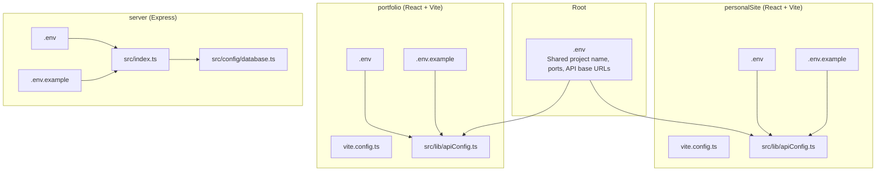
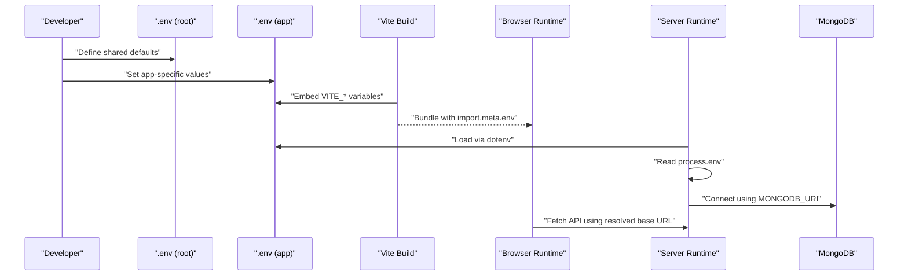
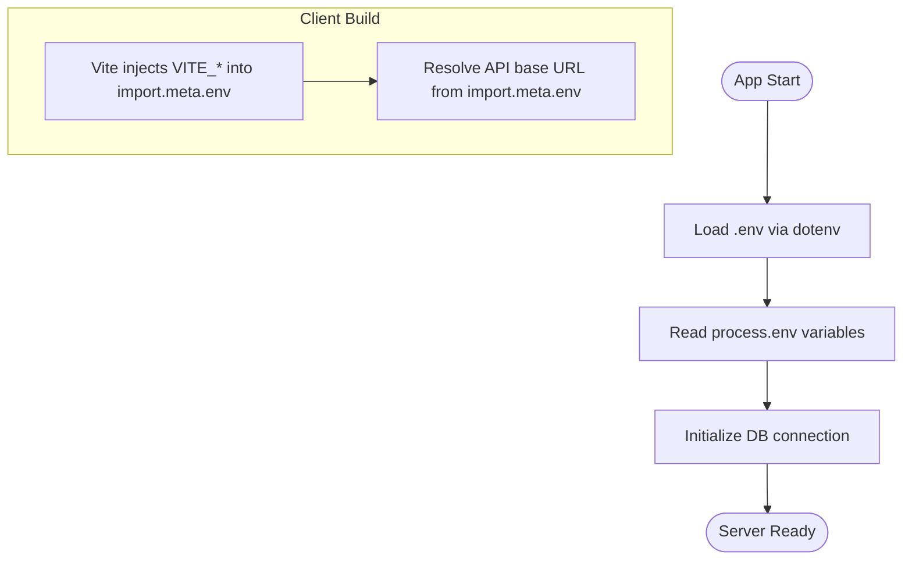
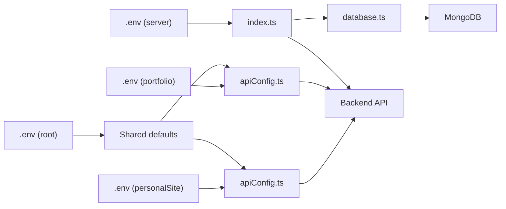

# Environment Management

<cite>
**Referenced Files in This Document**
- [.env](file://.env)
- [personalSite/.env](file://personalSite/.env)
- [personalSite/.env.example](file://personalSite/.env.example)
- [personalSite/vite.config.ts](file://personalSite/vite.config.ts)
- [personalSite/src/lib/apiConfig.ts](file://personalSite/src/lib/apiConfig.ts)
- [portfolio/.env](file://portfolio/.env)
- [portfolio/.env.example](file://portfolio/.env.example)
- [portfolio/vite.config.ts](file://portfolio/vite.config.ts)
- [portfolio/src/lib/apiConfig.ts](file://portfolio/src/lib/apiConfig.ts)
- [server/.env](file://server/.env)
- [server/.env.example](file://server/.env.example)
- [server/src/index.ts](file://server/src/index.ts)
- [server/src/config/database.ts](file://server/src/config/database.ts)
</cite>

## Table of Contents
1. [Introduction](#introduction)
2. [Project Structure](#project-structure)
3. [Core Components](#core-components)
4. [Architecture Overview](#architecture-overview)
5. [Detailed Component Analysis](#detailed-component-analysis)
6. [Dependency Analysis](#dependency-analysis)
7. [Performance Considerations](#performance-considerations)
8. [Troubleshooting Guide](#troubleshooting-guide)
9. [Conclusion](#conclusion)
10. [Appendices](#appendices)

## Introduction
This document explains environment variable management across the monorepo’s personalSite, portfolio, and server applications. It covers configuration structure, naming conventions, environment-specific variables, security best practices, templates (.env.example), build-time vs runtime handling, validation patterns, and practical setup steps for local, staging, and production. It also includes troubleshooting tips and guidance for feature flags and hot-reloading during development.

## Project Structure
The monorepo organizes environment configuration per application with shared root-level variables for cross-project coordination. Each application defines its own .env and .env.example, and client applications centralize API base URL resolution via dedicated configuration modules.

**Diagram sources**
- [.env](file://.env#L1-L17)
- [personalSite/.env](file://personalSite/.env#L1-L7)
- [personalSite/.env.example](file://personalSite/.env.example#L1-L10)
- [personalSite/vite.config.ts](file://personalSite/vite.config.ts#L1-L61)
- [personalSite/src/lib/apiConfig.ts](file://personalSite/src/lib/apiConfig.ts#L1-L75)
- [portfolio/.env](file://portfolio/.env#L1-L3)
- [portfolio/.env.example](file://portfolio/.env.example#L1-L3)
- [portfolio/vite.config.ts](file://portfolio/vite.config.ts#L1-L16)
- [portfolio/src/lib/apiConfig.ts](file://portfolio/src/lib/apiConfig.ts#L1-L19)
- [server/.env](file://server/.env#L1-L27)
- [server/.env.example](file://server/.env.example#L1-L27)
- [server/src/index.ts](file://server/src/index.ts#L1-L158)
- [server/src/config/database.ts](file://server/src/config/database.ts#L1-L61)

**Section sources**
- [.env](file://.env#L1-L17)
- [personalSite/.env](file://personalSite/.env#L1-L7)
- [personalSite/.env.example](file://personalSite/.env.example#L1-L10)
- [portfolio/.env](file://portfolio/.env#L1-L3)
- [portfolio/.env.example](file://portfolio/.env.example#L1-L3)
- [server/.env](file://server/.env#L1-L27)
- [server/.env.example](file://server/.env.example#L1-L27)

## Core Components
- Root environment file: Defines shared metadata and defaults (project name, common ports, API base URLs).
- Application-level environment files: Define app-specific variables and overrides.
- Client API configuration: Centralizes API base URL selection based on environment and Vite prefixes.
- Server configuration: Loads environment variables, configures CORS, rate limiting, and database connectivity.

Key responsibilities:
- personalSite: Uses Vite’s VITE_ prefix for client-visible variables and resolves API base URL via import.meta.env.
- portfolio: Similar to personalSite but simpler API configuration.
- server: Uses process.env for backend variables, loads .env via dotenv, and applies environment-aware CORS and logging.

**Section sources**
- [.env](file://.env#L1-L17)
- [personalSite/.env](file://personalSite/.env#L1-L7)
- [personalSite/.env.example](file://personalSite/.env.example#L1-L10)
- [personalSite/src/lib/apiConfig.ts](file://personalSite/src/lib/apiConfig.ts#L1-L75)
- [portfolio/.env](file://portfolio/.env#L1-L3)
- [portfolio/.env.example](file://portfolio/.env.example#L1-L3)
- [portfolio/src/lib/apiConfig.ts](file://portfolio/src/lib/apiConfig.ts#L1-L19)
- [server/.env](file://server/.env#L1-L27)
- [server/.env.example](file://server/.env.example#L1-L27)
- [server/src/index.ts](file://server/src/index.ts#L1-L158)
- [server/src/config/database.ts](file://server/src/config/database.ts#L1-L61)

## Architecture Overview
Environment variables flow from files to runtime contexts:
- Root .env supplies shared defaults.
- Application .env overrides and extends root values.
- Client builds embed VITE_* variables at build time; runtime reads import.meta.env.
- Server loads .env at startup via dotenv and reads process.env at runtime.

**Diagram sources**
- [.env](file://.env#L1-L17)
- [personalSite/.env](file://personalSite/.env#L1-L7)
- [personalSite/.env.example](file://personalSite/.env.example#L1-L10)
- [personalSite/src/lib/apiConfig.ts](file://personalSite/src/lib/apiConfig.ts#L1-L75)
- [server/.env](file://server/.env#L1-L27)
- [server/src/index.ts](file://server/src/index.ts#L1-L158)
- [server/src/config/database.ts](file://server/src/config/database.ts#L1-L61)

## Detailed Component Analysis

### Naming Conventions and Templates
- Client applications (personalSite, portfolio):
  - Use VITE_ prefix for variables consumed by the browser (Vite injects these into import.meta.env).
  - Provide .env.example with placeholders for API base URLs and optional GitHub username.
- Server application:
  - Use uppercase names without VITE_ prefix (consumed via process.env).
  - Provide .env.example with database URI, JWT secret, port, frontend URL, GitHub credentials, admin email, and email delivery settings.

Recommended practice:
- Keep secrets out of client bundles by avoiding VITE_ for sensitive data.
- Use descriptive names and group related variables (e.g., API base URLs, CORS origins).

**Section sources**
- [personalSite/.env.example](file://personalSite/.env.example#L1-L10)
- [personalSite/.env](file://personalSite/.env#L1-L7)
- [portfolio/.env.example](file://portfolio/.env.example#L1-L3)
- [portfolio/.env](file://portfolio/.env#L1-L3)
- [server/.env.example](file://server/.env.example#L1-L27)
- [server/.env](file://server/.env#L1-L27)

### Required Variables by Environment

- Development
  - personalSite:
    - VITE_API_BASE_URL (local backend)
    - Optional: VITE_GITHUB_USERNAME
  - portfolio:
    - VITE_API_BASE_URL (local backend)
  - server:
    - MONGODB_URI (local or remote)
    - PORT (development port)
    - FRONTEND_URL (client dev origins)
    - Optional: CORS_ORIGINS, GITHUB_USERNAME, GITHUB_TOKEN, GOOGLE_APP_PASSWORD

- Staging
  - personalSite:
    - VITE_API_BASE_URL_PROD (staging backend)
  - portfolio:
    - VITE_API_BASE_URL_PROD (staging backend)
  - server:
    - MONGODB_URI (staging DB)
    - PORT
    - FRONTEND_URL_PROD (staging frontend)
    - Optional: CORS_ORIGINS, GITHUB_TOKEN, GOOGLE_APP_PASSWORD

- Production
  - personalSite:
    - VITE_API_BASE_URL_PROD (production backend)
  - portfolio:
    - VITE_API_BASE_URL_PROD (production backend)
  - server:
    - MONGODB_URI (production DB)
    - PORT
    - FRONTEND_URL_PROD
    - JWT_SECRET (strong, rotated)
    - ADMIN_EMAIL, GOOGLE_APP_PASSWORD (secure delivery)
    - Optional: GITHUB_TOKEN for enhanced integrations

Notes:
- Use FRONTEND_URL or FRONTEND_URL_PROD to align CORS with the deployed frontend origin.
- Keep CORS_ORIGINS minimal and environment-aware.

**Section sources**
- [personalSite/.env.example](file://personalSite/.env.example#L1-L10)
- [personalSite/.env](file://personalSite/.env#L1-L7)
- [portfolio/.env.example](file://portfolio/.env.example#L1-L3)
- [portfolio/.env](file://portfolio/.env#L1-L3)
- [server/.env.example](file://server/.env.example#L1-L27)
- [server/.env](file://server/.env#L1-L27)
- [server/src/index.ts](file://server/src/index.ts#L37-L85)

### Build-Time vs Runtime Handling

- Build-time (client)
  - Vite injects VITE_* variables into import.meta.env at build time.
  - personalSite and portfolio read VITE_API_BASE_URL and VITE_API_BASE_URL_PROD to compute API base URL.
  - Vite proxy in personalSite forwards /api requests to the backend.

- Runtime (server)
  - dotenv loads .env into process.env at startup.
  - Server reads process.env for database, JWT, ports, CORS, and email settings.
  - Database connection uses process.env.MONGODB_URI with retry logic.

**Diagram sources**
- [server/src/index.ts](file://server/src/index.ts#L22-L32)
- [server/src/config/database.ts](file://server/src/config/database.ts#L14-L55)
- [personalSite/src/lib/apiConfig.ts](file://personalSite/src/lib/apiConfig.ts#L6-L49)
- [portfolio/src/lib/apiConfig.ts](file://portfolio/src/lib/apiConfig.ts#L6-L16)
- [personalSite/vite.config.ts](file://personalSite/vite.config.ts#L18-L25)

**Section sources**
- [personalSite/src/lib/apiConfig.ts](file://personalSite/src/lib/apiConfig.ts#L1-L75)
- [portfolio/src/lib/apiConfig.ts](file://portfolio/src/lib/apiConfig.ts#L1-L19)
- [personalSite/vite.config.ts](file://personalSite/vite.config.ts#L1-L61)
- [server/src/index.ts](file://server/src/index.ts#L22-L32)
- [server/src/config/database.ts](file://server/src/config/database.ts#L1-L61)

### Configuration Validation and Error Handling
- Client API base URL resolution:
  - Throws an error if neither dev nor prod URL is configured, preventing silent misconfiguration.
- Server startup:
  - Logs CORS origins and current environment.
  - Database connection attempts with retries; logs availability after startup.
  - Generic error handler responds with sanitized messages in production.

Recommendations:
- Add explicit checks for required variables in CI/CD.
- Validate API base URLs for correctness and trailing slashes normalization.

**Section sources**
- [personalSite/src/lib/apiConfig.ts](file://personalSite/src/lib/apiConfig.ts#L27-L47)
- [portfolio/src/lib/apiConfig.ts](file://portfolio/src/lib/apiConfig.ts#L15-L16)
- [server/src/index.ts](file://server/src/index.ts#L66-L140)
- [server/src/config/database.ts](file://server/src/config/database.ts#L46-L55)

### Security Best Practices
- Secrets
  - Store JWT_SECRET, MONGODB_URI, and email credentials in .env; never commit .env to version control.
  - Use strong, rotated secrets; enforce minimum entropy.
- Exposure
  - Avoid placing secrets under VITE_ in client apps; they are bundled and exposed to the browser.
- Transport
  - Use HTTPS in production and configure CORS origins accordingly.
- Logging
  - Avoid logging secrets; in development, keep logs informative but avoid sensitive data.

**Section sources**
- [server/.env.example](file://server/.env.example#L4-L8)
- [server/.env](file://server/.env#L6-L8)
- [server/src/index.ts](file://server/src/index.ts#L34-L35)

### Feature Flags via Environment
- Use environment variables to gate features:
  - Example: FEATURE_ENHANCED_DASHBOARD=true to enable routes and UI sections.
  - Read via import.meta.env in client code and process.env in server code.
- Toggle behavior without rebuilding by changing .env values.

[No sources needed since this section provides general guidance]

### Hot-Reloading and Development Workflow
- Client development:
  - Vite HMR is enabled; environment changes require restarting the dev server to reload import.meta.env.
  - Proxy in personalSite forwards /api to backend for seamless local development.
- Server development:
  - Restart the server when changing process.env variables (dotenv is loaded at startup).
  - Use environment-specific ports and origins to avoid conflicts.

**Section sources**
- [personalSite/vite.config.ts](file://personalSite/vite.config.ts#L10-L34)
- [server/src/index.ts](file://server/src/index.ts#L22-L32)

## Dependency Analysis
Environment variables influence runtime behavior across modules. The following diagram shows how variables flow from files to runtime components.

**Diagram sources**
- [.env](file://.env#L1-L17)
- [personalSite/.env](file://personalSite/.env#L1-L7)
- [personalSite/src/lib/apiConfig.ts](file://personalSite/src/lib/apiConfig.ts#L1-L75)
- [portfolio/.env](file://portfolio/.env#L1-L3)
- [portfolio/src/lib/apiConfig.ts](file://portfolio/src/lib/apiConfig.ts#L1-L19)
- [server/.env](file://server/.env#L1-L27)
- [server/src/index.ts](file://server/src/index.ts#L1-L158)
- [server/src/config/database.ts](file://server/src/config/database.ts#L1-L61)

**Section sources**
- [personalSite/src/lib/apiConfig.ts](file://personalSite/src/lib/apiConfig.ts#L1-L75)
- [portfolio/src/lib/apiConfig.ts](file://portfolio/src/lib/apiConfig.ts#L1-L19)
- [server/src/index.ts](file://server/src/index.ts#L1-L158)
- [server/src/config/database.ts](file://server/src/config/database.ts#L1-L61)

## Performance Considerations
- Minimize environment-dependent branching in hot paths; cache computed values (e.g., normalized API base URL).
- Avoid excessive logging of environment variables in production.
- Use environment-aware timeouts and limits (rate limiting, DB pool sizes) to prevent resource exhaustion.

[No sources needed since this section provides general guidance]

## Troubleshooting Guide
Common issues and resolutions:
- API base URL errors in clients
  - Cause: Missing VITE_API_BASE_URL or VITE_API_BASE_URL_PROD.
  - Fix: Populate .env with appropriate values; confirm import.meta.env resolution.
- CORS errors
  - Cause: Origin not included in allowed list or FRONTEND_URL mismatch.
  - Fix: Set FRONTEND_URL or FRONTEND_URL_PROD and/or CORS_ORIGINS; verify NODE_ENV.
- Database connection failures
  - Cause: Incorrect MONGODB_URI or network issues.
  - Fix: Validate URI, credentials, and network; check retry logs.
- Server not starting
  - Cause: Missing required variables or dotenv load failure.
  - Fix: Ensure .env exists and dotenv is invoked at startup; verify permissions.

**Section sources**
- [personalSite/src/lib/apiConfig.ts](file://personalSite/src/lib/apiConfig.ts#L27-L47)
- [portfolio/src/lib/apiConfig.ts](file://portfolio/src/lib/apiConfig.ts#L15-L16)
- [server/src/index.ts](file://server/src/index.ts#L37-L85)
- [server/src/config/database.ts](file://server/src/config/database.ts#L46-L55)

## Conclusion
The monorepo’s environment management relies on clear separation of concerns: root-level shared defaults, app-specific overrides, client-side Vite injection, and server-side dotenv loading. By following naming conventions, validating required variables, and applying security best practices, teams can maintain reliable, secure, and scalable deployments across development, staging, and production.

[No sources needed since this section summarizes without analyzing specific files]

## Appendices

### Setup Examples

- Local development
  - personalSite:
    - Copy personalSite/.env.example to personalSite/.env.
    - Set VITE_API_BASE_URL to your backend URL.
  - portfolio:
    - Copy portfolio/.env.example to portfolio/.env.
    - Set VITE_API_BASE_URL to your backend URL.
  - server:
    - Copy server/.env.example to server/.env.
    - Set MONGODB_URI, PORT, FRONTEND_URL, JWT_SECRET, and email credentials.

- Staging configuration
  - Set VITE_API_BASE_URL_PROD for clients.
  - Set FRONTEND_URL_PROD for server CORS.
  - Provide MONGODB_URI pointing to staging DB.

- Production hardening
  - Rotate JWT_SECRET regularly.
  - Restrict CORS_ORIGINS to production domains.
  - Use HTTPS and secure cookies.

[No sources needed since this section provides general guidance]