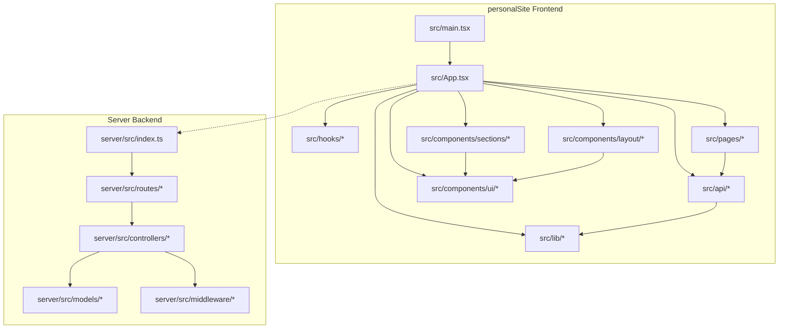
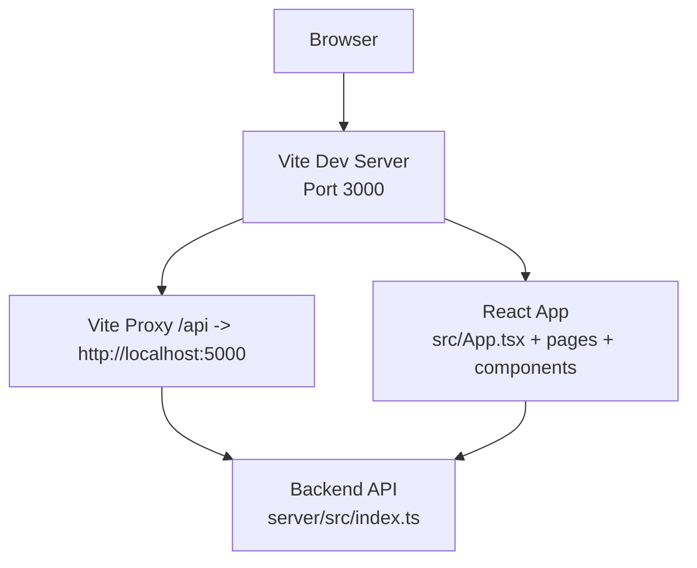
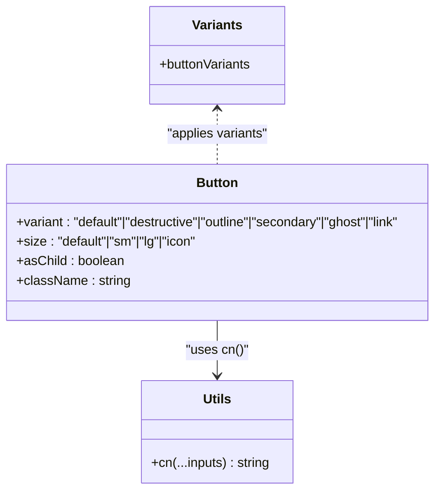
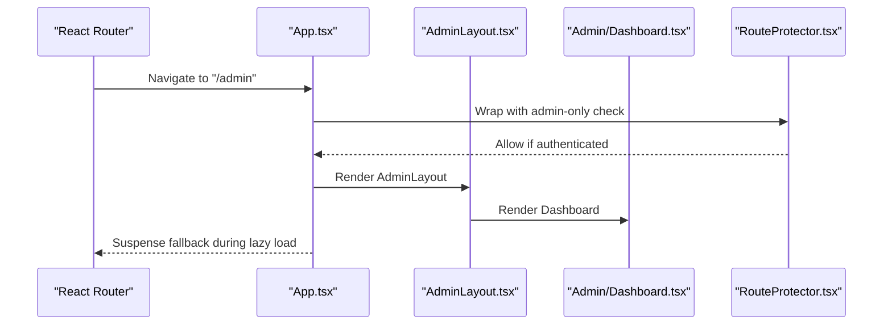
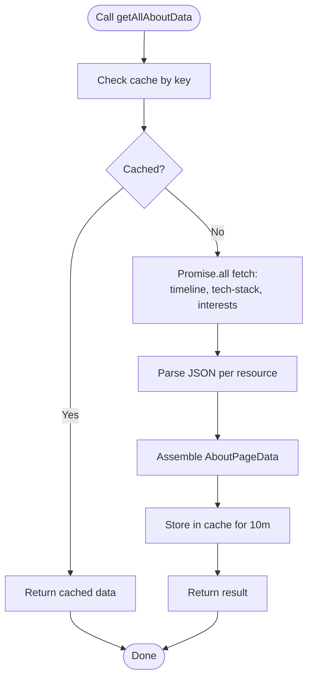
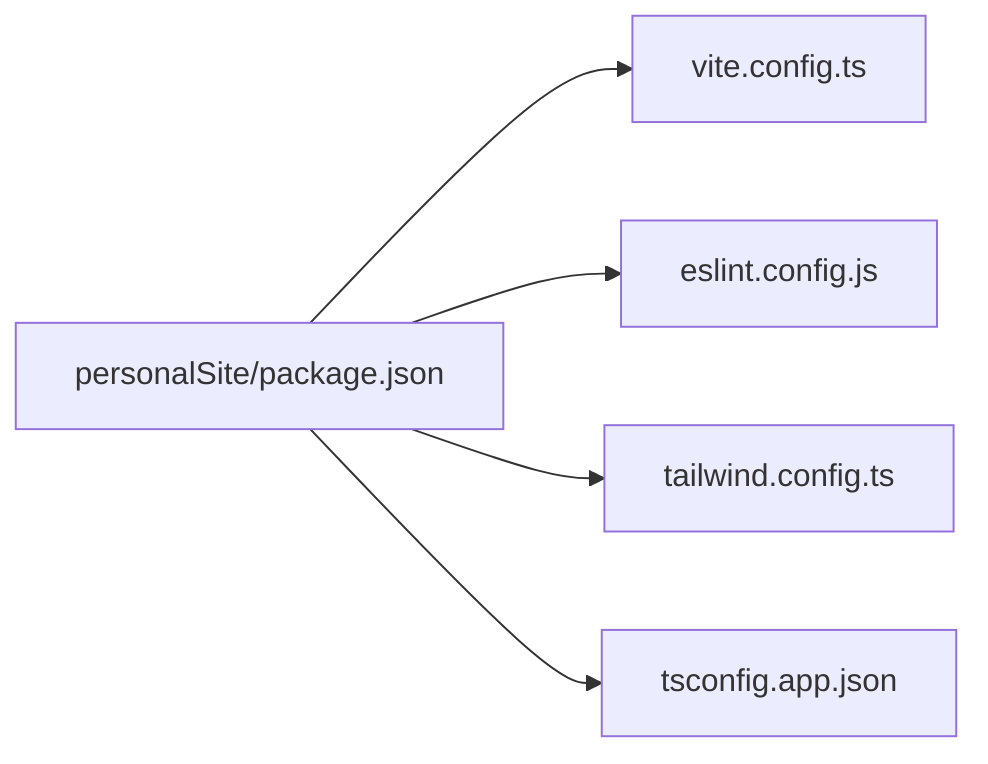

# Development Guidelines

<cite>
**Referenced Files in This Document**
- [package.json](file://personalSite/package.json)
- [eslint.config.js](file://personalSite/eslint.config.js)
- [tailwind.config.ts](file://personalSite/tailwind.config.ts)
- [vite.config.ts](file://personalSite/vite.config.ts)
- [tsconfig.json](file://personalSite/tsconfig.json)
- [tsconfig.app.json](file://personalSite/tsconfig.app.json)
- [src/main.tsx](file://personalSite/src/main.tsx)
- [src/App.tsx](file://personalSite/src/App.tsx)
- [src/lib/utils.ts](file://personalSite/src/lib/utils.ts)
- [src/hooks/use-mobile.tsx](file://personalSite/src/hooks/use-mobile.tsx)
- [src/api/aboutApi.ts](file://personalSite/src/api/aboutApi.ts)
- [src/api/contactApi.ts](file://personalSite/src/api/contactApi.ts)
- [src/components/ui/button.tsx](file://personalSite/src/components/ui/button.tsx)
</cite>

## Table of Contents
1. [Introduction](#introduction)
2. [Project Structure](#project-structure)
3. [Core Components](#core-components)
4. [Architecture Overview](#architecture-overview)
5. [Detailed Component Analysis](#detailed-component-analysis)
6. [Dependency Analysis](#dependency-analysis)
7. [Performance Considerations](#performance-considerations)
8. [Troubleshooting Guide](#troubleshooting-guide)
9. [Conclusion](#conclusion)
10. [Appendices](#appendices)

## Introduction
This document defines the development guidelines for the Personal Portfolio Platform. It consolidates code standards, testing strategies, and contribution processes across the frontend (React + TypeScript), backend (Node.js), and shared tooling. It also documents TypeScript conventions, React component patterns, naming conventions, file organization standards, ESLint and Prettier enforcement, testing approaches, Git workflow, and local development practices.

## Project Structure
The platform is organized into three primary workspaces:
- personalSite: Vite + React + TypeScript frontend with shadcn/ui components and Radix UI primitives.
- server: Node.js REST API with controllers, routes, middleware, and models.
- portfolio: Alternative portfolio implementation with distinct UI patterns.

Key frontend conventions observed:
- Feature-based organization under src/components, src/pages, src/api, src/hooks, src/contexts, src/lib.
- Shared utilities under src/lib (e.g., cn merging utility, caching, API configuration).
- UI primitives under src/components/ui follow a consistent variant and size pattern.
- Global styles under src/index.css and Tailwind configuration under tailwind.config.ts.

**Diagram sources**
- [src/main.tsx](file://personalSite/src/main.tsx#L1-L26)
- [src/App.tsx](file://personalSite/src/App.tsx#L1-L359)
- [src/lib/utils.ts](file://personalSite/src/lib/utils.ts#L1-L7)
- [src/hooks/use-mobile.tsx](file://personalSite/src/hooks/use-mobile.tsx#L1-L26)
- [src/api/aboutApi.ts](file://personalSite/src/api/aboutApi.ts#L1-L86)
- [src/api/contactApi.ts](file://personalSite/src/api/contactApi.ts#L1-L154)
- [src/components/ui/button.tsx](file://personalSite/src/components/ui/button.tsx#L1-L48)
- [server/src/index.ts](file://server/src/index.ts)
- [server/src/routes/*](file://server/src/routes/)
- [server/src/controllers/*](file://server/src/controllers/)
- [server/src/models/*](file://server/src/models/)
- [server/src/middleware/*](file://server/src/middleware/)

**Section sources**
- [package.json](file://personalSite/package.json#L1-L113)
- [tsconfig.json](file://personalSite/tsconfig.json#L1-L17)
- [tsconfig.app.json](file://personalSite/tsconfig.app.json#L1-L31)
- [vite.config.ts](file://personalSite/vite.config.ts#L1-L61)
- [tailwind.config.ts](file://personalSite/tailwind.config.ts#L1-L117)

## Core Components
This section outlines the foundational patterns and standards used across the codebase.

- TypeScript configuration
  - Strictness: Disabled in app TSConfig for pragmatic development; recommended to keep strict off but enable selective strictness per module.
  - Path aliases: @/* resolves to ./src for clean imports.
  - Target and JSX: ES2020 with react-jsx for modern environments.
  - No emit: Vite bundler mode; builds occur via Vite scripts.

- React component patterns
  - Forward refs and variants: Components expose props for variant and size, with className composition via cn.
  - Controlled and uncontrolled patterns: Buttons support asChild via Slot for semantic composition.
  - Lazy loading and suspense: Pages and admin components are lazy-loaded with Suspense fallback.

- Naming conventions
  - Interfaces and types: PascalCase (e.g., AboutPageData).
  - APIs: camelCase with Api suffix (e.g., aboutApi, contactApi).
  - Hooks: useXxx pattern (e.g., useIsMobile).
  - Utilities: kebab-case or camelCase depending on purpose (e.g., cn).

- File organization standards
  - Feature grouping: src/components/ui, src/components/sections, src/pages, src/api, src/hooks, src/contexts, src/lib.
  - Aliasing: Consistent @/* aliasing simplifies imports.

- Code quality enforcement
  - ESLint: Shared config extends recommended TypeScript and React hooks rules; warns on export refresh; disables unused vars rule.
  - Prettier: Not explicitly configured; rely on editor integrations or shared configs in team settings.

- Build and dev tooling
  - Vite: Dev server on port 3000, HMR overlay disabled, proxy to backend API, history API fallback, component tagger in development.
  - Scripts: dev, build, build:dev, lint, preview; SEO sitemap generation included in build.

**Section sources**
- [tsconfig.json](file://personalSite/tsconfig.json#L1-L17)
- [tsconfig.app.json](file://personalSite/tsconfig.app.json#L1-L31)
- [eslint.config.js](file://personalSite/eslint.config.js#L1-L27)
- [vite.config.ts](file://personalSite/vite.config.ts#L1-L61)
- [package.json](file://personalSite/package.json#L1-L113)
- [src/components/ui/button.tsx](file://personalSite/src/components/ui/button.tsx#L1-L48)
- [src/lib/utils.ts](file://personalSite/src/lib/utils.ts#L1-L7)
- [src/hooks/use-mobile.tsx](file://personalSite/src/hooks/use-mobile.tsx#L1-L26)
- [src/App.tsx](file://personalSite/src/App.tsx#L1-L359)

## Architecture Overview
The frontend composes pages and layouts, orchestrates routing with transitions, and integrates with a backend API via a proxy. The server exposes REST endpoints consumed by the frontend.

**Diagram sources**
- [vite.config.ts](file://personalSite/vite.config.ts#L10-L34)
- [src/App.tsx](file://personalSite/src/App.tsx#L1-L359)
- [server/src/index.ts](file://server/src/index.ts)

**Section sources**
- [vite.config.ts](file://personalSite/vite.config.ts#L10-L34)
- [src/App.tsx](file://personalSite/src/App.tsx#L240-L359)

## Detailed Component Analysis

### UI Component Pattern: Button
The Button component demonstrates a reusable, variant-driven design with controlled composition.

**Diagram sources**
- [src/components/ui/button.tsx](file://personalSite/src/components/ui/button.tsx#L1-L48)
- [src/lib/utils.ts](file://personalSite/src/lib/utils.ts#L1-L7)

Implementation highlights:
- Variant system via class-variance-authority.
- Composition with Radix Slot for semantic HTML.
- Merging classes with cn utility.

**Section sources**
- [src/components/ui/button.tsx](file://personalSite/src/components/ui/button.tsx#L1-L48)
- [src/lib/utils.ts](file://personalSite/src/lib/utils.ts#L1-L7)

### Routing and Transitions
The App component coordinates route transitions, lazy loading, and protected routes.

**Diagram sources**
- [src/App.tsx](file://personalSite/src/App.tsx#L254-L343)

Key behaviors:
- Horizontal vs vertical route axes based on path prefixes.
- Direction derived from route ranks and navigation type.
- Suspense fallback during dynamic imports.
- Protected routes enforced via RouteProtector.

**Section sources**
- [src/App.tsx](file://personalSite/src/App.tsx#L141-L359)

### API Layer Patterns
Two representative API modules illustrate caching, parallel fetching, and error handling.

**Diagram sources**
- [src/api/aboutApi.ts](file://personalSite/src/api/aboutApi.ts#L12-L85)

Additional patterns:
- Prefetching and cache invalidation strategies.
- Typed payloads and responses with explicit status handling.

**Section sources**
- [src/api/aboutApi.ts](file://personalSite/src/api/aboutApi.ts#L1-L86)
- [src/api/contactApi.ts](file://personalSite/src/api/contactApi.ts#L1-L154)

### Utility and Hook Patterns
- cn utility merges and normalizes Tailwind classes.
- useIsMobile detects viewport breakpoints and updates on resize.

**Section sources**
- [src/lib/utils.ts](file://personalSite/src/lib/utils.ts#L1-L7)
- [src/hooks/use-mobile.tsx](file://personalSite/src/hooks/use-mobile.tsx#L1-L26)

## Dependency Analysis
The frontend relies on React, React Router, Radix UI, shadcn/ui primitives, TanStack Query for caching, and Vite for build tooling. The server provides REST endpoints consumed by the frontend.

**Diagram sources**
- [package.json](file://personalSite/package.json#L1-L113)
- [vite.config.ts](file://personalSite/vite.config.ts#L1-L61)
- [tsconfig.app.json](file://personalSite/tsconfig.app.json#L1-L31)
- [eslint.config.js](file://personalSite/eslint.config.js#L1-L27)
- [tailwind.config.ts](file://personalSite/tailwind.config.ts#L1-L117)

**Section sources**
- [package.json](file://personalSite/package.json#L1-L113)
- [vite.config.ts](file://personalSite/vite.config.ts#L1-L61)
- [tsconfig.app.json](file://personalSite/tsconfig.app.json#L1-L31)
- [eslint.config.js](file://personalSite/eslint.config.js#L1-L27)
- [tailwind.config.ts](file://personalSite/tailwind.config.ts#L1-L117)

## Performance Considerations
- Parallel API fetching reduces total latency for composite data.
- Client-side caching minimizes redundant network requests.
- Chunk splitting separates vendor and UI bundles for efficient loading.
- History API fallback ensures SPA routing works behind static hosts.
- Lazy loading defers heavy components until needed.

Recommendations:
- Prefer caching for frequently accessed data.
- Monitor bundle sizes and adjust manualChunks as needed.
- Use React Profiler to identify expensive renders.

**Section sources**
- [src/api/aboutApi.ts](file://personalSite/src/api/aboutApi.ts#L24-L57)
- [vite.config.ts](file://personalSite/vite.config.ts#L46-L56)
- [src/App.tsx](file://personalSite/src/App.tsx#L141-L229)

## Troubleshooting Guide
Common issues and resolutions:
- API proxy errors: Verify Vite proxy target and path rewrites.
- Route transitions not animating: Ensure dataset attributes for axis and direction are set on the document element.
- Missing Tailwind classes: Confirm content globs and darkMode configuration.
- ESLint warnings: Address hook rules and export refresh warnings as indicated by the config.

**Section sources**
- [vite.config.ts](file://personalSite/vite.config.ts#L18-L32)
- [src/App.tsx](file://personalSite/src/App.tsx#L174-L177)
- [tailwind.config.ts](file://personalSite/tailwind.config.ts#L4-L5)
- [eslint.config.js](file://personalSite/eslint.config.js#L20-L24)

## Conclusion
These guidelines consolidate the established patterns and standards across the Personal Portfolio Platform. By adhering to the documented conventions—component variants, API caching, routing transitions, and tooling—you can maintain consistency, readability, and performance while contributing effectively to the project.

## Appendices

### A. TypeScript Conventions
- Interfaces and types: PascalCase.
- Functions and variables: camelCase.
- Constants: UPPER_SNAKE_CASE where appropriate.
- Paths: Use @/* alias for cleaner imports.

**Section sources**
- [tsconfig.json](file://personalSite/tsconfig.json#L6-L8)
- [tsconfig.app.json](file://personalSite/tsconfig.app.json#L24-L27)

### B. React Component Patterns
- Variants and sizes via class-variance-authority.
- Ref forwarding and asChild composition.
- Controlled/uncontrolled patterns with clear prop contracts.

**Section sources**
- [src/components/ui/button.tsx](file://personalSite/src/components/ui/button.tsx#L33-L47)

### C. Naming Conventions
- APIs: camelCase with Api suffix (e.g., aboutApi).
- Hooks: useXxx pattern (e.g., useIsMobile).
- Utilities: concise and descriptive (e.g., cn).

**Section sources**
- [src/api/aboutApi.ts](file://personalSite/src/api/aboutApi.ts#L12-L85)
- [src/hooks/use-mobile.tsx](file://personalSite/src/hooks/use-mobile.tsx#L5-L24)
- [src/lib/utils.ts](file://personalSite/src/lib/utils.ts#L4-L6)

### D. File Organization Standards
- Feature-based grouping under src/components, src/pages, src/api, src/hooks, src/contexts, src/lib.
- UI primitives under src/components/ui with consistent variants.

**Section sources**
- [src/App.tsx](file://personalSite/src/App.tsx#L14-L31)
- [src/components/ui/button.tsx](file://personalSite/src/components/ui/button.tsx#L1-L48)

### E. ESLint and Formatting
- ESLint configuration extends recommended TypeScript and React hooks rules.
- Disables unused vars rule; enforces react-refresh exports warning.
- Prettier: Not configured in this repo; coordinate with team for shared formatting.

**Section sources**
- [eslint.config.js](file://personalSite/eslint.config.js#L1-L27)

### F. Testing Strategies
- Unit testing with Jest: Recommended for pure functions and utilities (e.g., cn, cache helpers).
- Component testing with React Testing Library: Use for UI components and page fragments.
- API testing: Mock fetch responses and test error handling paths (e.g., contactApi).
- Example patterns:
  - Test parallel fetches and caching behavior in aboutApi.
  - Validate error extraction and user-facing messages in contactApi.

Note: Add Jest and RTL configurations as needed for the project.

**Section sources**
- [src/api/aboutApi.ts](file://personalSite/src/api/aboutApi.ts#L12-L85)
- [src/api/contactApi.ts](file://personalSite/src/api/contactApi.ts#L58-L153)

### G. Git Workflow and Contribution Processes
- Branch naming: Use feature/<issue-number>-short-description for feature branches.
- Commit messages: Use imperative mood; reference issue numbers when applicable.
- Pull requests: Open against develop or main; include screenshots for UI changes.
- Code review: Ensure ESLint passes and tests are green; request reviews from maintainers.

Note: Adopt these practices consistently to streamline collaboration.

[No sources needed since this section provides general guidance]

### H. Local Development Setup and Debugging
- Install dependencies and run dev server.
- Use Vite proxy for backend integration; confirm /api routes forward correctly.
- Enable component tagger in development for component inspection.
- Use React DevTools and Profiler for performance analysis.

**Section sources**
- [package.json](file://personalSite/package.json#L6-L13)
- [vite.config.ts](file://personalSite/vite.config.ts#L34-L34)
- [src/main.tsx](file://personalSite/src/main.tsx#L17-L23)