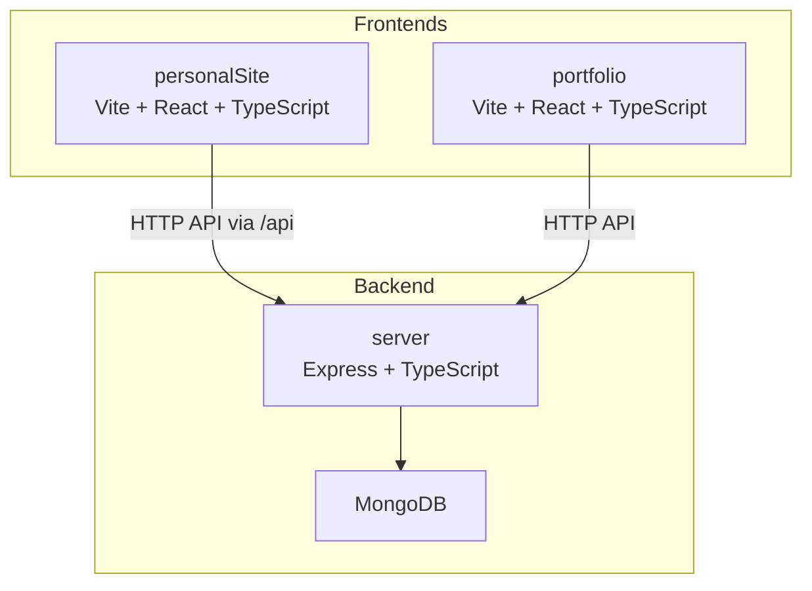

# Getting Started

<cite>
**Referenced Files in This Document**
- [README.md](file://README.md)
- [package.json](file://package.json)
- [server/package.json](file://server/package.json)
- [personalSite/package.json](file://personalSite/package.json)
- [portfolio/package.json](file://portfolio/package.json)
- [server/.env.example](file://server/.env.example)
- [personalSite/.env.example](file://personalSite/.env.example)
- [portfolio/.env.example](file://portfolio/.env.example)
- [server/src/config/database.ts](file://server/src/config/database.ts)
- [server/src/index.ts](file://server/src/index.ts)
- [personalSite/vite.config.ts](file://personalSite/vite.config.ts)
- [portfolio/vite.config.ts](file://portfolio/vite.config.ts)
- [personalSite/src/lib/apiConfig.ts](file://personalSite/src/lib/apiConfig.ts)
- [portfolio/src/lib/apiConfig.ts](file://portfolio/src/lib/apiConfig.ts)
- [server/src/controllers/seedController.ts](file://server/src/controllers/seedController.ts)
- [server/src/middleware/auth.ts](file://server/src/middleware/auth.ts)
</cite>

## Table of Contents
1. [Introduction](#introduction)
2. [Prerequisites](#prerequisites)
3. [Installation](#installation)
4. [Environment Setup](#environment-setup)
5. [Development Workflow](#development-workflow)
6. [Initial Setup and Seeding](#initial-setup-and-seeding)
7. [Verification Steps](#verification-steps)
8. [Architecture Overview](#architecture-overview)
9. [Troubleshooting Guide](#troubleshooting-guide)
10. [Conclusion](#conclusion)

## Introduction
This guide helps you set up and run the Personal Portfolio Platform locally. The project is a monorepo containing:
- personalSite: A React/Vite frontend application
- portfolio: An alternative portfolio frontend
- server: An Express/Node.js backend with MongoDB

It includes admin dashboard, CMS capabilities, REST APIs, authentication, and content management features.

**Section sources**
- [README.md](file://README.md#L1-L64)

## Prerequisites
Before installing, ensure your system meets these requirements:

- Operating System
  - Windows, macOS, or Linux
- Node.js
  - Version 18.x or 20.x recommended
  - Verify with: node --version
- npm
  - Comes with Node.js; verify with: npm --version
- MongoDB
  - Local instance (mongod running on default port 27017) or a hosted MongoDB URI
  - Verify connectivity by connecting via mongo shell or Compass
- Git
  - Optional but recommended for cloning and version control

Notes:
- The backend defaults to connecting to mongodb://localhost:27017/portfolio if no MONGODB_URI is provided.
- The frontend proxies API calls to http://localhost:5000 by default.

**Section sources**
- [server/src/config/database.ts](file://server/src/config/database.ts#L14-L18)
- [personalSite/.env.example](file://personalSite/.env.example#L5-L5)
- [portfolio/.env.example](file://portfolio/.env.example#L1-L1)

## Installation
Follow these steps to install the project locally:

1. Clone the repository (if applicable) and navigate to the project root.
2. Install root dependencies:
   - Run: npm ci
   - This installs cross-platform scripts and concurrently for managing multiple apps.
3. Install backend dependencies:
   - From the project root: cd server && npm ci
4. Install frontend dependencies:
   - From the project root: cd personalSite && npm ci
   - From the project root: cd portfolio && npm ci

After installation, your monorepo is ready. Proceed to environment setup.

**Section sources**
- [package.json](file://package.json#L6-L16)
- [server/package.json](file://server/package.json#L1-L40)
- [personalSite/package.json](file://personalSite/package.json#L1-L113)
- [portfolio/package.json](file://portfolio/package.json#L1-L74)

## Environment Setup
Configure environment variables for each module:

### Backend (.env)
1. Copy the example file:
   - cp server/.env.example server/.env
2. Edit server/.env with your values:
   - MONGODB_URI: Your MongoDB connection string (required)
   - JWT_SECRET: Strong secret for JWT signing (required)
   - PORT: Backend port (default 5000)
   - FRONTEND_URL: Base URL for frontend (used for CORS and logs)
   - GITHUB_USERNAME/GITHUB_TOKEN: For GitHub integrations (optional)
   - ADMIN_EMAIL: Admin account email
   - SEND_AS_EMAIL/SEND_AS_NAME: Email sender settings for contact forms
   - GOOGLE_APP_PASSWORD: App password for the admin email account

Key defaults and behavior:
- If MONGODB_URI is empty, the backend connects to mongodb://localhost:27017/portfolio.
- The backend seeds default data automatically when collections are empty.

**Section sources**
- [server/.env.example](file://server/.env.example#L1-L27)
- [server/src/config/database.ts](file://server/src/config/database.ts#L14-L24)

### Frontend (personalSite/.env)
1. Copy the example file:
   - cp personalSite/.env.example personalSite/.env
2. Edit personalSite/.env:
   - VITE_API_BASE_URL: API base URL for development (default http://localhost:5000)
   - VITE_GITHUB_USERNAME: Your GitHub username for repository fetches (optional)

Note:
- All Vite env vars must be prefixed with VITE_.

**Section sources**
- [personalSite/.env.example](file://personalSite/.env.example#L1-L10)
- [personalSite/src/lib/apiConfig.ts](file://personalSite/src/lib/apiConfig.ts#L6-L49)

### Frontend (portfolio/.env)
1. Copy the example file:
   - cp portfolio/.env.example portfolio/.env
2. Edit portfolio/.env:
   - VITE_API_BASE_URL: API base URL for development (default http://localhost:5000)
   - VITE_API_BASE_URL_PROD: API base URL for production builds (optional)

**Section sources**
- [portfolio/.env.example](file://portfolio/.env.example#L1-L3)
- [portfolio/src/lib/apiConfig.ts](file://portfolio/src/lib/apiConfig.ts#L6-L16)

## Development Workflow
Start all three applications (personalSite, portfolio, server) using the root scripts:

- Start both frontends with the backend:
  - npm run devp
- Start personalSite with the backend:
  - npm run dev
- Start only personalSite:
  - npm run dev:personalSite
- Start only portfolio with backend:
  - npm run devp
- Start only portfolio:
  - npm run dev:portfolio
- Start backend only:
  - npm run dev:server

Port configuration:
- personalSite runs on port 3000 (Vite default) with HMR disabled overlay.
- portfolio runs on port 3000 by default (per its Vite config).
- server runs on port 5000 (default) and proxies API requests to the backend.

Proxy behavior:
- personalSite Vite proxy forwards /api* requests to http://localhost:5000 and strips the /api prefix before sending.

CORS behavior:
- The backend determines allowed origins based on environment variables and defaults to common development origins.

**Section sources**
- [package.json](file://package.json#L6-L16)
- [personalSite/vite.config.ts](file://personalSite/vite.config.ts#L12-L32)
- [portfolio/vite.config.ts](file://portfolio/vite.config.ts#L5-L15)
- [server/src/index.ts](file://server/src/index.ts#L38-L83)

## Initial Setup and Seeding
On first startup, the backend automatically seeds default data if collections are empty. This includes timeline entries, interests, tech skills, and tech stack categories.

What happens:
- The backend connects to MongoDB and checks collection counts.
- If any targeted collection is empty, it inserts default documents.
- This occurs on initial connection and on reconnection events.

Manual seeding endpoint:
- The backend exposes a route to trigger seeding programmatically (see controller implementation).

Security note:
- JWT_SECRET must be set to a strong value in production.

**Section sources**
- [server/src/config/database.ts](file://server/src/config/database.ts#L23-L24)
- [server/src/controllers/seedController.ts](file://server/src/controllers/seedController.ts#L108-L134)
- [server/src/middleware/auth.ts](file://server/src/middleware/auth.ts#L18-L18)

## Verification Steps
After starting all services, verify the setup:

1. Backend health check
   - Visit: http://localhost:5000/health
   - Expect JSON response indicating OK status.
2. Backend root endpoint
   - Visit: http://localhost:5000/
   - Expect a JSON response confirming the backend is running.
3. personalSite
   - Open: http://localhost:3000
   - Should load the main portfolio frontend.
   - API calls to /api/* should proxy to the backend.
4. portfolio
   - Open: http://localhost:3000 (or configured port)
   - Should load the alternative portfolio frontend.
5. Database connectivity
   - Check backend logs for successful connection and seeding messages.
   - If no MONGODB_URI is provided, the backend attempts to connect to mongodb://localhost:27017/portfolio.

Optional: Test authentication
- Use the auth routes to register/login and verify JWT token handling.

**Section sources**
- [server/src/index.ts](file://server/src/index.ts#L119-L131)
- [server/src/config/database.ts](file://server/src/config/database.ts#L23-L24)

## Architecture Overview
High-level architecture of the monorepo:

**Diagram sources**
- [personalSite/vite.config.ts](file://personalSite/vite.config.ts#L18-L25)
- [server/src/index.ts](file://server/src/index.ts#L100-L116)
- [server/src/config/database.ts](file://server/src/config/database.ts#L14-L18)

## Troubleshooting Guide
Common setup issues and resolutions:

- MongoDB connection failures
  - Symptom: Backend logs show connection errors or retries.
  - Checks:
    - Ensure mongod is running locally or provide a valid MONGODB_URI.
    - Verify network/firewall settings if using a remote database.
  - Resolution:
    - Set MONGODB_URI in server/.env to your MongoDB connection string.
    - Confirm the backend attempts to connect to mongodb://localhost:27017/portfolio if MONGODB_URI is empty.

- Port conflicts
  - Symptom: Ports 3000 or 5000 already in use.
  - Resolution:
    - Change ports in:
      - personalSite/vite.config.ts (server.port)
      - portfolio/vite.config.ts (server.port)
      - server/src/index.ts (PORT)
    - Restart services after changes.

- CORS errors in browser
  - Symptom: Browser blocks API requests from frontend.
  - Checks:
    - Ensure FRONTEND_URL or CORS_ORIGINS includes your frontend origin(s).
    - Verify allowed origins logic matches your setup.
  - Resolution:
    - Add your frontend origins to CORS_ORIGINS or FRONTEND_URL in server/.env.

- API proxy not working in personalSite
  - Symptom: Frontend cannot reach backend endpoints under /api.
  - Checks:
    - Confirm VITE_API_BASE_URL in personalSite/.env points to http://localhost:5000.
    - Verify Vite proxy configuration in personalSite/vite.config.ts.

- Missing environment variables
  - Symptom: Application throws errors about missing environment variables.
  - Resolution:
    - Copy .env.example to .env in each module and fill required values.
    - For personalSite and portfolio, ensure VITE_* variables are prefixed correctly.

- Authentication issues
  - Symptom: 401/403 responses when accessing protected routes.
  - Checks:
    - Ensure JWT_SECRET is set in server/.env.
    - Verify tokens are included in Authorization headers.

- First-time seeding not occurring
  - Symptom: Expected default data not present.
  - Checks:
    - Confirm backend connects successfully to MongoDB.
    - Review backend logs for seeding messages.
  - Resolution:
    - Ensure collections are truly empty or restart backend to trigger seeding.

**Section sources**
- [server/src/config/database.ts](file://server/src/config/database.ts#L46-L55)
- [server/src/index.ts](file://server/src/index.ts#L38-L83)
- [personalSite/vite.config.ts](file://personalSite/vite.config.ts#L18-L25)
- [server/.env.example](file://server/.env.example#L1-L27)
- [personalSite/.env.example](file://personalSite/.env.example#L1-L10)
- [portfolio/.env.example](file://portfolio/.env.example#L1-L3)
- [server/src/middleware/auth.ts](file://server/src/middleware/auth.ts#L14-L29)

## Conclusion
You now have the Personal Portfolio Platform running locally with:
- A React/Vite frontend (personalSite) and an alternative portfolio frontend (portfolio)
- An Express backend serving REST APIs
- MongoDB integration with automatic seeding
- Proper proxying and CORS configuration

Proceed to customize content, configure GitHub integrations, and deploy to production following the project’s documented features and environment variables.