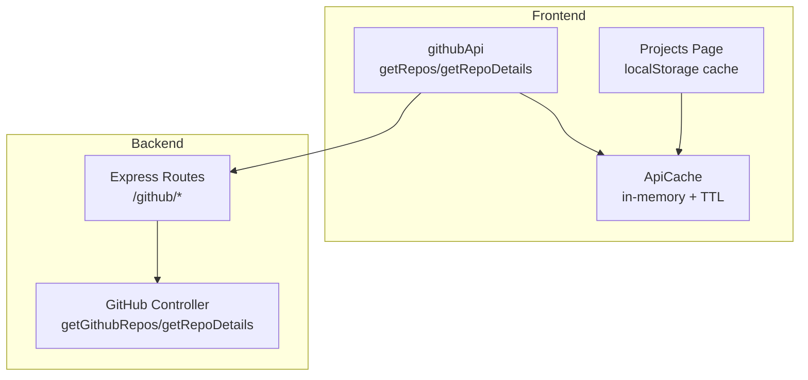
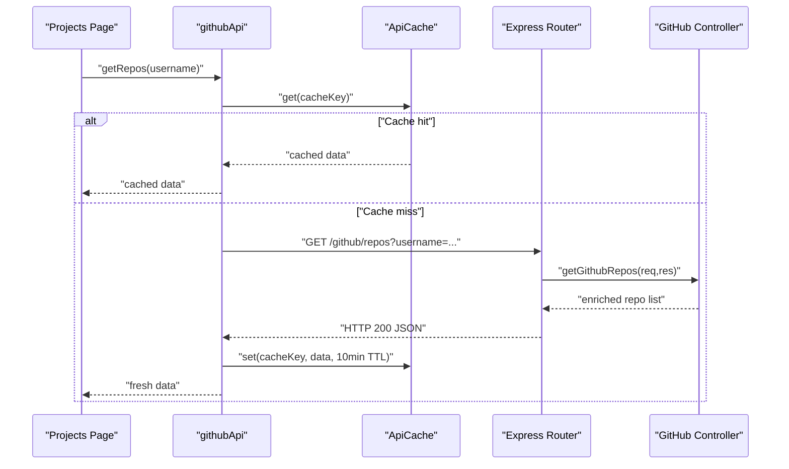
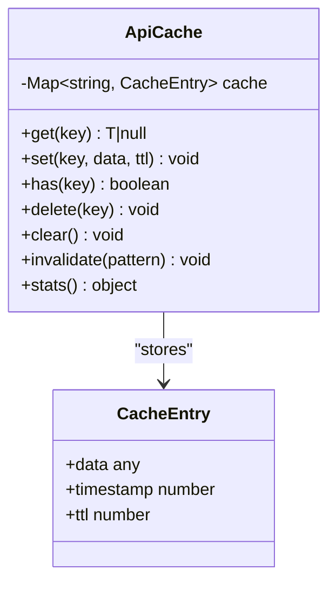
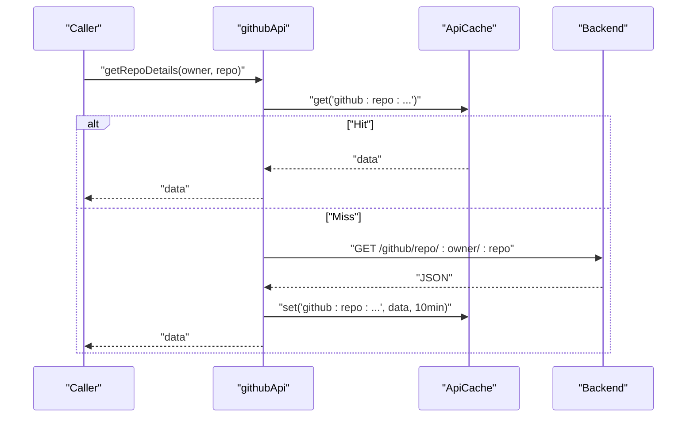
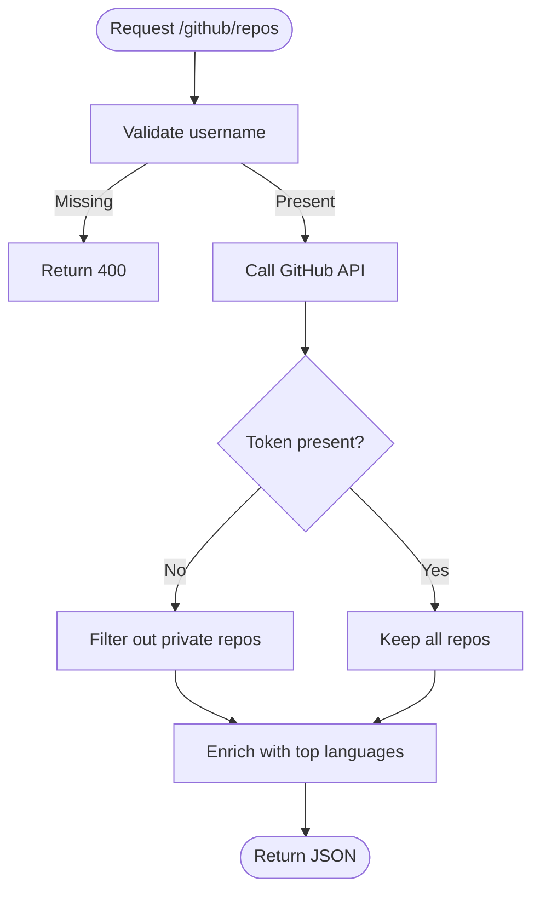

# Caching Strategy and Performance Optimization

<cite>
**Referenced Files in This Document**
- [cache.ts](file://personalSite/src/lib/cache.ts)
- [githubApi.ts](file://personalSite/src/api/githubApi.ts)
- [githubController.ts](file://server/src/controllers/githubController.ts)
- [github.ts](file://server/src/routes/github.ts)
- [Projects.tsx](file://personalSite/src/pages/Projects.tsx)
- [cache.ts](file://portfolio/src/lib/cache.ts)
</cite>

## Table of Contents
1. [Introduction](#introduction)
2. [Project Structure](#project-structure)
3. [Core Components](#core-components)
4. [Architecture Overview](#architecture-overview)
5. [Detailed Component Analysis](#detailed-component-analysis)
6. [Dependency Analysis](#dependency-analysis)
7. [Performance Considerations](#performance-considerations)
8. [Troubleshooting Guide](#troubleshooting-guide)
9. [Conclusion](#conclusion)

## Introduction
This document explains the caching strategy used in the GitHub integration to optimize API performance and reduce external requests. It covers the in-memory cache with TTL (time-to-live) expiration, cache key generation patterns, and invalidation strategies. It documents the 10-minute TTL for repository data, cache hit/miss scenarios, and performance benefits. It also describes cache key naming conventions for repositories and repository details, cache warming techniques, and practical guidance for debugging, customizing TTL values, preloading caches, handling consistency when GitHub data changes, and managing memory and cleanup.

## Project Structure
The caching implementation spans three layers:
- Frontend cache utilities for API responses
- Frontend GitHub API wrapper that reads/writes cache
- Backend GitHub controller that serves aggregated repository data



**Diagram sources**
- [cache.ts](file://personalSite/src/lib/cache.ts#L12-L96)
- [githubApi.ts](file://personalSite/src/api/githubApi.ts#L6-L46)
- [github.ts](file://server/src/routes/github.ts#L1-L9)
- [githubController.ts](file://server/src/controllers/githubController.ts#L4-L100)
- [Projects.tsx](file://personalSite/src/pages/Projects.tsx#L41-L106)

**Section sources**
- [cache.ts](file://personalSite/src/lib/cache.ts#L1-L137)
- [githubApi.ts](file://personalSite/src/api/githubApi.ts#L1-L46)
- [githubController.ts](file://server/src/controllers/githubController.ts#L1-L177)
- [github.ts](file://server/src/routes/github.ts#L1-L9)
- [Projects.tsx](file://personalSite/src/pages/Projects.tsx#L1-L200)

## Core Components
- ApiCache: In-memory cache with TTL and key-based invalidation
- cacheKeys: Centralized cache key generators for consistent naming
- githubApi: Frontend client that checks cache, fetches from backend, and writes cache
- GitHub backend routes and controller: Aggregates repository data and returns it to the frontend
- Projects page: Demonstrates a separate localStorage cache for page-level data

Key behaviors:
- Cache hit: Return cached data immediately
- Cache miss: Fetch from backend, cache the response, then return
- TTL enforcement: Expired entries are removed automatically on access
- Invalidation: Pattern-based deletion supports targeted cache clearing

**Section sources**
- [cache.ts](file://personalSite/src/lib/cache.ts#L12-L96)
- [githubApi.ts](file://personalSite/src/api/githubApi.ts#L6-L46)
- [Projects.tsx](file://personalSite/src/pages/Projects.tsx#L41-L106)

## Architecture Overview
The GitHub integration follows a layered caching strategy:
- Frontend ApiCache stores API responses with TTL
- Frontend githubApi coordinates cache access and backend fetch
- Backend routes expose endpoints for repositories and repository details
- Backend controller enriches data (e.g., language counts) and handles errors
- Projects page maintains a separate localStorage cache for page-level data



**Diagram sources**
- [githubApi.ts](file://personalSite/src/api/githubApi.ts#L6-L25)
- [cache.ts](file://personalSite/src/lib/cache.ts#L20-L34)
- [github.ts](file://server/src/routes/github.ts#L6)
- [githubController.ts](file://server/src/controllers/githubController.ts#L4-L100)

## Detailed Component Analysis

### ApiCache: In-Memory Cache with TTL
ApiCache provides:
- get(key): Returns data if present and not expired; removes expired entries
- set(key, data, ttl): Stores data with timestamp and TTL
- has(key): Checks validity without returning data
- delete(key)/clear(): Removes specific or all entries
- invalidate(pattern): Deletes entries matching a wildcard pattern
- stats(): Reports cache size and keys (useful for debugging)

Implementation highlights:
- Uses Map for O(1) average-time operations
- TTL stored per entry; expiration checked on access
- Default TTL is 5 minutes; GitHub endpoints override to 10 minutes



**Diagram sources**
- [cache.ts](file://personalSite/src/lib/cache.ts#L6-L96)

**Section sources**
- [cache.ts](file://personalSite/src/lib/cache.ts#L12-L96)

### Cache Keys and Naming Conventions
Centralized key generation ensures consistency and simplifies invalidation:
- Articles: all, published, byId
- Projects: all (with optional params), byId, bySlug
- Settings, about, timeline, techSkills, interests
- Tech stack: all, public
- Dashboard: stats, analytics, enhanced (token-scoped)
- Contact: messages (token-scoped)
- GitHub: repos (username-scoped)

Examples of usage:
- Repositories: generated via cacheKeys.github.repos(username)
- Repository details: constructed as "github:repo:{owner}/{repo}"

These conventions enable:
- Predictable cache keys
- Easy invalidation using patterns like "github:repos:*" or "github:repo:*"

**Section sources**
- [cache.ts](file://personalSite/src/lib/cache.ts#L101-L136)

### GitHub API Wrapper: Cache Integration
The frontend githubApi integrates with ApiCache:
- getRepos(username): Generates cache key, checks cache, fetches from backend if needed, sets 10-minute TTL
- getRepoDetails(owner, repo): Direct key construction, checks cache, fetches from backend if needed, sets 10-minute TTL

Behavioral guarantees:
- Immediate cache hit returns without network latency
- Fresh data is cached for subsequent hits
- Errors propagate from backend with meaningful messages



**Diagram sources**
- [githubApi.ts](file://personalSite/src/api/githubApi.ts#L27-L45)
- [cache.ts](file://personalSite/src/lib/cache.ts#L20-L34)

**Section sources**
- [githubApi.ts](file://personalSite/src/api/githubApi.ts#L6-L46)

### Backend GitHub Controller: Data Enrichment and Error Handling
The backend aggregates repository data:
- getGithubRepos: Validates query, calls GitHub API, optionally filters private repos without a token, enriches with top languages, and returns structured data
- getRepoDetails: Retrieves repository metadata, languages, and contributors, then returns a unified payload

Error handling:
- Propagates 404 for user/repository not found
- Handles rate limit errors
- Returns generic 500 for unexpected failures



**Diagram sources**
- [githubController.ts](file://server/src/controllers/githubController.ts#L4-L100)

**Section sources**
- [githubController.ts](file://server/src/controllers/githubController.ts#L4-L100)
- [github.ts](file://server/src/routes/github.ts#L6)

### Projects Page: Page-Level Cache with localStorage
The Projects page demonstrates a separate caching layer:
- Cache key: "projects:page:cache:v1"
- TTL: 15 minutes
- Reads cache on mount; if valid, hydrates UI immediately
- On miss, fetches projects, computes GitHub stats, then writes cache

This pattern complements the API cache by reducing repeated network calls and improving perceived performance for page loads.

**Section sources**
- [Projects.tsx](file://personalSite/src/pages/Projects.tsx#L41-L106)

### Portfolio Site Cache Utilities: localStorage + Memory Hybrid
The portfolio site implements a localStorage-backed cache with TTL:
- CacheRecord: value, cachedAt, expiresAt
- getCachedValue/readCacheRecord/isCacheExpired/setCachedValue/clearCachedValue
- Writes to localStorage and falls back to memory cache when storage is unavailable

This approach provides persistence across browser sessions and robustness against storage errors.

**Section sources**
- [cache.ts](file://portfolio/src/lib/cache.ts#L1-L118)

## Dependency Analysis
The GitHub caching pipeline depends on:
- Frontend ApiCache for in-memory TTL
- Frontend githubApi for cache orchestration and backend coordination
- Backend routes and controller for data aggregation and error handling
- Projects page for an additional cache layer

```mermaid
graph LR
Cache["ApiCache"] <- --> GHAPI["githubApi"]
GHAPI --> Router["Express Router"]
Router --> Controller["GitHub Controller"]
Projects["Projects Page"] -.-> Cache
```

**Diagram sources**
- [cache.ts](file://personalSite/src/lib/cache.ts#L12-L96)
- [githubApi.ts](file://personalSite/src/api/githubApi.ts#L6-L46)
- [github.ts](file://server/src/routes/github.ts#L1-L9)
- [githubController.ts](file://server/src/controllers/githubController.ts#L1-L177)
- [Projects.tsx](file://personalSite/src/pages/Projects.tsx#L108-L189)

**Section sources**
- [cache.ts](file://personalSite/src/lib/cache.ts#L12-L96)
- [githubApi.ts](file://personalSite/src/api/githubApi.ts#L6-L46)
- [githubController.ts](file://server/src/controllers/githubController.ts#L1-L177)
- [github.ts](file://server/src/routes/github.ts#L1-L9)
- [Projects.tsx](file://personalSite/src/pages/Projects.tsx#L108-L189)

## Performance Considerations
- 10-minute TTL for GitHub repository data balances freshness and performance. After 10 minutes, subsequent requests trigger a backend fetch and repopulate the cache.
- Cache hit reduces network latency and external API load. Subsequent hits serve from memory.
- Page-level cache (Projects page) further minimizes repeated work by storing combined project and GitHub stats for 15 minutes.
- Backend enrichment (top languages, contributors) occurs once per cache miss, amortizing cost across multiple hits.

[No sources needed since this section provides general guidance]

## Troubleshooting Guide
Common scenarios and remedies:
- Cache miss followed by backend failure: Inspect backend error responses (404, 403, 500) and surface user-friendly messages.
- Stale data after GitHub updates: Use invalidate patterns to remove stale entries (e.g., invalidate "github:repos:*" or "github:repo:*").
- Excessive cache growth: Periodically call clear() or invalidate() to free memory and storage.
- Debugging cache state: Use stats() to inspect current cache size and keys.

Practical steps:
- Invalidate specific scopes: apiCache.invalidate("github:repos:*")
- Clear all: apiCache.clear()
- Verify presence: apiCache.has("your:cache:key")

**Section sources**
- [cache.ts](file://personalSite/src/lib/cache.ts#L74-L96)
- [githubApi.ts](file://personalSite/src/api/githubApi.ts#L6-L46)

## Conclusion
The GitHub integration employs a layered caching strategy:
- In-memory ApiCache with TTL for API responses
- Centralized cache key naming for consistency and easy invalidation
- 10-minute TTL for repository data to balance freshness and performance
- Backend enrichment and robust error handling
- Optional page-level cache for improved UX

This approach reduces external API calls, improves responsiveness, and provides mechanisms to maintain consistency and manage resources effectively.