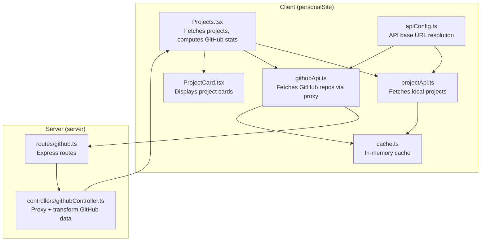
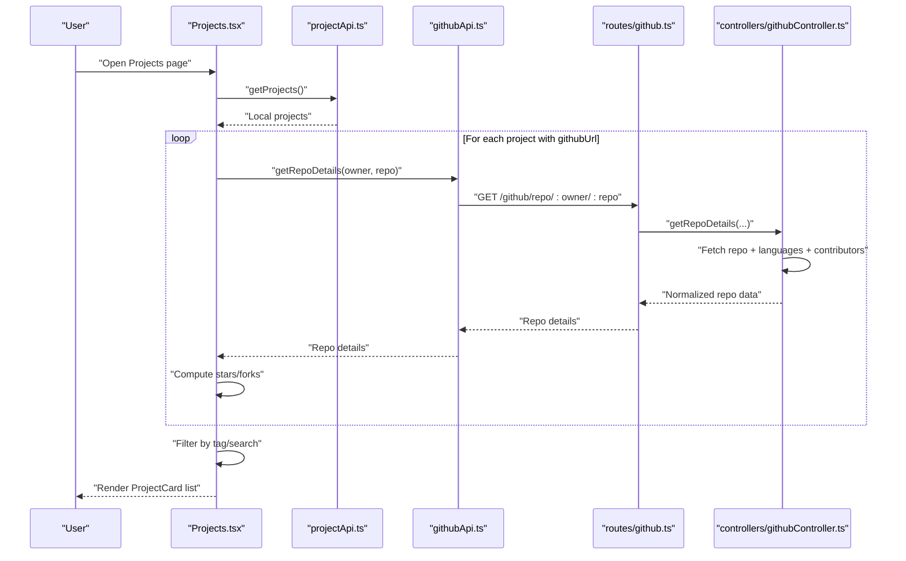
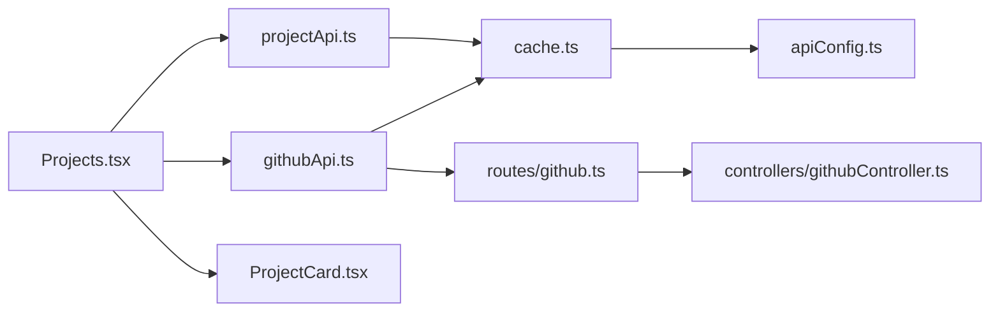

# Data Processing and Repository Filtering

<cite>
**Referenced Files in This Document**
- [githubApi.ts](file://personalSite/src/api/githubApi.ts)
- [projectApi.ts](file://personalSite/src/api/projectApi.ts)
- [Projects.tsx](file://personalSite/src/pages/Projects.tsx)
- [ProjectCard.tsx](file://personalSite/src/components/ui/ProjectCard.tsx)
- [cache.ts](file://personalSite/src/lib/cache.ts)
- [apiConfig.ts](file://personalSite/src/lib/apiConfig.ts)
- [githubController.ts](file://server/src/controllers/githubController.ts)
- [github.ts](file://server/src/routes/github.ts)
- [use-portfolio-data.ts](file://portfolio/src/hooks/use-portfolio-data.ts)
- [portfolio.ts](file://portfolio/src/types/portfolio.ts)
</cite>

## Table of Contents
1. [Introduction](#introduction)
2. [Project Structure](#project-structure)
3. [Core Components](#core-components)
4. [Architecture Overview](#architecture-overview)
5. [Detailed Component Analysis](#detailed-component-analysis)
6. [Dependency Analysis](#dependency-analysis)
7. [Performance Considerations](#performance-considerations)
8. [Troubleshooting Guide](#troubleshooting-guide)
9. [Conclusion](#conclusion)

## Introduction
This document explains the data processing pipeline that transforms raw GitHub API responses into display-ready portfolio content. It covers repository filtering logic, data transformation steps (language detection, star/fork counts, description handling), project card integration, metadata extraction, and conditional display logic. It also provides guidance on customizing filters, implementing custom sorting, extending attributes, validating data, handling errors, and applying fallback strategies.

## Project Structure
The pipeline spans client-side and server-side components:
- Client-side data acquisition and caching: [githubApi.ts](file://personalSite/src/api/githubApi.ts), [projectApi.ts](file://personalSite/src/api/projectApi.ts), [cache.ts](file://personalSite/src/lib/cache.ts), [apiConfig.ts](file://personalSite/src/lib/apiConfig.ts)
- Client-side rendering and filtering: [Projects.tsx](file://personalSite/src/pages/Projects.tsx), [ProjectCard.tsx](file://personalSite/src/components/ui/ProjectCard.tsx)
- Server-side GitHub proxy and transformations: [githubController.ts](file://server/src/controllers/githubController.ts), [github.ts](file://server/src/routes/github.ts)
- Portfolio-specific data hooks and types: [use-portfolio-data.ts](file://portfolio/src/hooks/use-portfolio-data.ts), [portfolio.ts](file://portfolio/src/types/portfolio.ts)

**Diagram sources**
- [Projects.tsx](file://personalSite/src/pages/Projects.tsx#L108-L189)
- [ProjectCard.tsx](file://personalSite/src/components/ui/ProjectCard.tsx#L39-L169)
- [projectApi.ts](file://personalSite/src/api/projectApi.ts#L28-L62)
- [githubApi.ts](file://personalSite/src/api/githubApi.ts#L6-L46)
- [cache.ts](file://personalSite/src/lib/cache.ts#L12-L96)
- [apiConfig.ts](file://personalSite/src/lib/apiConfig.ts#L6-L52)
- [github.ts](file://server/src/routes/github.ts#L1-L9)
- [githubController.ts](file://server/src/controllers/githubController.ts#L4-L100)

**Section sources**
- [Projects.tsx](file://personalSite/src/pages/Projects.tsx#L108-L189)
- [ProjectCard.tsx](file://personalSite/src/components/ui/ProjectCard.tsx#L39-L169)
- [projectApi.ts](file://personalSite/src/api/projectApi.ts#L28-L62)
- [githubApi.ts](file://personalSite/src/api/githubApi.ts#L6-L46)
- [cache.ts](file://personalSite/src/lib/cache.ts#L12-L96)
- [apiConfig.ts](file://personalSite/src/lib/apiConfig.ts#L6-L52)
- [github.ts](file://server/src/routes/github.ts#L1-L9)
- [githubController.ts](file://server/src/controllers/githubController.ts#L4-L100)

## Core Components
- Client-side GitHub API wrapper: [githubApi.ts](file://personalSite/src/api/githubApi.ts#L6-L46) caches and proxies GitHub endpoints.
- Local project API wrapper: [projectApi.ts](file://personalSite/src/api/projectApi.ts#L28-L62) caches and fetches local project records.
- Projects page orchestration: [Projects.tsx](file://personalSite/src/pages/Projects.tsx#L108-L189) loads projects, resolves GitHub stats, and renders cards.
- Project card component: [ProjectCard.tsx](file://personalSite/src/components/ui/ProjectCard.tsx#L39-L169) displays project metadata and GitHub stats.
- Server-side GitHub proxy: [githubController.ts](file://server/src/controllers/githubController.ts#L4-L100) filters and enriches repository data.
- Portfolio data hook: [use-portfolio-data.ts](file://portfolio/src/hooks/use-portfolio-data.ts#L64-L74) sorts projects deterministically.

**Section sources**
- [githubApi.ts](file://personalSite/src/api/githubApi.ts#L6-L46)
- [projectApi.ts](file://personalSite/src/api/projectApi.ts#L28-L62)
- [Projects.tsx](file://personalSite/src/pages/Projects.tsx#L108-L189)
- [ProjectCard.tsx](file://personalSite/src/components/ui/ProjectCard.tsx#L39-L169)
- [githubController.ts](file://server/src/controllers/githubController.ts#L4-L100)
- [use-portfolio-data.ts](file://portfolio/src/hooks/use-portfolio-data.ts#L64-L74)

## Architecture Overview
The pipeline follows a client-server model:
- The client requests local projects via [projectApi.ts](file://personalSite/src/api/projectApi.ts#L28-L62).
- For each project with a GitHub URL, the client extracts owner/repo and queries GitHub via the server proxy [githubApi.ts](file://personalSite/src/api/githubApi.ts#L27-L45) or directly to https://api.github.com.
- The server proxy [githubController.ts](file://server/src/controllers/githubController.ts#L4-L100) filters private repos when unauthenticated, enriches languages, and returns normalized data.
- The client caches responses using [cache.ts](file://personalSite/src/lib/cache.ts#L12-L96) and renders cards via [ProjectCard.tsx](file://personalSite/src/components/ui/ProjectCard.tsx#L39-L169).

**Diagram sources**
- [Projects.tsx](file://personalSite/src/pages/Projects.tsx#L127-L182)
- [projectApi.ts](file://personalSite/src/api/projectApi.ts#L28-L62)
- [githubApi.ts](file://personalSite/src/api/githubApi.ts#L27-L45)
- [github.ts](file://server/src/routes/github.ts#L6-L7)
- [githubController.ts](file://server/src/controllers/githubController.ts#L102-L177)

## Detailed Component Analysis

### Repository Filtering Logic
- Private repositories: The server proxy filters out private repositories when no GitHub token is configured. See [githubController.ts](file://server/src/controllers/githubController.ts#L26-L30).
- Forks and archived repositories: No explicit exclusion occurs in the server proxy. If you need to exclude forks or archived repositories, customize the server route or client filtering logic.

Customization examples:
- Exclude forks on the server: Add a query parameter and filter repos before enrichment in [githubController.ts](file://server/src/controllers/githubController.ts#L26-L30).
- Exclude archived repositories: Extend filtering to check repository archival status similarly.

**Section sources**
- [githubController.ts](file://server/src/controllers/githubController.ts#L26-L30)

### Data Transformation Processes
- Language detection: The server fetches languages and returns the top N languages sorted by byte size. See [githubController.ts](file://server/src/controllers/githubController.ts#L129-L132).
- Star and fork counts: Returned as numeric fields and displayed in [ProjectCard.tsx](file://personalSite/src/components/ui/ProjectCard.tsx#L156-L165).
- Description handling: Descriptions are passed through; client-side truncation uses a line clamp in [ProjectCard.tsx](file://personalSite/src/components/ui/ProjectCard.tsx#L133-L135).
- README parsing: Not implemented in the current pipeline. To add README parsing, integrate a README fetch endpoint in the server proxy and pass parsed content to the client.

Implementation notes:
- Normalize visibility to a simple string ("public" or "private") in [githubController.ts](file://server/src/controllers/githubController.ts#L63).
- Enrich contributors list in [githubController.ts](file://server/src/controllers/githubController.ts#L134-L139).

**Section sources**
- [githubController.ts](file://server/src/controllers/githubController.ts#L32-L85)
- [githubController.ts](file://server/src/controllers/githubController.ts#L129-L139)
- [ProjectCard.tsx](file://personalSite/src/components/ui/ProjectCard.tsx#L133-L135)
- [ProjectCard.tsx](file://personalSite/src/components/ui/ProjectCard.tsx#L156-L165)

### Project Card Component Integration
- Props: [ProjectCard.tsx](file://personalSite/src/components/ui/ProjectCard.tsx#L10-L31) accepts project metadata and optional GitHub stats.
- Conditional display: Featured badges, live and GitHub links, language chips, and star/fork counts are rendered conditionally. See [ProjectCard.tsx](file://personalSite/src/components/ui/ProjectCard.tsx#L68-L165).
- Language color mapping: Uses [languageColors.ts](file://personalSite/src/lib/languageColors.ts#L1-L72) to render colored indicators.

**Section sources**
- [ProjectCard.tsx](file://personalSite/src/components/ui/ProjectCard.tsx#L10-L31)
- [ProjectCard.tsx](file://personalSite/src/components/ui/ProjectCard.tsx#L68-L165)
- [languageColors.ts](file://personalSite/src/lib/languageColors.ts#L1-L72)

### Repository Metadata Extraction
- Client-side extraction: The Projects page parses GitHub URLs to extract owner/repo and fetches details. See [Projects.tsx](file://personalSite/src/pages/Projects.tsx#L44-L56) and [Projects.tsx](file://personalSite/src/pages/Projects.tsx#L149-L164).
- Server-side extraction: The proxy controller returns normalized fields including id, name, description, HTML URL, counts, language, languages, timestamps, topics, and visibility. See [githubController.ts](file://server/src/controllers/githubController.ts#L48-L83).

**Section sources**
- [Projects.tsx](file://personalSite/src/pages/Projects.tsx#L44-L56)
- [Projects.tsx](file://personalSite/src/pages/Projects.tsx#L149-L164)
- [githubController.ts](file://server/src/controllers/githubController.ts#L48-L83)

### Conditional Display Logic
- Featured projects: Rendered with a special badge in [ProjectCard.tsx](file://personalSite/src/components/ui/ProjectCard.tsx#L68-L75).
- Links: Live site and GitHub code buttons appear conditionally based on presence of URLs in [ProjectCard.tsx](file://personalSite/src/components/ui/ProjectCard.tsx#L96-L122).
- Language chips: Limited to top languages and shown only when present in [ProjectCard.tsx](file://personalSite/src/components/ui/ProjectCard.tsx#L145-L154).

**Section sources**
- [ProjectCard.tsx](file://personalSite/src/components/ui/ProjectCard.tsx#L68-L75)
- [ProjectCard.tsx](file://personalSite/src/components/ui/ProjectCard.tsx#L96-L122)
- [ProjectCard.tsx](file://personalSite/src/components/ui/ProjectCard.tsx#L145-L154)

### Examples: Customizing Filters, Sorting, and Attributes
- Custom filter criteria:
  - Exclude forks/archived: Add query parameters in the server route and filter in [githubController.ts](file://server/src/controllers/githubController.ts#L26-L30).
  - Additional attributes: Extend the returned fields in [githubController.ts](file://server/src/controllers/githubController.ts#L48-L83) and map them in the client.
- Custom sorting:
  - Client-side tag/search filtering is implemented in [Projects.tsx](file://personalSite/src/pages/Projects.tsx#L193-L202).
  - Deterministic sorting for portfolio data is implemented in [use-portfolio-data.ts](file://portfolio/src/hooks/use-portfolio-data.ts#L64-L74).
- Adding attributes:
  - Extend the project type in [portfolio.ts](file://portfolio/src/types/portfolio.ts#L43-L58) and ensure server returns the new fields.

**Section sources**
- [githubController.ts](file://server/src/controllers/githubController.ts#L26-L30)
- [githubController.ts](file://server/src/controllers/githubController.ts#L48-L83)
- [Projects.tsx](file://personalSite/src/pages/Projects.tsx#L193-L202)
- [use-portfolio-data.ts](file://portfolio/src/hooks/use-portfolio-data.ts#L64-L74)
- [portfolio.ts](file://portfolio/src/types/portfolio.ts#L43-L58)

### Data Validation and Error Handling
- Malformed API responses:
  - Client catches non-OK responses and throws descriptive errors in [projectApi.ts](file://personalSite/src/api/projectApi.ts#L52-L56) and [githubApi.ts](file://personalSite/src/api/githubApi.ts#L15-L19).
  - Server validates GitHub user/repository existence and rate limits, returning structured errors in [githubController.ts](file://server/src/controllers/githubController.ts#L88-L99) and [githubController.ts](file://server/src/controllers/githubController.ts#L165-L176).
- Fallback strategies:
  - If languages cannot be fetched, the server falls back to returning the primary language in [githubController.ts](file://server/src/controllers/githubController.ts#L65-L84).
  - Client-side fallbacks: Stars/forks default to zero when missing in [Projects.tsx](file://personalSite/src/pages/Projects.tsx#L157-L160).

**Section sources**
- [projectApi.ts](file://personalSite/src/api/projectApi.ts#L52-L56)
- [githubApi.ts](file://personalSite/src/api/githubApi.ts#L15-L19)
- [githubController.ts](file://server/src/controllers/githubController.ts#L88-L99)
- [githubController.ts](file://server/src/controllers/githubController.ts#L165-L176)
- [githubController.ts](file://server/src/controllers/githubController.ts#L65-L84)
- [Projects.tsx](file://personalSite/src/pages/Projects.tsx#L157-L160)

## Dependency Analysis

**Diagram sources**
- [Projects.tsx](file://personalSite/src/pages/Projects.tsx#L127-L182)
- [projectApi.ts](file://personalSite/src/api/projectApi.ts#L28-L62)
- [githubApi.ts](file://personalSite/src/api/githubApi.ts#L6-L46)
- [github.ts](file://server/src/routes/github.ts#L1-L9)
- [githubController.ts](file://server/src/controllers/githubController.ts#L4-L100)
- [ProjectCard.tsx](file://personalSite/src/components/ui/ProjectCard.tsx#L39-L169)
- [cache.ts](file://personalSite/src/lib/cache.ts#L12-L96)
- [apiConfig.ts](file://personalSite/src/lib/apiConfig.ts#L6-L52)

**Section sources**
- [Projects.tsx](file://personalSite/src/pages/Projects.tsx#L127-L182)
- [projectApi.ts](file://personalSite/src/api/projectApi.ts#L28-L62)
- [githubApi.ts](file://personalSite/src/api/githubApi.ts#L6-L46)
- [github.ts](file://server/src/routes/github.ts#L1-L9)
- [githubController.ts](file://server/src/controllers/githubController.ts#L4-L100)
- [ProjectCard.tsx](file://personalSite/src/components/ui/ProjectCard.tsx#L39-L169)
- [cache.ts](file://personalSite/src/lib/cache.ts#L12-L96)
- [apiConfig.ts](file://personalSite/src/lib/apiConfig.ts#L6-L52)

## Performance Considerations
- Caching:
  - Client-side cache TTLs: Repositories cache for 10 minutes in [githubApi.ts](file://personalSite/src/api/githubApi.ts#L22-L22) and [githubApi.ts](file://personalSite/src/api/githubApi.ts#L42-L42). Projects cache via [cache.ts](file://personalSite/src/lib/cache.ts#L42-L48).
  - Local storage cache for the Projects page: TTL of 15 minutes in [Projects.tsx](file://personalSite/src/pages/Projects.tsx#L41-L42).
- Parallelization:
  - Server-side enrichment uses Promise.all to fetch languages concurrently per repository in [githubController.ts](file://server/src/controllers/githubController.ts#L33-L85).
- Network efficiency:
  - Prefer server proxy to avoid CORS and rate limits on the client.
  - Limit language lists to top N to reduce payload size in [githubController.ts](file://server/src/controllers/githubController.ts#L43-L46).

**Section sources**
- [githubApi.ts](file://personalSite/src/api/githubApi.ts#L22-L22)
- [githubApi.ts](file://personalSite/src/api/githubApi.ts#L42-L42)
- [cache.ts](file://personalSite/src/lib/cache.ts#L42-L48)
- [Projects.tsx](file://personalSite/src/pages/Projects.tsx#L41-L42)
- [githubController.ts](file://server/src/controllers/githubController.ts#L33-L85)
- [githubController.ts](file://server/src/controllers/githubController.ts#L43-L46)

## Troubleshooting Guide
- Rate limiting:
  - Server returns structured 403 errors when GitHub API rate limit is exceeded in [githubController.ts](file://server/src/controllers/githubController.ts#L94-L96).
- User not found:
  - Server responds with 404 when the GitHub username is invalid in [githubController.ts](file://server/src/controllers/githubController.ts#L91-L93).
- Malformed GitHub URLs:
  - Client-side URL parsing handles variations in [Projects.tsx](file://personalSite/src/pages/Projects.tsx#L44-L56). Ensure URLs are valid before attempting fetch.
- Missing repository information:
  - Client defaults to zero stars/forks in [Projects.tsx](file://personalSite/src/pages/Projects.tsx#L157-L160).
  - Server falls back to primary language when languages cannot be fetched in [githubController.ts](file://server/src/controllers/githubController.ts#L65-L84).

**Section sources**
- [githubController.ts](file://server/src/controllers/githubController.ts#L91-L99)
- [Projects.tsx](file://personalSite/src/pages/Projects.tsx#L44-L56)
- [Projects.tsx](file://personalSite/src/pages/Projects.tsx#L157-L160)
- [githubController.ts](file://server/src/controllers/githubController.ts#L65-L84)

## Conclusion
The pipeline integrates a client-server architecture to fetch, filter, and transform GitHub repository data into a portfolio-ready format. Client-side caching and local storage improve performance, while the server proxy centralizes GitHub API handling and normalization. Extensibility points exist for custom filters, sorting, and additional attributes, with robust error handling and fallback strategies to maintain reliability.