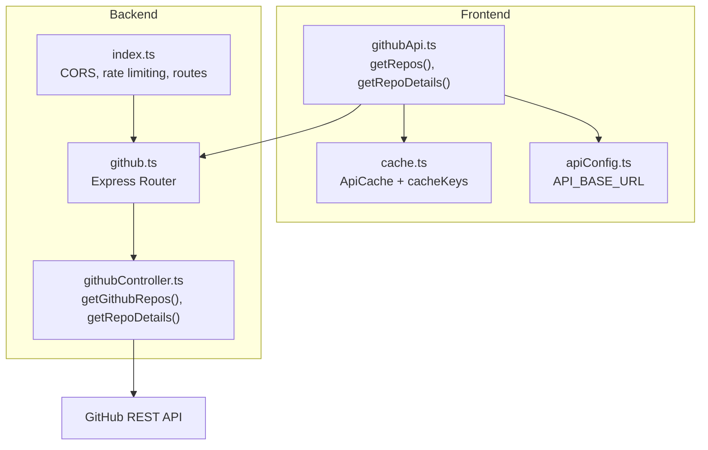
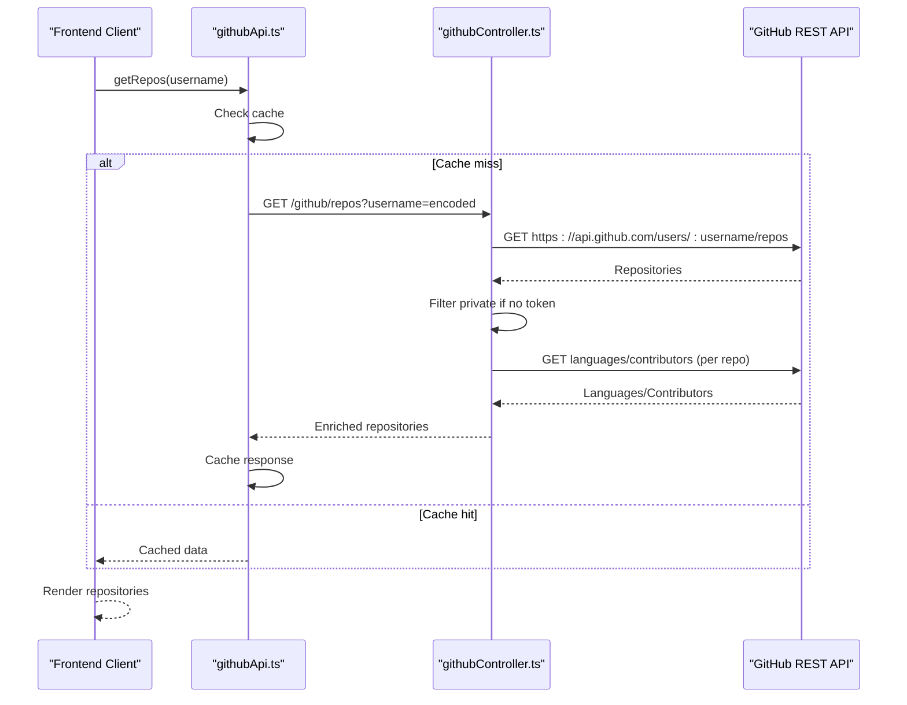
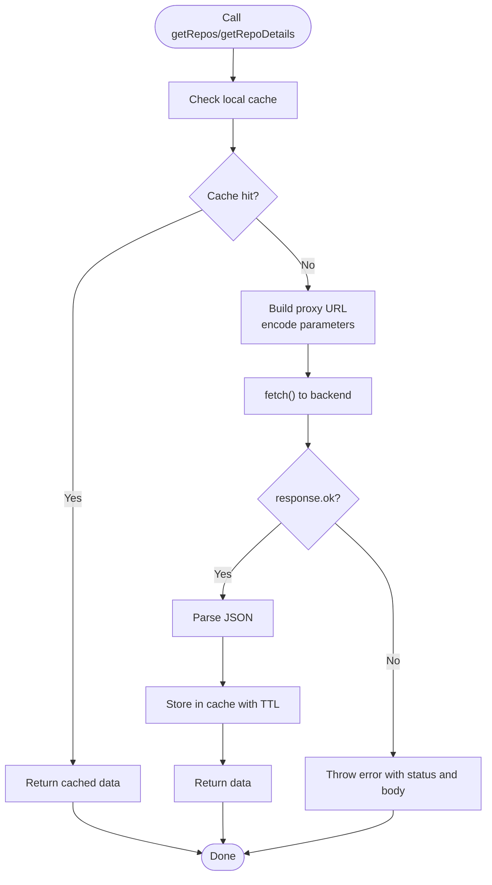
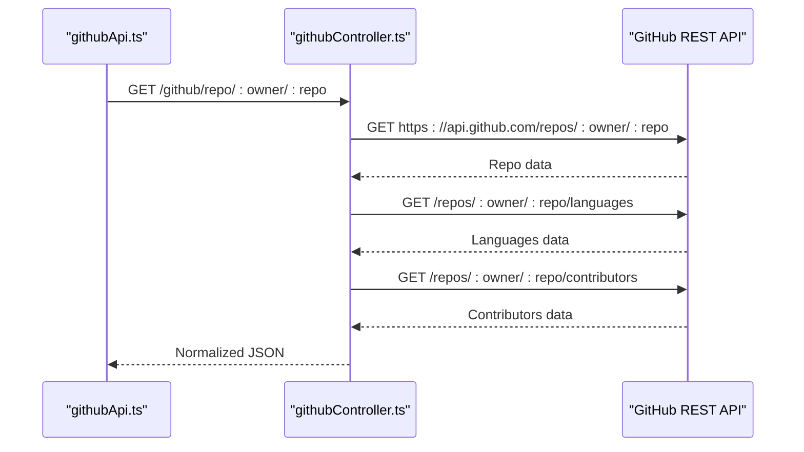
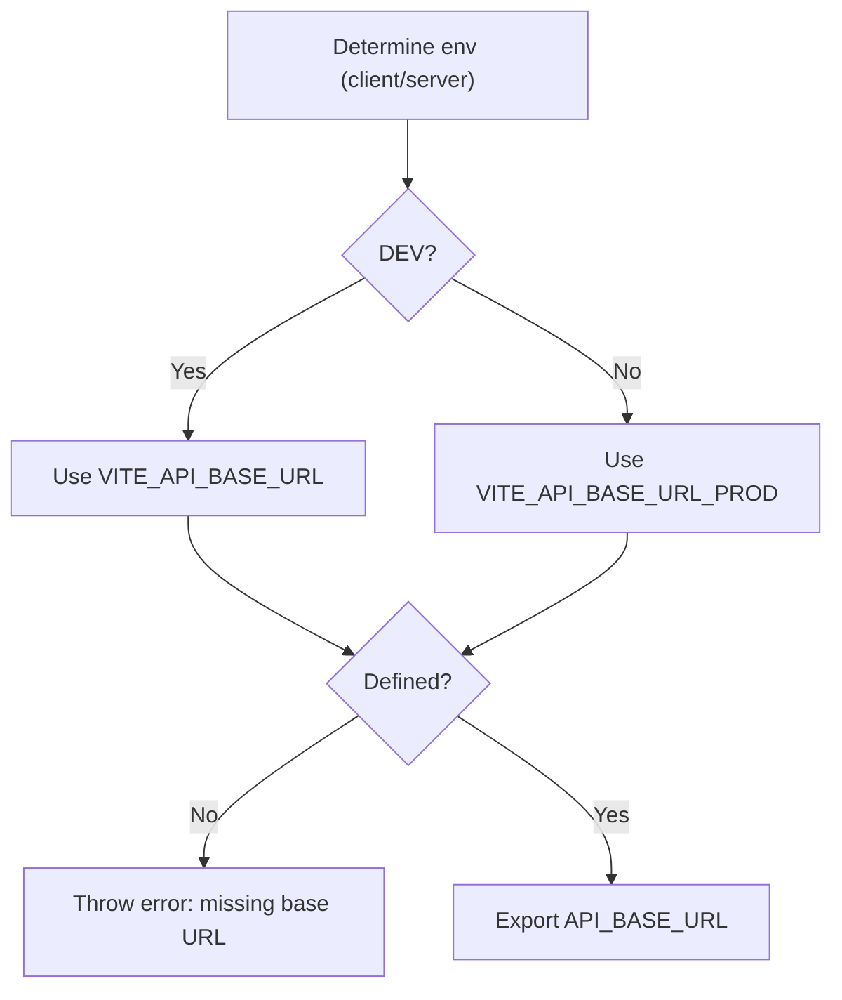
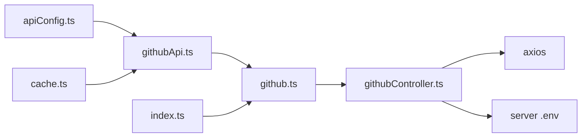

# GitHub API Wrapper Implementation

<cite>
**Referenced Files in This Document**
- [githubApi.ts](file://personalSite/src/api/githubApi.ts)
- [apiConfig.ts](file://personalSite/src/lib/apiConfig.ts)
- [cache.ts](file://personalSite/src/lib/cache.ts)
- [githubController.ts](file://server/src/controllers/githubController.ts)
- [github.ts](file://server/src/routes/github.ts)
- [index.ts](file://server/src/index.ts)
- [auth.ts](file://server/src/middleware/auth.ts)
- [.env.example (server)](file://server/.env.example)
- [.env.example (personalSite)](file://personalSite/.env.example)
</cite>

## Table of Contents
1. [Introduction](#introduction)
2. [Project Structure](#project-structure)
3. [Core Components](#core-components)
4. [Architecture Overview](#architecture-overview)
5. [Detailed Component Analysis](#detailed-component-analysis)
6. [Dependency Analysis](#dependency-analysis)
7. [Performance Considerations](#performance-considerations)
8. [Troubleshooting Guide](#troubleshooting-guide)
9. [Conclusion](#conclusion)

## Introduction
This document explains the GitHub API wrapper implementation that enables the frontend to communicate with GitHub's REST API through a secure backend proxy. It covers the API endpoint structure, request and response handling, error management, centralized configuration, parameter encoding, and response validation. It also documents the two primary methods: fetching user repositories and retrieving individual repository details. Guidance is included for authenticated requests, rate limiting handling, retry logic, and the integration between frontend API calls and backend proxy controllers, including CORS and authentication forwarding.

## Project Structure
The GitHub API integration spans three layers:
- Frontend API wrapper: encapsulates client-side requests to the backend proxy and local caching.
- Backend proxy controller: forwards requests to GitHub, enriches responses, and handles errors.
- Routing and configuration: exposes routes under /github and centralizes API base URL configuration.

**Diagram sources**
- [githubApi.ts](file://personalSite/src/api/githubApi.ts#L1-L46)
- [cache.ts](file://personalSite/src/lib/cache.ts#L1-L137)
- [apiConfig.ts](file://personalSite/src/lib/apiConfig.ts#L1-L75)
- [github.ts](file://server/src/routes/github.ts#L1-L9)
- [githubController.ts](file://server/src/controllers/githubController.ts#L1-L177)
- [index.ts](file://server/src/index.ts#L1-L158)

**Section sources**
- [githubApi.ts](file://personalSite/src/api/githubApi.ts#L1-L46)
- [apiConfig.ts](file://personalSite/src/lib/apiConfig.ts#L1-L75)
- [cache.ts](file://personalSite/src/lib/cache.ts#L1-L137)
- [github.ts](file://server/src/routes/github.ts#L1-L9)
- [githubController.ts](file://server/src/controllers/githubController.ts#L1-L177)
- [index.ts](file://server/src/index.ts#L1-L158)

## Core Components
- Frontend GitHub API wrapper: Provides two methods to fetch repositories and repository details via the backend proxy, with built-in caching and error handling.
- Backend GitHub controller: Implements proxy endpoints that call GitHub’s REST API, apply optional authentication, filter private repositories when unauthenticated, enrich data with languages and contributors, and handle rate limiting and other errors.
- Routing: Exposes GET endpoints under /github for repositories and repository details.
- Configuration: Centralizes API base URL resolution for development and production environments.
- Caching: Frontend cache with TTL to reduce repeated network calls.

**Section sources**
- [githubApi.ts](file://personalSite/src/api/githubApi.ts#L6-L46)
- [githubController.ts](file://server/src/controllers/githubController.ts#L4-L100)
- [githubController.ts](file://server/src/controllers/githubController.ts#L102-L177)
- [github.ts](file://server/src/routes/github.ts#L6-L7)
- [apiConfig.ts](file://personalSite/src/lib/apiConfig.ts#L6-L52)
- [cache.ts](file://personalSite/src/lib/cache.ts#L12-L96)

## Architecture Overview
The frontend calls the backend proxy using a centralized base URL. The backend forwards requests to GitHub, optionally authenticates with a token, enriches responses, and returns normalized data to the client. CORS and rate limiting are enforced at the backend.

**Diagram sources**
- [githubApi.ts](file://personalSite/src/api/githubApi.ts#L7-L25)
- [githubController.ts](file://server/src/controllers/githubController.ts#L4-L100)

**Section sources**
- [githubApi.ts](file://personalSite/src/api/githubApi.ts#L1-L46)
- [githubController.ts](file://server/src/controllers/githubController.ts#L1-L177)
- [index.ts](file://server/src/index.ts#L68-L85)

## Detailed Component Analysis

### Frontend GitHub API Wrapper
Responsibilities:
- Build proxy URLs using the centralized API base URL.
- Encode query parameters and path segments.
- Implement caching with TTL to avoid redundant requests.
- Normalize and return responses, throwing descriptive errors on failure.

Key behaviors:
- getRepos(username): Fetches a paginated list of repositories, filters private ones when unauthenticated, enriches with languages, and caches the result.
- getRepoDetails(owner, repo): Retrieves repository metadata, languages, and top contributors, caches the result, and returns normalized data.

**Diagram sources**
- [githubApi.ts](file://personalSite/src/api/githubApi.ts#L7-L45)

**Section sources**
- [githubApi.ts](file://personalSite/src/api/githubApi.ts#L6-L46)
- [cache.ts](file://personalSite/src/lib/cache.ts#L12-L96)

### Backend Proxy Controller
Responsibilities:
- Validate and extract query/path parameters.
- Call GitHub REST API with appropriate headers and query parameters.
- Optionally forward authentication via a token environment variable.
- Enrich repository lists with languages and filter private repositories when unauthenticated.
- Enrich single repository details with languages and top contributors.
- Map and return normalized JSON responses.
- Handle specific error statuses (e.g., 404 user not found, 403 rate limit exceeded) and generic server errors.

**Diagram sources**
- [githubController.ts](file://server/src/controllers/githubController.ts#L102-L177)

**Section sources**
- [githubController.ts](file://server/src/controllers/githubController.ts#L4-L100)
- [githubController.ts](file://server/src/controllers/githubController.ts#L102-L177)

### Routing and Endpoint Structure
- GET /github/repos: Proxies repository listings with query parameters for sorting, pagination, and type filtering.
- GET /github/repo/:owner/:repo: Proxies repository details and enriches with languages and contributors.

**Section sources**
- [github.ts](file://server/src/routes/github.ts#L6-L7)

### Centralized API Base URL Configuration
The frontend resolves the API base URL from environment variables depending on the runtime environment (client vs server) and development/production modes. The backend uses the same base URL to expose the /github route.

**Diagram sources**
- [apiConfig.ts](file://personalSite/src/lib/apiConfig.ts#L6-L52)

**Section sources**
- [apiConfig.ts](file://personalSite/src/lib/apiConfig.ts#L6-L52)

### Parameter Encoding and Response Validation
- Query parameters are encoded using standard URI encoding to prevent injection and ensure compatibility.
- Responses are validated using response.ok checks; non-OK responses trigger error handling with status codes and textual bodies.
- Backend enriches responses by calling additional GitHub endpoints and normalizing fields.

**Section sources**
- [githubApi.ts](file://personalSite/src/api/githubApi.ts#L15-L18)
- [githubApi.ts](file://personalSite/src/api/githubApi.ts#L35-L38)
- [githubController.ts](file://server/src/controllers/githubController.ts#L12-L24)
- [githubController.ts](file://server/src/controllers/githubController.ts#L106-L125)

### Error Management Strategies
- Frontend: Throws descriptive errors with HTTP status and textual body when backend responses fail.
- Backend: Handles specific GitHub error statuses (e.g., 404 user not found, 403 rate limit exceeded) and maps them to meaningful JSON responses. General errors are returned as 500 with a generic message.

**Section sources**
- [githubApi.ts](file://personalSite/src/api/githubApi.ts#L16-L18)
- [githubApi.ts](file://personalSite/src/api/githubApi.ts#L36-L38)
- [githubController.ts](file://server/src/controllers/githubController.ts#L88-L99)
- [githubController.ts](file://server/src/controllers/githubController.ts#L165-L176)

### Authentication and Token Forwarding
- Optional GitHub token can be provided via environment variable. When present, the backend attaches an Authorization header to GitHub API calls.
- The frontend does not directly handle tokens; authentication is managed server-side.

**Section sources**
- [githubController.ts](file://server/src/controllers/githubController.ts#L20-L23)
- [githubController.ts](file://server/src/controllers/githubController.ts#L106-L110)
- [githubController.ts](file://server/src/controllers/githubController.ts#L113-L125)
- [.env.example (server)](file://server/.env.example#L16-L17)

### CORS Handling and Integration with Frontend
- The backend configures CORS dynamically based on environment variables and defaults, allowing credentials and validating origins.
- The frontend uses the centralized API base URL to call backend routes under /github.

**Section sources**
- [index.ts](file://server/src/index.ts#L37-L85)
- [apiConfig.ts](file://personalSite/src/lib/apiConfig.ts#L6-L52)

### Examples and Usage Patterns

- Making authenticated requests:
  - Set the GitHub token environment variable on the backend so that Authorization headers are forwarded to GitHub.
  - The backend automatically applies the token when available.

- Handling rate limiting responses:
  - The backend detects 403 responses and returns a structured error indicating rate limit exceeded.
  - The frontend receives a JSON error and can surface it to users or trigger retry logic.

- Implementing retry logic for failed requests:
  - The frontend wrapper does not implement retries; however, the backend returns explicit error codes for rate limiting and not-found scenarios, enabling clients to implement retry/backoff strategies as needed.

- Integrating with frontend components:
  - The frontend wrapper exposes getRepos and getRepoDetails methods that encapsulate caching and error handling, simplifying usage in React components.

**Section sources**
- [githubController.ts](file://server/src/controllers/githubController.ts#L88-L99)
- [githubController.ts](file://server/src/controllers/githubController.ts#L165-L176)
- [githubApi.ts](file://personalSite/src/api/githubApi.ts#L6-L46)

## Dependency Analysis
The frontend GitHub API wrapper depends on:
- Centralized API base URL configuration.
- Local caching utilities.
- Express routes and controllers on the backend.

The backend controller depends on:
- Axios for HTTP requests.
- Environment variables for GitHub token and base URLs.
- Express routing and middleware.

**Diagram sources**
- [apiConfig.ts](file://personalSite/src/lib/apiConfig.ts#L1-L75)
- [cache.ts](file://personalSite/src/lib/cache.ts#L1-L137)
- [githubApi.ts](file://personalSite/src/api/githubApi.ts#L1-L46)
- [github.ts](file://server/src/routes/github.ts#L1-L9)
- [githubController.ts](file://server/src/controllers/githubController.ts#L1-L177)
- [index.ts](file://server/src/index.ts#L1-L158)

**Section sources**
- [githubApi.ts](file://personalSite/src/api/githubApi.ts#L1-L46)
- [githubController.ts](file://server/src/controllers/githubController.ts#L1-L177)
- [github.ts](file://server/src/routes/github.ts#L1-L9)
- [index.ts](file://server/src/index.ts#L1-L158)

## Performance Considerations
- Frontend caching: Responses are cached with TTL to reduce network load and improve perceived performance.
- Backend enrichment: The controller performs additional calls to gather languages and contributors; consider batching or caching these secondary calls if traffic increases.
- Pagination and filtering: The frontend wrapper currently uses the backend’s pagination/filtering; tune per_page and sort parameters to balance freshness and performance.
- CORS and rate limiting: The backend enforces rate limits and validates origins to protect resources.

[No sources needed since this section provides general guidance]

## Troubleshooting Guide
Common issues and resolutions:
- API base URL not defined:
  - Ensure VITE_API_BASE_URL or VITE_API_BASE_URL_PROD is set in the frontend environment.
- Missing GitHub token:
  - Without a token, private repositories are filtered out; set GITHUB_TOKEN on the backend to access private data.
- Rate limit exceeded:
  - The backend returns a 403 error indicating rate limit exceeded; consider adding retry logic with exponential backoff on the client.
- User or repository not found:
  - The backend returns 404 for invalid usernames or repository paths; validate inputs before calling the API.
- CORS errors:
  - Verify allowed origins and credentials configuration on the backend; ensure frontend uses the correct API base URL.

**Section sources**
- [apiConfig.ts](file://personalSite/src/lib/apiConfig.ts#L14-L27)
- [githubController.ts](file://server/src/controllers/githubController.ts#L88-L99)
- [githubController.ts](file://server/src/controllers/githubController.ts#L165-L176)
- [index.ts](file://server/src/index.ts#L68-L85)

## Conclusion
The GitHub API wrapper integrates a robust frontend proxy with intelligent caching and a backend controller that enriches GitHub responses, handles authentication, and manages errors gracefully. By centralizing configuration and enforcing CORS and rate limiting, the system provides a reliable foundation for displaying repositories and repository details in the application.