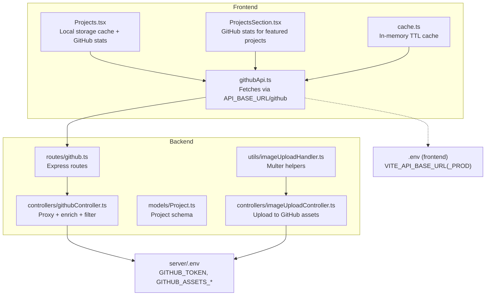
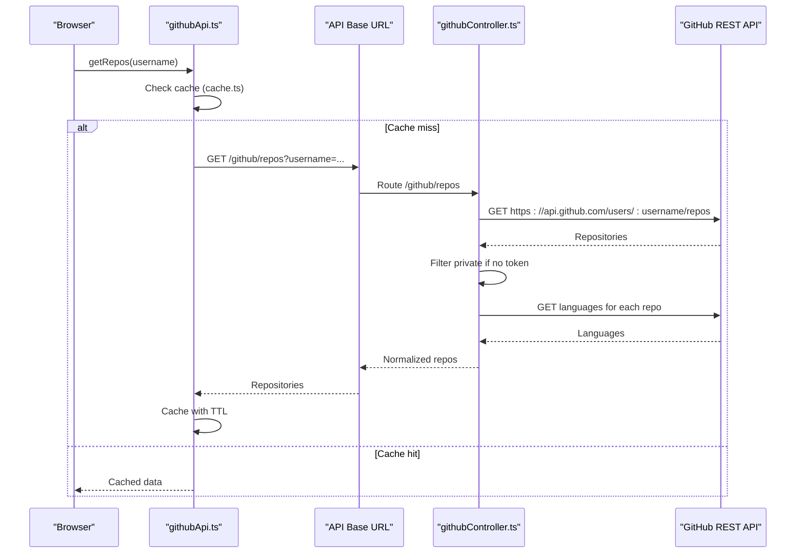
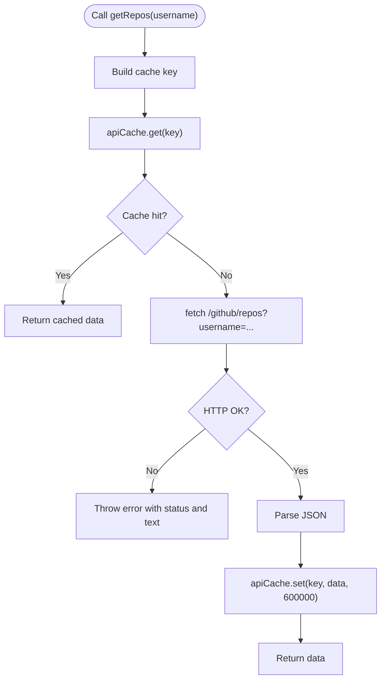
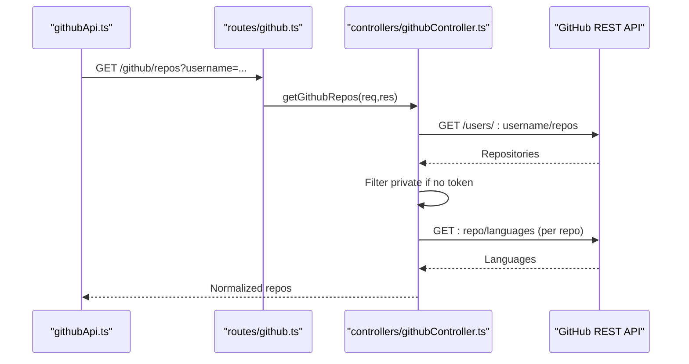
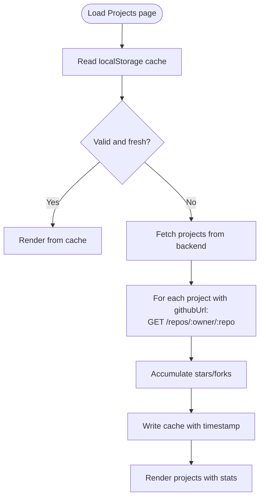
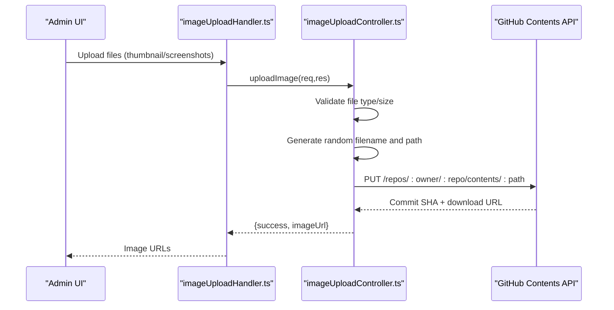
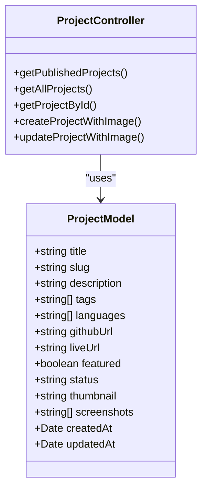
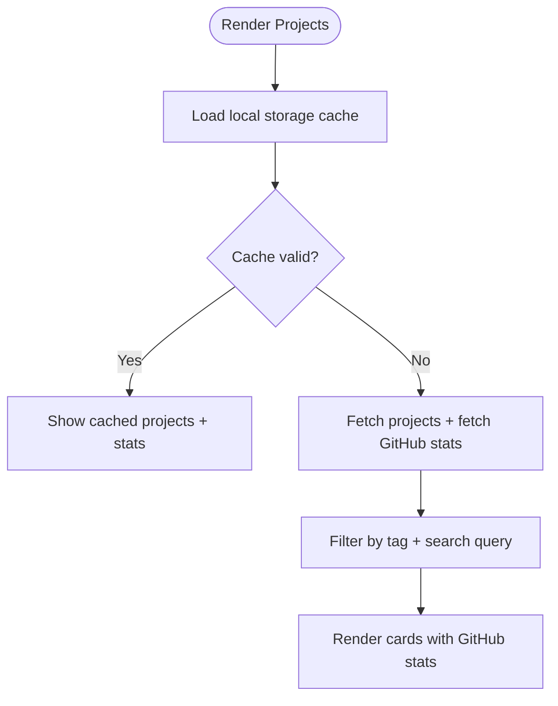
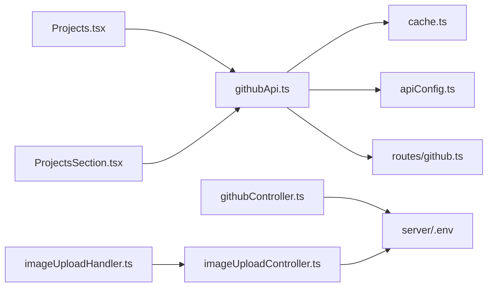

# GitHub Integration System

<cite>
**Referenced Files in This Document**
- [githubApi.ts](file://personalSite/src/api/githubApi.ts)
- [githubController.ts](file://server/src/controllers/githubController.ts)
- [github.ts](file://server/src/routes/github.ts)
- [cache.ts](file://personalSite/src/lib/cache.ts)
- [apiConfig.ts](file://personalSite/src/lib/apiConfig.ts)
- [.env](file://personalSite/.env)
- [server/.env](file://server/.env)
- [imageUploadHandler.ts](file://server/src/utils/imageUploadHandler.ts)
- [imageUploadController.ts](file://server/src/controllers/imageUploadController.ts)
- [Projects.tsx](file://personalSite/src/pages/Projects.tsx)
- [ProjectsSection.tsx](file://personalSite/src/components/sections/ProjectsSection.tsx)
- [Project.ts](file://server/src/models/Project.ts)
- [projectController.ts](file://server/src/controllers/projectController.ts)
</cite>

## Table of Contents
1. [Introduction](#introduction)
2. [Project Structure](#project-structure)
3. [Core Components](#core-components)
4. [Architecture Overview](#architecture-overview)
5. [Detailed Component Analysis](#detailed-component-analysis)
6. [Dependency Analysis](#dependency-analysis)
7. [Performance Considerations](#performance-considerations)
8. [Troubleshooting Guide](#troubleshooting-guide)
9. [Conclusion](#conclusion)
10. [Appendices](#appendices)

## Introduction
This document explains the GitHub Integration System that connects the portfolio with GitHub repositories. It covers the frontend API wrapper for GitHub’s REST API, caching strategies to minimize API calls, data synchronization processes, project data extraction and filtering logic, repository showcase formatting, and real-time update mechanisms. It also documents the image upload system for repository avatars and screenshots, Multer-based file handling, and cloud storage integration via GitHub. Error handling for API rate limits, network failures, and authentication issues is addressed, along with examples for customizing repository filtering, implementing custom caching strategies, and extending the integration for additional GitHub features. Performance optimization and best practices for API usage are included.

## Project Structure
The integration spans three main areas:
- Frontend API wrapper and caching for GitHub data
- Backend proxy controller for GitHub REST API with filtering and enrichment
- Image upload pipeline to GitHub-backed asset storage
- Project data model and controllers for portfolio-managed projects

**Diagram sources**
- [githubApi.ts](file://personalSite/src/api/githubApi.ts#L1-L46)
- [cache.ts](file://personalSite/src/lib/cache.ts#L1-L137)
- [Projects.tsx](file://personalSite/src/pages/Projects.tsx#L1-L337)
- [ProjectsSection.tsx](file://personalSite/src/components/sections/ProjectsSection.tsx#L1-L172)
- [github.ts](file://server/src/routes/github.ts#L1-L9)
- [githubController.ts](file://server/src/controllers/githubController.ts#L1-L177)
- [Project.ts](file://server/src/models/Project.ts#L1-L97)
- [imageUploadHandler.ts](file://server/src/utils/imageUploadHandler.ts#L1-L199)
- [imageUploadController.ts](file://server/src/controllers/imageUploadController.ts#L1-L137)
- [.env](file://personalSite/.env#L1-L7)
- [server/.env](file://server/.env#L1-L27)

**Section sources**
- [githubApi.ts](file://personalSite/src/api/githubApi.ts#L1-L46)
- [githubController.ts](file://server/src/controllers/githubController.ts#L1-L177)
- [github.ts](file://server/src/routes/github.ts#L1-L9)
- [cache.ts](file://personalSite/src/lib/cache.ts#L1-L137)
- [apiConfig.ts](file://personalSite/src/lib/apiConfig.ts#L1-L75)
- [.env](file://personalSite/.env#L1-L7)
- [server/.env](file://server/.env#L1-L27)
- [imageUploadHandler.ts](file://server/src/utils/imageUploadHandler.ts#L1-L199)
- [imageUploadController.ts](file://server/src/controllers/imageUploadController.ts#L1-L137)
- [Projects.tsx](file://personalSite/src/pages/Projects.tsx#L1-L337)
- [ProjectsSection.tsx](file://personalSite/src/components/sections/ProjectsSection.tsx#L1-L172)
- [Project.ts](file://server/src/models/Project.ts#L1-L97)
- [projectController.ts](file://server/src/controllers/projectController.ts#L1-L800)

## Core Components
- Frontend GitHub API wrapper: Fetches repositories and repository details with in-memory caching and TTL.
- Backend GitHub proxy controller: Calls GitHub REST API, filters private repositories when unauthenticated, enriches with languages/contributors, and handles rate-limit and error responses.
- Local storage cache for the Projects page: Stores combined project and GitHub stats with TTL.
- Image upload pipeline: Validates and uploads images to a GitHub repository configured via environment variables, returning raw URLs.
- Project data model and controllers: Manage portfolio projects with GitHub URL validation and image fields.

**Section sources**
- [githubApi.ts](file://personalSite/src/api/githubApi.ts#L6-L46)
- [githubController.ts](file://server/src/controllers/githubController.ts#L4-L100)
- [Projects.tsx](file://personalSite/src/pages/Projects.tsx#L58-L106)
- [imageUploadController.ts](file://server/src/controllers/imageUploadController.ts#L14-L137)
- [Project.ts](file://server/src/models/Project.ts#L3-L17)

## Architecture Overview
The system uses a layered approach:
- Frontend requests go through a centralized API base URL and are cached locally.
- Backend routes proxy GitHub API calls, apply filtering/enrichment, and return normalized data.
- Image uploads are handled by a dedicated pipeline that writes to a GitHub-backed asset repository.
- Portfolio projects are stored in MongoDB and optionally linked to GitHub repositories.

**Diagram sources**
- [githubApi.ts](file://personalSite/src/api/githubApi.ts#L7-L25)
- [cache.ts](file://personalSite/src/lib/cache.ts#L20-L48)
- [github.ts](file://server/src/routes/github.ts#L6-L6)
- [githubController.ts](file://server/src/controllers/githubController.ts#L12-L87)

## Detailed Component Analysis

### Frontend GitHub API Wrapper and Caching
- Purpose: Provide a typed client to fetch repositories and repository details via the backend proxy, with in-memory caching and TTL.
- Key behaviors:
  - Uses a centralized API base URL resolved from environment variables.
  - Generates cache keys for usernames and individual repositories.
  - Returns cached data immediately if not expired.
  - On cache miss, fetches from backend route and caches with a 10-minute TTL.
- Error handling: Throws descriptive errors on HTTP failure.

**Diagram sources**
- [githubApi.ts](file://personalSite/src/api/githubApi.ts#L7-L25)
- [cache.ts](file://personalSite/src/lib/cache.ts#L20-L48)

**Section sources**
- [githubApi.ts](file://personalSite/src/api/githubApi.ts#L1-L46)
- [cache.ts](file://personalSite/src/lib/cache.ts#L1-L137)
- [apiConfig.ts](file://personalSite/src/lib/apiConfig.ts#L6-L55)

### Backend GitHub Proxy Controller
- Purpose: Act as a gateway to GitHub REST API, normalize responses, and handle authentication and rate limiting.
- Key behaviors:
  - Validates presence of username and applies query parameters (sort, direction, page, per_page).
  - Calls GitHub API with optional Authorization header when a token is present.
  - Filters out private repositories when no token is provided.
  - Enriches each repository with top languages (up to a limit) and visibility.
  - Handles 404 (user not found) and 403 (rate limit) responses.
- Repository details endpoint:
  - Fetches repository metadata, languages, and contributors.
  - Returns a normalized payload with selected fields and contributor summaries.

**Diagram sources**
- [github.ts](file://server/src/routes/github.ts#L6-L6)
- [githubController.ts](file://server/src/controllers/githubController.ts#L12-L87)

**Section sources**
- [githubController.ts](file://server/src/controllers/githubController.ts#L4-L100)
- [githubController.ts](file://server/src/controllers/githubController.ts#L102-L177)
- [github.ts](file://server/src/routes/github.ts#L1-L9)

### Local Storage Cache for Projects Page
- Purpose: Persist combined project list and GitHub stats with TTL to reduce repeated network calls.
- Key behaviors:
  - Reads/writes a cache object containing timestamp, projects, and GitHub stats.
  - Validates cache age and structure before use.
  - Updates stats by fetching repository metadata for each project with a GitHub URL.

**Diagram sources**
- [Projects.tsx](file://personalSite/src/pages/Projects.tsx#L58-L106)
- [Projects.tsx](file://personalSite/src/pages/Projects.tsx#L127-L182)

**Section sources**
- [Projects.tsx](file://personalSite/src/pages/Projects.tsx#L35-L106)
- [Projects.tsx](file://personalSite/src/pages/Projects.tsx#L108-L189)

### Image Upload Pipeline to GitHub Assets
- Purpose: Validate, upload, and serve images from the portfolio admin to a GitHub-backed asset repository.
- Key behaviors:
  - Validates file type (PNG, JPEG, WebP) and size (≤ 2MB).
  - Generates a cryptographically secure random filename with correct extension.
  - Creates a date-based path (images/uploads/YYYY/MM/<filename>).
  - Uploads base64-encoded content to GitHub using a PUT request to the contents API.
  - Returns a raw URL for consumption by the frontend.
- Helpers:
  - Supports single/thumbnail and multiple screenshots uploads.
  - Handles legacy single-file uploads and modern named-field uploads.

**Diagram sources**
- [imageUploadHandler.ts](file://server/src/utils/imageUploadHandler.ts#L48-L199)
- [imageUploadController.ts](file://server/src/controllers/imageUploadController.ts#L14-L137)

**Section sources**
- [imageUploadHandler.ts](file://server/src/utils/imageUploadHandler.ts#L1-L199)
- [imageUploadController.ts](file://server/src/controllers/imageUploadController.ts#L14-L137)

### Project Data Model and Controllers
- Purpose: Define the project schema and provide CRUD operations with image upload integration.
- Key behaviors:
  - Validates GitHub URL format and live URL format.
  - Supports both creation and update flows with image handling.
  - Slug generation ensures uniqueness.
  - Search and filtering for published vs. all projects.

**Diagram sources**
- [Project.ts](file://server/src/models/Project.ts#L3-L17)
- [projectController.ts](file://server/src/controllers/projectController.ts#L25-L146)

**Section sources**
- [Project.ts](file://server/src/models/Project.ts#L1-L97)
- [projectController.ts](file://server/src/controllers/projectController.ts#L148-L329)
- [projectController.ts](file://server/src/controllers/projectController.ts#L448-L481)
- [projectController.ts](file://server/src/controllers/projectController.ts#L606-L687)

### Repository Showcase Formatting and Filtering
- Purpose: Present projects with optional GitHub stats and interactive filtering.
- Key behaviors:
  - Projects page:
    - Local storage cache with TTL.
    - Tag-based filtering and free-text search across title, description, and tags.
  - Projects section (homepage):
    - Fetches latest projects and enriches with stars/forks from GitHub.
    - Skeleton loading and error handling.

**Diagram sources**
- [Projects.tsx](file://personalSite/src/pages/Projects.tsx#L108-L202)
- [ProjectsSection.tsx](file://personalSite/src/components/sections/ProjectsSection.tsx#L43-L96)

**Section sources**
- [Projects.tsx](file://personalSite/src/pages/Projects.tsx#L108-L202)
- [ProjectsSection.tsx](file://personalSite/src/components/sections/ProjectsSection.tsx#L43-L96)

## Dependency Analysis
- Frontend depends on:
  - Centralized API base URL resolution.
  - In-memory cache with TTL.
  - Local storage cache for the Projects page.
- Backend depends on:
  - GitHub API with optional token for higher rate limits.
  - Environment variables for GitHub token and asset repository configuration.
- Image upload depends on:
  - GitHub token and asset repository settings.
  - Multer-style file handling via helper utilities.

**Diagram sources**
- [githubApi.ts](file://personalSite/src/api/githubApi.ts#L1-L46)
- [cache.ts](file://personalSite/src/lib/cache.ts#L1-L137)
- [apiConfig.ts](file://personalSite/src/lib/apiConfig.ts#L1-L75)
- [Projects.tsx](file://personalSite/src/pages/Projects.tsx#L1-L337)
- [ProjectsSection.tsx](file://personalSite/src/components/sections/ProjectsSection.tsx#L1-L172)
- [github.ts](file://server/src/routes/github.ts#L1-L9)
- [githubController.ts](file://server/src/controllers/githubController.ts#L1-L177)
- [imageUploadHandler.ts](file://server/src/utils/imageUploadHandler.ts#L1-L199)
- [imageUploadController.ts](file://server/src/controllers/imageUploadController.ts#L1-L137)
- [server/.env](file://server/.env#L1-L27)

**Section sources**
- [githubApi.ts](file://personalSite/src/api/githubApi.ts#L1-L46)
- [cache.ts](file://personalSite/src/lib/cache.ts#L1-L137)
- [apiConfig.ts](file://personalSite/src/lib/apiConfig.ts#L1-L75)
- [Projects.tsx](file://personalSite/src/pages/Projects.tsx#L1-L337)
- [ProjectsSection.tsx](file://personalSite/src/components/sections/ProjectsSection.tsx#L1-L172)
- [github.ts](file://server/src/routes/github.ts#L1-L9)
- [githubController.ts](file://server/src/controllers/githubController.ts#L1-L177)
- [imageUploadHandler.ts](file://server/src/utils/imageUploadHandler.ts#L1-L199)
- [imageUploadController.ts](file://server/src/controllers/imageUploadController.ts#L1-L137)
- [server/.env](file://server/.env#L1-L27)

## Performance Considerations
- Minimize API calls:
  - Use in-memory cache with TTL for repository lists and details.
  - Use local storage cache with TTL for the Projects page to avoid repeated GitHub stats fetches.
- Batch enrichments:
  - Backend controller enriches languages concurrently per repository.
- Rate limit mitigation:
  - Provide a GitHub token to increase rate limits.
  - Implement exponential backoff and retry on 403 rate limit errors.
- Network resilience:
  - Add timeouts and circuit-breaker patterns around external API calls.
- Caching strategies:
  - Implement cache invalidation by pattern for repository updates.
  - Consider Redis or IndexedDB for persistence across browser sessions.

[No sources needed since this section provides general guidance]

## Troubleshooting Guide
- Authentication issues:
  - Ensure the GitHub token is set in the server environment variables.
  - Verify the token has appropriate scopes for repository access.
- Rate limits:
  - Backend returns 403 with a specific message when rate-limited; frontend should display a retry prompt or cached data.
  - Consider adding retry logic with jitter and exponential backoff.
- Network failures:
  - Wrap fetch calls with try/catch and surface user-friendly messages.
  - Implement fallback to cached data when offline or partially available.
- Image upload errors:
  - Validate file type and size before upload.
  - Check GitHub token and asset repository configuration.
  - Log detailed error responses from the GitHub API.

**Section sources**
- [githubController.ts](file://server/src/controllers/githubController.ts#L88-L99)
- [githubController.ts](file://server/src/controllers/githubController.ts#L165-L176)
- [imageUploadController.ts](file://server/src/controllers/imageUploadController.ts#L22-L36)
- [imageUploadController.ts](file://server/src/controllers/imageUploadController.ts#L111-L119)

## Conclusion
The GitHub Integration System combines a frontend API wrapper with in-memory and local storage caching, a robust backend proxy for GitHub REST API with filtering and enrichment, and a secure image upload pipeline to a GitHub-backed asset repository. Together, these components deliver efficient, scalable, and user-friendly integration with GitHub repositories while maintaining performance and reliability.

[No sources needed since this section summarizes without analyzing specific files]

## Appendices

### Customizing Repository Filtering
- Modify the backend controller to add additional filters (e.g., language, topic, date range).
- Adjust frontend filters to expose new options and update the filtering logic accordingly.

**Section sources**
- [githubController.ts](file://server/src/controllers/githubController.ts#L26-L30)
- [Projects.tsx](file://personalSite/src/pages/Projects.tsx#L193-L202)

### Implementing Custom Caching Strategies
- Extend the frontend cache utility to support:
  - Cache invalidation by pattern.
  - Persistence across sessions (e.g., IndexedDB).
  - Stale-while-revalidate for gradual cache refresh.

**Section sources**
- [cache.ts](file://personalSite/src/lib/cache.ts#L78-L85)
- [cache.ts](file://personalSite/src/lib/cache.ts#L90-L95)

### Extending the Integration for Additional GitHub Features
- Add endpoints for:
  - Topics and descriptions enrichment.
  - Releases and README parsing.
  - Activity timelines and contributor insights.
- Integrate with GitHub GraphQL API for more efficient queries.

[No sources needed since this section provides general guidance]

### Best Practices for API Usage
- Use environment variables for tokens and endpoints.
- Apply rate-limit-aware retry logic.
- Prefer normalized data structures and consistent field naming.
- Validate and sanitize all external inputs.

[No sources needed since this section provides general guidance]