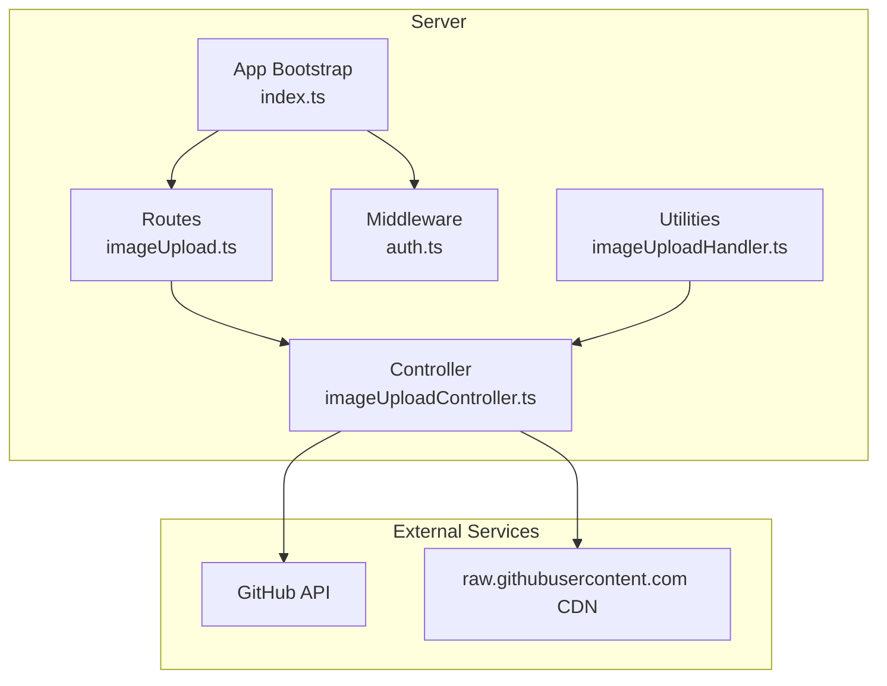
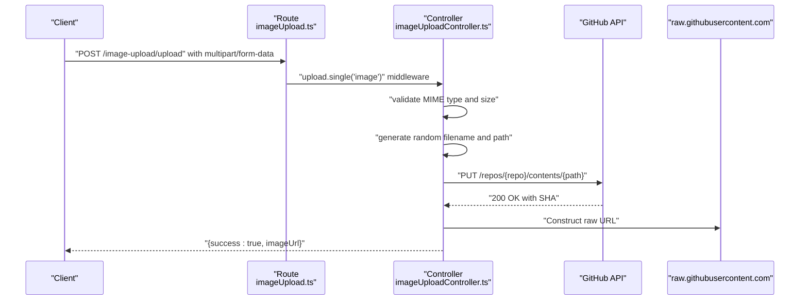
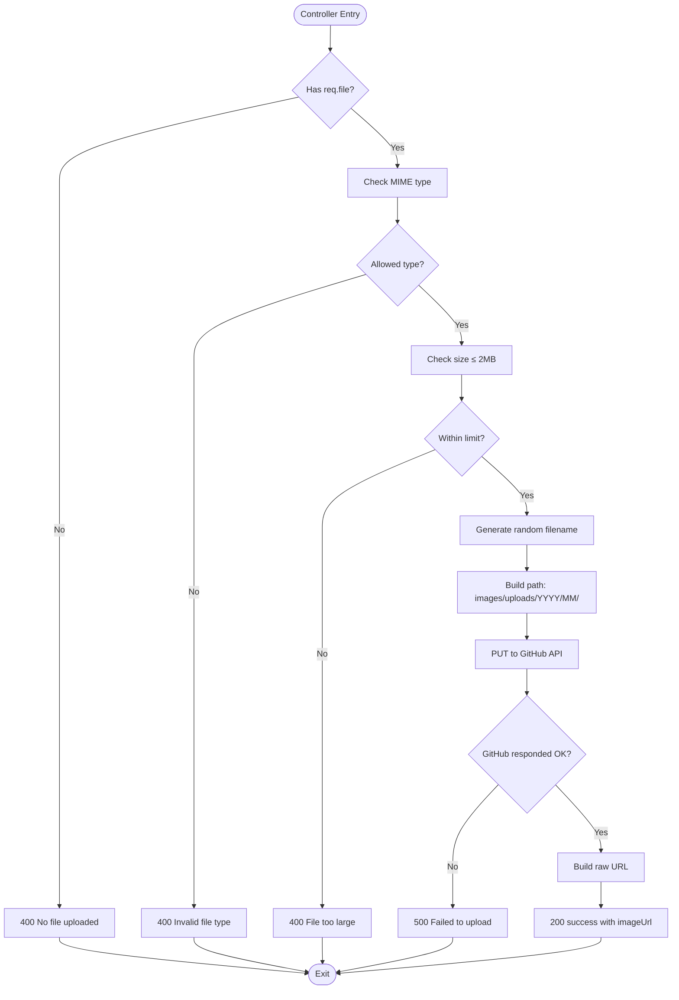
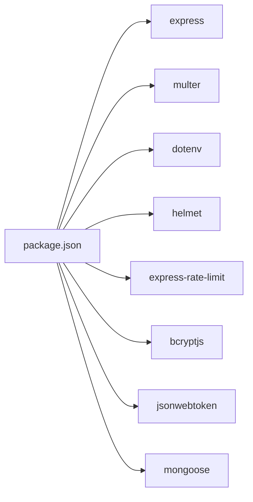

# Image Upload and Media Handling

<cite>
**Referenced Files in This Document**
- [imageUploadController.ts](file://server/src/controllers/imageUploadController.ts)
- [imageUploadHandler.ts](file://server/src/utils/imageUploadHandler.ts)
- [imageUpload.ts](file://server/src/routes/imageUpload.ts)
- [index.ts](file://server/src/index.ts)
- [auth.ts](file://server/src/middleware/auth.ts)
- [package.json](file://server/package.json)
- [.env.example](file://server/.env.example)
</cite>

## Table of Contents
1. [Introduction](#introduction)
2. [Project Structure](#project-structure)
3. [Core Components](#core-components)
4. [Architecture Overview](#architecture-overview)
5. [Detailed Component Analysis](#detailed-component-analysis)
6. [Dependency Analysis](#dependency-analysis)
7. [Performance Considerations](#performance-considerations)
8. [Troubleshooting Guide](#troubleshooting-guide)
9. [Conclusion](#conclusion)
10. [Appendices](#appendices)

## Introduction
This document explains the image upload system used for repository-related media such as avatars, screenshots, and profile images. It covers the Multer configuration for file handling, supported file types and size limits, security validations, the upload controller implementation, file naming strategies, and storage location management. It also documents the integration with GitHub as a cloud storage service, the fallback to a local file system approach, and CDN integration for optimized image delivery. Practical examples show how to customize upload directories, implement custom file naming schemes, and add watermarking or image optimization features. Security considerations include file type validation, malicious file detection, and access control for uploaded files.

## Project Structure
The image upload system is implemented in the server-side codebase under the server directory. The key components are:
- Route definition that configures Multer for in-memory file buffering
- Controller that validates uploads, generates filenames, and stores images to GitHub
- Utility helpers that orchestrate uploads for articles and projects
- Application bootstrap that registers the upload route and applies global middleware

**Diagram sources**
- [imageUpload.ts](file://server/src/routes/imageUpload.ts#L1-L19)
- [imageUploadController.ts](file://server/src/controllers/imageUploadController.ts#L1-L137)
- [imageUploadHandler.ts](file://server/src/utils/imageUploadHandler.ts#L1-L199)
- [index.ts](file://server/src/index.ts#L1-L158)
- [auth.ts](file://server/src/middleware/auth.ts#L1-L37)

**Section sources**
- [imageUpload.ts](file://server/src/routes/imageUpload.ts#L1-L19)
- [imageUploadController.ts](file://server/src/controllers/imageUploadController.ts#L1-L137)
- [imageUploadHandler.ts](file://server/src/utils/imageUploadHandler.ts#L1-L199)
- [index.ts](file://server/src/index.ts#L1-L158)
- [auth.ts](file://server/src/middleware/auth.ts#L1-L37)

## Core Components
- Multer configuration: Stores uploaded files in memory as buffers with a 2 MB size limit and a single field named image.
- Upload controller: Validates MIME types, enforces size limits, generates cryptographically secure random filenames, constructs a dated folder path, and uploads to GitHub via the REST API.
- Utilities: Provide helper functions to upload images for articles and projects, handling both single and multiple file scenarios.
- CDN integration: Returns URLs pointing to raw.githubusercontent.com for optimized delivery.

Key capabilities:
- Supported file types: PNG, JPEG, WebP
- Size limit: 2 MB
- Storage: GitHub repository with a structured path under images/uploads/YYYY/MM/
- Delivery: raw.githubusercontent.com URLs

**Section sources**
- [imageUpload.ts](file://server/src/routes/imageUpload.ts#L5-L12)
- [imageUploadController.ts](file://server/src/controllers/imageUploadController.ts#L46-L87)
- [imageUploadHandler.ts](file://server/src/utils/imageUploadHandler.ts#L8-L45)
- [imageUploadHandler.ts](file://server/src/utils/imageUploadHandler.ts#L48-L199)

## Architecture Overview
The upload flow begins at the route, which uses Multer to parse multipart/form-data. The controller validates the file, generates a filename, and uploads the content to GitHub. The response returns a CDN-ready URL.

**Diagram sources**
- [imageUpload.ts](file://server/src/routes/imageUpload.ts#L17-L17)
- [imageUploadController.ts](file://server/src/controllers/imageUploadController.ts#L14-L129)

## Detailed Component Analysis

### Multer Configuration and Route
- Storage: Memory storage buffers the entire file in RAM.
- Limits: Maximum file size is 2 MB.
- Field name: Expects a single field named image.
- Route registration: Mounted under /image-upload.

**Diagram sources**
- [imageUpload.ts](file://server/src/routes/imageUpload.ts#L6-L12)

**Section sources**
- [imageUpload.ts](file://server/src/routes/imageUpload.ts#L5-L12)

### Upload Controller Implementation
Responsibilities:
- Validate presence of uploaded file
- Validate MIME type against allowed list
- Enforce 2 MB size limit
- Generate cryptographically secure random filename based on detected MIME type
- Construct path using year/month folders
- Upload to GitHub using the REST API
- Return CDN URL

Security validations:
- MIME type whitelist: PNG, JPEG, WebP
- Size limit enforcement
- Randomized filenames prevent predictable paths
- Environment variables guard secrets and repository configuration

**Diagram sources**
- [imageUploadController.ts](file://server/src/controllers/imageUploadController.ts#L38-L129)

**Section sources**
- [imageUploadController.ts](file://server/src/controllers/imageUploadController.ts#L14-L137)

### File Naming Strategies and Storage Location Management
- Filename: Cryptographically secure random bytes converted to hex, suffixed with the correct extension derived from the MIME type.
- Path: images/uploads/YYYY/MM/, where YYYY and MM are derived from the current date.
- Extension mapping: PNG, JPEG, WebP mapped to respective extensions; fallback to WebP if unknown.

Customization points:
- Change extension mapping to support additional formats.
- Modify path construction to include subfolders (e.g., user ID).
- Adjust date granularity (e.g., include day).

**Section sources**
- [imageUploadController.ts](file://server/src/controllers/imageUploadController.ts#L65-L87)

### Integration with Cloud Storage Services and CDN
- Cloud storage: GitHub repository configured via environment variables.
- CDN: raw.githubusercontent.com URLs constructed from repository, branch, and path.
- Branch selection: configurable via environment variable.

Operational notes:
- The controller uploads base64-encoded content to GitHub.
- The response provides a direct CDN URL for immediate use.

**Section sources**
- [imageUploadController.ts](file://server/src/controllers/imageUploadController.ts#L92-L124)
- [.env.example](file://server/.env.example#L16-L17)

### Access Control and Authentication
- Authentication middleware: JWT-based authentication and admin role checks are available in the middleware layer.
- Current upload route does not enforce authentication. To protect uploads:
  - Apply the authentication middleware to the upload route.
  - Optionally apply the admin middleware for administrative uploads.

**Section sources**
- [auth.ts](file://server/src/middleware/auth.ts#L9-L37)
- [imageUpload.ts](file://server/src/routes/imageUpload.ts#L17-L17)
- [index.ts](file://server/src/index.ts#L113-L113)

### Utilities for Article and Project Uploads
- handleArticleImageUpload: Wraps the controller to return a single image URL for articles.
- handleProjectImageUpload: Supports multiple upload modes:
  - Single file upload for thumbnails
  - Named fields upload with separate thumbnail and screenshots arrays
  - Multiple file fallback for screenshots

Behavior:
- Iterates through provided files, invoking the controller for each.
- Aggregates results into a structured object.

**Section sources**
- [imageUploadHandler.ts](file://server/src/utils/imageUploadHandler.ts#L8-L45)
- [imageUploadHandler.ts](file://server/src/utils/imageUploadHandler.ts#L48-L199)

## Dependency Analysis
- Dependencies:
  - Express for routing and middleware
  - Multer for multipart/form-data parsing
  - dotenv for environment configuration
  - Helmet for security headers
  - express-rate-limit for rate limiting
  - bcryptjs, jsonwebtoken for authentication
  - mongoose for database connectivity

**Diagram sources**
- [package.json](file://server/package.json#L12-L26)

**Section sources**
- [package.json](file://server/package.json#L12-L26)

## Performance Considerations
- In-memory buffering: Multer memory storage loads entire files into RAM. This is suitable for small images but can increase memory pressure with larger files or concurrent uploads.
- Size limit: 2 MB prevents excessive memory usage and reduces network overhead.
- CDN delivery: Using raw.githubusercontent.com offloads bandwidth and improves latency.
- Recommendations:
  - Monitor memory usage under load.
  - Consider streaming uploads for very large files if supported by the client.
  - Implement queueing or background processing for heavy transformations.

[No sources needed since this section provides general guidance]

## Troubleshooting Guide
Common issues and resolutions:
- Missing environment variables:
  - GITHUB_TOKEN and GITHUB_ASSETS_REPO must be set. The controller returns a 500 error if missing.
- Invalid file type:
  - Only PNG, JPEG, and WebP are accepted. The controller returns a 400 error for unsupported types.
- File too large:
  - Exceeding 2 MB triggers a 400 error.
- GitHub API failure:
  - Non-OK responses from GitHub result in a 500 error with a logged message.
- No file uploaded:
  - Missing file field results in a 400 error.

Access control:
- If uploads fail due to authentication, ensure the authentication middleware is applied to the route and the client sends a valid JWT.

**Section sources**
- [imageUploadController.ts](file://server/src/controllers/imageUploadController.ts#L21-L42)
- [imageUploadController.ts](file://server/src/controllers/imageUploadController.ts#L46-L63)
- [imageUploadController.ts](file://server/src/controllers/imageUploadController.ts#L111-L119)
- [auth.ts](file://server/src/middleware/auth.ts#L9-L37)

## Conclusion
The image upload system uses Multer for robust multipart parsing, enforces strict file type and size constraints, and securely stores images on GitHub with randomized filenames and dated folder organization. The controller returns CDN-ready URLs for efficient delivery. While the current implementation targets small images and relies on GitHub, the architecture allows customization for additional formats, storage backends, and advanced features like watermarking or optimization.

[No sources needed since this section summarizes without analyzing specific files]

## Appendices

### Customizing Upload Directories
To change the storage path:
- Modify the path construction logic in the controller to include additional segments (e.g., user ID).
- Ensure the target repository supports the new path structure.

Example customization point:
- Path building: images/uploads/YYYY/MM/ → images/uploads/{userId}/{YYYY}/{MM}/

**Section sources**
- [imageUploadController.ts](file://server/src/controllers/imageUploadController.ts#L83-L87)

### Implementing Custom File Naming Schemes
To implement custom naming:
- Replace the random filename generator with a scheme that incorporates metadata (e.g., user ID, timestamp).
- Ensure the chosen scheme avoids collisions and maintains uniqueness.

Example customization point:
- Filename generation: randomBytes → custom scheme with metadata

**Section sources**
- [imageUploadController.ts](file://server/src/controllers/imageUploadController.ts#L65-L81)

### Adding Watermarking or Image Optimization Features
Recommended approach:
- Introduce a library for image processing (e.g., sharp) to transform images before upload.
- Perform transformations in-memory or stream-based to respect the 2 MB limit.
- Consider asynchronous processing for heavy operations.

Implementation steps:
- Add the image processing library to dependencies.
- Transform the buffer in the controller before uploading to GitHub.
- Adjust the controller to handle transformed content and metadata.

**Section sources**
- [package.json](file://server/package.json#L12-L26)
- [imageUploadController.ts](file://server/src/controllers/imageUploadController.ts#L89-L90)

### Security Considerations
- File type validation: Whitelist MIME types to prevent malicious content.
- Size limits: Prevent resource exhaustion and reduce attack surface.
- Randomized filenames: Avoid directory traversal and enumeration.
- Access control: Apply authentication and admin middleware to protect sensitive uploads.
- Secrets management: Store tokens and repository details in environment variables.

**Section sources**
- [imageUploadController.ts](file://server/src/controllers/imageUploadController.ts#L46-L63)
- [imageUploadController.ts](file://server/src/controllers/imageUploadController.ts#L17-L36)
- [auth.ts](file://server/src/middleware/auth.ts#L9-L37)