# API Integration

<cite>
**Referenced Files in This Document**
- [apiConfig.ts](file://personalSite/src/lib/apiConfig.ts)
- [cache.ts](file://personalSite/src/lib/cache.ts)
- [slugify.ts](file://server/src/utils/slugify.ts)
- [articleApi.ts](file://personalSite/src/api/articleApi.ts)
- [projectApi.ts](file://personalSite/src/api/projectApi.ts)
- [githubApi.ts](file://personalSite/src/api/githubApi.ts)
- [dashboardApi.ts](file://personalSite/src/api/dashboardApi.ts)
- [aboutApi.ts](file://personalSite/src/api/aboutApi.ts)
- [settingsApi.ts](file://personalSite/src/api/settingsApi.ts)
- [.env](file://personalSite/.env)
- [.env.example](file://personalSite/.env.example)
- [App.tsx](file://personalSite/src/App.tsx)
- [Projects.tsx](file://personalSite/src/pages/Projects.tsx)
- [About.tsx](file://personalSite/src/pages/About.tsx)
</cite>

## Table of Contents
1. [Introduction](#introduction)
2. [Project Structure](#project-structure)
3. [Core Components](#core-components)
4. [Architecture Overview](#architecture-overview)
5. [Detailed Component Analysis](#detailed-component-analysis)
6. [Dependency Analysis](#dependency-analysis)
7. [Performance Considerations](#performance-considerations)
8. [Troubleshooting Guide](#troubleshooting-guide)
9. [Conclusion](#conclusion)
10. [Appendices](#appendices)

## Introduction
This document explains the API integration layer that connects the frontend to the backend services. It covers centralized API configuration, per-module API services for different content types, in-memory caching with TTL, request/response handling patterns, error management, data transformation utilities, integration with React Query for caching and synchronization, slug generation utilities for URL-safe identifiers, and GitHub API integration for repository data. Practical guidance is included for adding new API services, handling various response types, and optimizing network requests.

## Project Structure
The API integration layer is organized around:
- Centralized configuration for API base URLs
- Per-domain API service modules
- A shared in-memory cache with TTL and key patterns
- Environment-driven base URL selection
- Optional GitHub API integration and local slug utilities

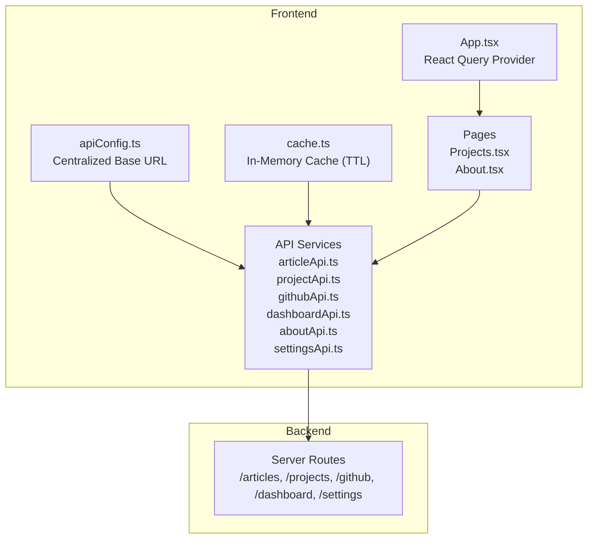

**Diagram sources**
- [apiConfig.ts](file://personalSite/src/lib/apiConfig.ts#L1-L75)
- [cache.ts](file://personalSite/src/lib/cache.ts#L1-L137)
- [articleApi.ts](file://personalSite/src/api/articleApi.ts#L1-L224)
- [projectApi.ts](file://personalSite/src/api/projectApi.ts#L1-L259)
- [githubApi.ts](file://personalSite/src/api/githubApi.ts#L1-L46)
- [dashboardApi.ts](file://personalSite/src/api/dashboardApi.ts#L1-L152)
- [aboutApi.ts](file://personalSite/src/api/aboutApi.ts#L1-L86)
- [settingsApi.ts](file://personalSite/src/api/settingsApi.ts#L1-L96)
- [App.tsx](file://personalSite/src/App.tsx#L1-L200)

**Section sources**
- [apiConfig.ts](file://personalSite/src/lib/apiConfig.ts#L1-L75)
- [cache.ts](file://personalSite/src/lib/cache.ts#L1-L137)
- [App.tsx](file://personalSite/src/App.tsx#L1-L200)

## Core Components
- Centralized API configuration: Selects base URL based on environment variables and runtime context.
- Shared cache: Provides TTL-based in-memory caching with granular key patterns.
- API service modules: Encapsulate CRUD and retrieval operations for content domains.
- React Query provider: Wraps the app to enable automatic caching and synchronization.
- Slug utilities: Generate URL-safe identifiers and ensure uniqueness.

**Section sources**
- [apiConfig.ts](file://personalSite/src/lib/apiConfig.ts#L1-L75)
- [cache.ts](file://personalSite/src/lib/cache.ts#L1-L137)
- [App.tsx](file://personalSite/src/App.tsx#L1-L200)

## Architecture Overview
The frontend composes domain-specific API services that:
- Resolve the base URL from configuration
- Optionally check the in-memory cache before issuing network requests
- Apply domain-specific TTL policies
- Invalidate related cache keys on mutation operations
- Return typed responses for downstream components

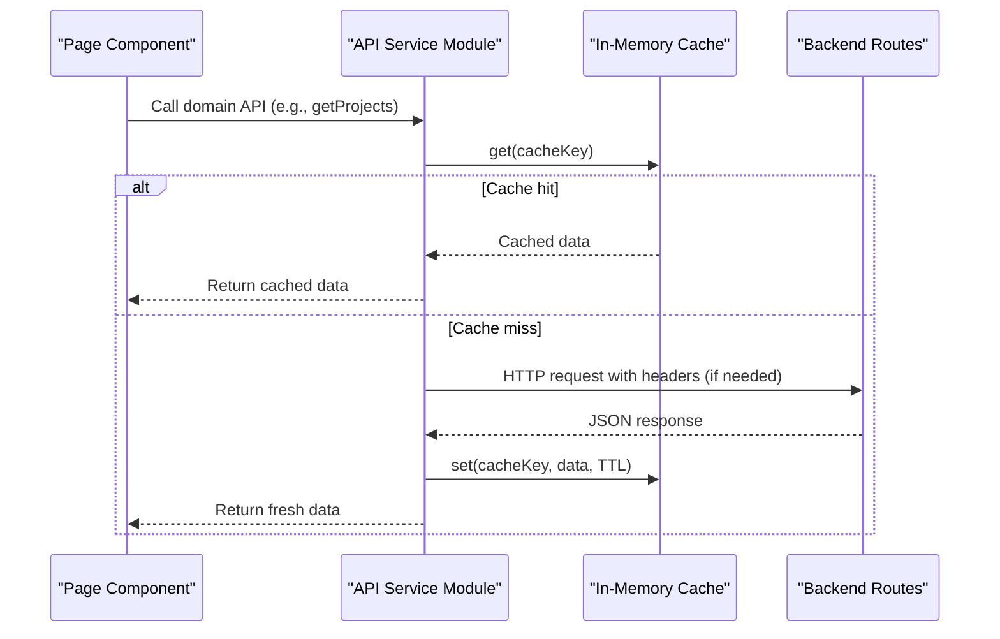

**Diagram sources**
- [projectApi.ts](file://personalSite/src/api/projectApi.ts#L28-L126)
- [cache.ts](file://personalSite/src/lib/cache.ts#L12-L96)

**Section sources**
- [projectApi.ts](file://personalSite/src/api/projectApi.ts#L28-L126)
- [cache.ts](file://personalSite/src/lib/cache.ts#L12-L96)

## Detailed Component Analysis

### Centralized API Configuration
- Determines base URL using environment variables and runtime context.
- Exposes a constant base URL and a getter for dynamic scenarios.
- Provides environment metadata for logging and diagnostics.

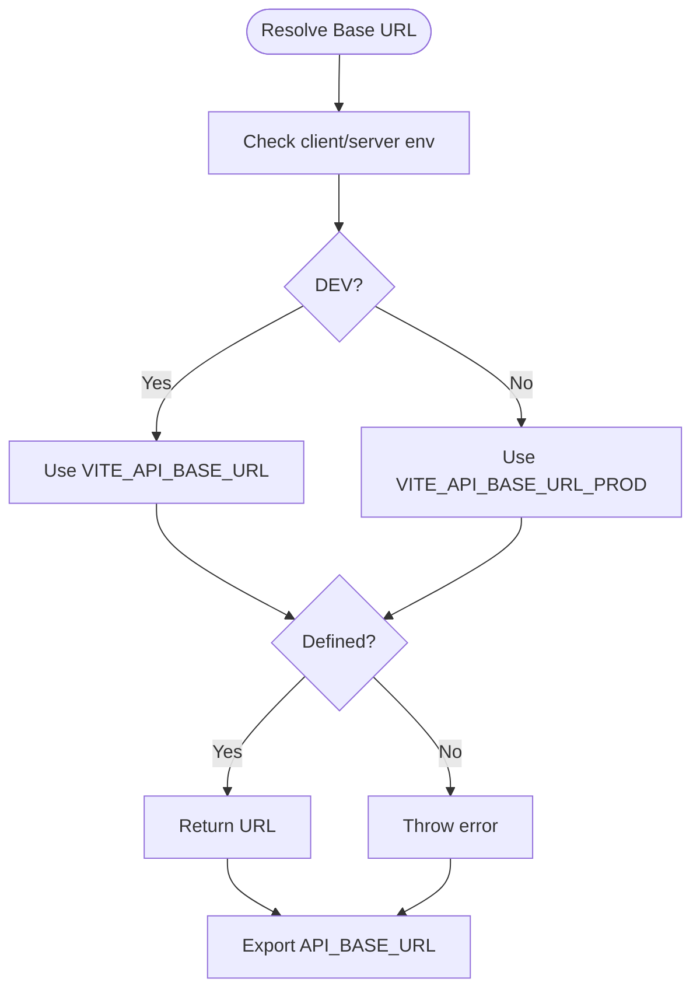

**Diagram sources**
- [apiConfig.ts](file://personalSite/src/lib/apiConfig.ts#L6-L52)
- [.env](file://personalSite/.env#L1-L7)
- [.env.example](file://personalSite/.env.example#L1-L10)

**Section sources**
- [apiConfig.ts](file://personalSite/src/lib/apiConfig.ts#L1-L75)
- [.env](file://personalSite/.env#L1-L7)
- [.env.example](file://personalSite/.env.example#L1-L10)

### In-Memory Cache with TTL
- Stores typed entries with timestamps and TTL.
- Supports get/set/has/delete/clear/invalidate and statistics.
- Uses structured cache keys for domains (articles, projects, settings, dashboard, github).

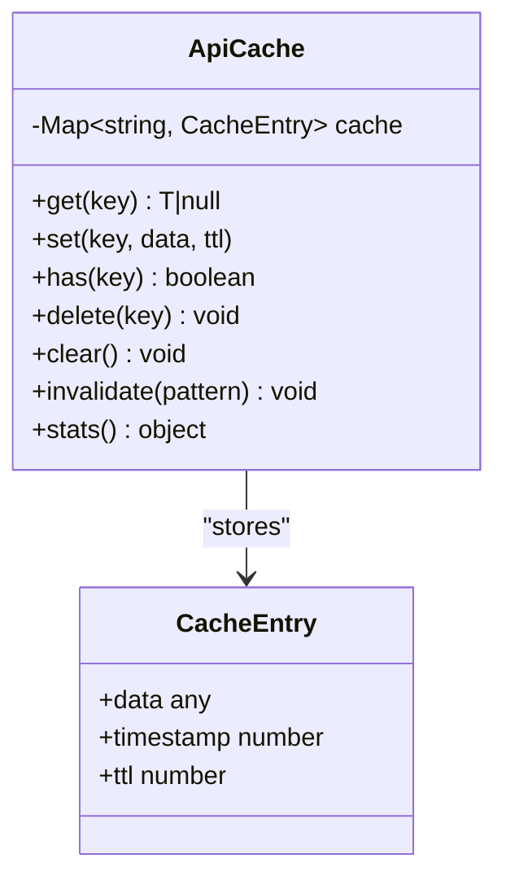

**Diagram sources**
- [cache.ts](file://personalSite/src/lib/cache.ts#L6-L96)

**Section sources**
- [cache.ts](file://personalSite/src/lib/cache.ts#L1-L137)

### API Service Modules

#### Articles API
- Fetch published/all articles, single article by ID.
- Create/update/delete articles with JSON or multipart/form-data.
- Invalidate cache on mutations; uses domain-specific TTLs.

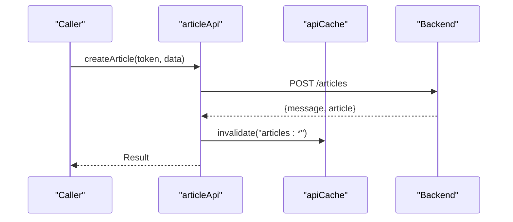

**Diagram sources**
- [articleApi.ts](file://personalSite/src/api/articleApi.ts#L103-L124)

**Section sources**
- [articleApi.ts](file://personalSite/src/api/articleApi.ts#L1-L224)

#### Projects API
- Paginated and filtered queries with query string building.
- Fetch by ID or slug; supports uploads.
- Comprehensive cache invalidation on mutations.

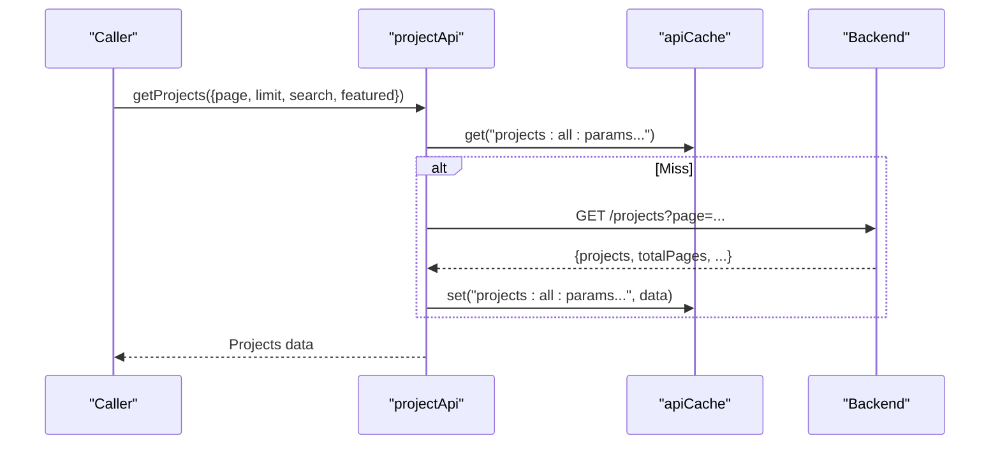

**Diagram sources**
- [projectApi.ts](file://personalSite/src/api/projectApi.ts#L28-L126)

**Section sources**
- [projectApi.ts](file://personalSite/src/api/projectApi.ts#L1-L259)

#### GitHub API Integration
- Fetches repositories and repository details via a dedicated endpoint.
- Applies shorter TTLs for external data freshness.

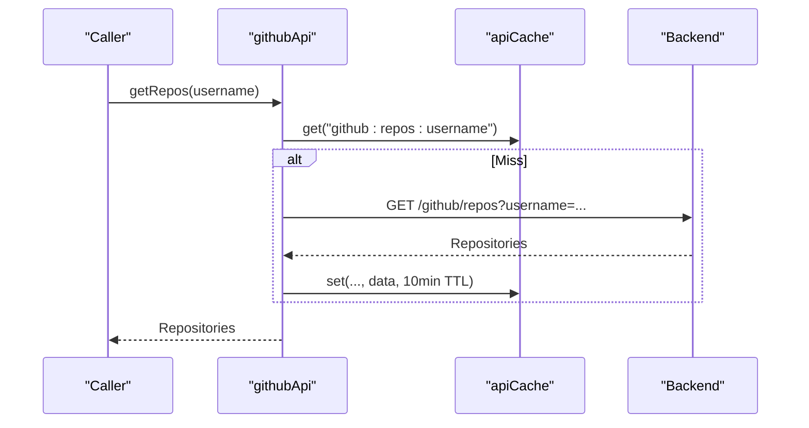

**Diagram sources**
- [githubApi.ts](file://personalSite/src/api/githubApi.ts#L6-L46)

**Section sources**
- [githubApi.ts](file://personalSite/src/api/githubApi.ts#L1-L46)

#### Dashboard API
- Retrieves stats, analytics, and enhanced dashboard data.
- Uses short TTLs for frequently changing metrics.
- Provides explicit cache invalidation helper.

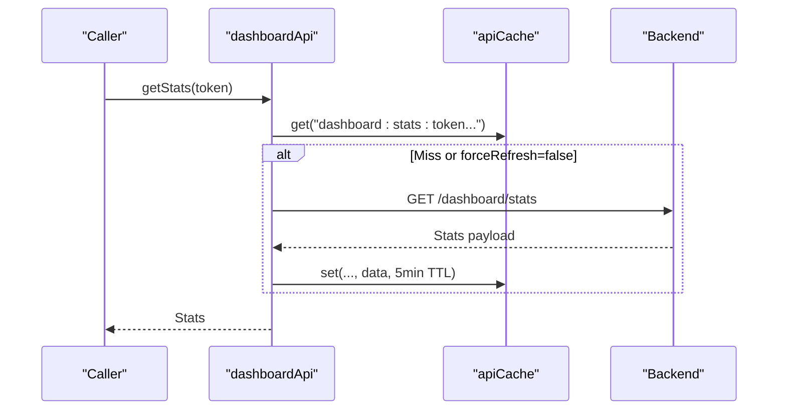

**Diagram sources**
- [dashboardApi.ts](file://personalSite/src/api/dashboardApi.ts#L70-L152)

**Section sources**
- [dashboardApi.ts](file://personalSite/src/api/dashboardApi.ts#L1-L152)

#### About Page Aggregation
- Fetches timeline, tech categories, and interests in parallel.
- Caches combined data for 10 minutes.
- Provides pre-fetch and cached access helpers.

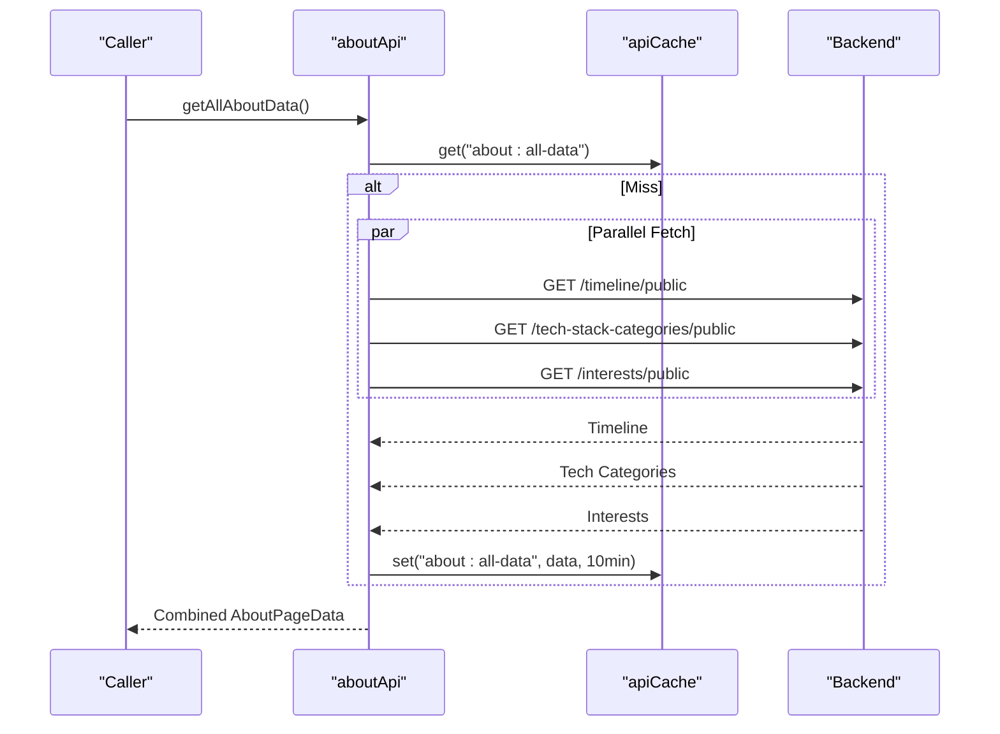

**Diagram sources**
- [aboutApi.ts](file://personalSite/src/api/aboutApi.ts#L12-L86)

**Section sources**
- [aboutApi.ts](file://personalSite/src/api/aboutApi.ts#L1-L86)

#### Settings API
- Retrieves and updates site-wide settings.
- Invalidates related caches after updates.

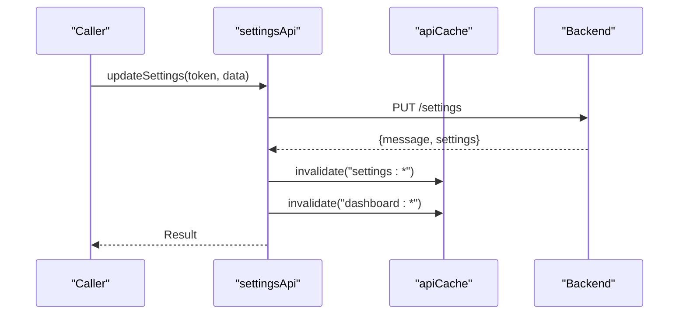

**Diagram sources**
- [settingsApi.ts](file://personalSite/src/api/settingsApi.ts#L72-L94)

**Section sources**
- [settingsApi.ts](file://personalSite/src/api/settingsApi.ts#L1-L96)

### React Query Integration
- The app initializes a QueryClient and wraps routing with QueryClientProvider.
- This enables automatic caching, background refetching, optimistic updates, and cache normalization across the app.
- Pages can leverage React Query hooks alongside the custom cache for optimal performance.

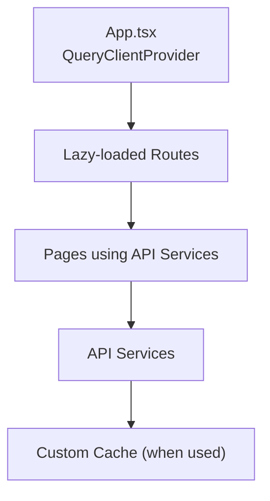

**Diagram sources**
- [App.tsx](file://personalSite/src/App.tsx#L1-L200)

**Section sources**
- [App.tsx](file://personalSite/src/App.tsx#L1-L200)

### Slug Utilities
- Server-side slug utilities normalize and uniquify project titles for URL-safe identifiers.
- These utilities support generating slugs and ensuring uniqueness via existence checks.

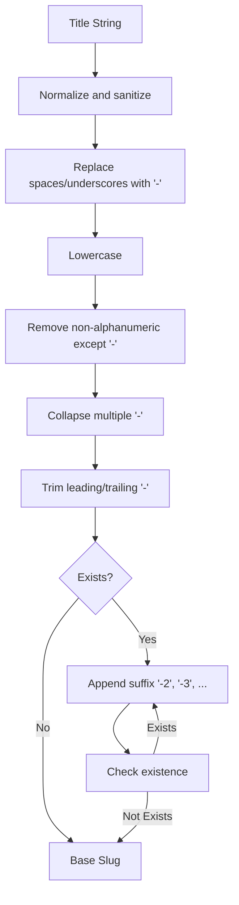

**Diagram sources**
- [slugify.ts](file://server/src/utils/slugify.ts#L1-L33)

**Section sources**
- [slugify.ts](file://server/src/utils/slugify.ts#L1-L33)

### Request/Response Handling Patterns
- All services construct URLs from the centralized base URL.
- Mutations include Authorization headers when tokens are required.
- Responses are validated via response.ok; errors surface textual bodies for debugging.
- Successful reads are cached with domain-appropriate TTLs; mutations invalidate affected cache keys.

**Section sources**
- [articleApi.ts](file://personalSite/src/api/articleApi.ts#L38-L224)
- [projectApi.ts](file://personalSite/src/api/projectApi.ts#L28-L259)
- [githubApi.ts](file://personalSite/src/api/githubApi.ts#L6-L46)
- [dashboardApi.ts](file://personalSite/src/api/dashboardApi.ts#L70-L152)
- [aboutApi.ts](file://personalSite/src/api/aboutApi.ts#L12-L86)
- [settingsApi.ts](file://personalSite/src/api/settingsApi.ts#L48-L96)

### Error Management Strategies
- Non-OK responses trigger errors with status and textual body for traceability.
- Pages handle errors gracefully and may fall back to default data or cached content.
- Some background operations (e.g., pre-fetch) swallow errors to avoid blocking UI.

**Section sources**
- [articleApi.ts](file://personalSite/src/api/articleApi.ts#L48-L50)
- [aboutApi.ts](file://personalSite/src/api/aboutApi.ts#L58-L72)
- [Projects.tsx](file://personalSite/src/pages/Projects.tsx#L172-L177)

### Data Transformation Utilities
- Pages transform raw API responses into UI-ready structures (e.g., mapping icons, aggregating GitHub stats).
- Local caches (e.g., Projects page) augment API data with external GitHub stats and persist them with TTL.

**Section sources**
- [About.tsx](file://personalSite/src/pages/About.tsx#L74-L103)
- [Projects.tsx](file://personalSite/src/pages/Projects.tsx#L138-L171)

## Dependency Analysis
- API services depend on centralized configuration and shared cache.
- Pages consume API services; some also use React Query and local caches.
- Server-side slug utilities are separate from frontend services but align with URL-safe identifiers.

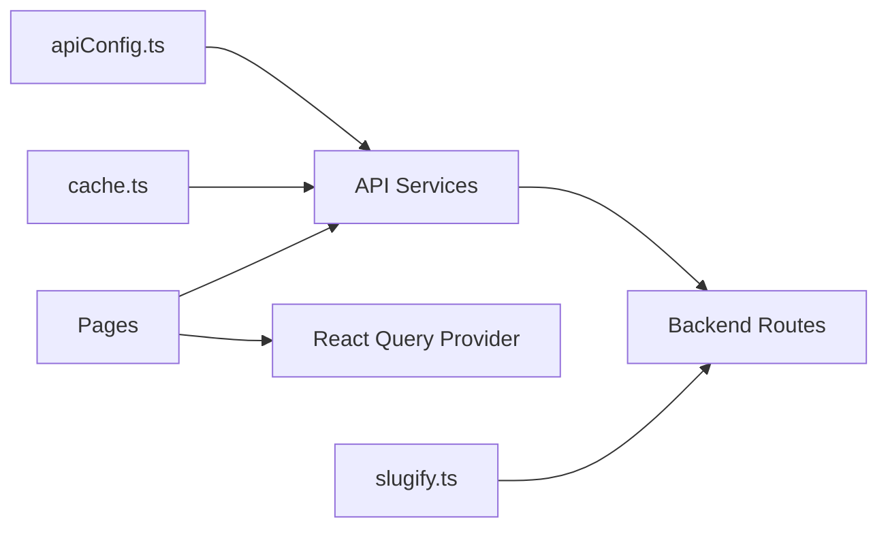

**Diagram sources**
- [apiConfig.ts](file://personalSite/src/lib/apiConfig.ts#L1-L75)
- [cache.ts](file://personalSite/src/lib/cache.ts#L1-L137)
- [articleApi.ts](file://personalSite/src/api/articleApi.ts#L35-L36)
- [projectApi.ts](file://personalSite/src/api/projectApi.ts#L1-L2)
- [githubApi.ts](file://personalSite/src/api/githubApi.ts#L1-L2)
- [dashboardApi.ts](file://personalSite/src/api/dashboardApi.ts#L1-L2)
- [aboutApi.ts](file://personalSite/src/api/aboutApi.ts#L1-L2)
- [settingsApi.ts](file://personalSite/src/api/settingsApi.ts#L1-L2)
- [App.tsx](file://personalSite/src/App.tsx#L1-L10)
- [slugify.ts](file://server/src/utils/slugify.ts#L1-L33)

**Section sources**
- [apiConfig.ts](file://personalSite/src/lib/apiConfig.ts#L1-L75)
- [cache.ts](file://personalSite/src/lib/cache.ts#L1-L137)
- [App.tsx](file://personalSite/src/App.tsx#L1-L200)

## Performance Considerations
- Prefer domain-specific cache keys and TTLs to balance freshness and performance.
- Use parallel fetching for related resources (as seen in aboutApi) to reduce latency.
- Invalidate only affected cache segments on mutations to minimize unnecessary refreshes.
- Combine custom cache with React Query for comprehensive caching coverage.
- For external data (e.g., GitHub), apply shorter TTLs to reflect frequent changes.
- Persist page-level data locally when beneficial (e.g., Projects page cache) with explicit TTL checks.

[No sources needed since this section provides general guidance]

## Troubleshooting Guide
- Base URL not defined: Verify environment variables are present and correctly named.
- Unexpected 401/403: Ensure Authorization headers are attached for protected endpoints.
- Stale data: Check cache TTLs and invalidate patterns; consider bypassing cache with force-refresh where supported.
- Mutation not reflected: Confirm cache invalidation logic runs after successful writes.
- Network failures: Inspect textual error responses and logs; implement fallback UI states.

**Section sources**
- [apiConfig.ts](file://personalSite/src/lib/apiConfig.ts#L27-L47)
- [articleApi.ts](file://personalSite/src/api/articleApi.ts#L119-L121)
- [projectApi.ts](file://personalSite/src/api/projectApi.ts#L145-L150)
- [dashboardApi.ts](file://personalSite/src/api/dashboardApi.ts#L148-L150)

## Conclusion
The API integration layer provides a consistent, maintainable, and performant bridge between the frontend and backend. Centralized configuration, domain-specific API services, and a shared cache with TTLs streamline development and improve user experience. React Query complements the custom cache for broader caching and synchronization needs. Slug utilities and GitHub integration round out the ecosystem for URL-safe identifiers and external data enrichment.

[No sources needed since this section summarizes without analyzing specific files]

## Appendices

### Practical Examples

- Implementing a new API service module
  - Define TypeScript interfaces for requests/responses.
  - Import the centralized base URL and shared cache.
  - Add cache keys to the cache key registry.
  - Implement getters with cache-first logic and setters with appropriate TTLs.
  - Add mutations with Authorization headers and targeted cache invalidation.

- Handling different response types
  - Use response.ok checks and parse JSON.
  - For multipart/form-data uploads, send FormData without Content-Type header.
  - For paginated lists, build query strings from parameters.

- Optimizing network requests
  - Prefetch data on home page and cache it for immediate use on deeper pages.
  - Combine parallel fetches for related resources.
  - Use shorter TTLs for frequently changing data; longer TTLs for static-like content.
  - Invalidate only affected cache segments on updates.

**Section sources**
- [articleApi.ts](file://personalSite/src/api/articleApi.ts#L38-L224)
- [projectApi.ts](file://personalSite/src/api/projectApi.ts#L28-L259)
- [aboutApi.ts](file://personalSite/src/api/aboutApi.ts#L12-L86)
- [dashboardApi.ts](file://personalSite/src/api/dashboardApi.ts#L70-L152)
- [cache.ts](file://personalSite/src/lib/cache.ts#L102-L136)