# Admin Panel

<cite>
**Referenced Files in This Document**
- [App.tsx](file://personalSite/src/App.tsx)
- [RouteProtector.tsx](file://personalSite/src/components/RouteProtector.tsx)
- [AuthContext.tsx](file://personalSite/src/contexts/AuthContext.tsx)
- [AdminLayout.tsx](file://personalSite/src/components/layout/AdminLayout.tsx)
- [Dashboard.tsx](file://personalSite/src/pages/Admin/Dashboard.tsx)
- [ArticleManager.tsx](file://personalSite/src/pages/Admin/ArticleManager.tsx)
- [ProjectManager.tsx](file://personalSite/src/pages/Admin/ProjectManager.tsx)
- [TimelineManager.tsx](file://personalSite/src/pages/Admin/TimelineManager.tsx)
- [Settings.tsx](file://personalSite/src/pages/Admin/Settings.tsx)
- [articleApi.ts](file://personalSite/src/api/articleApi.ts)
- [projectApi.ts](file://personalSite/src/api/projectApi.ts)
- [timelineApi.ts](file://personalSite/src/api/timelineApi.ts)
- [settingsApi.ts](file://personalSite/src/api/settingsApi.ts)
- [apiConfig.ts](file://personalSite/src/lib/apiConfig.ts)
- [cache.ts](file://personalSite/src/lib/cache.ts)
</cite>

## Table of Contents
1. [Introduction](#introduction)
2. [Project Structure](#project-structure)
3. [Core Components](#core-components)
4. [Architecture Overview](#architecture-overview)
5. [Detailed Component Analysis](#detailed-component-analysis)
6. [Dependency Analysis](#dependency-analysis)
7. [Performance Considerations](#performance-considerations)
8. [Troubleshooting Guide](#troubleshooting-guide)
9. [Conclusion](#conclusion)
10. [Appendices](#appendices)

## Introduction
This document provides comprehensive documentation for the admin panel system. It explains the dashboard overview with analytics and quick actions, the content management interfaces for articles, projects, timeline items, and settings. It documents the AdminLayout component structure, CRUD operations for each content type, and the real-time update mechanisms using React Query. It also covers admin-only route protection, data validation and form handling patterns, and the integration with the backend API for content management. Practical examples are included for implementing new content managers, customizing dashboard widgets, and extending the admin functionality with additional content types.

## Project Structure
The admin panel is built as part of a Vite-based React application with TypeScript. Routing is configured to protect admin routes, and the admin area is wrapped in a shared AdminLayout. Content managers are organized per domain entity (articles, projects, timeline, settings), each with dedicated pages and API modules. A centralized API configuration and caching utility manage network requests and caching behavior.

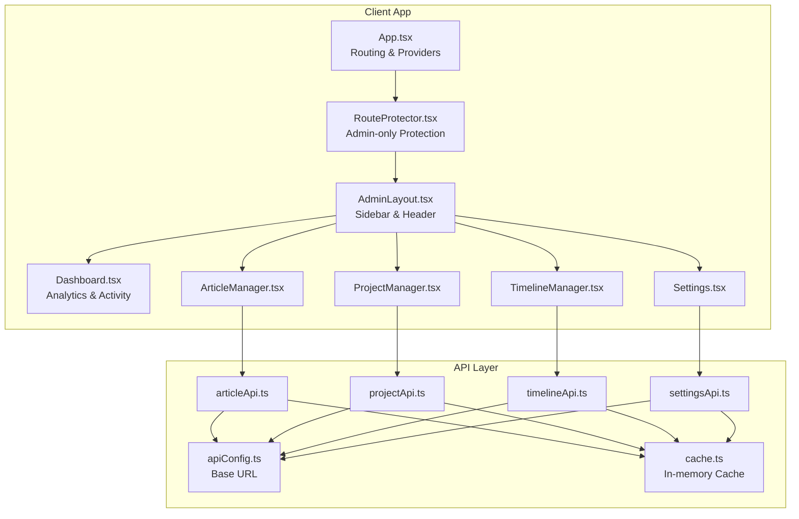

**Diagram sources**
- [App.tsx](file://personalSite/src/App.tsx#L254-L343)
- [RouteProtector.tsx](file://personalSite/src/components/RouteProtector.tsx#L10-L38)
- [AdminLayout.tsx](file://personalSite/src/components/layout/AdminLayout.tsx#L32-L291)
- [Dashboard.tsx](file://personalSite/src/pages/Admin/Dashboard.tsx#L79-L345)
- [ArticleManager.tsx](file://personalSite/src/pages/Admin/ArticleManager.tsx#L14-L559)
- [ProjectManager.tsx](file://personalSite/src/pages/Admin/ProjectManager.tsx#L30-L864)
- [TimelineManager.tsx](file://personalSite/src/pages/Admin/TimelineManager.tsx#L25-L403)
- [Settings.tsx](file://personalSite/src/pages/Admin/Settings.tsx#L28-L273)
- [articleApi.ts](file://personalSite/src/api/articleApi.ts#L38-L224)
- [projectApi.ts](file://personalSite/src/api/projectApi.ts#L28-L259)
- [timelineApi.ts](file://personalSite/src/api/timelineApi.ts#L21-L139)
- [settingsApi.ts](file://personalSite/src/api/settingsApi.ts#L48-L96)
- [apiConfig.ts](file://personalSite/src/lib/apiConfig.ts#L6-L52)
- [cache.ts](file://personalSite/src/lib/cache.ts#L12-L96)

**Section sources**
- [App.tsx](file://personalSite/src/App.tsx#L254-L343)
- [AdminLayout.tsx](file://personalSite/src/components/layout/AdminLayout.tsx#L32-L291)

## Core Components
- AdminLayout: Provides a persistent sidebar with navigation, active route highlighting, user profile, and logout. Wraps admin pages with a top bar and main content area.
- RouteProtector: Guards admin routes, redirecting unauthenticated users to login and non-admin users to home.
- AuthContext: Manages authentication state, token persistence, and admin role checks.
- API Modules: Encapsulate CRUD operations for articles, projects, timeline, and settings with caching and token-based authorization.
- Cache Utility: Provides in-memory caching with TTL and pattern-based invalidation.

**Section sources**
- [AdminLayout.tsx](file://personalSite/src/components/layout/AdminLayout.tsx#L32-L291)
- [RouteProtector.tsx](file://personalSite/src/components/RouteProtector.tsx#L10-L38)
- [AuthContext.tsx](file://personalSite/src/contexts/AuthContext.tsx#L36-L140)
- [articleApi.ts](file://personalSite/src/api/articleApi.ts#L38-L224)
- [projectApi.ts](file://personalSite/src/api/projectApi.ts#L28-L259)
- [timelineApi.ts](file://personalSite/src/api/timelineApi.ts#L21-L139)
- [settingsApi.ts](file://personalSite/src/api/settingsApi.ts#L48-L96)
- [cache.ts](file://personalSite/src/lib/cache.ts#L12-L96)

## Architecture Overview
The admin panel follows a layered architecture:
- Presentation Layer: Pages (Dashboard, Managers) and shared layout.
- Routing & Security: ProtectedRoute enforces admin-only access; AuthContext manages session state.
- API Layer: Dedicated modules per domain with standardized CRUD methods.
- Data Access: Centralized API base URL and caching utilities.

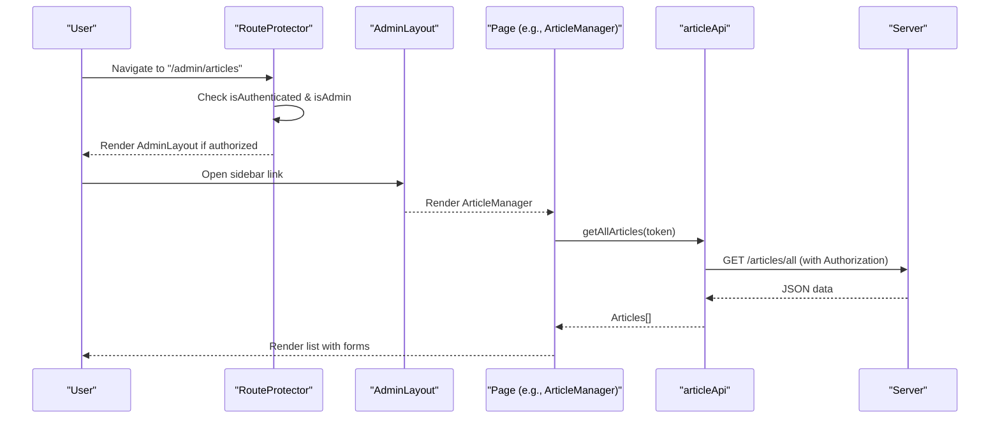

**Diagram sources**
- [RouteProtector.tsx](file://personalSite/src/components/RouteProtector.tsx#L10-L38)
- [AdminLayout.tsx](file://personalSite/src/components/layout/AdminLayout.tsx#L32-L291)
- [ArticleManager.tsx](file://personalSite/src/pages/Admin/ArticleManager.tsx#L146-L159)
- [articleApi.ts](file://personalSite/src/api/articleApi.ts#L59-L81)
- [apiConfig.ts](file://personalSite/src/lib/apiConfig.ts#L6-L52)

## Detailed Component Analysis

### AdminLayout Component
AdminLayout defines the admin shell with:
- Navigation items for dashboard, articles, projects, timeline, tech skills, tech stack, interests, messages, and settings.
- Active route detection and visual indicators.
- Persistent sidebar with user profile and logout action.
- Top bar with page title and online indicator.

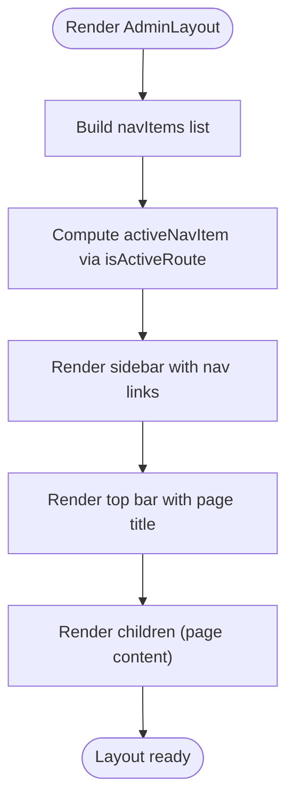

**Diagram sources**
- [AdminLayout.tsx](file://personalSite/src/components/layout/AdminLayout.tsx#L42-L106)

**Section sources**
- [AdminLayout.tsx](file://personalSite/src/components/layout/AdminLayout.tsx#L32-L291)

### Dashboard Overview
The Dashboard displays:
- Time-based greeting and last-updated indicator.
- Stats cards for articles, projects, timeline items, and tech skills.
- Recent activity feed with status badges and relative timestamps.

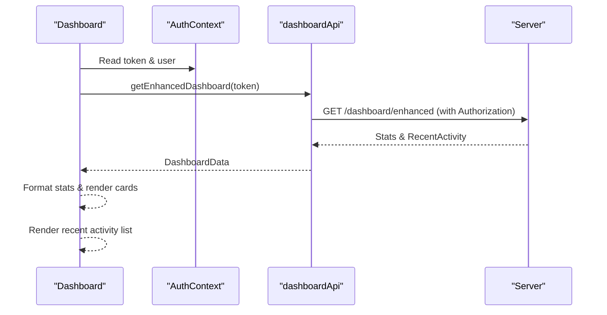

**Diagram sources**
- [Dashboard.tsx](file://personalSite/src/pages/Admin/Dashboard.tsx#L86-L105)
- [AuthContext.tsx](file://personalSite/src/contexts/AuthContext.tsx#L36-L56)

**Section sources**
- [Dashboard.tsx](file://personalSite/src/pages/Admin/Dashboard.tsx#L79-L345)

### Content Management Interfaces

#### Articles Manager
Implements CRUD with support for image uploads via FormData:
- Create: Uses createArticleWithImage to send multipart/form-data with title, content, excerpt, status, tags, and optional featuredImage file.
- Update: Uses updateArticleWithImage to update fields and optionally replace the featured image.
- Delete: Uses deleteArticle and updates local state.
- Search: Filters articles by title, content, or tags.
- Validation: Basic client-side checks before submission.

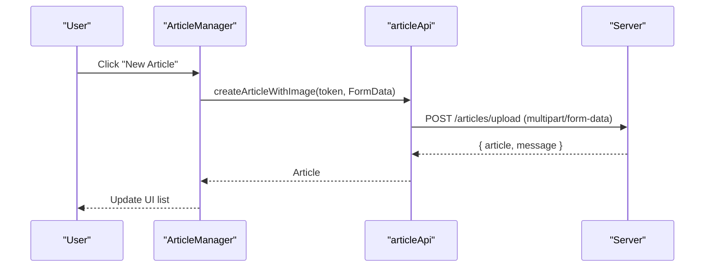

**Diagram sources**
- [ArticleManager.tsx](file://personalSite/src/pages/Admin/ArticleManager.tsx#L44-L95)
- [articleApi.ts](file://personalSite/src/api/articleApi.ts#L126-L149)

**Section sources**
- [ArticleManager.tsx](file://personalSite/src/pages/Admin/ArticleManager.tsx#L14-L559)
- [articleApi.ts](file://personalSite/src/api/articleApi.ts#L38-L224)

#### Projects Manager
Implements CRUD with support for thumbnail and multiple screenshot uploads:
- Create: Uses createProjectWithImage to send FormData with title, description, tags, languages, URLs, status, featured flag, and optional images.
- Update: Uses updateProjectWithImage to update metadata and images.
- Toggle featured and publish/unpublish.
- Search: Filters by title, description, or tags.
- Validation: Ensures required fields and minimum tags before submission.

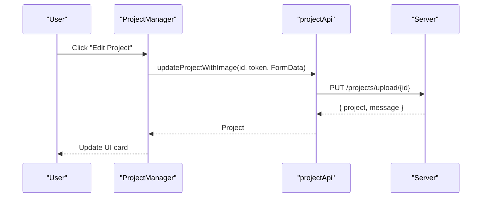

**Diagram sources**
- [ProjectManager.tsx](file://personalSite/src/pages/Admin/ProjectManager.tsx#L163-L242)
- [projectApi.ts](file://personalSite/src/api/projectApi.ts#L206-L233)

**Section sources**
- [ProjectManager.tsx](file://personalSite/src/pages/Admin/ProjectManager.tsx#L30-L864)
- [projectApi.ts](file://personalSite/src/api/projectApi.ts#L28-L259)

#### Timeline Manager
Manages ordered timeline items with icon and order fields:
- Create: Sends year, role, company, description, icon, and order; reorders existing items before creation.
- Update: Reorders around the updated item and updates fields.
- Delete: Reorders remaining items after deletion.
- Search: Filters by year, role, company, or description.

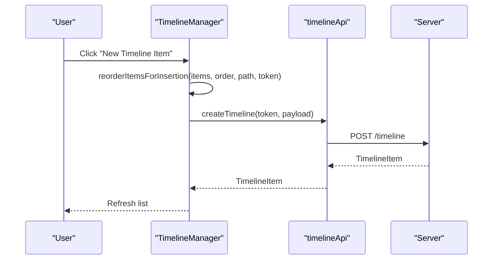

**Diagram sources**
- [TimelineManager.tsx](file://personalSite/src/pages/Admin/TimelineManager.tsx#L86-L108)
- [timelineApi.ts](file://personalSite/src/api/timelineApi.ts#L70-L93)

**Section sources**
- [TimelineManager.tsx](file://personalSite/src/pages/Admin/TimelineManager.tsx#L25-L403)
- [timelineApi.ts](file://personalSite/src/api/timelineApi.ts#L21-L139)

#### Settings Manager
Allows updating site-wide settings:
- Fetches current settings with force refresh option.
- Updates social links and visibility of site sections.
- Saves changes and refreshes settings context for immediate effect.

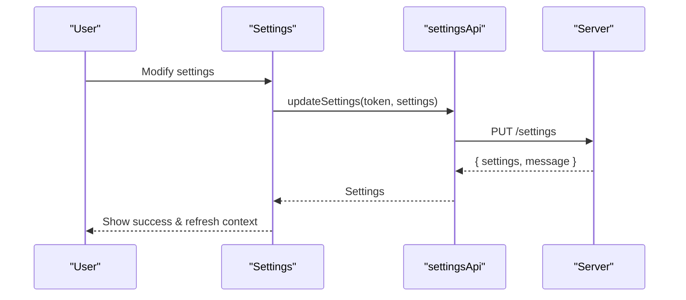

**Diagram sources**
- [Settings.tsx](file://personalSite/src/pages/Admin/Settings.tsx#L105-L126)
- [settingsApi.ts](file://personalSite/src/api/settingsApi.ts#L72-L94)

**Section sources**
- [Settings.tsx](file://personalSite/src/pages/Admin/Settings.tsx#L28-L273)
- [settingsApi.ts](file://personalSite/src/api/settingsApi.ts#L48-L96)

### Real-Time Update Mechanisms and Caching
- React Query: The application initializes a QueryClient provider at the root, enabling caching and optimistic updates across pages.
- In-Memory Cache: A global ApiCache stores responses with TTL and supports pattern-based invalidation. Cache keys are centralized under cacheKeys.
- Cache Invalidation: After create/update/delete operations, cache entries are invalidated to ensure fresh data on subsequent reads.

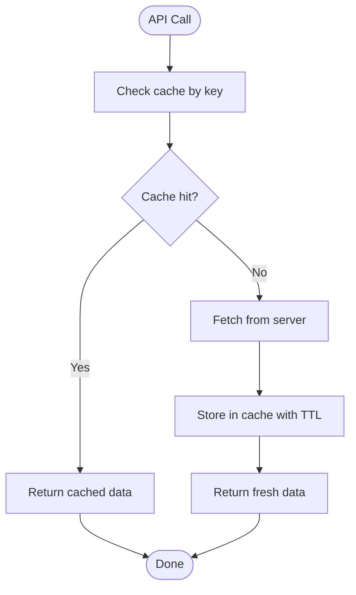

**Diagram sources**
- [cache.ts](file://personalSite/src/lib/cache.ts#L12-L96)
- [apiConfig.ts](file://personalSite/src/lib/apiConfig.ts#L6-L52)

**Section sources**
- [App.tsx](file://personalSite/src/App.tsx#L32-L32)
- [cache.ts](file://personalSite/src/lib/cache.ts#L12-L96)
- [articleApi.ts](file://personalSite/src/api/articleApi.ts#L119-L121)
- [projectApi.ts](file://personalSite/src/api/projectApi.ts#L145-L148)
- [timelineApi.ts](file://personalSite/src/api/timelineApi.ts#L87-L90)
- [settingsApi.ts](file://personalSite/src/api/settingsApi.ts#L88-L91)

### Admin-Only Route Protection
- ProtectedRoute enforces authentication and admin privileges.
- AuthContext validates tokens against the backend and persists user state.
- App routes wrap admin pages with ProtectedRoute(adminOnly=true).

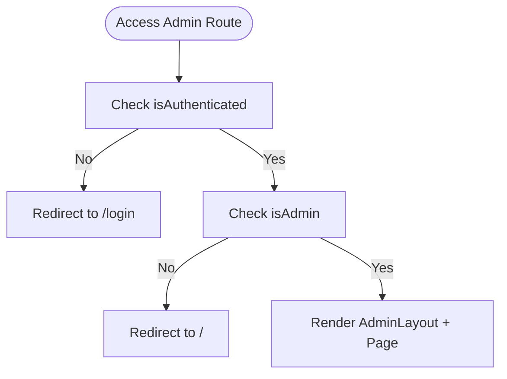

**Diagram sources**
- [RouteProtector.tsx](file://personalSite/src/components/RouteProtector.tsx#L10-L38)
- [AuthContext.tsx](file://personalSite/src/contexts/AuthContext.tsx#L58-L76)
- [App.tsx](file://personalSite/src/App.tsx#L254-L343)

**Section sources**
- [RouteProtector.tsx](file://personalSite/src/components/RouteProtector.tsx#L10-L38)
- [AuthContext.tsx](file://personalSite/src/contexts/AuthContext.tsx#L36-L140)
- [App.tsx](file://personalSite/src/App.tsx#L254-L343)

### Data Validation and Form Handling Patterns
- Articles: Client-side checks for token presence; image upload via FormData; tags parsed from comma-separated string; status radios.
- Projects: Required fields validation (title, description, tags); optional thumbnail and multiple screenshots; status and featured toggles.
- Timeline: Order reordering utilities invoked before create/update/delete; icon selection via dropdown.
- Settings: Controlled form inputs; submit handler with token check; success feedback and settings refresh.

**Section sources**
- [ArticleManager.tsx](file://personalSite/src/pages/Admin/ArticleManager.tsx#L44-L95)
- [ProjectManager.tsx](file://personalSite/src/pages/Admin/ProjectManager.tsx#L77-L94)
- [TimelineManager.tsx](file://personalSite/src/pages/Admin/TimelineManager.tsx#L86-L108)
- [Settings.tsx](file://personalSite/src/pages/Admin/Settings.tsx#L105-L126)

### Backend API Integration
- Base URL resolution: apiConfig determines API base URL from environment variables with fallbacks.
- Token-based authorization: All admin endpoints require Authorization header with Bearer token.
- Cache keys: Centralized cache keys for articles, projects, settings, timeline, dashboard, and others.

**Section sources**
- [apiConfig.ts](file://personalSite/src/lib/apiConfig.ts#L6-L52)
- [articleApi.ts](file://personalSite/src/api/articleApi.ts#L67-L70)
- [projectApi.ts](file://personalSite/src/api/projectApi.ts#L72-L75)
- [timelineApi.ts](file://personalSite/src/api/timelineApi.ts#L53-L56)
- [settingsApi.ts](file://personalSite/src/api/settingsApi.ts#L73-L78)
- [cache.ts](file://personalSite/src/lib/cache.ts#L102-L136)

## Dependency Analysis
The admin panel exhibits clear separation of concerns:
- Pages depend on API modules and AuthContext.
- API modules depend on apiConfig and cache utilities.
- RouteProtector depends on AuthContext for guards.
- AdminLayout is a presentation shell with navigation and user actions.

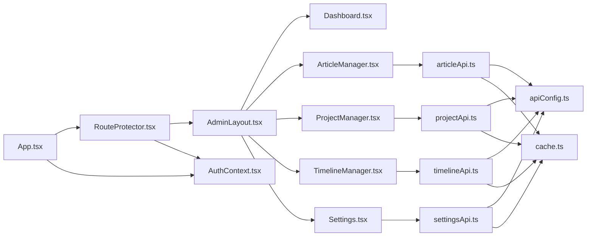

**Diagram sources**
- [App.tsx](file://personalSite/src/App.tsx#L254-L343)
- [RouteProtector.tsx](file://personalSite/src/components/RouteProtector.tsx#L10-L38)
- [AdminLayout.tsx](file://personalSite/src/components/layout/AdminLayout.tsx#L32-L291)
- [ArticleManager.tsx](file://personalSite/src/pages/Admin/ArticleManager.tsx#L11-L34)
- [ProjectManager.tsx](file://personalSite/src/pages/Admin/ProjectManager.tsx#L2-L12)
- [TimelineManager.tsx](file://personalSite/src/pages/Admin/TimelineManager.tsx#L21-L23)
- [Settings.tsx](file://personalSite/src/pages/Admin/Settings.tsx#L2-L11)
- [articleApi.ts](file://personalSite/src/api/articleApi.ts#L35-L36)
- [projectApi.ts](file://personalSite/src/api/projectApi.ts#L1-L2)
- [timelineApi.ts](file://personalSite/src/api/timelineApi.ts#L1-L2)
- [settingsApi.ts](file://personalSite/src/api/settingsApi.ts#L1-L2)
- [apiConfig.ts](file://personalSite/src/lib/apiConfig.ts#L6-L52)
- [cache.ts](file://personalSite/src/lib/cache.ts#L12-L96)
- [AuthContext.tsx](file://personalSite/src/contexts/AuthContext.tsx#L36-L140)

**Section sources**
- [App.tsx](file://personalSite/src/App.tsx#L254-L343)
- [AuthContext.tsx](file://personalSite/src/contexts/AuthContext.tsx#L36-L140)
- [articleApi.ts](file://personalSite/src/api/articleApi.ts#L35-L36)
- [projectApi.ts](file://personalSite/src/api/projectApi.ts#L1-L2)
- [timelineApi.ts](file://personalSite/src/api/timelineApi.ts#L1-L2)
- [settingsApi.ts](file://personalSite/src/api/settingsApi.ts#L1-L2)
- [cache.ts](file://personalSite/src/lib/cache.ts#L102-L136)

## Performance Considerations
- Caching: Use cache keys and TTL to reduce redundant network calls. Invalidate caches after mutations to maintain consistency.
- Lazy Loading: Pages are lazy-loaded to improve initial load performance.
- Conditional Fetching: Dashboard and managers conditionally fetch data only when tokens are present.
- Image Uploads: Prefer URL fields when possible; upload only when necessary to minimize payload sizes.

[No sources needed since this section provides general guidance]

## Troubleshooting Guide
Common issues and resolutions:
- Authentication errors: Verify token presence and validity; ensure AuthContext validates tokens against the backend.
- Network failures: Check API base URL configuration and environment variables; confirm server availability.
- Cache inconsistencies: Trigger force refresh or invalidate related cache keys after mutations.
- Form submission errors: Review client-side validations and error messages surfaced to users.

**Section sources**
- [AuthContext.tsx](file://personalSite/src/contexts/AuthContext.tsx#L58-L76)
- [apiConfig.ts](file://personalSite/src/lib/apiConfig.ts#L6-L52)
- [cache.ts](file://personalSite/src/lib/cache.ts#L78-L85)
- [ArticleManager.tsx](file://personalSite/src/pages/Admin/ArticleManager.tsx#L89-L94)
- [ProjectManager.tsx](file://personalSite/src/pages/Admin/ProjectManager.tsx#L155-L160)

## Conclusion
The admin panel provides a robust, secure, and efficient content management experience. It leverages protected routing, centralized API configuration, and in-memory caching to deliver responsive interactions. The modular design of content managers and shared layout simplifies maintenance and extension. Following the patterns documented here enables adding new content types and customizing dashboard widgets with minimal effort.

[No sources needed since this section summarizes without analyzing specific files]

## Appendices

### Practical Examples

- Implementing a new content manager:
  - Define TypeScript interfaces for the model.
  - Create an API module with CRUD methods mirroring existing modules.
  - Add a page component with search, forms, and dialogs.
  - Integrate with AdminLayout and ProtectedRoute.
  - Add navigation item in AdminLayout.
  - Invalidate appropriate cache keys after mutations.

- Customizing dashboard widgets:
  - Extend the dashboard data fetching to include new metrics.
  - Add new stat cards or charts using existing UI components.
  - Use motion animations for smooth transitions.

- Extending admin functionality:
  - Add new admin routes in App.tsx with ProtectedRoute.
  - Implement CRUD in a new API module with cache invalidation.
  - Create a new manager page with form validation and image upload support if needed.

[No sources needed since this section provides general guidance]