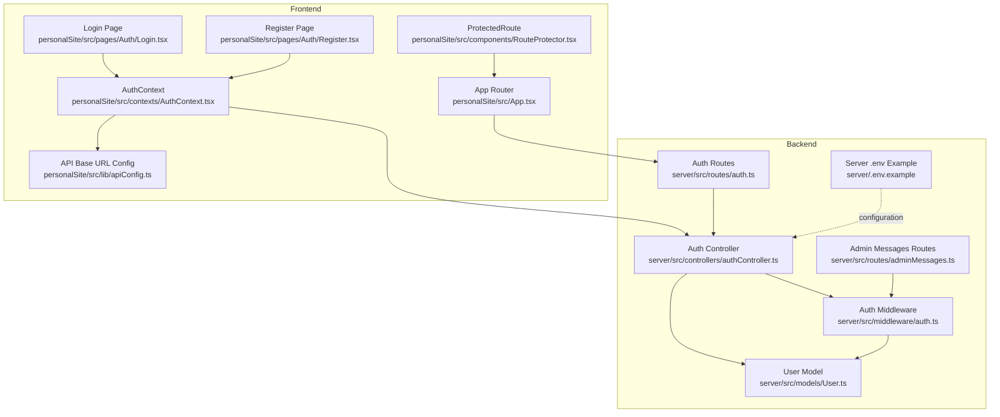
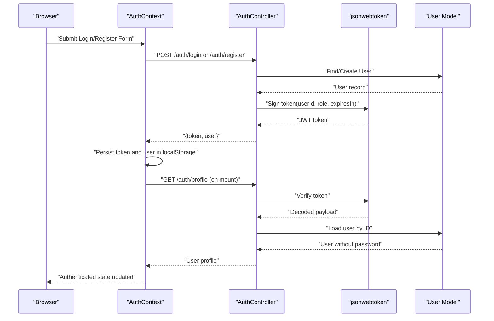
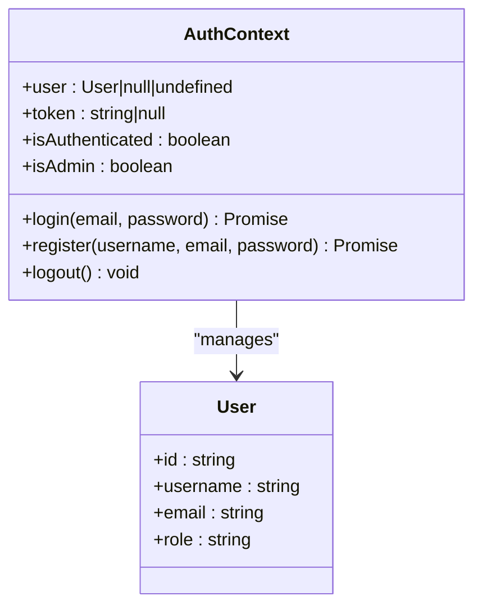
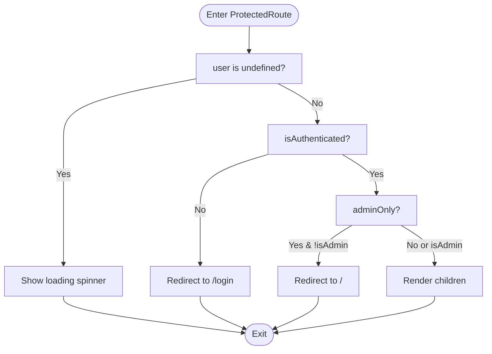
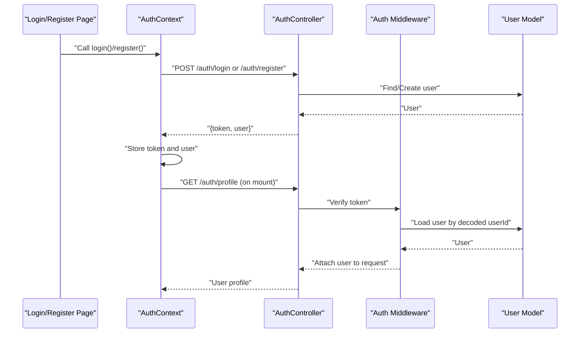
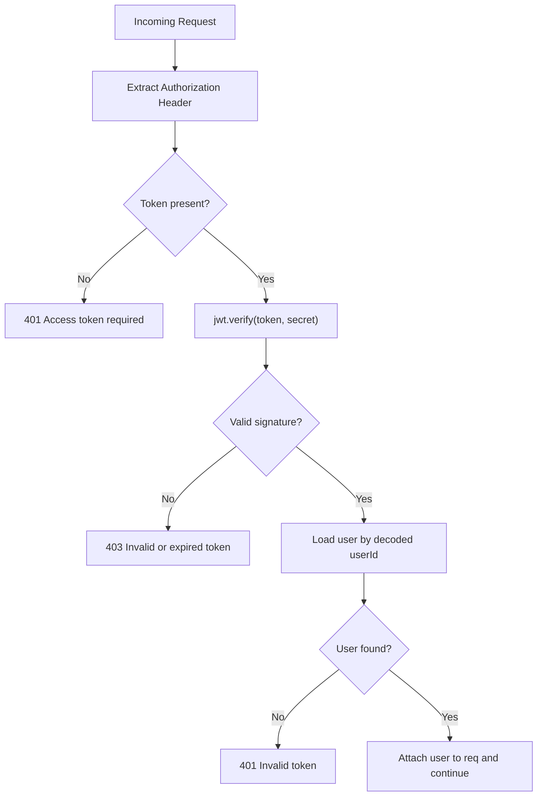
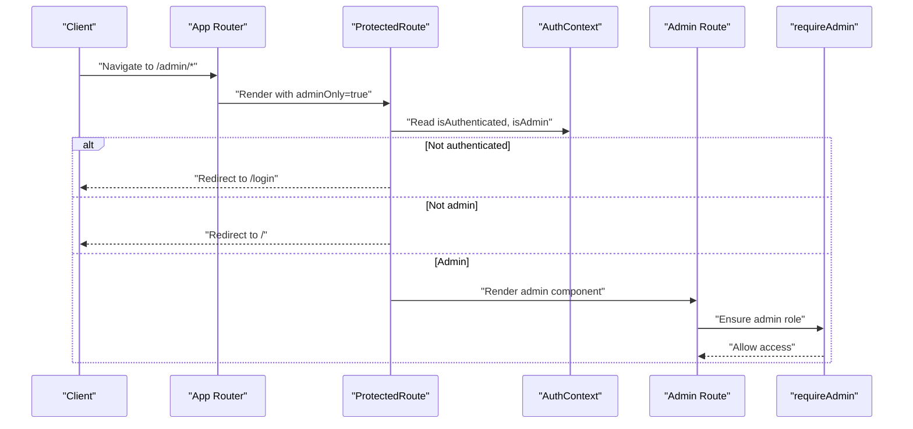
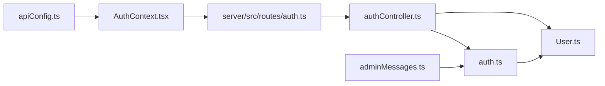

# Authentication System

<cite>
**Referenced Files in This Document**
- [AuthContext.tsx](file://personalSite/src/contexts/AuthContext.tsx)
- [apiConfig.ts](file://personalSite/src/lib/apiConfig.ts)
- [Login.tsx](file://personalSite/src/pages/Auth/Login.tsx)
- [Register.tsx](file://personalSite/src/pages/Auth/Register.tsx)
- [RouteProtector.tsx](file://personalSite/src/components/RouteProtector.tsx)
- [App.tsx](file://personalSite/src/App.tsx)
- [authController.ts](file://server/src/controllers/authController.ts)
- [auth.ts](file://server/src/middleware/auth.ts)
- [User.ts](file://server/src/models/User.ts)
- [auth.ts](file://server/src/routes/auth.ts)
- [adminMessages.ts](file://server/src/routes/adminMessages.ts)
- [.env.example (server)](file://server/.env.example)
- [.env.example (personalSite)](file://personalSite/.env.example)
</cite>

## Table of Contents
1. [Introduction](#introduction)
2. [Project Structure](#project-structure)
3. [Core Components](#core-components)
4. [Architecture Overview](#architecture-overview)
5. [Detailed Component Analysis](#detailed-component-analysis)
6. [Dependency Analysis](#dependency-analysis)
7. [Performance Considerations](#performance-considerations)
8. [Troubleshooting Guide](#troubleshooting-guide)
9. [Conclusion](#conclusion)
10. [Appendices](#appendices)

## Introduction
This document explains the JWT-based authentication system used by the application. It covers how the frontend manages user state via a React context, how tokens are stored and validated, and how protected routes enforce role-based access control. It also documents the backend authentication flow, including JWT generation, token verification, and admin-only enforcement. Practical guidance is included for implementing protected routes, handling authentication state changes, and integrating with admin panel access controls.

## Project Structure
The authentication system spans two primary areas:
- Frontend (React + TypeScript): Context provider, login/register pages, protected route wrapper, and API configuration.
- Backend (Express + TypeScript): Controllers for registration, login, and profile retrieval; middleware for JWT verification and admin checks; Mongoose model for users.

**Diagram sources**
- [AuthContext.tsx](file://personalSite/src/contexts/AuthContext.tsx#L1-L140)
- [Login.tsx](file://personalSite/src/pages/Auth/Login.tsx#L1-L120)
- [Register.tsx](file://personalSite/src/pages/Auth/Register.tsx#L1-L106)
- [RouteProtector.tsx](file://personalSite/src/components/RouteProtector.tsx#L1-L41)
- [App.tsx](file://personalSite/src/App.tsx#L231-L355)
- [apiConfig.ts](file://personalSite/src/lib/apiConfig.ts#L1-L75)
- [authController.ts](file://server/src/controllers/authController.ts#L1-L142)
- [auth.ts](file://server/src/middleware/auth.ts#L1-L37)
- [User.ts](file://server/src/models/User.ts#L1-L58)
- [auth.ts](file://server/src/routes/auth.ts#L1-L11)
- [adminMessages.ts](file://server/src/routes/adminMessages.ts#L1-L24)
- [.env.example (server)](file://server/.env.example#L1-L27)

**Section sources**
- [AuthContext.tsx](file://personalSite/src/contexts/AuthContext.tsx#L1-L140)
- [apiConfig.ts](file://personalSite/src/lib/apiConfig.ts#L1-L75)
- [authController.ts](file://server/src/controllers/authController.ts#L1-L142)
- [auth.ts](file://server/src/middleware/auth.ts#L1-L37)
- [User.ts](file://server/src/models/User.ts#L1-L58)
- [auth.ts](file://server/src/routes/auth.ts#L1-L11)
- [adminMessages.ts](file://server/src/routes/adminMessages.ts#L1-L24)
- [.env.example (server)](file://server/.env.example#L1-L27)
- [.env.example (personalSite)](file://personalSite/.env.example#L1-L10)

## Core Components
- AuthContext: Manages user state, JWT lifecycle, local storage persistence, and token validation against the backend.
- Login and Register pages: Trigger authentication actions and surface errors.
- ProtectedRoute: Enforces authentication and optional admin-only access.
- Backend auth controller: Validates inputs, creates/verifies users, generates JWTs.
- Auth middleware: Extracts and verifies JWTs, attaches user to requests, enforces admin access.
- User model: Defines schema, hashing, and password comparison.
- API configuration: Centralizes base URL resolution for frontend-backend communication.

Key responsibilities:
- Frontend: Persist tokens, validate on startup, redirect unauthenticated users, enforce admin-only routes.
- Backend: Secure registration/login, JWT signing, profile retrieval, and admin-only endpoints.

**Section sources**
- [AuthContext.tsx](file://personalSite/src/contexts/AuthContext.tsx#L1-L140)
- [Login.tsx](file://personalSite/src/pages/Auth/Login.tsx#L1-L120)
- [Register.tsx](file://personalSite/src/pages/Auth/Register.tsx#L1-L106)
- [RouteProtector.tsx](file://personalSite/src/components/RouteProtector.tsx#L1-L41)
- [authController.ts](file://server/src/controllers/authController.ts#L1-L142)
- [auth.ts](file://server/src/middleware/auth.ts#L1-L37)
- [User.ts](file://server/src/models/User.ts#L1-L58)
- [apiConfig.ts](file://personalSite/src/lib/apiConfig.ts#L1-L75)

## Architecture Overview
The authentication architecture follows a standard JWT flow:
- Frontend stores a bearer token in local storage after login/register.
- On app initialization, the frontend validates the token against the backend profile endpoint.
- Protected routes rely on context-provided booleans for authentication and admin roles.
- Backend middleware verifies tokens and ensures admin-only endpoints are restricted to admin users.

**Diagram sources**
- [AuthContext.tsx](file://personalSite/src/contexts/AuthContext.tsx#L41-L76)
- [authController.ts](file://server/src/controllers/authController.ts#L22-L78)
- [auth.ts](file://server/src/middleware/auth.ts#L9-L30)
- [User.ts](file://server/src/models/User.ts#L54-L56)
- [auth.ts](file://server/src/routes/auth.ts#L9-L9)

## Detailed Component Analysis

### AuthContext Implementation
AuthContext centralizes authentication state and actions:
- State: Tracks user, token, and derived flags (authenticated, admin).
- Persistence: Reads/writes token and user from localStorage.
- Validation: On mount, validates stored token against backend profile endpoint.
- Actions: Login, register, and logout update state and storage, and navigate appropriately.
- Role checks: Exposes isAdmin flag based on user role.

**Diagram sources**
- [AuthContext.tsx](file://personalSite/src/contexts/AuthContext.tsx#L5-L20)
- [AuthContext.tsx](file://personalSite/src/contexts/AuthContext.tsx#L36-L140)

**Section sources**
- [AuthContext.tsx](file://personalSite/src/contexts/AuthContext.tsx#L1-L140)

### ProtectedRoute Component
ProtectedRoute enforces access control:
- Loading state: Renders a spinner while authentication is being validated.
- Authentication gate: Redirects unauthenticated users to the login page.
- Admin-only gate: Redirects non-admin users away from admin-only routes.
- Children rendering: Passes through the wrapped route when access is granted.

**Diagram sources**
- [RouteProtector.tsx](file://personalSite/src/components/RouteProtector.tsx#L10-L38)

**Section sources**
- [RouteProtector.tsx](file://personalSite/src/components/RouteProtector.tsx#L1-L41)
- [App.tsx](file://personalSite/src/App.tsx#L254-L343)

### Authentication Flow: Login/Register to Backend
The frontend triggers login/register, which calls backend endpoints. The backend validates inputs, authenticates/creates the user, and returns a signed JWT with a role claim.

**Diagram sources**
- [Login.tsx](file://personalSite/src/pages/Auth/Login.tsx#L19-L31)
- [Register.tsx](file://personalSite/src/pages/Auth/Register.tsx#L18-L25)
- [AuthContext.tsx](file://personalSite/src/contexts/AuthContext.tsx#L78-L122)
- [authController.ts](file://server/src/controllers/authController.ts#L22-L78)
- [auth.ts](file://server/src/middleware/auth.ts#L9-L30)
- [User.ts](file://server/src/models/User.ts#L54-L56)
- [auth.ts](file://server/src/routes/auth.ts#L9-L9)

**Section sources**
- [Login.tsx](file://personalSite/src/pages/Auth/Login.tsx#L1-L120)
- [Register.tsx](file://personalSite/src/pages/Auth/Register.tsx#L1-L106)
- [AuthContext.tsx](file://personalSite/src/contexts/AuthContext.tsx#L1-L140)
- [authController.ts](file://server/src/controllers/authController.ts#L1-L142)
- [auth.ts](file://server/src/middleware/auth.ts#L1-L37)
- [User.ts](file://server/src/models/User.ts#L1-L58)
- [auth.ts](file://server/src/routes/auth.ts#L1-L11)

### Backend JWT Validation and Admin Enforcement
- Token extraction: Authorization header split to extract Bearer token.
- Verification: Uses JWT secret to verify signature and decode payload.
- User lookup: Loads user by decoded userId and attaches to request.
- Admin enforcement: Ensures user role is admin for admin-only routes.

**Diagram sources**
- [auth.ts](file://server/src/middleware/auth.ts#L9-L30)

**Section sources**
- [auth.ts](file://server/src/middleware/auth.ts#L1-L37)
- [authController.ts](file://server/src/controllers/authController.ts#L135-L142)
- [adminMessages.ts](file://server/src/routes/adminMessages.ts#L18-L21)

### Role-Based Access Control in Admin Panel
Admin-only routes are wrapped with ProtectedRoute(adminOnly=true). The backend enforces admin access via middleware for sensitive endpoints.

**Diagram sources**
- [App.tsx](file://personalSite/src/App.tsx#L254-L343)
- [RouteProtector.tsx](file://personalSite/src/components/RouteProtector.tsx#L10-L38)
- [auth.ts](file://server/src/middleware/auth.ts#L32-L37)

**Section sources**
- [App.tsx](file://personalSite/src/App.tsx#L254-L343)
- [RouteProtector.tsx](file://personalSite/src/components/RouteProtector.tsx#L1-L41)
- [auth.ts](file://server/src/middleware/auth.ts#L32-L37)

## Dependency Analysis
- Frontend depends on:
  - API base URL configuration for backend endpoints.
  - AuthContext for state and actions.
  - ProtectedRoute for route guards.
- Backend depends on:
  - Express routes for endpoints.
  - Auth middleware for JWT verification and admin checks.
  - User model for password hashing and verification.
  - jsonwebtoken for signing and verifying tokens.

**Diagram sources**
- [apiConfig.ts](file://personalSite/src/lib/apiConfig.ts#L1-L75)
- [AuthContext.tsx](file://personalSite/src/contexts/AuthContext.tsx#L1-L140)
- [auth.ts](file://server/src/routes/auth.ts#L1-L11)
- [authController.ts](file://server/src/controllers/authController.ts#L1-L142)
- [auth.ts](file://server/src/middleware/auth.ts#L1-L37)
- [User.ts](file://server/src/models/User.ts#L1-L58)
- [adminMessages.ts](file://server/src/routes/adminMessages.ts#L1-L24)

**Section sources**
- [apiConfig.ts](file://personalSite/src/lib/apiConfig.ts#L1-L75)
- [AuthContext.tsx](file://personalSite/src/contexts/AuthContext.tsx#L1-L140)
- [auth.ts](file://server/src/routes/auth.ts#L1-L11)
- [authController.ts](file://server/src/controllers/authController.ts#L1-L142)
- [auth.ts](file://server/src/middleware/auth.ts#L1-L37)
- [User.ts](file://server/src/models/User.ts#L1-L58)
- [adminMessages.ts](file://server/src/routes/adminMessages.ts#L1-L24)

## Performance Considerations
- Token validation on mount: A single network call to the profile endpoint prevents unnecessary re-authentication loops.
- Local storage usage: Reduces repeated login prompts but requires careful error handling when tokens become stale.
- Rate limiting: Admin reply endpoint includes rate limiting to mitigate abuse.
- Password hashing cost: bcrypt cost is set to a high value; consider monitoring DB performance under load.

[No sources needed since this section provides general guidance]

## Troubleshooting Guide
Common issues and resolutions:
- Invalid or expired token:
  - Symptom: Redirect to login or unauthorized responses.
  - Cause: Token missing, malformed, or expired.
  - Resolution: Clear local storage, re-login, and ensure JWT_SECRET is configured correctly.
- Missing Authorization header:
  - Symptom: 401 “Access token required”.
  - Cause: Frontend did not attach Bearer token.
  - Resolution: Verify AuthContext persists token and sends Authorization header on requests.
- Admin access denied:
  - Symptom: 403 “Admin access required”.
  - Cause: Non-admin user attempting admin route.
  - Resolution: Ensure ADMIN_EMAIL matches the intended admin’s email so role assignment is correct.
- Registration conflicts:
  - Symptom: 400 “User with this email or username already exists”.
  - Cause: Duplicate email or username.
  - Resolution: Prompt user to choose unique identifiers.
- Environment misconfiguration:
  - Symptom: API base URL errors or JWT verification failures.
  - Resolution: Set VITE_API_BASE_URL and JWT_SECRET in environment files.

**Section sources**
- [AuthContext.tsx](file://personalSite/src/contexts/AuthContext.tsx#L58-L76)
- [auth.ts](file://server/src/middleware/auth.ts#L14-L29)
- [auth.ts](file://server/src/middleware/auth.ts#L32-L37)
- [authController.ts](file://server/src/controllers/authController.ts#L36-L40)
- [.env.example (server)](file://server/.env.example#L4-L6)
- [.env.example (personalSite)](file://personalSite/.env.example#L5-L6)

## Conclusion
The authentication system combines a React context for frontend state management with robust backend JWT verification and admin enforcement. It provides secure, role-aware access to the admin panel and resilient token validation on application startup. Proper environment configuration and adherence to the documented patterns ensure reliable authentication across the application.

[No sources needed since this section summarizes without analyzing specific files]

## Appendices

### Practical Examples

- Implementing a protected route:
  - Wrap admin pages with ProtectedRoute and adminOnly=true.
  - Reference: [App.tsx](file://personalSite/src/App.tsx#L254-L343), [RouteProtector.tsx](file://personalSite/src/components/RouteProtector.tsx#L10-L38)

- Handling authentication state changes:
  - Use AuthContext flags (isAuthenticated, isAdmin) to render UI conditionally.
  - Reference: [AuthContext.tsx](file://personalSite/src/contexts/AuthContext.tsx#L132-L133)

- Integrating with admin panel access controls:
  - Ensure routes are behind ProtectedRoute and backend middleware requireAdmin.
  - Reference: [App.tsx](file://personalSite/src/App.tsx#L254-L343), [auth.ts](file://server/src/middleware/auth.ts#L32-L37), [adminMessages.ts](file://server/src/routes/adminMessages.ts#L18-L21)

- Environment configuration checklist:
  - Server: JWT_SECRET, ADMIN_EMAIL, MONGODB_URI, PORT, FRONTEND_URL.
  - Frontend: VITE_API_BASE_URL.
  - References: [.env.example (server)](file://server/.env.example#L4-L26), [.env.example (personalSite)](file://personalSite/.env.example#L5-L6)