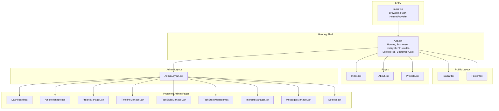
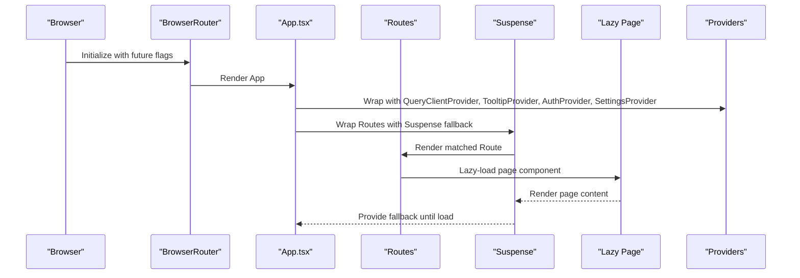
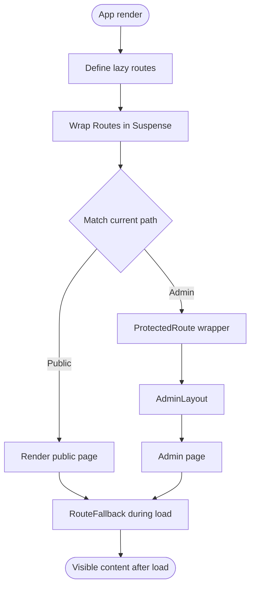
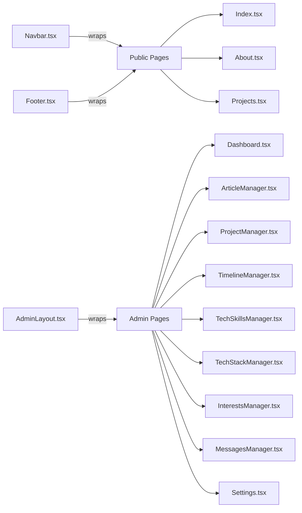
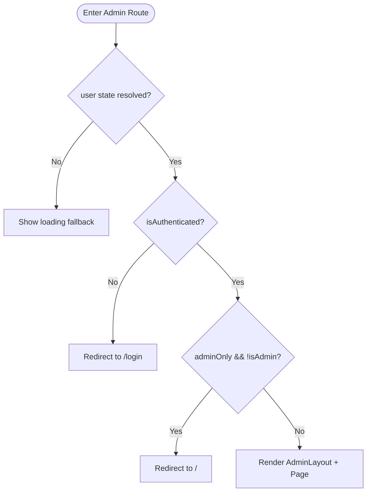
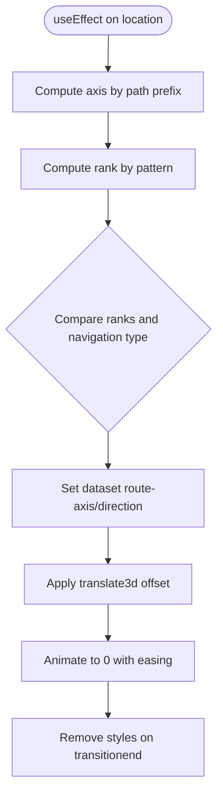
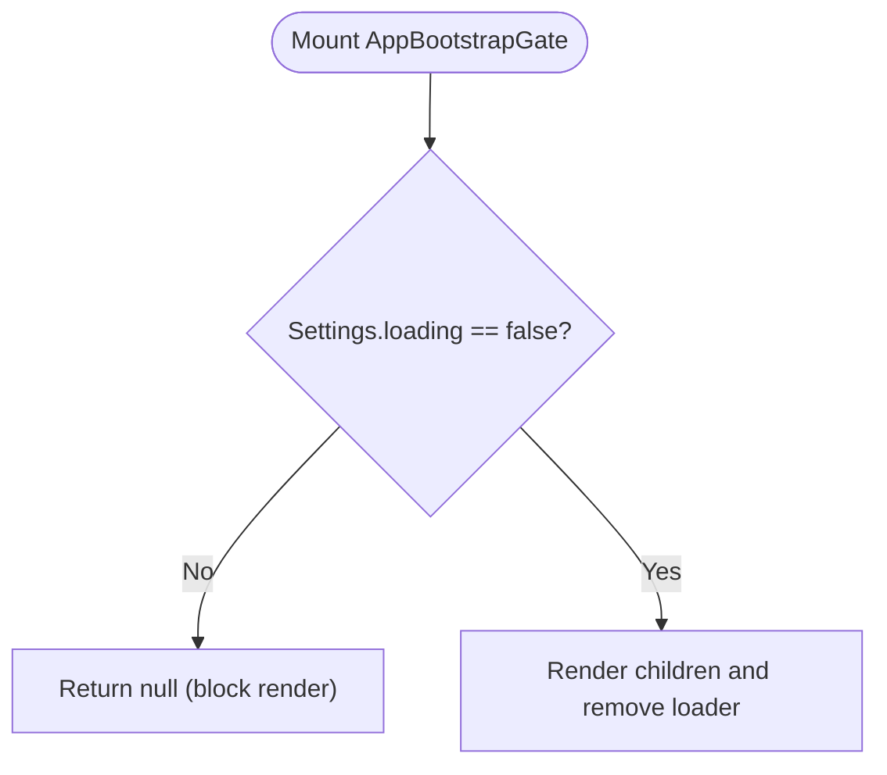
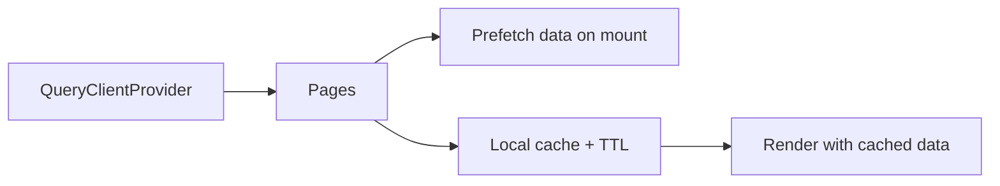
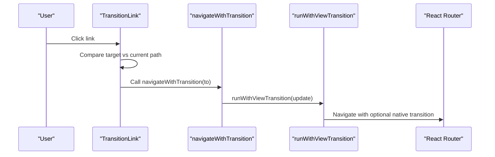
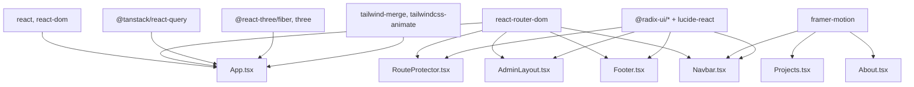

# Frontend Architecture

<cite>
**Referenced Files in This Document**
- [App.tsx](file://personalSite/src/App.tsx)
- [main.tsx](file://personalSite/src/main.tsx)
- [Navbar.tsx](file://personalSite/src/components/layout/Navbar.tsx)
- [Footer.tsx](file://personalSite/src/components/layout/Footer.tsx)
- [AdminLayout.tsx](file://personalSite/src/components/layout/AdminLayout.tsx)
- [RouteProtector.tsx](file://personalSite/src/components/RouteProtector.tsx)
- [ScrollToTop.tsx](file://personalSite/src/components/ScrollToTop.tsx)
- [viewTransition.ts](file://personalSite/src/lib/viewTransition.ts)
- [TransitionLink.tsx](file://personalSite/src/components/TransitionLink.tsx)
- [Index.tsx](file://personalSite/src/pages/Index.tsx)
- [About.tsx](file://personalSite/src/pages/About.tsx)
- [Projects.tsx](file://personalSite/src/pages/Projects.tsx)
- [package.json](file://personalSite/package.json)
- [tsconfig.app.json](file://personalSite/tsconfig.app.json)
</cite>

## Table of Contents
1. [Introduction](#introduction)
2. [Project Structure](#project-structure)
3. [Core Components](#core-components)
4. [Architecture Overview](#architecture-overview)
5. [Detailed Component Analysis](#detailed-component-analysis)
6. [Dependency Analysis](#dependency-analysis)
7. [Performance Considerations](#performance-considerations)
8. [Troubleshooting Guide](#troubleshooting-guide)
9. [Conclusion](#conclusion)

## Introduction
This document explains the Personal Site frontend architecture built with React, React Router DOM, and TanStack React Query. It covers the component hierarchy starting from the root App, the routing system with lazy loading and Suspense fallbacks, the layout system with Navbar, Footer, and AdminLayout, route transitions with custom animations, the bootstrap gate pattern for initial loading, and integration with React Query for state management. Practical examples demonstrate component composition, route protection, and performance optimization techniques.

## Project Structure
The frontend is organized by feature and layer:
- Root entry initializes routing, SEO, and app shell providers.
- App orchestrates routing, lazy-loaded pages, Suspense fallbacks, and route transitions.
- Layout components (Navbar, Footer, AdminLayout) wrap page content.
- Pages implement route-specific logic and integrate with TanStack Query and local caching.
- Utilities support view transitions and navigation.

**Diagram sources**
- [main.tsx](file://personalSite/src/main.tsx#L17-L23)
- [App.tsx](file://personalSite/src/App.tsx#L231-L356)
- [Navbar.tsx](file://personalSite/src/components/layout/Navbar.tsx#L39-L344)
- [Footer.tsx](file://personalSite/src/components/layout/Footer.tsx#L20-L133)
- [AdminLayout.tsx](file://personalSite/src/components/layout/AdminLayout.tsx#L32-L293)
- [Index.tsx](file://personalSite/src/pages/Index.tsx#L12-L65)
- [About.tsx](file://personalSite/src/pages/About.tsx#L32-L376)
- [Projects.tsx](file://personalSite/src/pages/Projects.tsx#L108-L336)

**Section sources**
- [main.tsx](file://personalSite/src/main.tsx#L1-L26)
- [App.tsx](file://personalSite/src/App.tsx#L1-L359)

## Core Components
- App: Central orchestrator for routing, lazy loading, Suspense fallback, route transitions, and provider tree.
- main.tsx: Initializes routing with React Router DOM and SEO with react-helmet-async.
- Navbar/Footer: Shared layouts for public routes.
- AdminLayout: Dedicated layout for admin routes with sidebar and protected routes.
- RouteProtector: Guards admin routes and enforces admin-only access.
- ScrollToTop: Ensures smooth navigation to top and hash scrolling.
- viewTransition utilities: Control native view transitions with reduced-motion safety.
- TransitionLink: Wraps navigation to trigger view transitions.

**Section sources**
- [App.tsx](file://personalSite/src/App.tsx#L141-L356)
- [main.tsx](file://personalSite/src/main.tsx#L17-L23)
- [Navbar.tsx](file://personalSite/src/components/layout/Navbar.tsx#L39-L344)
- [Footer.tsx](file://personalSite/src/components/layout/Footer.tsx#L20-L133)
- [AdminLayout.tsx](file://personalSite/src/components/layout/AdminLayout.tsx#L32-L293)
- [RouteProtector.tsx](file://personalSite/src/components/RouteProtector.tsx#L10-L40)
- [ScrollToTop.tsx](file://personalSite/src/components/ScrollToTop.tsx#L6-L44)
- [viewTransition.ts](file://personalSite/src/lib/viewTransition.ts#L17-L29)
- [TransitionLink.tsx](file://personalSite/src/components/TransitionLink.tsx#L12-L35)

## Architecture Overview
The application uses React Router DOM for declarative routing, lazy loading for code-splitting, and Suspense for graceful fallbacks. App wraps all routes with providers for TanStack Query, tooltips, and settings. Route transitions are computed per-axis and direction, and applied via CSS transforms with requestAnimationFrame for smoothness. The bootstrap gate ensures initial settings are loaded before rendering the app shell.

**Diagram sources**
- [main.tsx](file://personalSite/src/main.tsx#L18-L22)
- [App.tsx](file://personalSite/src/App.tsx#L232-L352)
- [App.tsx](file://personalSite/src/App.tsx#L240-L346)

## Detailed Component Analysis

### Routing System with Lazy Loading and Suspense
- Lazy imports are defined at the top of App.tsx for all public and admin pages.
- Suspense fallback is configured globally around Routes to show a spinner with background.
- Routes are declared under a single Routes container keyed by location to force remounts and enable transition effects.

**Diagram sources**
- [App.tsx](file://personalSite/src/App.tsx#L14-L31)
- [App.tsx](file://personalSite/src/App.tsx#L240-L346)
- [App.tsx](file://personalSite/src/App.tsx#L88-L98)

**Section sources**
- [App.tsx](file://personalSite/src/App.tsx#L14-L31)
- [App.tsx](file://personalSite/src/App.tsx#L240-L346)
- [App.tsx](file://personalSite/src/App.tsx#L88-L98)

### Layout System: Navbar, Footer, AdminLayout
- Navbar: Desktop and mobile navigation, animated indicators, contact modal, and social links driven by SettingsContext.
- Footer: Quick links, social links, and legal links, also consuming SettingsContext.
- AdminLayout: Fixed sidebar with active indicator, top bar, and page content area with shared SEO and background.

**Diagram sources**
- [Navbar.tsx](file://personalSite/src/components/layout/Navbar.tsx#L39-L344)
- [Footer.tsx](file://personalSite/src/components/layout/Footer.tsx#L20-L133)
- [AdminLayout.tsx](file://personalSite/src/components/layout/AdminLayout.tsx#L32-L293)
- [Index.tsx](file://personalSite/src/pages/Index.tsx#L12-L65)
- [About.tsx](file://personalSite/src/pages/About.tsx#L32-L376)
- [Projects.tsx](file://personalSite/src/pages/Projects.tsx#L108-L336)

**Section sources**
- [Navbar.tsx](file://personalSite/src/components/layout/Navbar.tsx#L39-L344)
- [Footer.tsx](file://personalSite/src/components/layout/Footer.tsx#L20-L133)
- [AdminLayout.tsx](file://personalSite/src/components/layout/AdminLayout.tsx#L32-L293)

### Route Protection Patterns
- ProtectedRoute checks authentication and admin privileges, with a loading state while user state resolves.
- Admin routes are wrapped with ProtectedRoute(adminOnly=true) and rendered inside AdminLayout.

**Diagram sources**
- [RouteProtector.tsx](file://personalSite/src/components/RouteProtector.tsx#L10-L38)
- [App.tsx](file://personalSite/src/App.tsx#L254-L343)

**Section sources**
- [RouteProtector.tsx](file://personalSite/src/components/RouteProtector.tsx#L10-L40)
- [App.tsx](file://personalSite/src/App.tsx#L254-L343)

### Route Transition System with Custom Animations
- Transition metadata is computed based on route axis (horizontal vs vertical) and direction (forward/backward).
- CSS transform offsets are applied via requestAnimationFrame and cleaned up on transition end.
- Transition classes are dynamically applied to the root container for consistent animation behavior.

**Diagram sources**
- [App.tsx](file://personalSite/src/App.tsx#L146-L229)

**Section sources**
- [App.tsx](file://personalSite/src/App.tsx#L146-L229)

### Bootstrap Gate Pattern for Initial Loading
- AppBootstrapGate waits for SettingsContext.loading to become false before rendering children.
- On boot completion, it removes the loader element and cleans up classes.

**Diagram sources**
- [App.tsx](file://personalSite/src/App.tsx#L100-L139)

**Section sources**
- [App.tsx](file://personalSite/src/App.tsx#L100-L139)

### TanStack React Query Integration
- QueryClientProvider is mounted at the root to enable caching, background refetching, and optimistic updates across the app.
- Pages prefetch data on mount to improve perceived performance (e.g., Index prefetches about data).
- Local caching strategies are used alongside React Query to minimize network requests (e.g., Projects page cache TTL).

**Diagram sources**
- [App.tsx](file://personalSite/src/App.tsx#L32-L32)
- [Index.tsx](file://personalSite/src/pages/Index.tsx#L15-L19)
- [Projects.tsx](file://personalSite/src/pages/Projects.tsx#L58-L106)

**Section sources**
- [App.tsx](file://personalSite/src/App.tsx#L32-L32)
- [Index.tsx](file://personalSite/src/pages/Index.tsx#L15-L19)
- [Projects.tsx](file://personalSite/src/pages/Projects.tsx#L58-L106)

### View Transitions and Navigation Utilities
- TransitionLink intercepts clicks, computes target/current paths, and triggers navigateWithTransition.
- navigateWithTransition wraps navigation in runWithViewTransition, which respects reduced-motion preferences and native view transitions.

**Diagram sources**
- [TransitionLink.tsx](file://personalSite/src/components/TransitionLink.tsx#L12-L35)
- [viewTransition.ts](file://personalSite/src/lib/viewTransition.ts#L17-L29)

**Section sources**
- [TransitionLink.tsx](file://personalSite/src/components/TransitionLink.tsx#L12-L35)
- [viewTransition.ts](file://personalSite/src/lib/viewTransition.ts#L17-L29)

### Practical Examples of Component Composition
- Public pages (Index, About, Projects) render Navbar and Footer, and use route-transition-content to participate in transitions.
- Admin pages are composed inside AdminLayout, which provides sidebar, top bar, and SEO metadata.
- ProtectedRoute composes with AdminLayout to enforce authentication and admin-only access.

**Section sources**
- [Index.tsx](file://personalSite/src/pages/Index.tsx#L43-L62)
- [About.tsx](file://personalSite/src/pages/About.tsx#L192-L376)
- [Projects.tsx](file://personalSite/src/pages/Projects.tsx#L204-L336)
- [AdminLayout.tsx](file://personalSite/src/components/layout/AdminLayout.tsx#L108-L293)
- [App.tsx](file://personalSite/src/App.tsx#L254-L343)

## Dependency Analysis
External libraries and their roles:
- React Router DOM: Declarative routing, lazy loading, and navigation.
- TanStack React Query: Global caching and data synchronization.
- Framer Motion: Page and component animations.
- Radix UI + shadcn/ui: Accessible UI primitives and styled components.
- Three.js + @react-three/fiber: 3D assets for backgrounds.
- Tailwind + Tailwind Variants: Utility-first styling and component variants.
- Vite + SWC: Build toolchain and fast refresh.

**Diagram sources**
- [package.json](file://personalSite/package.json#L15-L73)
- [App.tsx](file://personalSite/src/App.tsx#L1-L12)
- [Navbar.tsx](file://personalSite/src/components/layout/Navbar.tsx#L1-L11)
- [Footer.tsx](file://personalSite/src/components/layout/Footer.tsx#L1-L3)
- [AdminLayout.tsx](file://personalSite/src/components/layout/AdminLayout.tsx#L1-L23)
- [RouteProtector.tsx](file://personalSite/src/components/RouteProtector.tsx#L1-L3)

**Section sources**
- [package.json](file://personalSite/package.json#L15-L73)

## Performance Considerations
- Lazy loading and Suspense: Reduce initial bundle size and provide immediate feedback during navigation.
- Prefetching: Index prefetches about data to minimize perceived latency.
- Local caching: Projects page caches data with TTL to avoid repeated network calls.
- Reduced-motion safety: View transitions respect user preferences and degrade gracefully.
- requestAnimationFrame: Used to batch transform updates for smooth animations.
- Tailwind JIT and tree-shaking: Minimizes CSS footprint in production builds.

[No sources needed since this section provides general guidance]

## Troubleshooting Guide
- Blank screen after login: ProtectedRoute displays a loading state while resolving user state; ensure authentication context is initialized.
- Admin routes redirect unexpectedly: Verify isAuthenticated and isAdmin flags; admin-only routes require admin privileges.
- Transitions not working: Confirm dataset route-axis and route-direction are set; ensure route-transition-content nodes exist.
- Boot loader never hides: Check SettingsContext loading state and APP_BOOT_LOADER_HIDDEN_CLASS application.
- Navigation does not animate: Ensure TransitionLink is used for internal links and navigateWithTransition is called.

**Section sources**
- [RouteProtector.tsx](file://personalSite/src/components/RouteProtector.tsx#L14-L38)
- [App.tsx](file://personalSite/src/App.tsx#L100-L139)
- [App.tsx](file://personalSite/src/App.tsx#L174-L229)
- [viewTransition.ts](file://personalSite/src/lib/viewTransition.ts#L9-L23)

## Conclusion
The Personal Site frontend leverages modern React patterns with lazy loading, Suspense, and TanStack Query to deliver a responsive, accessible, and performant experience. The routing system integrates seamlessly with custom animations and a bootstrap gate, while the layout components provide consistent navigation and branding. Route protection and caching strategies further enhance security and performance.