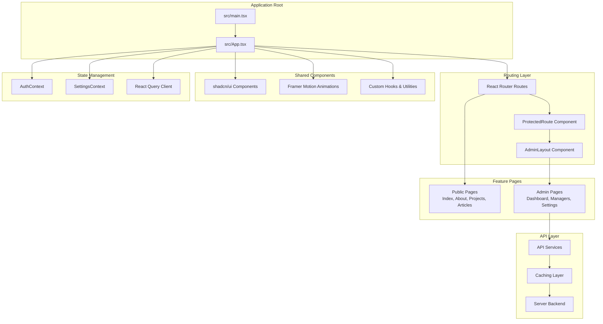
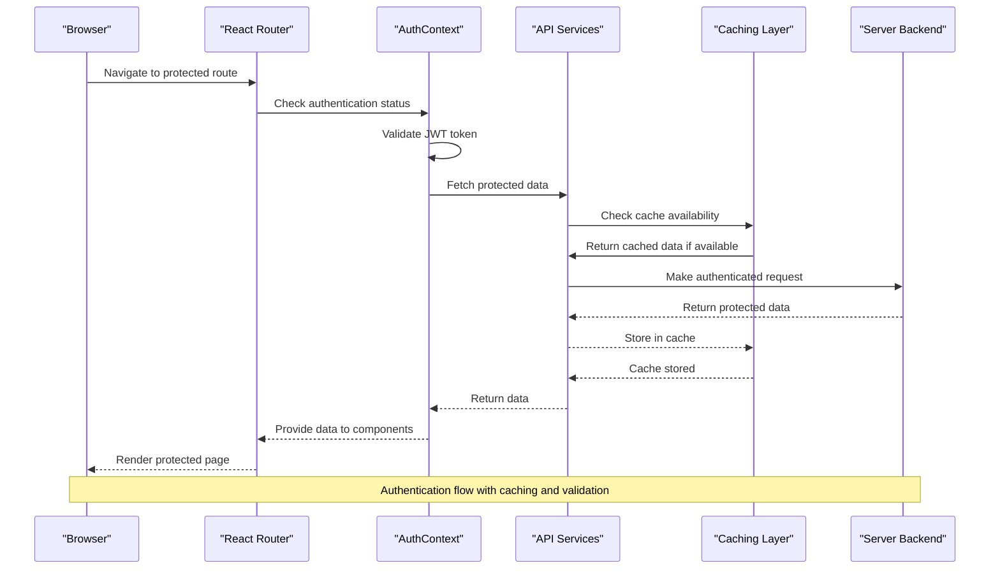
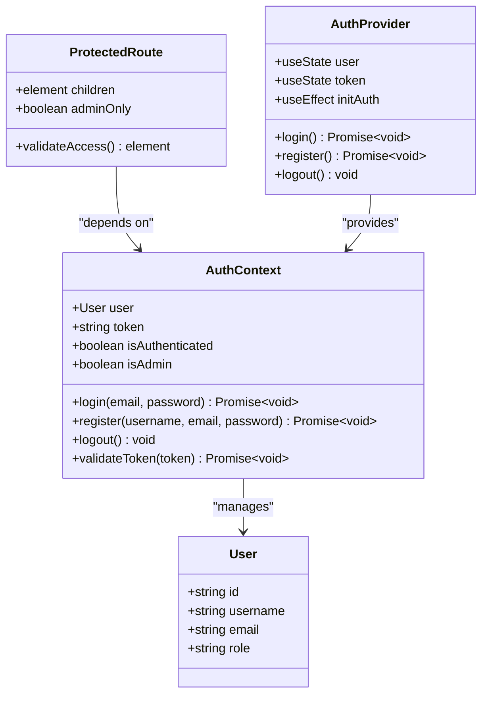
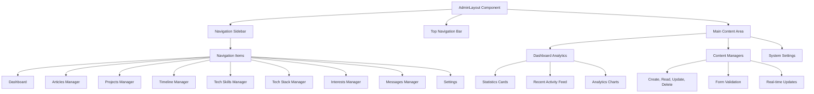
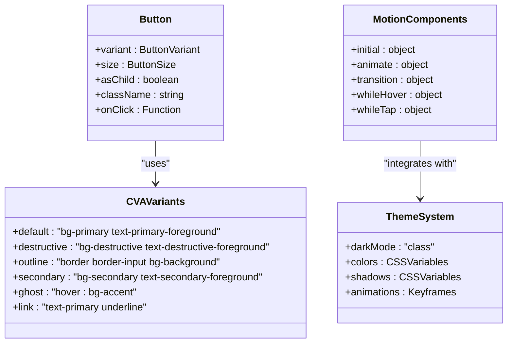
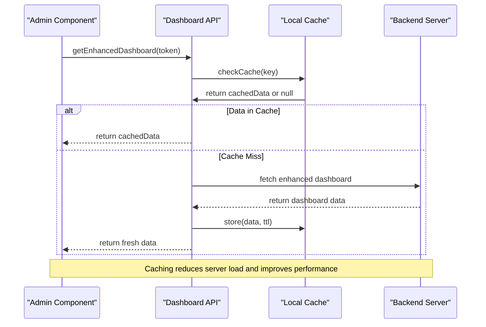
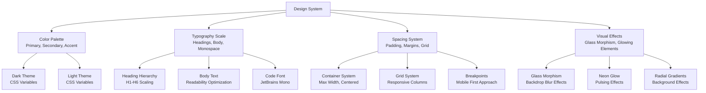
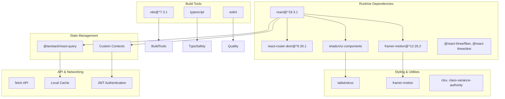

# Personal Site Application

<cite>
**Referenced Files in This Document**
- [package.json](file://personalSite/package.json)
- [App.tsx](file://personalSite/src/App.tsx)
- [main.tsx](file://personalSite/src/main.tsx)
- [index.css](file://personalSite/src/index.css)
- [tailwind.config.ts](file://personalSite/tailwind.config.ts)
- [AuthContext.tsx](file://personalSite/src/contexts/AuthContext.tsx)
- [RouteProtector.tsx](file://personalSite/src/components/RouteProtector.tsx)
- [AdminLayout.tsx](file://personalSite/src/components/layout/AdminLayout.tsx)
- [Dashboard.tsx](file://personalSite/src/pages/Admin/Dashboard.tsx)
- [apiConfig.ts](file://personalSite/src/lib/apiConfig.ts)
- [dashboardApi.ts](file://personalSite/src/api/dashboardApi.ts)
- [button.tsx](file://personalSite/src/components/ui/button.tsx)
- [use-mobile.tsx](file://personalSite/src/hooks/use-mobile.tsx)
- [HeroSection.tsx](file://personalSite/src/components/sections/HeroSection.tsx)
- [components.json](file://personalSite/components.json)
</cite>

## Table of Contents
1. [Introduction](#introduction)
2. [Project Structure](#project-structure)
3. [Core Components](#core-components)
4. [Architecture Overview](#architecture-overview)
5. [Detailed Component Analysis](#detailed-component-analysis)
6. [Dependency Analysis](#dependency-analysis)
7. [Performance Considerations](#performance-considerations)
8. [Troubleshooting Guide](#troubleshooting-guide)
9. [Conclusion](#conclusion)
10. [Appendices](#appendices)

## Introduction
The Personal Site application is a modern React-based portfolio frontend designed with a futuristic aesthetic, responsive design, and seamless navigation. It leverages shadcn/ui for a cohesive UI component library, Framer Motion for animations, and React Router for structured routing. The application implements a robust authentication system with JWT tokens, protected routes, and role-based access control (RBAC) for administrative features. The admin panel provides a comprehensive dashboard and content management interfaces with real-time updates and caching strategies.

## Project Structure
The application follows a feature-based organization within the personalSite directory, separating concerns into pages, components, contexts, hooks, APIs, and shared libraries. The build system uses Vite with TypeScript, Tailwind CSS for styling, and PostCSS for advanced styling capabilities.

**Diagram sources**
- [main.tsx](file://personalSite/src/main.tsx#L17-L23)
- [App.tsx](file://personalSite/src/App.tsx#L232-L355)

**Section sources**
- [package.json](file://personalSite/package.json#L1-L113)
- [main.tsx](file://personalSite/src/main.tsx#L1-L26)
- [App.tsx](file://personalSite/src/App.tsx#L1-L359)

## Core Components
The application's core functionality is built around several key components that work together to provide a seamless user experience:

### Authentication System
The authentication system implements JWT-based authentication with automatic token validation, secure storage, and role-based access control. The AuthContext manages user state, token lifecycle, and provides authentication utilities throughout the application.

### Routing and Navigation
React Router handles both public and admin routes with sophisticated transition animations and route protection. The system supports horizontal and vertical navigation patterns with custom animations.

### Admin Panel Infrastructure
The admin panel provides a comprehensive content management system with dashboard analytics, real-time updates, and intuitive interfaces for managing portfolio content.

### UI Component Library
Built on shadcn/ui, the component library provides consistent, accessible UI elements with extensive customization options and theme support.

**Section sources**
- [AuthContext.tsx](file://personalSite/src/contexts/AuthContext.tsx#L1-L140)
- [RouteProtector.tsx](file://personalSite/src/components/RouteProtector.tsx#L1-L41)
- [AdminLayout.tsx](file://personalSite/src/components/layout/AdminLayout.tsx#L1-L294)
- [Dashboard.tsx](file://personalSite/src/pages/Admin/Dashboard.tsx#L1-L348)

## Architecture Overview
The application follows a layered architecture with clear separation of concerns:

**Diagram sources**
- [AuthContext.tsx](file://personalSite/src/contexts/AuthContext.tsx#L58-L76)
- [dashboardApi.ts](file://personalSite/src/api/dashboardApi.ts#L121-L146)

The architecture implements several key patterns:
- **Context-based State Management**: Centralized authentication and settings state
- **Component Composition**: Reusable UI components with consistent styling
- **API Abstraction**: Unified API service layer with caching
- **Route Protection**: Conditional rendering based on authentication and roles
- **Responsive Design**: Adaptive layouts for all screen sizes

## Detailed Component Analysis

### Authentication and Authorization System
The authentication system provides comprehensive security features with JWT token management and role-based access control.

**Diagram sources**
- [AuthContext.tsx](file://personalSite/src/contexts/AuthContext.tsx#L5-L30)
- [RouteProtector.tsx](file://personalSite/src/components/RouteProtector.tsx#L5-L8)

Key authentication features include:
- **JWT Token Storage**: Secure local storage with automatic validation
- **Role-Based Access Control**: Admin-only routes and content
- **Automatic Token Refresh**: Backend validation during initialization
- **Protected Route Rendering**: Conditional component display based on permissions

**Section sources**
- [AuthContext.tsx](file://personalSite/src/contexts/AuthContext.tsx#L36-L140)
- [RouteProtector.tsx](file://personalSite/src/components/RouteProtector.tsx#L10-L38)

### Admin Panel Infrastructure
The admin panel provides a comprehensive content management system with real-time analytics and intuitive interfaces.

**Diagram sources**
- [AdminLayout.tsx](file://personalSite/src/components/layout/AdminLayout.tsx#L42-L88)
- [Dashboard.tsx](file://personalSite/src/pages/Admin/Dashboard.tsx#L123-L160)

The admin panel features:
- **Real-time Analytics**: Live dashboard with statistics and recent activity
- **Content Management**: Intuitive interfaces for managing portfolio content
- **Responsive Design**: Optimized layouts for desktop and mobile administration
- **User Profile Management**: Secure authentication and session handling

**Section sources**
- [AdminLayout.tsx](file://personalSite/src/components/layout/AdminLayout.tsx#L32-L294)
- [Dashboard.tsx](file://personalSite/src/pages/Admin/Dashboard.tsx#L79-L348)

### UI Component Library and Animation System
The application utilizes shadcn/ui for consistent, accessible UI components combined with Framer Motion for sophisticated animations.

**Diagram sources**
- [button.tsx](file://personalSite/src/components/ui/button.tsx#L7-L31)
- [index.css](file://personalSite/src/index.css#L10-L125)

The UI system provides:
- **Consistent Styling**: Theme-aware components with proper accessibility
- **Animation System**: Smooth transitions and micro-interactions
- **Responsive Design**: Adaptive layouts for all device sizes
- **Customization**: Extensive theming and styling options

**Section sources**
- [button.tsx](file://personalSite/src/components/ui/button.tsx#L1-L48)
- [index.css](file://personalSite/src/index.css#L1-L842)
- [tailwind.config.ts](file://personalSite/tailwind.config.ts#L1-L117)

### API Integration and Data Management
The application implements a robust API layer with caching, error handling, and real-time data updates.

**Diagram sources**
- [dashboardApi.ts](file://personalSite/src/api/dashboardApi.ts#L121-L146)
- [apiConfig.ts](file://personalSite/src/lib/apiConfig.ts#L1-L75)

Key API features include:
- **Centralized Configuration**: Environment-specific API base URLs
- **Intelligent Caching**: Automatic cache management with TTL
- **Error Handling**: Comprehensive error management and user feedback
- **Real-time Updates**: Efficient data synchronization

**Section sources**
- [dashboardApi.ts](file://personalSite/src/api/dashboardApi.ts#L70-L152)
- [apiConfig.ts](file://personalSite/src/lib/apiConfig.ts#L6-L52)

### Responsive Design and Modern Web Presentation
The application implements a comprehensive responsive design system with adaptive layouts and modern visual aesthetics.

**Diagram sources**
- [index.css](file://personalSite/src/index.css#L10-L125)
- [tailwind.config.ts](file://personalSite/tailwind.config.ts#L15-L113)

The design system emphasizes:
- **Futuristic Aesthetics**: Neon colors, glass morphism, and digital effects
- **Accessibility**: Proper contrast ratios and semantic markup
- **Performance**: Optimized animations and efficient rendering
- **Consistency**: Unified design language across all components

**Section sources**
- [index.css](file://personalSite/src/index.css#L1-L842)
- [tailwind.config.ts](file://personalSite/tailwind.config.ts#L1-L117)

## Dependency Analysis
The application maintains a clean dependency graph with clear boundaries between layers and modules.

**Diagram sources**
- [package.json](file://personalSite/package.json#L15-L74)

**Section sources**
- [package.json](file://personalSite/package.json#L1-L113)

## Performance Considerations
The application implements several performance optimization strategies:

### Lazy Loading and Code Splitting
- **Route-based Lazy Loading**: Routes are dynamically imported using React.lazy
- **Component-level Splitting**: Large components are split into separate chunks
- **Bundle Optimization**: Vite's tree-shaking removes unused code

### Caching Strategies
- **Intelligent Cache Management**: Automatic cache invalidation and TTL
- **Offline Support**: Local storage for authentication state persistence
- **API Response Caching**: Reduced server load and improved response times

### Animation Performance
- **Hardware Acceleration**: CSS transforms and GPU acceleration
- **Optimized Transitions**: Efficient animation timing and easing
- **Memory Management**: Cleanup of animation listeners and event handlers

### Bundle Size Optimization
- **Tree Shaking**: Unused imports are automatically removed
- **Component Libraries**: Only required components are included
- **Asset Optimization**: Image compression and modern formats

## Troubleshooting Guide
Common issues and their solutions:

### Authentication Issues
- **Token Validation Failures**: Check network connectivity and server status
- **Session Persistence**: Verify localStorage availability in browser
- **Redirect Loops**: Clear sessionStorage and refresh page

### API Integration Problems
- **CORS Errors**: Verify API base URL configuration
- **Cache Invalidation**: Use force refresh option for critical data
- **Network Timeouts**: Check server health and connection status

### Performance Issues
- **Slow Animations**: Disable animations on low-end devices
- **Memory Leaks**: Ensure proper cleanup of event listeners
- **Bundle Size**: Analyze bundle composition using Vite's analyzer

### Styling Conflicts
- **Tailwind Overrides**: Check for conflicting CSS declarations
- **Component Styling**: Verify proper className application
- **Theme Switching**: Ensure CSS variable updates are applied

**Section sources**
- [AuthContext.tsx](file://personalSite/src/contexts/AuthContext.tsx#L58-L76)
- [dashboardApi.ts](file://personalSite/src/api/dashboardApi.ts#L148-L151)

## Conclusion
The Personal Site application demonstrates modern web development practices with its comprehensive architecture, robust authentication system, and elegant user interface. The combination of shadcn/ui components, Framer Motion animations, and React Router creates a polished user experience while maintaining excellent performance and accessibility standards. The admin panel provides powerful content management capabilities with real-time updates and intuitive interfaces, making it an ideal solution for professional portfolio websites.

The application's modular design allows for easy maintenance and extension, while its responsive design ensures optimal viewing experiences across all devices. The implementation of JWT authentication, protected routes, and role-based access control provides enterprise-grade security for administrative features.

## Appendices

### Component Usage Examples
- **Button Component**: Use variant and size props for consistent styling
- **Protected Routes**: Wrap admin components with ProtectedRoute for access control
- **Animations**: Apply motion variants for smooth transitions and micro-interactions
- **API Services**: Utilize dashboardApi for enhanced dashboard functionality

### Customization Options
- **Theme Customization**: Modify CSS variables in index.css for brand-specific styling
- **Animation Timing**: Adjust motion transition durations for different performance needs
- **Component Variants**: Extend shadcn/ui components with custom variants
- **Layout Configuration**: Customize breakpoints and spacing systems

### Integration Patterns
- **Backend API Integration**: Use apiConfig for environment-specific endpoint configuration
- **State Management**: Leverage AuthContext and SettingsContext for centralized state
- **Real-time Updates**: Implement WebSocket connections for live data synchronization
- **SEO Optimization**: Utilize react-helmet-async for dynamic meta tag management

**Section sources**
- [components.json](file://personalSite/components.json#L1-L21)
- [HeroSection.tsx](file://personalSite/src/components/sections/HeroSection.tsx#L1-L82)
- [use-mobile.tsx](file://personalSite/src/hooks/use-mobile.tsx#L1-L26)