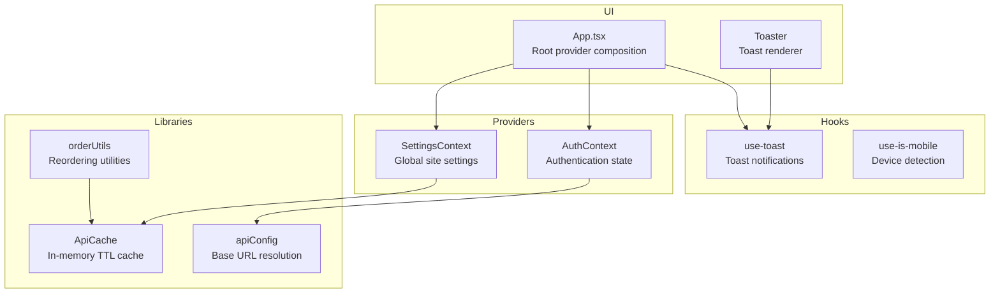
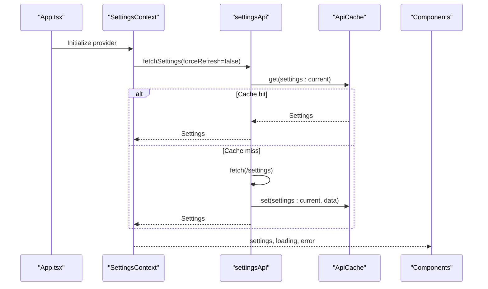
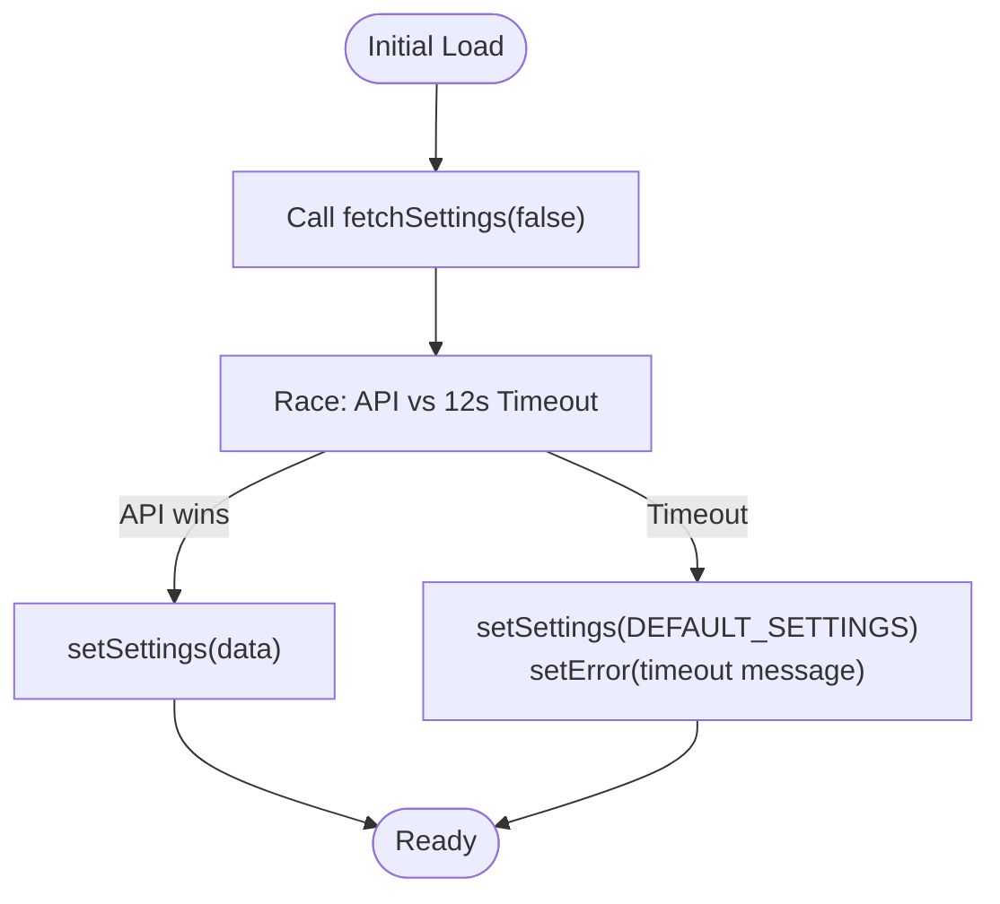
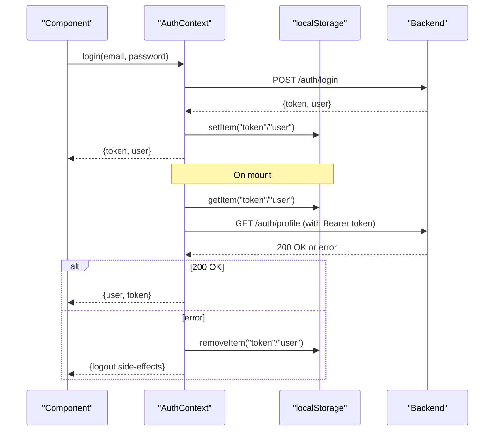
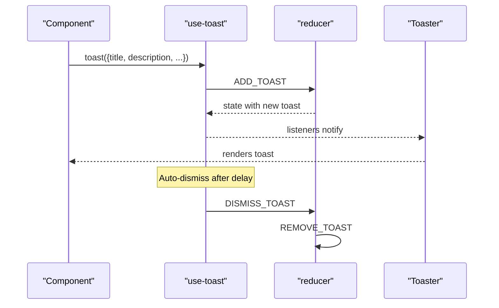
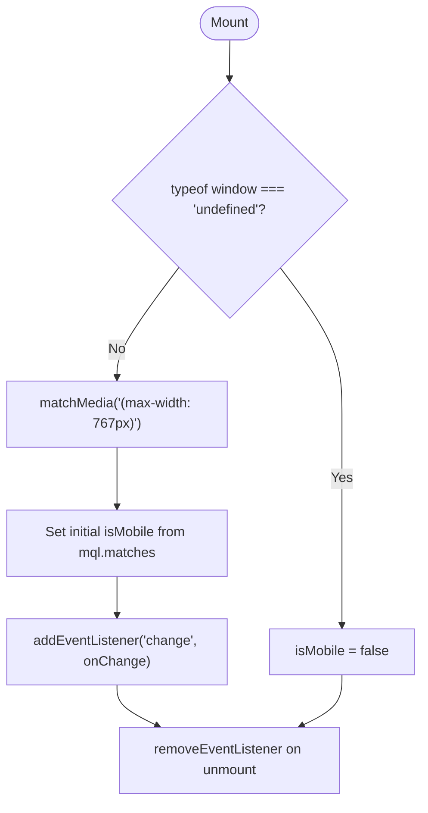
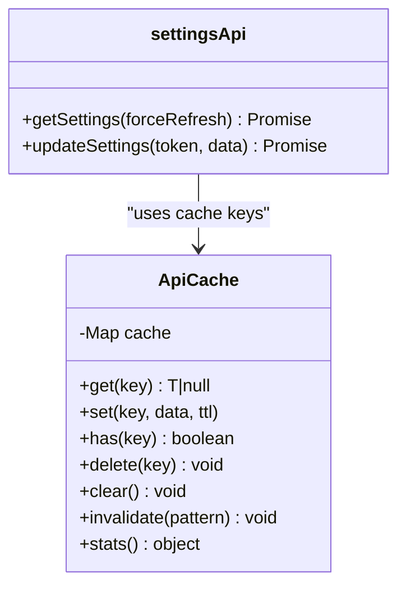
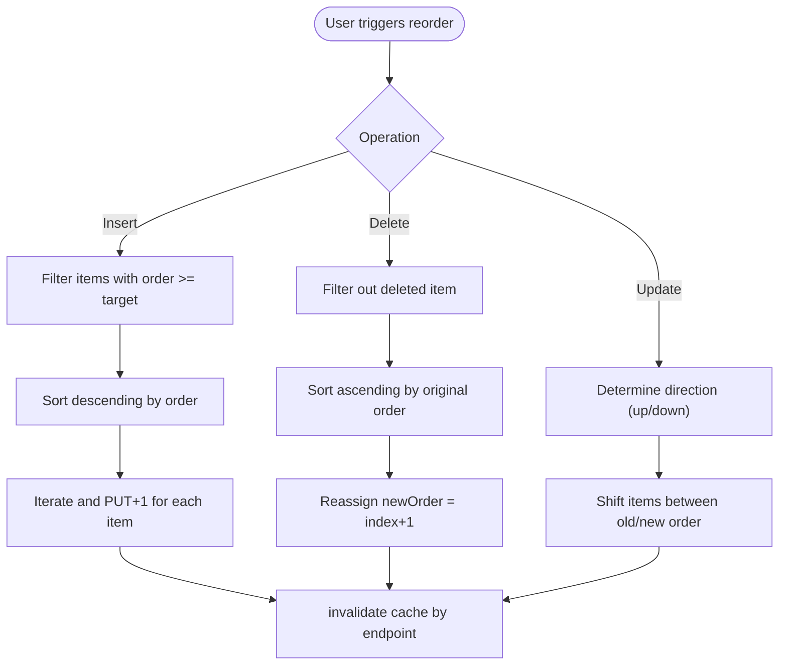
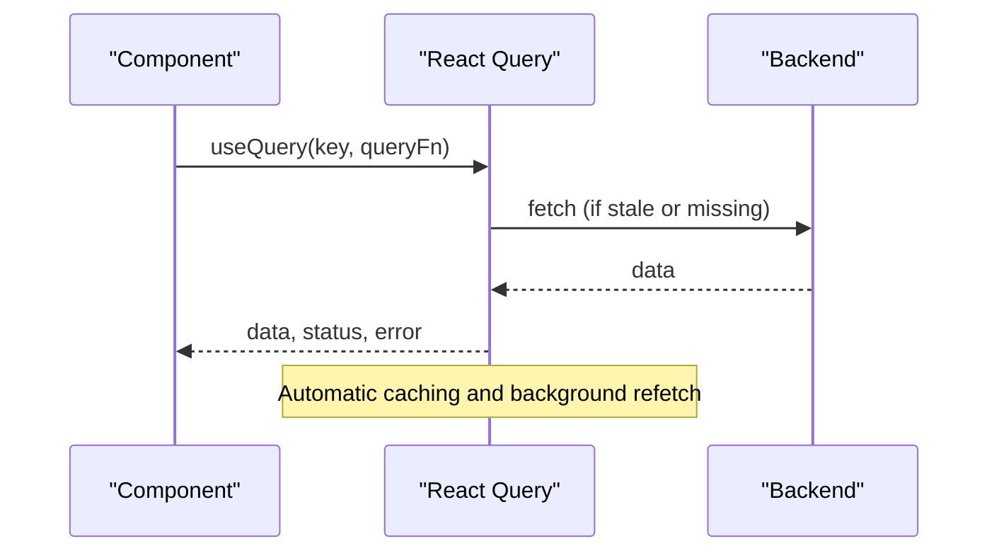
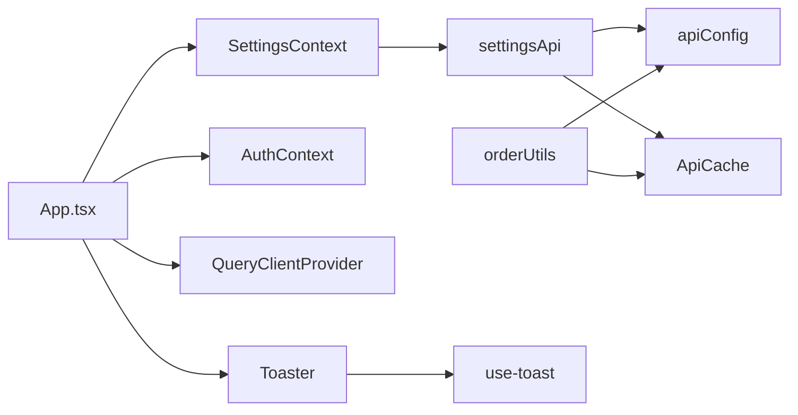

# State Management

<cite>
**Referenced Files in This Document**
- [SettingsContext.tsx](file://personalSite/src/contexts/SettingsContext.tsx)
- [use-toast.ts](file://personalSite/src/hooks/use-toast.ts)
- [use-mobile.tsx](file://personalSite/src/hooks/use-mobile.tsx)
- [cache.ts](file://personalSite/src/lib/cache.ts)
- [orderUtils.ts](file://personalSite/src/lib/orderUtils.ts)
- [apiConfig.ts](file://personalSite/src/lib/apiConfig.ts)
- [settingsApi.ts](file://personalSite/src/api/settingsApi.ts)
- [App.tsx](file://personalSite/src/App.tsx)
- [AuthContext.tsx](file://personalSite/src/contexts/AuthContext.tsx)
- [toaster.tsx](file://personalSite/src/components/ui/toaster.tsx)
- [Dashboard.tsx](file://personalSite/src/pages/Admin/Dashboard.tsx)
- [Settings.tsx](file://personalSite/src/pages/Admin/Settings.tsx)
- [AdminLayout.tsx](file://personalSite/src/components/layout/AdminLayout.tsx)
- [utils.ts](file://personalSite/src/lib/utils.ts)
</cite>

## Table of Contents
1. [Introduction](#introduction)
2. [Project Structure](#project-structure)
3. [Core Components](#core-components)
4. [Architecture Overview](#architecture-overview)
5. [Detailed Component Analysis](#detailed-component-analysis)
6. [Dependency Analysis](#dependency-analysis)
7. [Performance Considerations](#performance-considerations)
8. [Troubleshooting Guide](#troubleshooting-guide)
9. [Conclusion](#conclusion)
10. [Appendices](#appendices)

## Introduction
This document explains the state management patterns used across the application, focusing on:
- Global application state via SettingsContext
- Custom hooks for toast notifications and mobile detection
- Caching strategies for API responses
- Utility functions for data manipulation and ordering systems
- Integration with React Query for server state management
- Local storage patterns and state persistence
- Practical examples for implementing new contexts, optimizing performance with memoization, and maintaining state consistency

## Project Structure
The state management spans three layers:
- Context providers for global state (SettingsContext, AuthContext)
- Local caches for API responses (in-memory TTL cache)
- Custom hooks for UI state and device detection
- Utilities for ordering and data manipulation
- Integration with React Query for server state

**Diagram sources**
- [App.tsx](file://personalSite/src/App.tsx#L232-L354)
- [SettingsContext.tsx](file://personalSite/src/contexts/SettingsContext.tsx#L71-L126)
- [AuthContext.tsx](file://personalSite/src/contexts/AuthContext.tsx#L36-L140)
- [use-toast.ts](file://personalSite/src/hooks/use-toast.ts#L166-L186)
- [use-mobile.tsx](file://personalSite/src/hooks/use-mobile.tsx#L5-L25)
- [cache.ts](file://personalSite/src/lib/cache.ts#L12-L99)
- [orderUtils.ts](file://personalSite/src/lib/orderUtils.ts#L47-L237)
- [apiConfig.ts](file://personalSite/src/lib/apiConfig.ts#L7-L52)
- [toaster.tsx](file://personalSite/src/components/ui/toaster.tsx#L4-L24)

**Section sources**
- [App.tsx](file://personalSite/src/App.tsx#L232-L354)

## Core Components
- SettingsContext: Manages global site settings with loading, error, and refresh capabilities. Integrates with settingsApi and a timeout mechanism to ensure resilience.
- AuthContext: Handles authentication state, persistence via localStorage, and token validation against the backend.
- use-toast: A custom toast notification system with a finite queue, per-toast timers, and a reducer-driven state machine.
- use-is-mobile: Device detection hook with media query listeners and SSR-safe initialization.
- ApiCache: In-memory cache with TTL, key invalidation, and statistics.
- orderUtils: Utilities for reordering items in admin interfaces with cache invalidation.
- apiConfig: Centralized API base URL resolution across environments.
- Toaster: UI component rendering toast notifications from the use-toast hook.

**Section sources**
- [SettingsContext.tsx](file://personalSite/src/contexts/SettingsContext.tsx#L48-L126)
- [AuthContext.tsx](file://personalSite/src/contexts/AuthContext.tsx#L12-L140)
- [use-toast.ts](file://personalSite/src/hooks/use-toast.ts#L15-L186)
- [use-mobile.tsx](file://personalSite/src/hooks/use-mobile.tsx#L5-L25)
- [cache.ts](file://personalSite/src/lib/cache.ts#L12-L137)
- [orderUtils.ts](file://personalSite/src/lib/orderUtils.ts#L47-L237)
- [apiConfig.ts](file://personalSite/src/lib/apiConfig.ts#L7-L52)
- [toaster.tsx](file://personalSite/src/components/ui/toaster.tsx#L4-L24)

## Architecture Overview
The application composes providers at the root level and integrates React Query for server state. Settings are fetched during bootstrapping and persisted locally for resilience. Authentication state is persisted and validated. Toast notifications are centralized via a custom hook and UI renderer. Ordering utilities coordinate with cache invalidation to keep UI and backend in sync.

**Diagram sources**
- [App.tsx](file://personalSite/src/App.tsx#L232-L354)
- [SettingsContext.tsx](file://personalSite/src/contexts/SettingsContext.tsx#L76-L112)
- [settingsApi.ts](file://personalSite/src/api/settingsApi.ts#L49-L70)
- [cache.ts](file://personalSite/src/lib/cache.ts#L20-L48)

## Detailed Component Analysis

### SettingsContext: Global Application State
- Purpose: Provide global site settings to the entire app with loading/error handling and refresh capability.
- Key behaviors:
  - Fetches settings with a race between API and a timeout promise.
  - On timeout, falls back to default settings and logs a warning.
  - Exposes refreshSettings to force-refresh from the backend.
- Provider composition: Wrapped at the root in App.tsx.

**Diagram sources**
- [SettingsContext.tsx](file://personalSite/src/contexts/SettingsContext.tsx#L76-L112)

**Section sources**
- [SettingsContext.tsx](file://personalSite/src/contexts/SettingsContext.tsx#L48-L126)
- [App.tsx](file://personalSite/src/App.tsx#L232-L354)

### AuthContext: Authentication State and Persistence
- Purpose: Manage user session, persist credentials, and validate tokens.
- Key behaviors:
  - On mount, reads token and user from localStorage and validates with backend.
  - Supports login, register, and logout with localStorage updates.
  - Derives isAuthenticated and isAdmin flags.
- Persistence: Uses localStorage for token and user profile.

**Diagram sources**
- [AuthContext.tsx](file://personalSite/src/contexts/AuthContext.tsx#L36-L140)

**Section sources**
- [AuthContext.tsx](file://personalSite/src/contexts/AuthContext.tsx#L12-L140)

### Toast Notifications: use-toast and Toaster
- Purpose: Provide a toast notification system with a finite queue and per-toast timers.
- Key behaviors:
  - Maintains an in-memory state and dispatches actions to update it.
  - Adds a toast, updates it, dismisses it, and removes it after a delay.
  - Toaster renders toasts from the shared state.
- Usage: Import useToast and toast from the hook module; render Toaster in the app shell.

**Diagram sources**
- [use-toast.ts](file://personalSite/src/hooks/use-toast.ts#L137-L186)
- [toaster.tsx](file://personalSite/src/components/ui/toaster.tsx#L4-L24)

**Section sources**
- [use-toast.ts](file://personalSite/src/hooks/use-toast.ts#L15-L186)
- [toaster.tsx](file://personalSite/src/components/ui/toaster.tsx#L4-L24)

### Mobile Detection: use-is-mobile
- Purpose: Detect mobile viewport and react to media query changes.
- Key behaviors:
  - SSR-safe initialization using a factory initializer.
  - Subscribes to media query change events and cleans up on unmount.
  - Returns a boolean indicating mobile viewport.

**Diagram sources**
- [use-mobile.tsx](file://personalSite/src/hooks/use-mobile.tsx#L5-L25)

**Section sources**
- [use-mobile.tsx](file://personalSite/src/hooks/use-mobile.tsx#L5-L25)

### Caching Strategies: ApiCache and settingsApi
- Purpose: Provide in-memory caching with TTL and structured cache keys.
- Key behaviors:
  - ApiCache supports get, set, has, delete, clear, invalidate, and stats.
  - settingsApi uses cache keys to check cache before network requests and sets cache on successful fetch.
  - Cache invalidation is triggered after mutations (e.g., settings update).
- Integration: Used by settingsApi and other API modules to reduce network calls and improve responsiveness.

**Diagram sources**
- [cache.ts](file://personalSite/src/lib/cache.ts#L12-L137)
- [settingsApi.ts](file://personalSite/src/api/settingsApi.ts#L49-L94)

**Section sources**
- [cache.ts](file://personalSite/src/lib/cache.ts#L12-L137)
- [settingsApi.ts](file://personalSite/src/api/settingsApi.ts#L49-L94)

### Ordering Systems: orderUtils
- Purpose: Maintain contiguous ordering for admin-managed resources.
- Key behaviors:
  - reorderItemsForInsertion: Shifts items to make room for a new item.
  - reorderItemsForDeletion: Recomputes contiguous order after deletion.
  - reorderItemsForUpdate: Moves an item and adjusts others accordingly.
  - invalidateCacheForEndpoint: Invalidates related cache entries after reordering.
- Integration: Called from admin pages to keep backend and UI ordering synchronized.

**Diagram sources**
- [orderUtils.ts](file://personalSite/src/lib/orderUtils.ts#L47-L237)

**Section sources**
- [orderUtils.ts](file://personalSite/src/lib/orderUtils.ts#L47-L237)

### React Query Integration
- Purpose: Manage server state and caching at the framework level.
- Key behaviors:
  - App.tsx initializes a QueryClient and wraps the app with QueryClientProvider.
  - Components can leverage React Query’s caching, background refetching, and optimistic updates.
- Note: While the application demonstrates a custom in-memory cache, React Query complements it by handling server state lifecycle and normalization.

**Diagram sources**
- [App.tsx](file://personalSite/src/App.tsx#L32-L4)

**Section sources**
- [App.tsx](file://personalSite/src/App.tsx#L32-L4)

### Local Storage Patterns and State Persistence
- SettingsContext: Falls back to default settings on timeout; default settings are not persisted to localStorage.
- AuthContext: Persists token and user profile to localStorage and validates on mount.
- ProjectDetail page: Demonstrates localStorage caching for project details and README content with TTL.
- Best practice: Persist only small, non-sensitive data and always validate on mount.

**Section sources**
- [SettingsContext.tsx](file://personalSite/src/contexts/SettingsContext.tsx#L96-L104)
- [AuthContext.tsx](file://personalSite/src/contexts/AuthContext.tsx#L43-L56)
- [Dashboard.tsx](file://personalSite/src/pages/Admin/Dashboard.tsx#L86-L105)

### Utility Functions for Data Manipulation
- cn (clsx + tailwind merge): Utility for composing Tailwind classes safely.
- Additional utilities: Used across components for consistent styling and class composition.

**Section sources**
- [utils.ts](file://personalSite/src/lib/utils.ts#L4-L6)

## Dependency Analysis
- SettingsContext depends on settingsApi and ApiCache.
- settingsApi depends on apiConfig and ApiCache.
- orderUtils depends on API_BASE_URL and ApiCache.
- App.tsx composes SettingsProvider, AuthProvider, QueryClientProvider, and Toaster.
- Toaster depends on use-toast.

**Diagram sources**
- [App.tsx](file://personalSite/src/App.tsx#L232-L354)
- [SettingsContext.tsx](file://personalSite/src/contexts/SettingsContext.tsx#L71-L126)
- [settingsApi.ts](file://personalSite/src/api/settingsApi.ts#L49-L94)
- [orderUtils.ts](file://personalSite/src/lib/orderUtils.ts#L47-L237)
- [apiConfig.ts](file://personalSite/src/lib/apiConfig.ts#L7-L52)
- [toaster.tsx](file://personalSite/src/components/ui/toaster.tsx#L4-L24)
- [use-toast.ts](file://personalSite/src/hooks/use-toast.ts#L166-L186)

**Section sources**
- [App.tsx](file://personalSite/src/App.tsx#L232-L354)
- [settingsApi.ts](file://personalSite/src/api/settingsApi.ts#L49-L94)
- [orderUtils.ts](file://personalSite/src/lib/orderUtils.ts#L47-L237)

## Performance Considerations
- Memoization:
  - Use useMemo for derived values computed from props or state to prevent unnecessary recalculations.
  - Example: Compute expensive derived data in components and memoize the result.
- Rendering:
  - Lazy-load heavy routes and components to reduce initial bundle size.
  - Example: The application uses React.lazy for admin pages and main sections.
- Toast performance:
  - Limit concurrent toasts to one to avoid UI thrashing.
  - Use short-lived toasts and auto-dismiss timers.
- Caching:
  - Prefer ApiCache for frequent reads to reduce network latency.
  - Use cache invalidation after mutations to avoid stale data.
- Ordering:
  - Perform reordering operations sequentially to avoid race conditions and invalidate cache afterward.

[No sources needed since this section provides general guidance]

## Troubleshooting Guide
- Settings loading timeout:
  - Symptom: Warning about timeout and fallback to default settings.
  - Resolution: Verify backend availability and network connectivity; adjust timeout if necessary.
- Toast not appearing:
  - Symptom: toast() called but nothing renders.
  - Resolution: Ensure Toaster is rendered and use-toast is imported from the correct module.
- Mobile detection issues:
  - Symptom: Incorrect mobile state on SSR or hydration mismatch.
  - Resolution: Confirm use-is-mobile is initialized after mount and media queries are supported.
- Authentication state inconsistencies:
  - Symptom: Token present but profile validation fails.
  - Resolution: Clear localStorage entries and re-authenticate; confirm backend endpoint availability.
- Cache invalidation:
  - Symptom: Stale data after mutation.
  - Resolution: Call invalidateCacheForEndpoint after reordering or mutation; verify cache keys.

**Section sources**
- [SettingsContext.tsx](file://personalSite/src/contexts/SettingsContext.tsx#L96-L104)
- [use-toast.ts](file://personalSite/src/hooks/use-toast.ts#L166-L186)
- [use-mobile.tsx](file://personalSite/src/hooks/use-mobile.tsx#L5-L25)
- [AuthContext.tsx](file://personalSite/src/contexts/AuthContext.tsx#L58-L76)
- [orderUtils.ts](file://personalSite/src/lib/orderUtils.ts#L9-L35)

## Conclusion
The application employs a layered state management strategy:
- Global settings via SettingsContext with resilient loading and refresh.
- Authentication via AuthContext with localStorage persistence and token validation.
- Toast notifications via a custom hook and UI renderer.
- In-memory caching with TTL and structured cache keys.
- Ordering utilities that keep backend and UI ordering synchronized.
- React Query integration for server state management.
- Practical patterns for implementing new contexts, optimizing performance, and maintaining state consistency across sections.

[No sources needed since this section summarizes without analyzing specific files]

## Appendices

### Practical Examples

- Implementing a new context:
  - Define an interface for the context state and actions.
  - Create a provider component with useState and expose a custom hook.
  - Wrap consumers with the provider at the root level.
  - Example patterns: SettingsContext and AuthContext demonstrate structure and lifecycle.

- Optimizing performance with memoization:
  - Use useMemo for derived computations.
  - Use useCallback for event handlers passed to child components.
  - Keep state minimal and derive values when possible.

- Maintaining state consistency:
  - Invalidate cache after mutations (as seen in settingsApi and orderUtils).
  - Use optimistic updates with rollback on failure.
  - Ensure providers are composed at the root so all components share state.

**Section sources**
- [SettingsContext.tsx](file://personalSite/src/contexts/SettingsContext.tsx#L48-L126)
- [AuthContext.tsx](file://personalSite/src/contexts/AuthContext.tsx#L12-L140)
- [settingsApi.ts](file://personalSite/src/api/settingsApi.ts#L72-L94)
- [orderUtils.ts](file://personalSite/src/lib/orderUtils.ts#L9-L35)
- [App.tsx](file://personalSite/src/App.tsx#L232-L354)