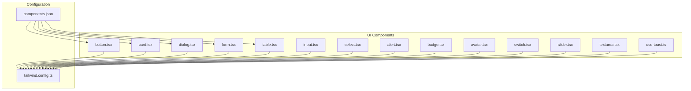
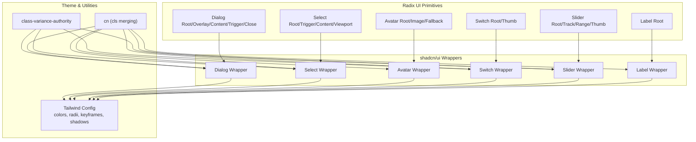
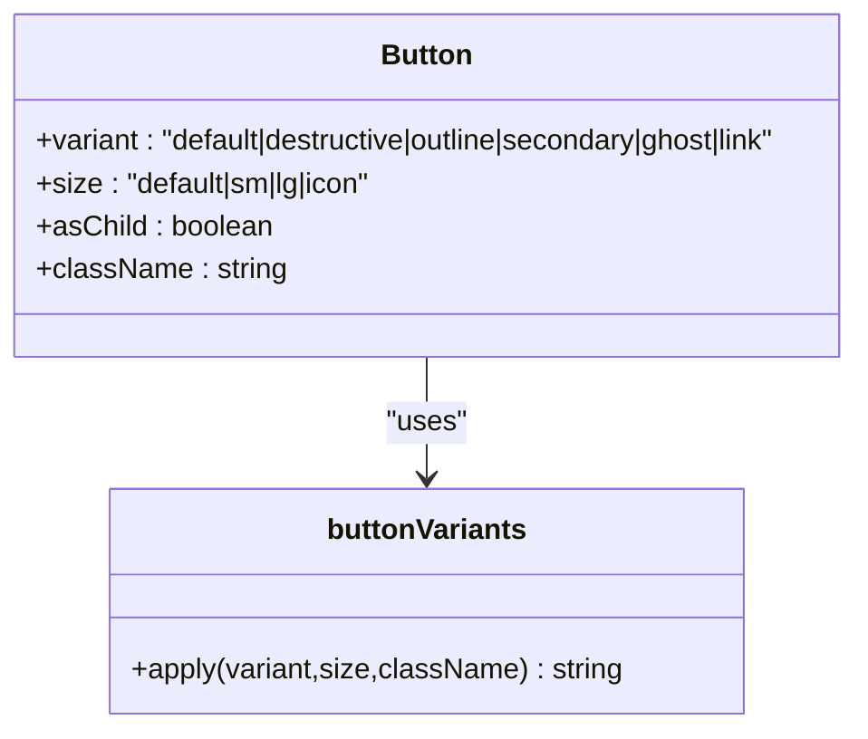
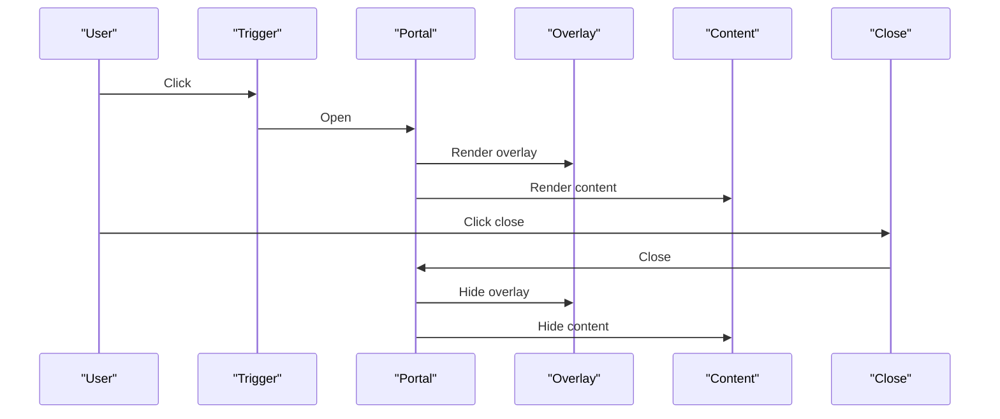
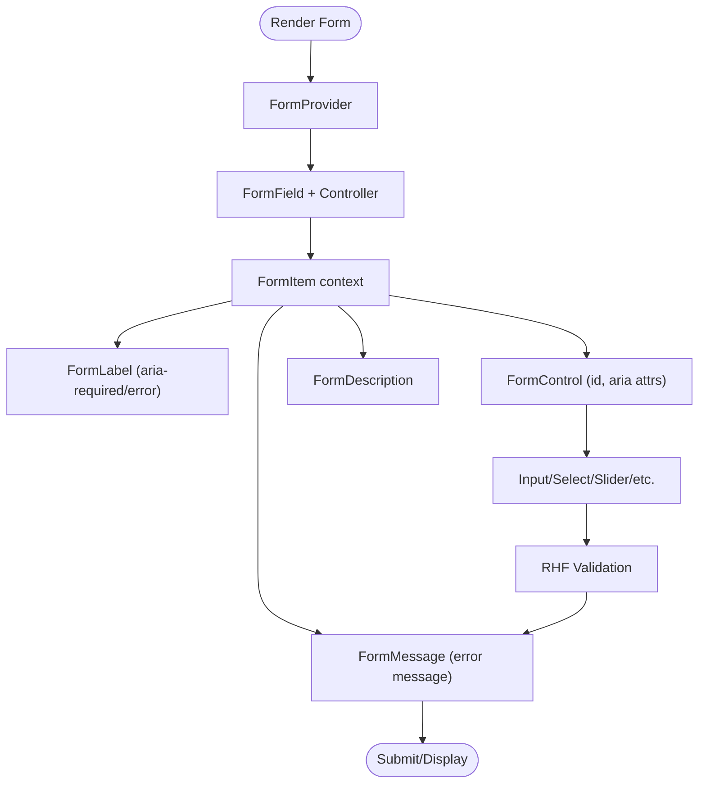
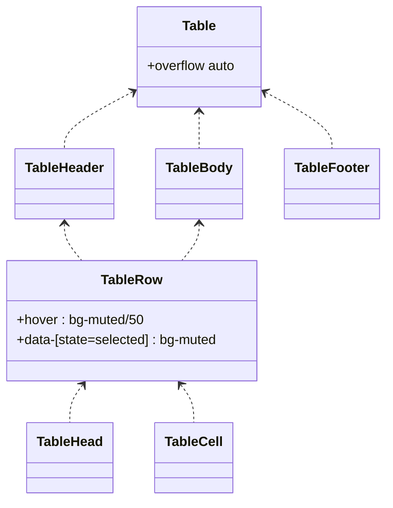
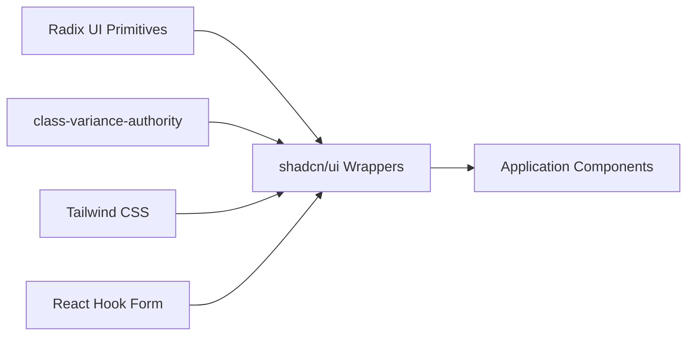

# UI Components

<cite>
**Referenced Files in This Document**
- [button.tsx](file://personalSite/src/components/ui/button.tsx)
- [card.tsx](file://personalSite/src/components/ui/card.tsx)
- [dialog.tsx](file://personalSite/src/components/ui/dialog.tsx)
- [form.tsx](file://personalSite/src/components/ui/form.tsx)
- [table.tsx](file://personalSite/src/components/ui/table.tsx)
- [input.tsx](file://personalSite/src/components/ui/input.tsx)
- [select.tsx](file://personalSite/src/components/ui/select.tsx)
- [alert.tsx](file://personalSite/src/components/ui/alert.tsx)
- [badge.tsx](file://personalSite/src/components/ui/badge.tsx)
- [avatar.tsx](file://personalSite/src/components/ui/avatar.tsx)
- [switch.tsx](file://personalSite/src/components/ui/switch.tsx)
- [slider.tsx](file://personalSite/src/components/ui/slider.tsx)
- [textarea.tsx](file://personalSite/src/components/ui/textarea.tsx)
- [tailwind.config.ts](file://personalSite/tailwind.config.ts)
- [components.json](file://personalSite/components.json)
- [use-toast.ts](file://personalSite/src/components/ui/use-toast.ts)
</cite>

## Table of Contents
1. [Introduction](#introduction)
2. [Project Structure](#project-structure)
3. [Core Components](#core-components)
4. [Architecture Overview](#architecture-overview)
5. [Detailed Component Analysis](#detailed-component-analysis)
6. [Dependency Analysis](#dependency-analysis)
7. [Performance Considerations](#performance-considerations)
8. [Troubleshooting Guide](#troubleshooting-guide)
9. [Conclusion](#conclusion)
10. [Appendices](#appendices)

## Introduction
This document describes the UI component library built with shadcn/ui in the personal site. It explains the component architecture, customization via Tailwind CSS, integration with Radix UI primitives, form components with React Hook Form, modal dialogs with accessibility, data display components such as tables and cards, theming and responsive design patterns, and animations. Practical usage guidance and best practices are included to maintain consistency across the application’s UI.

## Project Structure
The UI components live under personalSite/src/components/ui and are configured to use shadcn/ui defaults with a custom Tailwind setup. The configuration aliases the components and UI folders to simplify imports and centralize utilities.



**Diagram sources**
- [button.tsx](file://personalSite/src/components/ui/button.tsx#L1-L48)
- [card.tsx](file://personalSite/src/components/ui/card.tsx#L1-L44)
- [dialog.tsx](file://personalSite/src/components/ui/dialog.tsx#L1-L98)
- [form.tsx](file://personalSite/src/components/ui/form.tsx#L1-L130)
- [table.tsx](file://personalSite/src/components/ui/table.tsx#L1-L73)
- [input.tsx](file://personalSite/src/components/ui/input.tsx#L1-L23)
- [select.tsx](file://personalSite/src/components/ui/select.tsx#L1-L144)
- [alert.tsx](file://personalSite/src/components/ui/alert.tsx#L1-L44)
- [badge.tsx](file://personalSite/src/components/ui/badge.tsx#L1-L30)
- [avatar.tsx](file://personalSite/src/components/ui/avatar.tsx#L1-L39)
- [switch.tsx](file://personalSite/src/components/ui/switch.tsx#L1-L28)
- [slider.tsx](file://personalSite/src/components/ui/slider.tsx#L1-L24)
- [textarea.tsx](file://personalSite/src/components/ui/textarea.tsx#L1-L22)
- [use-toast.ts](file://personalSite/src/components/ui/use-toast.ts#L1-L4)
- [tailwind.config.ts](file://personalSite/tailwind.config.ts#L1-L117)
- [components.json](file://personalSite/components.json#L1-L21)

**Section sources**
- [tailwind.config.ts](file://personalSite/tailwind.config.ts#L1-L117)
- [components.json](file://personalSite/components.json#L1-L21)

## Core Components
This section highlights the foundational building blocks of the UI library and how they integrate with Tailwind and Radix UI.

- Button
  - Implements variant and size scales using class variance authority and supports rendering as a child element for composition.
  - Uses semantic ring and focus styles aligned with the theme.
  - Reference: [button.tsx](file://personalSite/src/components/ui/button.tsx#L1-L48)

- Card
  - Provides a flexible card container with header, title, description, content, and footer slots.
  - Inherits theme tokens for background and foreground.
  - Reference: [card.tsx](file://personalSite/src/components/ui/card.tsx#L1-L44)

- Dialog
  - Wraps Radix UI Dialog primitives with animated overlay and content, including close trigger and portal rendering.
  - Includes header, footer, title, and description helpers.
  - Reference: [dialog.tsx](file://personalSite/src/components/ui/dialog.tsx#L1-L98)

- Form
  - Integrates React Hook Form with shadcn/ui form semantics: Form, FormField, FormItem, FormLabel, FormControl, FormDescription, FormMessage, and useFormField.
  - Manages aria attributes and error propagation.
  - Reference: [form.tsx](file://personalSite/src/components/ui/form.tsx#L1-L130)

- Table
  - Responsive table wrapper with overflow handling and themed head/body/footer/row/cell elements.
  - Reference: [table.tsx](file://personalSite/src/components/ui/table.tsx#L1-L73)

- Inputs and Controls
  - Input, Textarea, Select, Switch, Slider, Checkbox, Radio Group, Toggle, Toggle Group, Tooltip, Hover Card, Progress, Skeleton, Aspect Ratio, Avatar, Badge, Alert, and others follow similar patterns: thin wrappers around Radix UI or native elements with Tailwind classes and optional variants.
  - References:
    - [input.tsx](file://personalSite/src/components/ui/input.tsx#L1-L23)
    - [select.tsx](file://personalSite/src/components/ui/select.tsx#L1-L144)
    - [switch.tsx](file://personalSite/src/components/ui/switch.tsx#L1-L28)
    - [slider.tsx](file://personalSite/src/components/ui/slider.tsx#L1-L24)
    - [textarea.tsx](file://personalSite/src/components/ui/textarea.tsx#L1-L22)

**Section sources**
- [button.tsx](file://personalSite/src/components/ui/button.tsx#L1-L48)
- [card.tsx](file://personalSite/src/components/ui/card.tsx#L1-L44)
- [dialog.tsx](file://personalSite/src/components/ui/dialog.tsx#L1-L98)
- [form.tsx](file://personalSite/src/components/ui/form.tsx#L1-L130)
- [table.tsx](file://personalSite/src/components/ui/table.tsx#L1-L73)
- [input.tsx](file://personalSite/src/components/ui/input.tsx#L1-L23)
- [select.tsx](file://personalSite/src/components/ui/select.tsx#L1-L144)
- [switch.tsx](file://personalSite/src/components/ui/switch.tsx#L1-L28)
- [slider.tsx](file://personalSite/src/components/ui/slider.tsx#L1-L24)
- [textarea.tsx](file://personalSite/src/components/ui/textarea.tsx#L1-L22)

## Architecture Overview
The UI library follows a consistent pattern:
- Each component is a small, focused wrapper around Radix UI primitives or native HTML elements.
- Variants and sizes are defined with class-variance-authority to keep styles centralized.
- Tailwind utility classes apply theme tokens and responsive modifiers.
- Form components use React Hook Form’s context and controller APIs to wire up validation and accessibility.



**Diagram sources**
- [dialog.tsx](file://personalSite/src/components/ui/dialog.tsx#L1-L98)
- [select.tsx](file://personalSite/src/components/ui/select.tsx#L1-L144)
- [avatar.tsx](file://personalSite/src/components/ui/avatar.tsx#L1-L39)
- [switch.tsx](file://personalSite/src/components/ui/switch.tsx#L1-L28)
- [slider.tsx](file://personalSite/src/components/ui/slider.tsx#L1-L24)
- [tailwind.config.ts](file://personalSite/tailwind.config.ts#L1-L117)

## Detailed Component Analysis

### Button
- Purpose: Unified button with variants (default, destructive, outline, secondary, ghost, link) and sizes (default, sm, lg, icon).
- Implementation: Uses class-variance-authority for variants, forwardRef for DOM access, and accepts an asChild prop to render as another component.
- Theming: Inherits primary/secondary/muted/accent palette tokens and focus/ring styles.
- Accessibility: Supports focus-visible outlines and disabled states.



**Diagram sources**
- [button.tsx](file://personalSite/src/components/ui/button.tsx#L7-L31)

**Section sources**
- [button.tsx](file://personalSite/src/components/ui/button.tsx#L1-L48)

### Dialog
- Purpose: Modal dialog with animated overlay and content, close trigger, and portal rendering.
- Implementation: Exposes Root, Portal, Overlay, Content, Trigger, Close, Header, Footer, Title, Description.
- Accessibility: Uses Radix UI semantics; includes screen-reader-friendly close label.
- Animation: Uses Tailwind transitions and data-state attributes for enter/exit animations.



**Diagram sources**
- [dialog.tsx](file://personalSite/src/components/ui/dialog.tsx#L1-L98)

**Section sources**
- [dialog.tsx](file://personalSite/src/components/ui/dialog.tsx#L1-L98)

### Form (React Hook Form Integration)
- Purpose: Provide a typed, accessible form layer that integrates with React Hook Form.
- Implementation: Form provider, FormField controller, FormItem context, FormLabel, FormControl, FormDescription, FormMessage, and useFormField hook.
- Accessibility: Automatically sets aria-describedby and aria-invalid based on field state.
- Usage pattern: Wrap forms with Form, compose FormField with Controller, and render inputs via FormControl.



**Diagram sources**
- [form.tsx](file://personalSite/src/components/ui/form.tsx#L1-L130)

**Section sources**
- [form.tsx](file://personalSite/src/components/ui/form.tsx#L1-L130)

### Table
- Purpose: Responsive data table with themed header/body/footer and row/cell helpers.
- Implementation: Table wrapper ensures horizontal scrolling on small screens; rows support hover and selection states.
- Theming: Uses muted backgrounds and accent borders consistent with the theme.



**Diagram sources**
- [table.tsx](file://personalSite/src/components/ui/table.tsx#L5-L71)

**Section sources**
- [table.tsx](file://personalSite/src/components/ui/table.tsx#L1-L73)

### Input, Textarea, Select, Switch, Slider
- Purpose: Consistent input controls with theme-aware styling and accessible behavior.
- Implementation: Thin wrappers around Radix UI or native elements; expose variant-like styling where applicable.
- Theming: Use input/background/muted/accent tokens; focus-visible rings; disabled states.

```mermaid
classDiagram
class Input {
+type : string
+className : string
}
class Textarea
class Select
class Switch
class Slider
Input --> TW["Tailwind Classes"]
Textarea --> TW
Select --> TW
Switch --> TW
Slider --> TW
```

**Diagram sources**
- [input.tsx](file://personalSite/src/components/ui/input.tsx#L1-L23)
- [textarea.tsx](file://personalSite/src/components/ui/textarea.tsx#L1-L22)
- [select.tsx](file://personalSite/src/components/ui/select.tsx#L1-L144)
- [switch.tsx](file://personalSite/src/components/ui/switch.tsx#L1-L28)
- [slider.tsx](file://personalSite/src/components/ui/slider.tsx#L1-L24)

**Section sources**
- [input.tsx](file://personalSite/src/components/ui/input.tsx#L1-L23)
- [textarea.tsx](file://personalSite/src/components/ui/textarea.tsx#L1-L22)
- [select.tsx](file://personalSite/src/components/ui/select.tsx#L1-L144)
- [switch.tsx](file://personalSite/src/components/ui/switch.tsx#L1-L28)
- [slider.tsx](file://personalSite/src/components/ui/slider.tsx#L1-L24)

### Additional Components (Overview)
- Avatar: Image with fallback and rounded-full sizing.
- Badge: Lightweight indicator with variant tokens.
- Alert: Contextual message with optional destructive variant.
- Others: Many more components follow the same pattern—Radix UI primitives wrapped with Tailwind classes and optional variants.

References:
- [avatar.tsx](file://personalSite/src/components/ui/avatar.tsx#L1-L39)
- [badge.tsx](file://personalSite/src/components/ui/badge.tsx#L1-L30)
- [alert.tsx](file://personalSite/src/components/ui/alert.tsx#L1-L44)

**Section sources**
- [avatar.tsx](file://personalSite/src/components/ui/avatar.tsx#L1-L39)
- [badge.tsx](file://personalSite/src/components/ui/badge.tsx#L1-L30)
- [alert.tsx](file://personalSite/src/components/ui/alert.tsx#L1-L44)

## Dependency Analysis
- Radix UI: Dialog, Select, Avatar, Switch, Slider, Label, and many other primitives are used directly to ensure accessibility and composability.
- class-variance-authority: Centralizes variant definitions for buttons, badges, alerts, and similar components.
- Tailwind CSS: Provides color tokens, spacing, typography, shadows, and animations; configured with CSS variables and plugins.
- React Hook Form: Integrated via FormProvider and Controller to manage form state and validation.



**Diagram sources**
- [dialog.tsx](file://personalSite/src/components/ui/dialog.tsx#L1-L98)
- [select.tsx](file://personalSite/src/components/ui/select.tsx#L1-L144)
- [button.tsx](file://personalSite/src/components/ui/button.tsx#L1-L48)
- [badge.tsx](file://personalSite/src/components/ui/badge.tsx#L1-L30)
- [alert.tsx](file://personalSite/src/components/ui/alert.tsx#L1-L44)
- [form.tsx](file://personalSite/src/components/ui/form.tsx#L1-L130)
- [tailwind.config.ts](file://personalSite/tailwind.config.ts#L1-L117)

**Section sources**
- [tailwind.config.ts](file://personalSite/tailwind.config.ts#L1-L117)
- [components.json](file://personalSite/components.json#L1-L21)

## Performance Considerations
- Prefer variant props over ad hoc class concatenation to reduce runtime computation.
- Use forwardRef to avoid unnecessary re-renders and to pass refs efficiently to underlying elements.
- Keep animations minimal and scoped; leverage Tailwind’s data-state-driven transitions.
- Defer heavy computations inside controlled components; use memoization where appropriate.
- Ensure responsive utilities are scoped to breakpoints to avoid layout thrashing.

## Troubleshooting Guide
- Dialog does not close or overlay remains visible
  - Verify Portal rendering and that Close triggers are reachable.
  - Reference: [dialog.tsx](file://personalSite/src/components/ui/dialog.tsx#L35-L53)

- Form validation not reflected in labels or messages
  - Ensure Form, FormField, and useFormField are used together and FormControl wraps the input.
  - Reference: [form.tsx](file://personalSite/src/components/ui/form.tsx#L20-L54)

- Focus ring or accessibility attributes missing
  - Confirm focus-visible outlines and aria-* attributes are applied by components.
  - References:
    - [button.tsx](file://personalSite/src/components/ui/button.tsx#L7-L31)
    - [form.tsx](file://personalSite/src/components/ui/form.tsx#L85-L99)

- Toast not appearing
  - Ensure use-toast is imported and toast is called from the hook.
  - Reference: [use-toast.ts](file://personalSite/src/components/ui/use-toast.ts#L1-L4)

**Section sources**
- [dialog.tsx](file://personalSite/src/components/ui/dialog.tsx#L35-L53)
- [form.tsx](file://personalSite/src/components/ui/form.tsx#L20-L54)
- [button.tsx](file://personalSite/src/components/ui/button.tsx#L7-L31)
- [use-toast.ts](file://personalSite/src/components/ui/use-toast.ts#L1-L4)

## Conclusion
The UI component library leverages shadcn/ui conventions with Radix UI primitives and Tailwind CSS for a cohesive, accessible, and themeable design system. Form integration with React Hook Form streamlines validation and accessibility. Dialogs, tables, cards, and input controls follow consistent patterns that promote maintainability and scalability across the application.

## Appendices

### Theming and Tailwind Configuration
- Color tokens: primary, secondary, destructive, muted, accent, popover, card, background/foreground, sidebar, chart, and neon palettes.
- Border radius scale: lg, md, sm mapped to CSS variables.
- Animations: accordion, shimmer, glow-pulse; shadows: glow-sm, glow, glow-lg, glow-purple.
- Plugins: tailwindcss-animate enabled.

**Section sources**
- [tailwind.config.ts](file://personalSite/tailwind.config.ts#L15-L116)

### shadcn/ui Setup
- Style: default
- TSX: enabled
- Tailwind: config path, CSS file, base color, CSS variables
- Aliases: components, utils, ui, lib, hooks

**Section sources**
- [components.json](file://personalSite/components.json#L1-L21)