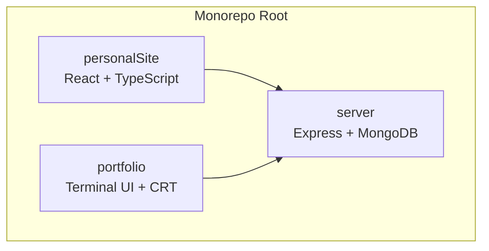
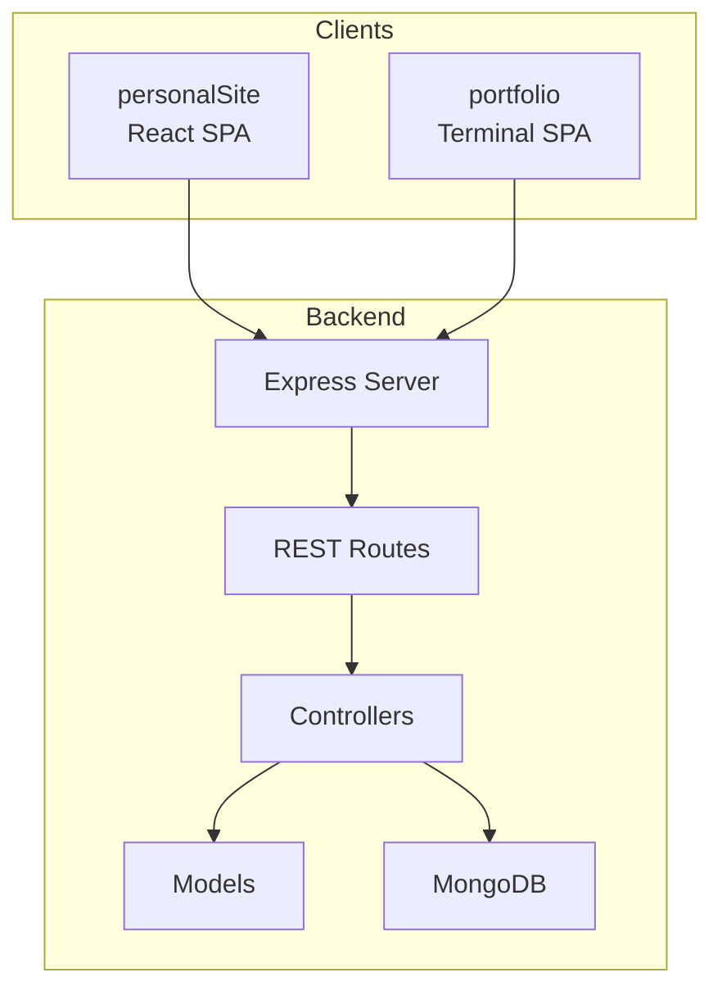
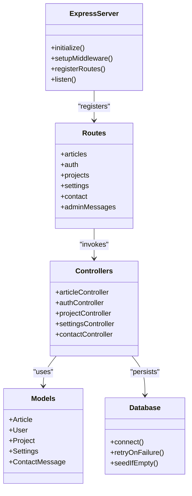
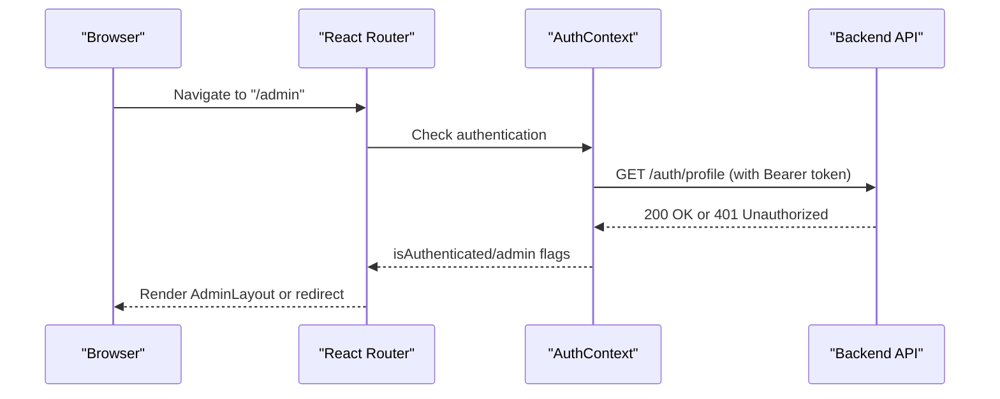
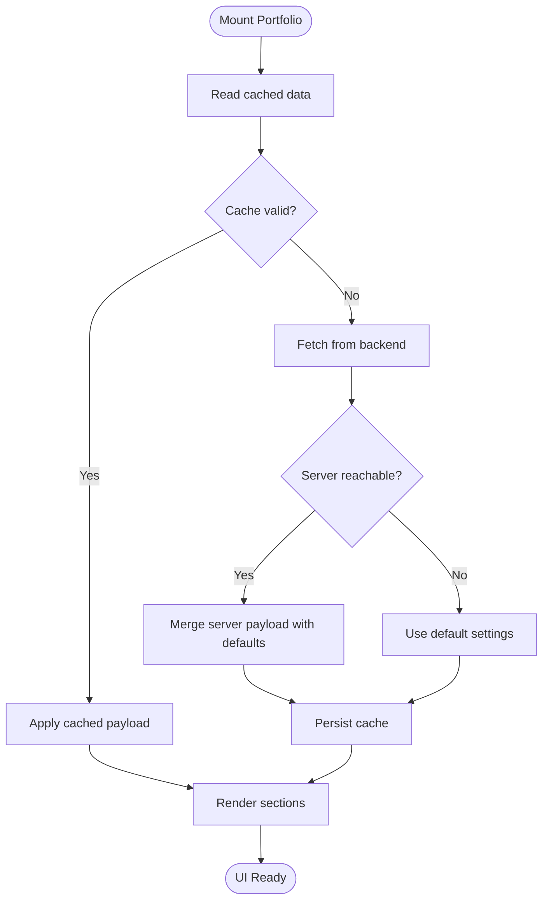
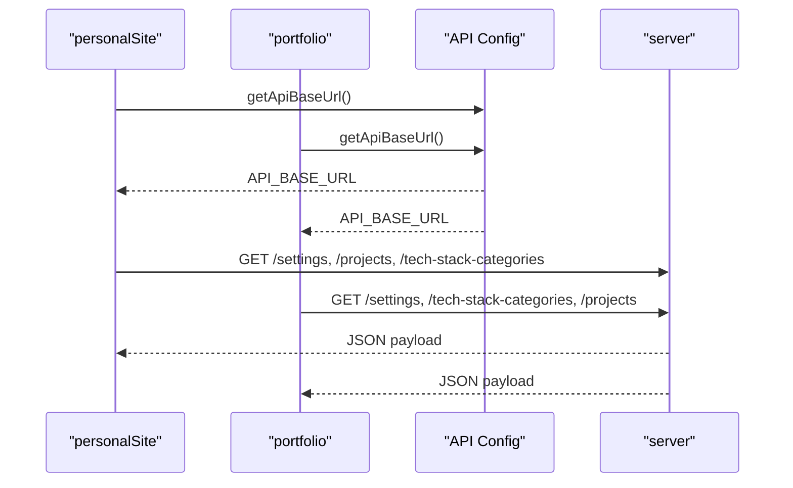
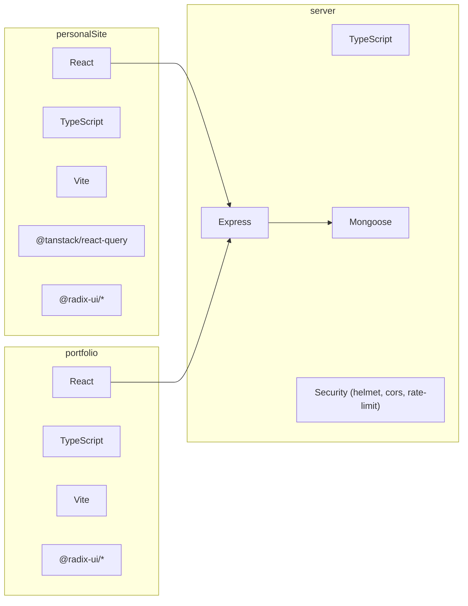

# Architecture Overview

<cite>
**Referenced Files in This Document**
- [personalSite/package.json](file://personalSite/package.json)
- [portfolio/package.json](file://portfolio/package.json)
- [server/package.json](file://server/package.json)
- [personalSite/src/App.tsx](file://personalSite/src/App.tsx)
- [portfolio/src/App.tsx](file://portfolio/src/App.tsx)
- [server/src/index.ts](file://server/src/index.ts)
- [personalSite/src/lib/apiConfig.ts](file://personalSite/src/lib/apiConfig.ts)
- [portfolio/src/lib/apiConfig.ts](file://portfolio/src/lib/apiConfig.ts)
- [server/src/config/database.ts](file://server/src/config/database.ts)
- [personalSite/src/contexts/AuthContext.tsx](file://personalSite/src/contexts/AuthContext.tsx)
- [portfolio/src/hooks/use-portfolio-data.ts](file://portfolio/src/hooks/use-portfolio-data.ts)
- [server/src/controllers/articleController.ts](file://server/src/controllers/articleController.ts)
- [server/src/routes/articles.ts](file://server/src/routes/articles.ts)
- [server/src/models/Article.ts](file://server/src/models/Article.ts)
- [personalSite/vite.config.ts](file://personalSite/vite.config.ts)
- [portfolio/vite.config.ts](file://portfolio/vite.config.ts)
- [server/tsconfig.json](file://server/tsconfig.json)
- [personalSite/tsconfig.json](file://personalSite/tsconfig.json)
</cite>

## Table of Contents
1. [Introduction](#introduction)
2. [Project Structure](#project-structure)
3. [Core Components](#core-components)
4. [Architecture Overview](#architecture-overview)
5. [Detailed Component Analysis](#detailed-component-analysis)
6. [Dependency Analysis](#dependency-analysis)
7. [Performance Considerations](#performance-considerations)
8. [Troubleshooting Guide](#troubleshooting-guide)
9. [Conclusion](#conclusion)

## Introduction
This document describes the Personal Portfolio Platform’s system design as a monorepo containing three applications:
- personalSite: Modern React/TypeScript frontend with component-based architecture and admin capabilities
- portfolio: Retro terminal-style React/TypeScript frontend with CRT effects and local caching
- server: Node.js/Express backend implementing REST APIs with MongoDB persistence

The system follows RESTful API communication between frontends and the backend, with distinct presentation approaches: a contemporary web interface and a nostalgic terminal aesthetic. The backend adheres to layered architecture (MVC-like separation of concerns) with explicit controllers, routes, middleware, and models.

## Project Structure
The repository is organized as a monorepo with three top-level applications sharing a unified configuration and deployment strategy:
- personalSite: Next-generation web UI with admin panels, routing, and state management
- portfolio: Retro terminal UI with animated CRT overlays and local-first caching
- server: Express-based backend with TypeScript, Mongoose, and modular routes/controllers

**Diagram sources**
- [personalSite/src/App.tsx](file://personalSite/src/App.tsx#L141-L356)
- [portfolio/src/App.tsx](file://portfolio/src/App.tsx#L41-L141)
- [server/src/index.ts](file://server/src/index.ts#L1-L158)

**Section sources**
- [personalSite/package.json](file://personalSite/package.json#L1-L113)
- [portfolio/package.json](file://portfolio/package.json#L1-L74)
- [server/package.json](file://server/package.json#L1-L40)

## Core Components
- Backend entrypoint initializes Express, security middleware, CORS, rate limiting, and routes
- Frontend personalSite orchestrates routing, lazy loading, protected admin routes, and global providers
- Frontend portfolio renders a terminal-inspired layout with CRT overlays and local caching
- Shared API configuration centralizes base URLs for cross-environment usage
- Database connectivity with automatic retry and seeding for resilience

Key implementation references:
- Backend bootstrap and middleware chain: [server/src/index.ts](file://server/src/index.ts#L24-L155)
- Frontend routing and transitions: [personalSite/src/App.tsx](file://personalSite/src/App.tsx#L141-L356)
- Terminal UI orchestration: [portfolio/src/App.tsx](file://portfolio/src/App.tsx#L41-L141)
- API base URL resolution: [personalSite/src/lib/apiConfig.ts](file://personalSite/src/lib/apiConfig.ts#L6-L52), [portfolio/src/lib/apiConfig.ts](file://portfolio/src/lib/apiConfig.ts#L6-L18)
- Database connectivity and retry: [server/src/config/database.ts](file://server/src/config/database.ts#L6-L56)

**Section sources**
- [server/src/index.ts](file://server/src/index.ts#L24-L155)
- [personalSite/src/App.tsx](file://personalSite/src/App.tsx#L141-L356)
- [portfolio/src/App.tsx](file://portfolio/src/App.tsx#L41-L141)
- [personalSite/src/lib/apiConfig.ts](file://personalSite/src/lib/apiConfig.ts#L6-L52)
- [portfolio/src/lib/apiConfig.ts](file://portfolio/src/lib/apiConfig.ts#L6-L18)
- [server/src/config/database.ts](file://server/src/config/database.ts#L6-L56)

## Architecture Overview
The system employs a client-server REST architecture:
- personalSite consumes backend endpoints via centralized API configuration and provides admin dashboards
- portfolio consumes the same backend endpoints, with local caching and fallbacks
- server exposes REST endpoints grouped by domain resources and enforces authentication and authorization

**Diagram sources**
- [server/src/index.ts](file://server/src/index.ts#L99-L116)
- [server/src/routes/articles.ts](file://server/src/routes/articles.ts#L32-L53)
- [server/src/controllers/articleController.ts](file://server/src/controllers/articleController.ts#L6-L39)
- [server/src/models/Article.ts](file://server/src/models/Article.ts#L16-L58)
- [server/src/config/database.ts](file://server/src/config/database.ts#L14-L44)

## Detailed Component Analysis

### Backend: REST API Layer
The backend implements a layered architecture:
- Routes define endpoint groups and attach middleware for authentication and admin-only access
- Controllers encapsulate business logic and data operations
- Models define schema and indexes for MongoDB collections
- Middleware handles security, CORS, rate limiting, and request parsing

**Diagram sources**
- [server/src/index.ts](file://server/src/index.ts#L24-L116)
- [server/src/routes/articles.ts](file://server/src/routes/articles.ts#L32-L53)
- [server/src/controllers/articleController.ts](file://server/src/controllers/articleController.ts#L6-L39)
- [server/src/models/Article.ts](file://server/src/models/Article.ts#L16-L58)
- [server/src/config/database.ts](file://server/src/config/database.ts#L6-L56)

**Section sources**
- [server/src/index.ts](file://server/src/index.ts#L24-L116)
- [server/src/routes/articles.ts](file://server/src/routes/articles.ts#L32-L53)
- [server/src/controllers/articleController.ts](file://server/src/controllers/articleController.ts#L6-L39)
- [server/src/models/Article.ts](file://server/src/models/Article.ts#L16-L58)
- [server/src/config/database.ts](file://server/src/config/database.ts#L6-L56)

### Frontend: personalSite (Modern Web)
Key characteristics:
- Component-based architecture with Radix UI primitives and shadcn/ui
- React Router v6 with lazy-loaded routes and protected admin sections
- Global providers for authentication, settings, and React Query
- Vite proxy configuration for seamless API integration

**Diagram sources**
- [personalSite/src/App.tsx](file://personalSite/src/App.tsx#L254-L343)
- [personalSite/src/contexts/AuthContext.tsx](file://personalSite/src/contexts/AuthContext.tsx#L58-L76)
- [personalSite/src/contexts/AuthContext.tsx](file://personalSite/src/contexts/AuthContext.tsx#L78-L99)

**Section sources**
- [personalSite/src/App.tsx](file://personalSite/src/App.tsx#L141-L356)
- [personalSite/src/contexts/AuthContext.tsx](file://personalSite/src/contexts/AuthContext.tsx#L36-L140)
- [personalSite/vite.config.ts](file://personalSite/vite.config.ts#L18-L25)

### Frontend: portfolio (Terminal UI)
Key characteristics:
- CRT overlays and scanline effects for a retro terminal feel
- Local-first caching with TTL and stale-while-revalidate semantics
- Single-page navigation with animated sweeps and section spy
- Minimal external dependencies for a lightweight terminal experience

**Diagram sources**
- [portfolio/src/App.tsx](file://portfolio/src/App.tsx#L41-L141)
- [portfolio/src/hooks/use-portfolio-data.ts](file://portfolio/src/hooks/use-portfolio-data.ts#L136-L224)

**Section sources**
- [portfolio/src/App.tsx](file://portfolio/src/App.tsx#L41-L141)
- [portfolio/src/hooks/use-portfolio-data.ts](file://portfolio/src/hooks/use-portfolio-data.ts#L136-L224)

### API Communication and Data Flow
- Both frontends resolve API base URLs from environment variables
- personalSite uses centralized configuration for API base URL resolution
- portfolio normalizes and validates API base URL with strict error handling
- Frontends issue HTTP requests to backend endpoints; server responds with JSON payloads

**Diagram sources**
- [personalSite/src/lib/apiConfig.ts](file://personalSite/src/lib/apiConfig.ts#L6-L52)
- [portfolio/src/lib/apiConfig.ts](file://portfolio/src/lib/apiConfig.ts#L6-L18)
- [server/src/index.ts](file://server/src/index.ts#L99-L116)

**Section sources**
- [personalSite/src/lib/apiConfig.ts](file://personalSite/src/lib/apiConfig.ts#L6-L52)
- [portfolio/src/lib/apiConfig.ts](file://portfolio/src/lib/apiConfig.ts#L6-L18)
- [server/src/index.ts](file://server/src/index.ts#L99-L116)

## Dependency Analysis
Technology stacks and module boundaries:
- personalSite: React 18, TypeScript, Vite, Tailwind CSS, @tanstack/react-query, radix-ui
- portfolio: React 19, TypeScript, Vite, radix-ui, minimal DOM-focused libraries
- server: Express, TypeScript, Mongoose, bcrypt, helmet, cors, express-rate-limit, jsonwebtoken, nodemailer

**Diagram sources**
- [personalSite/package.json](file://personalSite/package.json#L15-L74)
- [portfolio/package.json](file://portfolio/package.json#L11-L59)
- [server/package.json](file://server/package.json#L12-L26)

**Section sources**
- [personalSite/package.json](file://personalSite/package.json#L15-L74)
- [portfolio/package.json](file://portfolio/package.json#L11-L59)
- [server/package.json](file://server/package.json#L12-L26)

## Performance Considerations
- personalSite
  - Vite build with esbuild minification and manual chunk splitting for vendor/UI bundles
  - React.lazy for code-splitting and route-level chunks
  - react-snap for prerendering selected routes to improve initial load
- portfolio
  - Local caching with TTL and stale-while-revalidate reduces network requests
  - Minimal dependencies reduce bundle size and render overhead
- server
  - MongoDB connection pooling and retry logic improve resilience
  - Rate limiting and helmet enhance security and stability under load
  - Express JSON/URL-encoded limits prevent oversized payloads

Recommendations:
- Monitor database connection health and consider connection pooling tuning
- Implement CDN for static assets served by both frontends
- Add client-side caching strategies for frequently accessed endpoints
- Consider background revalidation for portfolio data to keep cached content fresh

**Section sources**
- [personalSite/vite.config.ts](file://personalSite/vite.config.ts#L40-L60)
- [portfolio/src/hooks/use-portfolio-data.ts](file://portfolio/src/hooks/use-portfolio-data.ts#L30-L32)
- [server/src/config/database.ts](file://server/src/config/database.ts#L14-L18)
- [server/src/index.ts](file://server/src/index.ts#L88-L93)

## Troubleshooting Guide
Common issues and diagnostics:
- API base URL misconfiguration
  - Verify environment variables for both frontends and ensure normalization
  - Check centralized API configuration resolution
- Authentication failures
  - Confirm token presence and validity checks against backend profile endpoint
  - Review bearer token header usage in auth requests
- Database connectivity problems
  - Inspect connection logs and retry behavior
  - Validate MongoDB URI and network accessibility
- CORS errors
  - Ensure allowed origins include frontend hosts and credentials are enabled when required
- Rate limiting
  - Review rate limit thresholds and adjust for staging vs production environments

**Section sources**
- [personalSite/src/lib/apiConfig.ts](file://personalSite/src/lib/apiConfig.ts#L6-L52)
- [portfolio/src/lib/apiConfig.ts](file://portfolio/src/lib/apiConfig.ts#L6-L18)
- [personalSite/src/contexts/AuthContext.tsx](file://personalSite/src/contexts/AuthContext.tsx#L58-L76)
- [server/src/config/database.ts](file://server/src/config/database.ts#L27-L44)
- [server/src/index.ts](file://server/src/index.ts#L38-L85)
- [server/src/index.ts](file://server/src/index.ts#L88-L93)

## Conclusion
The Personal Portfolio Platform demonstrates a clean separation of concerns across a monorepo:
- personalSite delivers a modern, component-based React experience with admin capabilities
- portfolio offers a distinctive terminal-style interface with robust local caching
- server provides a secure, layered REST backend with resilient database connectivity

The dual presentation approach showcases different UI paradigms while sharing a unified backend, enabling scalable growth and flexible deployment strategies. The architecture supports future enhancements such as additional clients, extended admin features, and improved caching strategies.