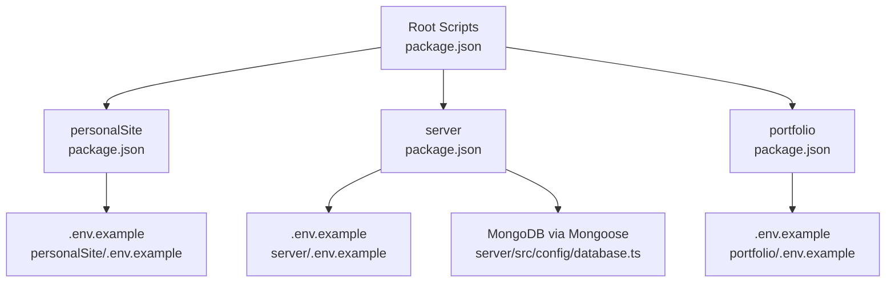

# Getting Started

<cite>
**Referenced Files in This Document**
- [README.md](file://README.md)
- [package.json](file://package.json)
- [.gitignore](file://.gitignore)
- [personalSite/package.json](file://personalSite/package.json)
- [personalSite/.env.example](file://personalSite/.env.example)
- [portfolio/package.json](file://portfolio/package.json)
- [portfolio/.env.example](file://portfolio/.env.example)
- [server/package.json](file://server/package.json)
- [server/.env.example](file://server/.env.example)
- [server/src/config/database.ts](file://server/src/config/database.ts)
- [server/src/index.ts](file://server/src/index.ts)
- [personalSite/.github/workflows/deploy.yml](file://personalSite/.github/workflows/deploy.yml)
- [portfolio/.github/workflows/deploy.yml](file://portfolio/.github/workflows/deploy.yml)
</cite>

## Table of Contents
1. [Introduction](#introduction)
2. [Project Structure](#project-structure)
3. [System Requirements](#system-requirements)
4. [Installation](#installation)
5. [Environment Variables](#environment-variables)
6. [Bootstrapping the Project](#bootstrapping-the-project)
7. [Running Applications](#running-applications)
8. [First-Time Setup](#first-time-setup)
9. [Common Setup Issues](#common-setup-issues)
10. [Troubleshooting Guide](#troubleshooting-guide)
11. [Conclusion](#conclusion)

## Introduction
This guide helps you install, configure, and run the Personal Portfolio Platform locally and in production. The platform consists of:
- personalSite: A React + TypeScript frontend built with Vite and shadcn/ui components.
- portfolio: An alternative portfolio frontend built with Vite.
- server: An Express + TypeScript backend with MongoDB via Mongoose.

It supports both development and production workflows, with pre-configured scripts to run the entire stack concurrently or individually.

**Section sources**
- [README.md](file://README.md#L1-L64)

## Project Structure
The repository is a monorepo with three applications and shared assets. The root orchestrates development and build scripts, while each app maintains its own dependencies and configuration.

**Diagram sources**
- [package.json](file://package.json#L6-L16)
- [personalSite/package.json](file://personalSite/package.json#L1-L113)
- [portfolio/package.json](file://portfolio/package.json#L1-L74)
- [server/package.json](file://server/package.json#L1-L40)
- [personalSite/.env.example](file://personalSite/.env.example#L1-L10)
- [portfolio/.env.example](file://portfolio/.env.example#L1-L3)
- [server/.env.example](file://server/.env.example#L1-L27)
- [server/src/config/database.ts](file://server/src/config/database.ts#L1-L61)

**Section sources**
- [README.md](file://README.md#L24-L46)
- [package.json](file://package.json#L6-L16)

## System Requirements
- Node.js: The backend workflow examples target Node.js 20. Use a compatible version for local development and CI consistency.
- Package manager: npm is used across scripts and workflows.
- MongoDB: Required for full functionality; the backend attempts to connect and seeds defaults if collections are empty.
- Ports: 
  - personalSite runs on the default Vite port.
  - portfolio runs on port 4000.
  - server runs on port 5000 by default (configurable via environment).

Note: The repository does not declare a Node.js engine requirement in the root package.json. Align your local Node.js version with the CI workflow (Node.js 20) to avoid discrepancies.

**Section sources**
- [personalSite/.github/workflows/deploy.yml](file://personalSite/.github/workflows/deploy.yml#L28-L33)
- [portfolio/.github/workflows/deploy.yml](file://portfolio/.github/workflows/deploy.yml#L28-L33)
- [server/src/config/database.ts](file://server/src/config/database.ts#L14-L18)
- [server/src/index.ts](file://server/src/index.ts#L26-L26)

## Installation
Follow these steps to prepare the monorepo locally:

1. Install root dependencies
   - From the repository root, run:
     - npm ci

2. Install application dependencies
   - personalSite:
     - cd personalSite && npm ci
   - portfolio:
     - cd portfolio && npm ci
   - server:
     - cd server && npm ci

3. Build applications (optional for development)
   - From the root:
     - npm run build
     - npm run build:portfolio

4. Start the backend
   - From the root:
     - cd server && npm run dev

5. Start the frontends
   - Option A: Run personalSite and server together
     - From the root:
       - npm run dev:personalSite
   - Option B: Run portfolio and server together
     - From the root:
       - npm run dev:portfolio

6. Start everything together
   - From the root:
     - npm run dev

**Section sources**
- [package.json](file://package.json#L6-L16)
- [personalSite/package.json](file://personalSite/package.json#L6-L14)
- [portfolio/package.json](file://portfolio/package.json#L5-L10)
- [server/package.json](file://server/package.json#L6-L11)

## Environment Variables
Configure environment variables for each app using the provided .env.example files. Copy each example to a .env file in the respective app directory and update values as needed.

- personalSite
  - Key variables:
    - VITE_API_BASE_URL: Base URL for the backend API.
    - VITE_GITHUB_USERNAME: Optional, for fetching repositories.
  - Reference:
    - [personalSite/.env.example](file://personalSite/.env.example#L1-L10)

- portfolio
  - Key variables:
    - VITE_API_BASE_URL: Base URL for the backend API.
    - VITE_API_BASE_URL_PROD: Production API base URL.
  - Reference:
    - [portfolio/.env.example](file://portfolio/.env.example#L1-L3)

- server
  - Key variables:
    - MONGODB_URI: MongoDB connection string.
    - JWT_SECRET: Secret for signing tokens.
    - PORT: Backend listening port.
    - FRONTEND_URL: Allowed origin(s) for CORS.
    - GITHUB_USERNAME and GITHUB_TOKEN: Optional GitHub integration.
    - ADMIN_EMAIL, SEND_AS_EMAIL, SEND_AS_NAME, GOOGLE_APP_PASSWORD: Contact form email delivery settings.
  - Reference:
    - [server/.env.example](file://server/.env.example#L1-L27)

- Root-level .env
  - The repository includes a root .env file. It is ignored by default (.gitignore) and can be used for root-level secrets if needed.
  - Reference:
    - [.gitignore](file://.gitignore#L14-L14)

Notes:
- personalSite requires VITE_ prefix for client-side variables.
- server loads environment variables via dotenv at startup.
- CORS behavior is controlled by FRONTEND_URL and optional CORS_ORIGINS.

**Section sources**
- [personalSite/.env.example](file://personalSite/.env.example#L1-L10)
- [portfolio/.env.example](file://portfolio/.env.example#L1-L3)
- [server/.env.example](file://server/.env.example#L1-L27)
- [.gitignore](file://.gitignore#L14-L14)

## Bootstrapping the Project
After installing dependencies and configuring environment variables:

1. Start the backend
   - From server:
     - npm run dev
   - The backend connects to MongoDB and seeds default data if collections are empty.

2. Start a frontend
   - personalSite:
     - From personalSite:
       - npm run dev
   - portfolio:
     - From portfolio:
       - npm run dev

3. Verify health
   - Access the backend health endpoint:
     - GET http://localhost:5000/health

4. Build for production (optional)
   - From root:
     - npm run build
     - npm run build:portfolio

**Section sources**
- [server/src/config/database.ts](file://server/src/config/database.ts#L23-L24)
- [server/src/index.ts](file://server/src/index.ts#L129-L131)
- [server/package.json](file://server/package.json#L6-L11)

## Running Applications
Choose one of the following approaches:

- Run personalSite with server
  - From root:
    - npm run dev:personalSite

- Run portfolio with server
  - From root:
    - npm run dev:portfolio

- Run all together
  - From root:
    - npm run dev

- Start server only
  - From server:
    - npm run dev

- Start personalSite only
  - From personalSite:
    - npm run dev

- Start portfolio only
  - From portfolio:
    - npm run dev

- Build and start server in production
  - From server:
    - npm run build
    - npm run start

- Build frontends
  - From root:
    - npm run build
    - npm run build:portfolio

**Section sources**
- [package.json](file://package.json#L6-L16)
- [personalSite/package.json](file://personalSite/package.json#L6-L14)
- [portfolio/package.json](file://portfolio/package.json#L5-L10)
- [server/package.json](file://server/package.json#L6-L11)

## First-Time Setup
Follow these steps to get the project running for the first time:

Development environment
1. Install dependencies
   - Root: npm ci
   - personalSite: cd personalSite && npm ci
   - portfolio: cd portfolio && npm ci
   - server: cd server && npm ci

2. Configure environment variables
   - Copy .env.example to .env in each app and set values:
     - personalSite/.env
     - portfolio/.env
     - server/.env

3. Start the backend
   - cd server && npm run dev

4. Start a frontend
   - cd personalSite && npm run dev
   - OR cd portfolio && npm run dev

5. Open the frontend in your browser and confirm the backend responds at /health.

Production environment
1. Build frontends
   - From root:
     - npm run build
     - npm run build:portfolio

2. Start server
   - From server:
     - npm run build
     - npm run start

3. Serve the built frontend static files from the dist directories of personalSite and portfolio.

Deployment automation
- GitHub Actions workflows are provided for building and deploying the frontends to external repositories. They use Node.js 20 and require secrets configured in your repository settings.

**Section sources**
- [package.json](file://package.json#L6-L16)
- [personalSite/.env.example](file://personalSite/.env.example#L1-L10)
- [portfolio/.env.example](file://portfolio/.env.example#L1-L3)
- [server/.env.example](file://server/.env.example#L1-L27)
- [personalSite/.github/workflows/deploy.yml](file://personalSite/.github/workflows/deploy.yml#L28-L33)
- [portfolio/.github/workflows/deploy.yml](file://portfolio/.github/workflows/deploy.yml#L28-L33)

## Common Setup Issues
- MongoDB connection fails
  - Symptom: Backend logs indicate connection errors or retries.
  - Resolution:
    - Ensure MongoDB is running locally or provide a valid MONGODB_URI.
    - Confirm the URI format and network accessibility.
    - The backend will attempt to reconnect automatically.

- CORS errors in the browser
  - Symptom: Requests blocked due to origin mismatch.
  - Resolution:
    - Set FRONTEND_URL or CORS_ORIGINS in server/.env to include your frontend origins.
    - For development, default origins are included; verify your frontend ports match expectations.

- Missing environment variables
  - Symptom: Unexpected behavior or runtime errors.
  - Resolution:
    - Copy .env.example to .env in each app and fill required values.
    - For personalSite, ensure VITE_API_BASE_URL points to the backend.

- Port conflicts
  - Symptom: Port 5000 or 4000 already in use.
  - Resolution:
    - Change PORT in server/.env or the portfolio port in portfolio/package.json scripts.

- Node.js version mismatch
  - Symptom: Build failures or unexpected behavior.
  - Resolution:
    - Use Node.js 20 to match CI workflows.

- Frontend not connecting to backend
  - Symptom: Network errors loading data.
  - Resolution:
    - Verify VITE_API_BASE_URL in personalSite/.env or portfolio/.env matches the backend URL.
    - Ensure the backend is running and reachable.

**Section sources**
- [server/src/config/database.ts](file://server/src/config/database.ts#L46-L55)
- [server/src/index.ts](file://server/src/index.ts#L38-L62)
- [server/.env.example](file://server/.env.example#L1-L27)
- [personalSite/.env.example](file://personalSite/.env.example#L1-L10)
- [portfolio/package.json](file://portfolio/package.json#L7-L7)

## Troubleshooting Guide
- Backend health check
  - Endpoint: GET http://localhost:5000/health
  - Purpose: Verify the server is running and logging status.

- Database connectivity
  - The backend logs connection status and attempts automatic reconnection on disconnect.
  - If persistent failures occur, review MONGODB_URI and network configuration.

- CORS configuration
  - The backend determines allowed origins dynamically based on environment and configuration.
  - Adjust FRONTEND_URL or CORS_ORIGINS to permit your frontend origins.

- Frontend build and deployment
  - personalSite build script generates SEO-friendly output and prerenders specific routes.
  - portfolio build script targets the dist directory for static hosting.

- Secrets and CI
  - Workflows expect secrets for deployment tokens and environment variables.
  - Ensure secrets are configured in your repository settings before running workflows.

**Section sources**
- [server/src/index.ts](file://server/src/index.ts#L129-L131)
- [server/src/config/database.ts](file://server/src/config/database.ts#L32-L44)
- [personalSite/package.json](file://personalSite/package.json#L8-L13)
- [portfolio/package.json](file://portfolio/package.json#L6-L6)
- [personalSite/.github/workflows/deploy.yml](file://personalSite/.github/workflows/deploy.yml#L40-L42)
- [portfolio/.github/workflows/deploy.yml](file://portfolio/.github/workflows/deploy.yml#L48-L50)

## Conclusion
You now have the essentials to install, configure, and run the Personal Portfolio Platform locally and in production. Use the provided scripts to orchestrate development, configure environment variables per app, and rely on the backend’s automatic database seeding and reconnection logic. For production, build the frontends and serve them alongside the server, and leverage the included GitHub Actions workflows for automated deployments.