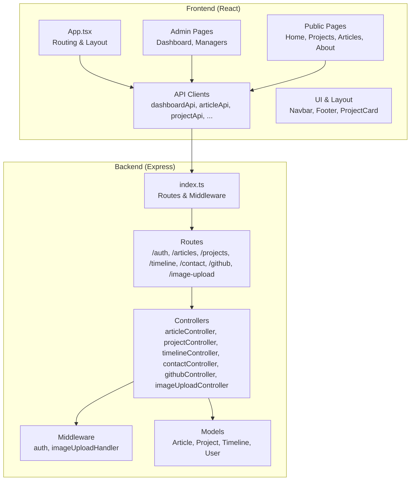
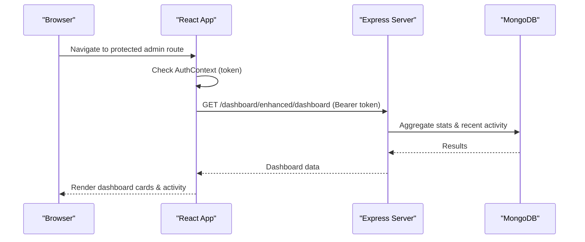
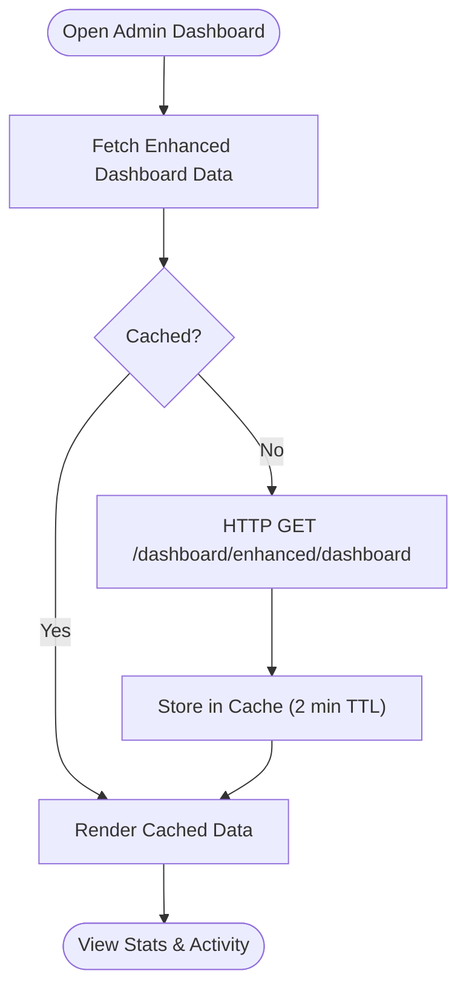
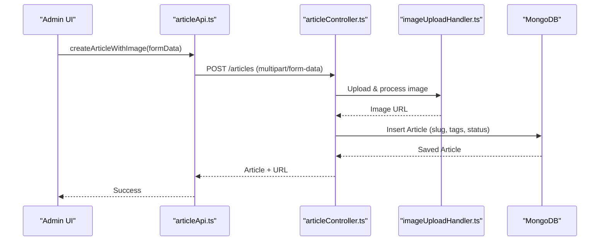
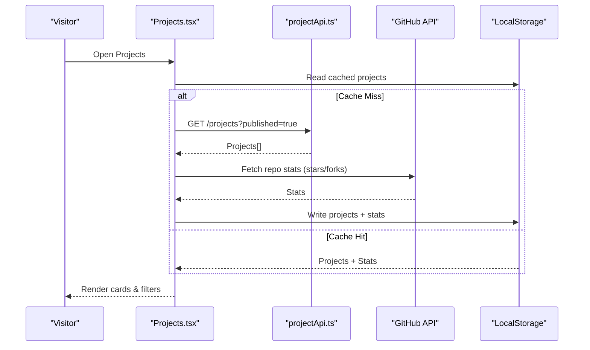
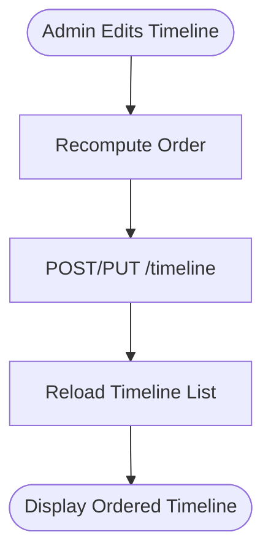
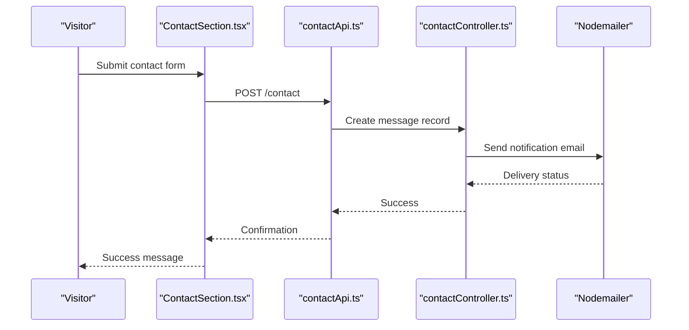
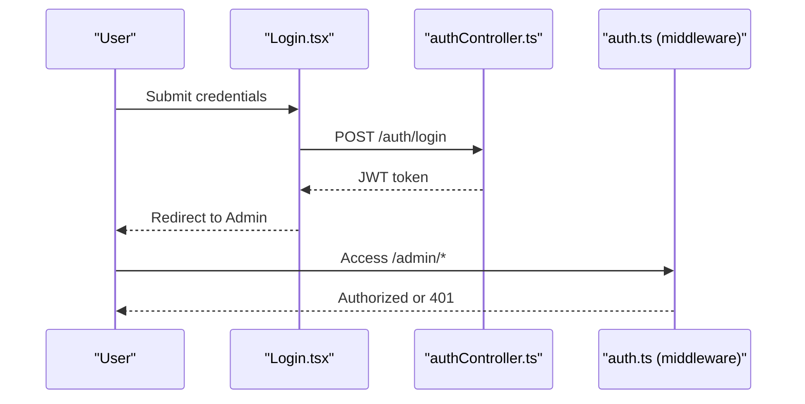
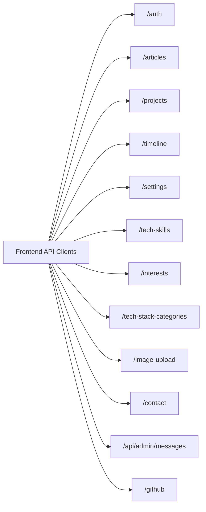
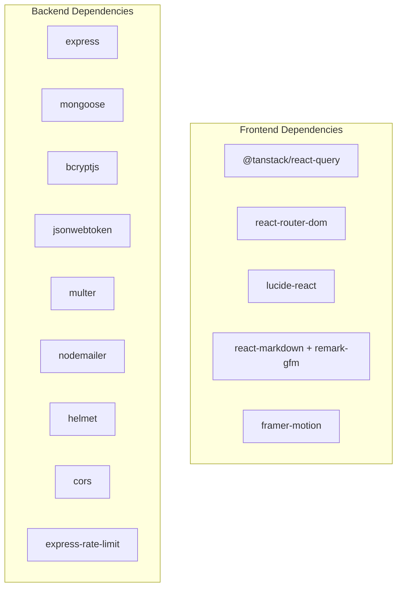

# Key Features

<cite>
**Referenced Files in This Document**
- [App.tsx](file://personalSite/src/App.tsx)
- [index.ts](file://server/src/index.ts)
- [package.json](file://personalSite/package.json)
- [package.json](file://server/package.json)
- [Dashboard.tsx](file://personalSite/src/pages/Admin/Dashboard.tsx)
- [dashboardApi.ts](file://personalSite/src/api/dashboardApi.ts)
- [dashboardController.ts](file://server/src/controllers/dashboardController.ts)
- [ArticleManager.tsx](file://personalSite/src/pages/Admin/ArticleManager.tsx)
- [articleApi.ts](file://personalSite/src/api/articleApi.ts)
- [articleController.ts](file://server/src/controllers/articleController.ts)
- [ProjectManager.tsx](file://personalSite/src/pages/Admin/ProjectManager.tsx)
- [projectApi.ts](file://personalSite/src/api/projectApi.ts)
- [projectController.ts](file://server/src/controllers/projectController.ts)
- [Projects.tsx](file://personalSite/src/pages/Projects.tsx)
- [ProjectDetail.tsx](file://personalSite/src/pages/ProjectDetail.tsx)
- [TimelineManager.tsx](file://personalSite/src/pages/Admin/TimelineManager.tsx)
- [timelineApi.ts](file://personalSite/src/api/timelineApi.ts)
- [timelineController.ts](file://server/src/controllers/timelineController.ts)
- [TechSkillsManager.tsx](file://personalSite/src/pages/Admin/TechSkillsManager.tsx)
- [InterestsManager.tsx](file://personalSite/src/pages/Admin/InterestsManager.tsx)
- [TechStackManager.tsx](file://personalSite/src/pages/Admin/TechStackManager.tsx)
- [MessagesManager.tsx](file://personalSite/src/pages/Admin/MessagesManager.tsx)
- [ContactSection.tsx](file://personalSite/src/components/sections/ContactSection.tsx)
- [contactApi.ts](file://personalSite/src/api/contactApi.ts)
- [contactController.ts](file://server/src/controllers/contactController.ts)
- [githubApi.ts](file://personalSite/src/api/githubApi.ts)
- [githubController.ts](file://server/src/controllers/githubController.ts)
- [AuthContext.tsx](file://personalSite/src/contexts/AuthContext.tsx)
- [Login.tsx](file://personalSite/src/pages/Auth/Login.tsx)
- [Register.tsx](file://personalSite/src/pages/Auth/Register.tsx)
- [RouteProtector.tsx](file://personalSite/src/components/RouteProtector.tsx)
- [AdminLayout.tsx](file://personalSite/src/components/layout/AdminLayout.tsx)
- [Navbar.tsx](file://personalSite/src/components/layout/Navbar.tsx)
- [Footer.tsx](file://personalSite/src/components/layout/Footer.tsx)
- [ProjectCard.tsx](file://personalSite/src/components/ui/ProjectCard.tsx)
- [HeroSection.tsx](file://personalSite/src/components/sections/HeroSection.tsx)
- [AboutSection.tsx](file://personalSite/src/components/sections/AboutSection.tsx)
- [ContactSection.tsx](file://personalSite/src/components/sections/ContactSection.tsx)
- [imageUploadHandler.ts](file://server/src/utils/imageUploadHandler.ts)
- [auth.ts](file://server/src/middleware/auth.ts)
- [Article.ts](file://server/src/models/Article.ts)
- [Project.ts](file://server/src/models/Project.ts)
- [Timeline.ts](file://server/src/models/Timeline.ts)
- [User.ts](file://server/src/models/User.ts)
</cite>

## Table of Contents
1. [Introduction](#introduction)
2. [Project Structure](#project-structure)
3. [Core Components](#core-components)
4. [Architecture Overview](#architecture-overview)
5. [Detailed Feature Documentation](#detailed-feature-documentation)
6. [Dependency Analysis](#dependency-analysis)
7. [Performance Considerations](#performance-considerations)
8. [Troubleshooting Guide](#troubleshooting-guide)
9. [Conclusion](#conclusion)

## Introduction
This document presents a comprehensive overview of the Personal Portfolio Platform’s core capabilities. It covers the responsive frontend built with modern UI patterns, the admin dashboard for content management, the blog/article publishing system with markdown rendering and media uploads, the project showcase with GitHub integration and filtering, the timeline and experience tracking system, the technology skills management, the contact form with notifications, and the RESTful backend with authentication and authorization. Practical examples and diagrams illustrate how features work together.

## Project Structure
The platform consists of:
- A React-based single-page application (frontend) with TypeScript and shadcn/ui components
- An Express.js backend with TypeScript, MongoDB via Mongoose, and REST APIs
- Shared UI components, routing, and authentication contexts
- Admin pages for managing content and settings
- Public pages for showcasing portfolio content

**Diagram sources**
- [App.tsx](file://personalSite/src/App.tsx#L246-L355)
- [index.ts](file://server/src/index.ts#L1-L158)

**Section sources**
- [App.tsx](file://personalSite/src/App.tsx#L141-L356)
- [index.ts](file://server/src/index.ts#L1-L158)

## Core Components
- Routing and layout: Protected routes, lazy-loaded pages, and animated transitions
- Authentication context and guards for admin-only areas
- Admin dashboard with stats and recent activity
- Content managers for articles, projects, timeline, skills, interests, tech stack, and messages
- Public showcases for projects and articles with GitHub integration
- Contact form with notifications and message management
- REST endpoints for CRUD operations, media uploads, and GitHub data retrieval

**Section sources**
- [App.tsx](file://personalSite/src/App.tsx#L232-L355)
- [AuthContext.tsx](file://personalSite/src/contexts/AuthContext.tsx)
- [RouteProtector.tsx](file://personalSite/src/components/RouteProtector.tsx)
- [AdminLayout.tsx](file://personalSite/src/components/layout/AdminLayout.tsx)

## Architecture Overview
The frontend uses React Router for navigation and @tanstack/react-query for caching and optimistic updates. The backend exposes REST endpoints secured by JWT middleware and supports file uploads and GitHub API integration.

**Diagram sources**
- [App.tsx](file://personalSite/src/App.tsx#L254-L343)
- [dashboardApi.ts](file://personalSite/src/api/dashboardApi.ts#L121-L146)
- [dashboardController.ts](file://server/src/controllers/dashboardController.ts#L6-L103)

**Section sources**
- [App.tsx](file://personalSite/src/App.tsx#L232-L355)
- [index.ts](file://server/src/index.ts#L102-L116)

## Detailed Feature Documentation

### Responsive Portfolio Website with Modern UI
- Navigation and layout: Navbar, Footer, and animated transitions between routes
- Public pages: Home, About, Projects, Articles, and Project detail
- UI primitives: Cards, forms, dialogs, tooltips, and responsive grids
- SEO and accessibility: Helmet-based meta tags and semantic markup

Practical example
- The Projects page filters by tags and search, and enriches data with GitHub stats.

**Section sources**
- [Navbar.tsx](file://personalSite/src/components/layout/Navbar.tsx)
- [Footer.tsx](file://personalSite/src/components/layout/Footer.tsx)
- [HeroSection.tsx](file://personalSite/src/components/sections/HeroSection.tsx)
- [AboutSection.tsx](file://personalSite/src/components/sections/AboutSection.tsx)
- [Projects.tsx](file://personalSite/src/pages/Projects.tsx#L108-L200)
- [ProjectDetail.tsx](file://personalSite/src/pages/ProjectDetail.tsx#L1-L200)

### Admin Dashboard
- Purpose: Centralized overview of portfolio metrics and recent activity
- Data: Articles, projects, timeline items, tech skills, and user counts
- Behavior: Fetches enhanced dashboard data with caching and displays stats cards and recent activity feed

**Diagram sources**
- [Dashboard.tsx](file://personalSite/src/pages/Admin/Dashboard.tsx#L79-L105)
- [dashboardApi.ts](file://personalSite/src/api/dashboardApi.ts#L121-L146)
- [dashboardController.ts](file://server/src/controllers/dashboardController.ts#L6-L103)

**Section sources**
- [Dashboard.tsx](file://personalSite/src/pages/Admin/Dashboard.tsx#L79-L345)
- [dashboardApi.ts](file://personalSite/src/api/dashboardApi.ts#L70-L151)
- [dashboardController.ts](file://server/src/controllers/dashboardController.ts#L6-L147)

### Blog and Article Publishing System
- Features: Create, edit, delete, publish/unpublish, search, and filter articles
- Markdown support: Rendering via react-markdown with GFM plugin
- Media: Featured images uploaded via multipart/form-data
- Workflow: Draft/published statuses, tagging, and slugs

**Diagram sources**
- [ArticleManager.tsx](file://personalSite/src/pages/Admin/ArticleManager.tsx#L44-L95)
- [articleApi.ts](file://personalSite/src/api/articleApi.ts)
- [articleController.ts](file://server/src/controllers/articleController.ts#L90-L194)
- [imageUploadHandler.ts](file://server/src/utils/imageUploadHandler.ts)

**Section sources**
- [ArticleManager.tsx](file://personalSite/src/pages/Admin/ArticleManager.tsx#L14-L200)
- [articleApi.ts](file://personalSite/src/api/articleApi.ts)
- [articleController.ts](file://server/src/controllers/articleController.ts#L6-L200)

### Project Showcase and Filtering
- Public listing: Paginated, searchable, and tag-filterable projects
- GitHub integration: Stars and forks shown for linked repositories
- Detail view: Markdown README rendering, screenshots carousel, links, and metadata
- Caching: LocalStorage-based cache for projects and README content

**Diagram sources**
- [Projects.tsx](file://personalSite/src/pages/Projects.tsx#L108-L189)
- [ProjectDetail.tsx](file://personalSite/src/pages/ProjectDetail.tsx#L76-L118)

**Section sources**
- [Projects.tsx](file://personalSite/src/pages/Projects.tsx#L108-L200)
- [ProjectDetail.tsx](file://personalSite/src/pages/ProjectDetail.tsx#L1-L200)
- [projectController.ts](file://server/src/controllers/projectController.ts#L25-L125)

### Timeline and Experience Tracking
- Management: Create, update, delete timeline entries with drag-and-reorder ordering
- Icons: Selectable icons per entry
- Ordering: Utilities to maintain contiguous order during insert/update/delete

**Diagram sources**
- [TimelineManager.tsx](file://personalSite/src/pages/Admin/TimelineManager.tsx#L86-L148)
- [timelineController.ts](file://server/src/controllers/timelineController.ts#L30-L88)

**Section sources**
- [TimelineManager.tsx](file://personalSite/src/pages/Admin/TimelineManager.tsx#L25-L200)
- [timelineController.ts](file://server/src/controllers/timelineController.ts#L1-L88)

### Technology Skills Management
- Skills manager: CRUD operations for skills entries
- Tech stack categories: Manage categories used by skills
- Interests: Manage personal interests shown on the site

Note: The managers for skills, tech stack categories, and interests are implemented similarly to other managers, leveraging shared patterns for forms, validation, and API integration.

**Section sources**
- [TechSkillsManager.tsx](file://personalSite/src/pages/Admin/TechSkillsManager.tsx)
- [TechStackManager.tsx](file://personalSite/src/pages/Admin/TechStackManager.tsx)
- [InterestsManager.tsx](file://personalSite/src/pages/Admin/InterestsManager.tsx)

### Contact Form and Message Management
- Public contact form: Captures name, email, subject, and message
- Notifications: Backend sends email notifications via nodemailer
- Admin management: Messages listing and actions for administrators

**Diagram sources**
- [ContactSection.tsx](file://personalSite/src/components/sections/ContactSection.tsx)
- [contactApi.ts](file://personalSite/src/api/contactApi.ts)
- [contactController.ts](file://server/src/controllers/contactController.ts)

**Section sources**
- [ContactSection.tsx](file://personalSite/src/components/sections/ContactSection.tsx)
- [contactApi.ts](file://personalSite/src/api/contactApi.ts)
- [contactController.ts](file://server/src/controllers/contactController.ts)

### File Uploads and Image Processing
- Supported uploads: Articles (featured image), Projects (thumbnail, screenshots)
- Implementation: Multer-based handlers and custom image processing utilities
- Storage: Backend stores processed images and returns URLs for content creation

**Section sources**
- [ArticleManager.tsx](file://personalSite/src/pages/Admin/ArticleManager.tsx#L36-L95)
- [ProjectManager.tsx](file://personalSite/src/pages/Admin/ProjectManager.tsx#L57-L161)
- [imageUploadHandler.ts](file://server/src/utils/imageUploadHandler.ts)
- [articleController.ts](file://server/src/controllers/articleController.ts#L138-L145)
- [projectController.ts](file://server/src/controllers/projectController.ts#L148-L200)

### Authentication and Authorization
- JWT-based authentication: Login and registration pages manage tokens
- Protected routes: Admin pages require a valid token
- Middleware: Auth guard validates tokens on protected endpoints

**Diagram sources**
- [Login.tsx](file://personalSite/src/pages/Auth/Login.tsx)
- [Register.tsx](file://personalSite/src/pages/Auth/Register.tsx)
- [AuthContext.tsx](file://personalSite/src/contexts/AuthContext.tsx)
- [RouteProtector.tsx](file://personalSite/src/components/RouteProtector.tsx)
- [auth.ts](file://server/src/middleware/auth.ts)

**Section sources**
- [Login.tsx](file://personalSite/src/pages/Auth/Login.tsx)
- [Register.tsx](file://personalSite/src/pages/Auth/Register.tsx)
- [AuthContext.tsx](file://personalSite/src/contexts/AuthContext.tsx)
- [RouteProtector.tsx](file://personalSite/src/components/RouteProtector.tsx)
- [auth.ts](file://server/src/middleware/auth.ts)

### RESTful API Architecture
- Base URL: Frontend API client configured centrally
- Routes: Auth, Articles, Projects, Timeline, Settings, Tech Skills, Interests, Tech Stack Categories, Image Upload, Contact, Admin Messages, GitHub
- Security: Helmet, CORS, rate limiting, and JWT auth middleware
- Models: Mongoose models for Article, Project, Timeline, User

**Diagram sources**
- [index.ts](file://server/src/index.ts#L102-L116)
- [package.json](file://server/package.json#L6-L11)

**Section sources**
- [index.ts](file://server/src/index.ts#L1-L158)
- [package.json](file://server/package.json#L1-L40)

### GitHub Integration for Repository Showcase
- Public projects page: Fetches GitHub stats (stars, forks) for linked repositories
- Project detail: Renders README content from GitHub with caching and sanitization
- API: Dedicated GitHub controller and client utilities

**Section sources**
- [Projects.tsx](file://personalSite/src/pages/Projects.tsx#L127-L184)
- [ProjectDetail.tsx](file://personalSite/src/pages/ProjectDetail.tsx#L120-L200)
- [githubController.ts](file://server/src/controllers/githubController.ts)
- [githubApi.ts](file://personalSite/src/api/githubApi.ts)

## Dependency Analysis
- Frontend dependencies include React, React Router, TanStack Query, Radix UI, Framer Motion, React Markdown, and Tailwind-based UI components
- Backend dependencies include Express, Mongoose, bcrypt, JWT, Multer, Nodemailer, Helmet, CORS, and rate limiting

**Diagram sources**
- [package.json](file://personalSite/package.json#L15-L74)
- [package.json](file://server/package.json#L12-L26)

**Section sources**
- [package.json](file://personalSite/package.json#L1-L113)
- [package.json](file://server/package.json#L1-L40)

## Performance Considerations
- Client-side caching: React Query caches and TTLs for dashboard and analytics
- LocalStorage caching: Projects and README content cached locally to reduce network usage
- Pagination and filtering: Server-side pagination and client-side filtering minimize payload sizes
- Asset delivery: CDN-friendly static build with prerendering and sitemap generation

[No sources needed since this section provides general guidance]

## Troubleshooting Guide
Common issues and resolutions:
- Authentication failures: Verify JWT token presence and expiration; ensure auth middleware is applied to protected routes
- CORS errors: Confirm allowed origins and credentials configuration in environment variables
- Upload failures: Check Multer configuration, file size limits, and image processing errors
- GitHub API throttling: Implement retries and caching for README and repo stats
- Rate limiting: Reduce request frequency or adjust server-side limits

**Section sources**
- [index.ts](file://server/src/index.ts#L38-L93)
- [auth.ts](file://server/src/middleware/auth.ts)
- [imageUploadHandler.ts](file://server/src/utils/imageUploadHandler.ts)
- [ProjectDetail.tsx](file://personalSite/src/pages/ProjectDetail.tsx#L120-L161)

## Conclusion
The Personal Portfolio Platform combines a modern, responsive frontend with a robust admin dashboard and a secure, RESTful backend. Its features span content management, media handling, GitHub integration, and user authentication, delivering a complete solution for professionals to showcase their work and experiences effectively.