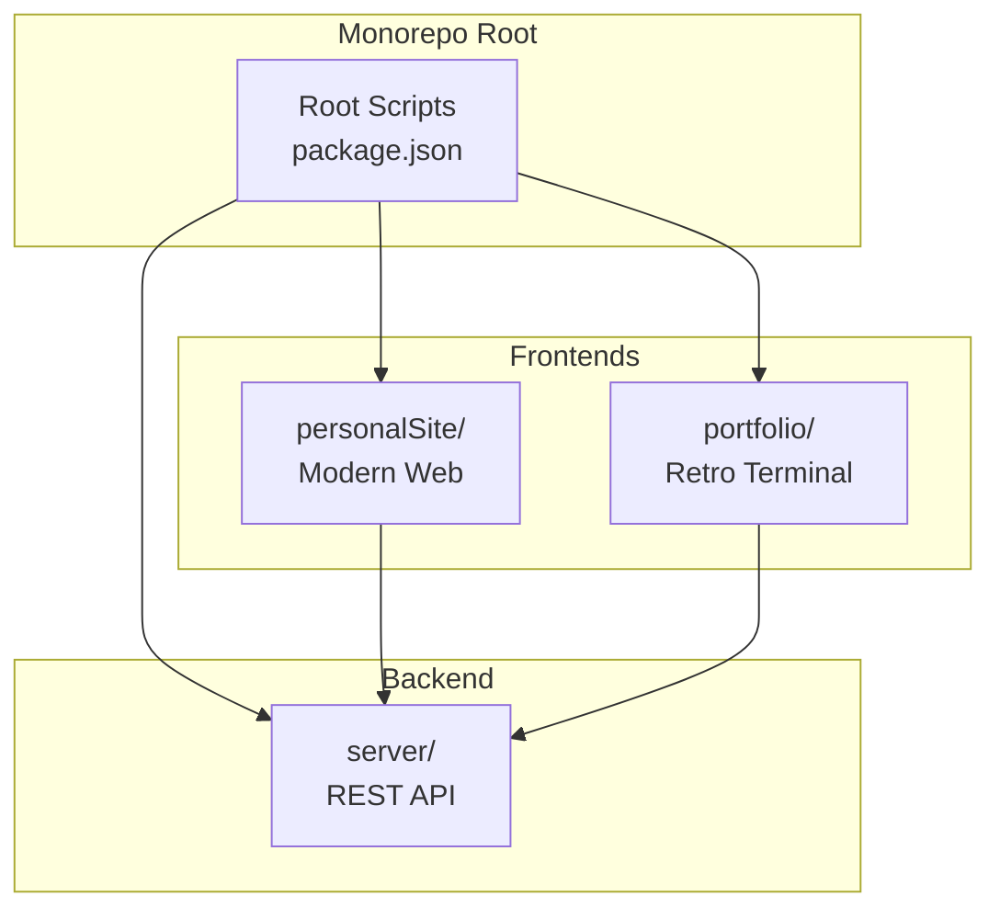
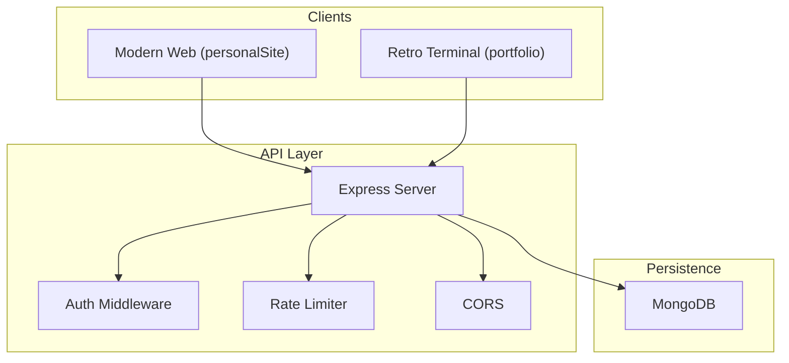
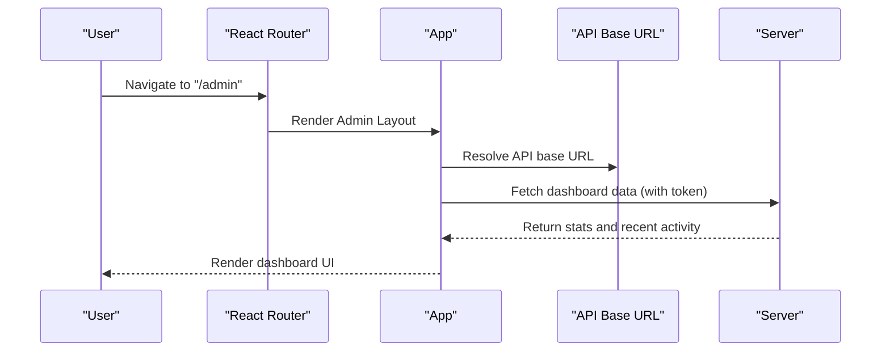
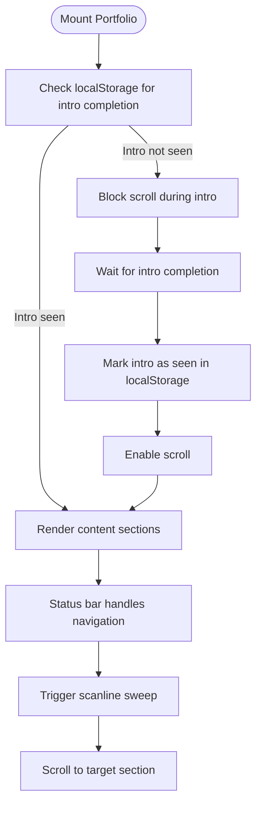
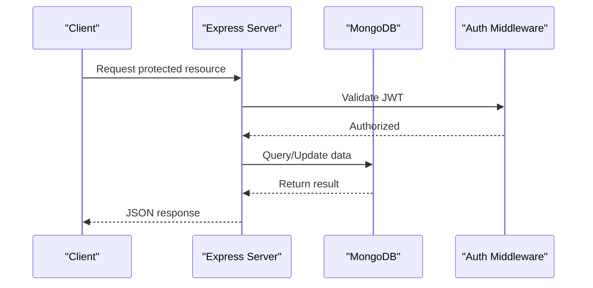
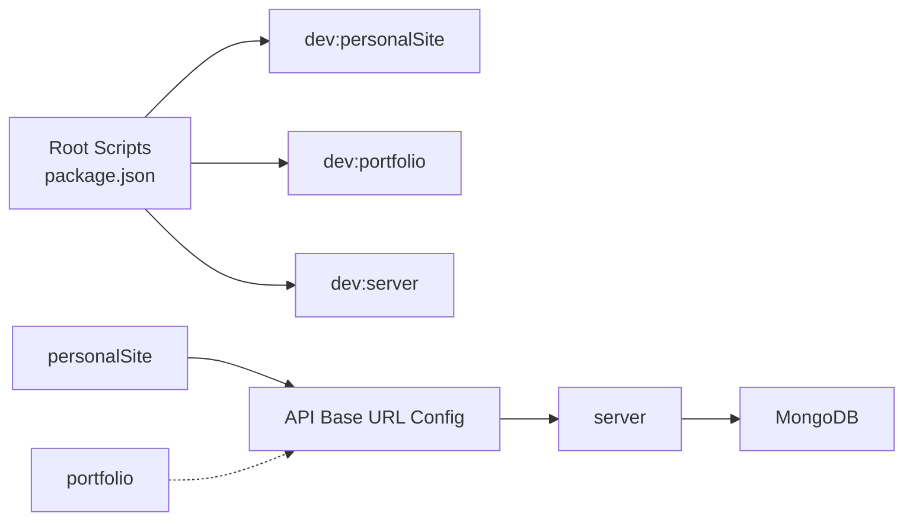

# Project Overview

<cite>
**Referenced Files in This Document**
- [README.md](file://README.md)
- [package.json](file://package.json)
- [personalSite/package.json](file://personalSite/package.json)
- [portfolio/package.json](file://portfolio/package.json)
- [server/package.json](file://server/package.json)
- [personalSite/src/App.tsx](file://personalSite/src/App.tsx)
- [personalSite/src/main.tsx](file://personalSite/src/main.tsx)
- [portfolio/src/App.tsx](file://portfolio/src/App.tsx)
- [portfolio/src/main.tsx](file://portfolio/src/main.tsx)
- [server/src/index.ts](file://server/src/index.ts)
- [personalSite/src/contexts/AuthContext.tsx](file://personalSite/src/contexts/AuthContext.tsx)
- [personalSite/src/lib/apiConfig.ts](file://personalSite/src/lib/apiConfig.ts)
- [server/src/config/database.ts](file://server/src/config/database.ts)
- [personalSite/src/pages/Admin/Dashboard.tsx](file://personalSite/src/pages/Admin/Dashboard.tsx)
- [portfolio/src/theme-provider.tsx](file://portfolio/src/theme-provider.tsx)
</cite>

## Table of Contents
1. [Introduction](#introduction)
2. [Project Structure](#project-structure)
3. [Core Components](#core-components)
4. [Architecture Overview](#architecture-overview)
5. [Detailed Component Analysis](#detailed-component-analysis)
6. [Dependency Analysis](#dependency-analysis)
7. [Performance Considerations](#performance-considerations)
8. [Troubleshooting Guide](#troubleshooting-guide)
9. [Conclusion](#conclusion)

## Introduction
The Personal Portfolio Platform is a full-stack portfolio website system designed to showcase professional work while offering robust content management capabilities through an integrated admin dashboard. It supports dual presentation modes: a modern web experience and a retro terminal-style presentation, enabling creators to present their brand in distinct visual identities. The platform emphasizes customization, maintainability, and developer productivity through a monorepo architecture that cleanly separates concerns across three primary applications.

Key goals:
- Provide a responsive, SEO-friendly portfolio with a modern UI
- Deliver an admin dashboard for managing content (articles, projects, timeline, skills, interests, messages)
- Support a retro terminal mode for a nostalgic, themed presentation
- Enable seamless GitHub integration and contact workflows
- Offer scalable backend APIs with authentication, file uploads, and rate limiting

## Project Structure
The repository follows a monorepo layout with three main applications:
- personalSite: The primary React/Vite frontend with modern UI, admin dashboard, and routing
- portfolio: A secondary React/Vite frontend implementing a retro terminal theme
- server: An Express/Node.js backend providing REST APIs, authentication, and MongoDB persistence

**Diagram sources**
- [package.json](file://package.json#L6-L16)
- [personalSite/package.json](file://personalSite/package.json#L1-L113)
- [portfolio/package.json](file://portfolio/package.json#L1-L74)
- [server/package.json](file://server/package.json#L1-L40)

**Section sources**
- [README.md](file://README.md#L24-L46)
- [package.json](file://package.json#L6-L16)

## Core Components
- Modern Web Frontend (personalSite)
  - Routing with React Router and route transitions
  - Admin protected routes and dashboard
  - Context providers for auth and settings
  - API clients for content management
- Retro Terminal Frontend (portfolio)
  - CRT overlays and animated status bar navigation
  - Terminal-inspired hero and section layout
  - Local storage-based intro state
- Backend Server (server)
  - REST endpoints for articles, projects, settings, timeline, tech skills, interests, and contact
  - Authentication with JWT and protected routes
  - MongoDB connectivity with seeding and reconnection logic
  - CORS, rate limiting, and helmet security middleware

Technology highlights:
- Frontend: React, TypeScript, Vite, Tailwind CSS, Radix UI, Framer Motion, React Router
- Backend: Node.js, Express, TypeScript, MongoDB, Mongoose
- Additional: REST API, JWT Authentication, Multer (file upload), Nodemailer

**Section sources**
- [README.md](file://README.md#L11-L16)
- [personalSite/src/App.tsx](file://personalSite/src/App.tsx#L141-L356)
- [portfolio/src/App.tsx](file://portfolio/src/App.tsx#L41-L142)
- [server/src/index.ts](file://server/src/index.ts#L1-L158)

## Architecture Overview
The system operates as a client-server architecture with two frontends consuming a shared backend API. The modern web frontend focuses on rich interactions and admin capabilities, while the retro terminal frontend emphasizes thematic immersion. Both frontends communicate with the backend via REST endpoints, authenticated by JWT tokens managed by the frontend’s AuthContext.

**Diagram sources**
- [server/src/index.ts](file://server/src/index.ts#L24-L117)
- [server/src/config/database.ts](file://server/src/config/database.ts#L6-L56)
- [personalSite/src/contexts/AuthContext.tsx](file://personalSite/src/contexts/AuthContext.tsx#L36-L140)

## Detailed Component Analysis

### Modern Web Frontend (personalSite)
The modern web frontend orchestrates page-level routing, admin protection, and global state management. It leverages React Router for navigation, React Query for caching, and a custom transition system for smooth route changes. Authentication is handled centrally, and the admin area exposes managers for content categories.

**Diagram sources**
- [personalSite/src/App.tsx](file://personalSite/src/App.tsx#L246-L346)
- [personalSite/src/lib/apiConfig.ts](file://personalSite/src/lib/apiConfig.ts#L6-L52)
- [personalSite/src/pages/Admin/Dashboard.tsx](file://personalSite/src/pages/Admin/Dashboard.tsx#L85-L105)

**Section sources**
- [personalSite/src/App.tsx](file://personalSite/src/App.tsx#L141-L356)
- [personalSite/src/main.tsx](file://personalSite/src/main.tsx#L17-L25)
- [personalSite/src/contexts/AuthContext.tsx](file://personalSite/src/contexts/AuthContext.tsx#L36-L140)
- [personalSite/src/lib/apiConfig.ts](file://personalSite/src/lib/apiConfig.ts#L6-L52)
- [personalSite/src/pages/Admin/Dashboard.tsx](file://personalSite/src/pages/Admin/Dashboard.tsx#L79-L105)

### Retro Terminal Frontend (portfolio)
The retro terminal frontend presents a themed experience with CRT overlays, animated scanlines, and a status bar for navigation. It uses a hook-based approach to track active sections and manage intro state persisted in local storage. The theme provider enables dark/light mode support.

**Diagram sources**
- [portfolio/src/App.tsx](file://portfolio/src/App.tsx#L41-L85)
- [portfolio/src/main.tsx](file://portfolio/src/main.tsx#L6-L10)
- [portfolio/src/theme-provider.tsx](file://portfolio/src/theme-provider.tsx#L9-L11)

**Section sources**
- [portfolio/src/App.tsx](file://portfolio/src/App.tsx#L41-L142)
- [portfolio/src/main.tsx](file://portfolio/src/main.tsx#L1-L11)
- [portfolio/src/theme-provider.tsx](file://portfolio/src/theme-provider.tsx#L1-L12)

### Backend Server (server)
The backend initializes Express, configures security middleware, sets up CORS policies, and mounts REST routes. It connects to MongoDB with automatic reconnection and seeds default data when collections are empty. Authentication endpoints protect admin areas, and file upload routes support media management.

**Diagram sources**
- [server/src/index.ts](file://server/src/index.ts#L102-L117)
- [server/src/config/database.ts](file://server/src/config/database.ts#L6-L56)
- [personalSite/src/contexts/AuthContext.tsx](file://personalSite/src/contexts/AuthContext.tsx#L58-L76)

**Section sources**
- [server/src/index.ts](file://server/src/index.ts#L1-L158)
- [server/src/config/database.ts](file://server/src/config/database.ts#L6-L56)
- [personalSite/src/contexts/AuthContext.tsx](file://personalSite/src/contexts/AuthContext.tsx#L58-L76)

## Dependency Analysis
The monorepo coordinates inter-application dependencies and shared tooling:
- Root scripts orchestrate development and build commands for all three applications
- Frontends depend on the backend API base URL configuration
- Backend depends on MongoDB for persistence and environment variables for configuration

**Diagram sources**
- [package.json](file://package.json#L6-L16)
- [personalSite/src/lib/apiConfig.ts](file://personalSite/src/lib/apiConfig.ts#L6-L52)
- [server/src/config/database.ts](file://server/src/config/database.ts#L14-L18)

**Section sources**
- [package.json](file://package.json#L6-L16)
- [personalSite/src/lib/apiConfig.ts](file://personalSite/src/lib/apiConfig.ts#L6-L52)
- [server/src/config/database.ts](file://server/src/config/database.ts#L14-L18)

## Performance Considerations
- Frontend
  - Route transitions and lazy loading reduce initial bundle size and improve perceived performance
  - React Query caching minimizes redundant network requests
  - Vite builds enable fast development and optimized production bundles
- Backend
  - Rate limiting protects against abuse
  - MongoDB connection pooling and reconnection logic improve resilience
  - CORS configuration prevents cross-origin issues and improves security

## Troubleshooting Guide
Common issues and resolutions:
- Authentication failures
  - Verify token validity and refresh flows in the AuthContext
  - Ensure API base URL is correctly configured for the environment
- Database connectivity
  - Confirm MongoDB URI and network accessibility
  - Review automatic reconnection logs and retry intervals
- CORS errors
  - Validate allowed origins and credentials settings
  - Check environment-specific overrides for development and production

**Section sources**
- [personalSite/src/contexts/AuthContext.tsx](file://personalSite/src/contexts/AuthContext.tsx#L58-L76)
- [personalSite/src/lib/apiConfig.ts](file://personalSite/src/lib/apiConfig.ts#L6-L52)
- [server/src/config/database.ts](file://server/src/config/database.ts#L46-L55)
- [server/src/index.ts](file://server/src/index.ts#L68-L83)

## Conclusion
The Personal Portfolio Platform delivers a flexible, full-stack solution for professionals seeking a modern yet customizable portfolio with admin capabilities. Its monorepo structure promotes maintainability, while dual presentation modes offer creative freedom. The backend’s robust API, security middleware, and MongoDB integration provide a solid foundation for scalable content management and delivery.