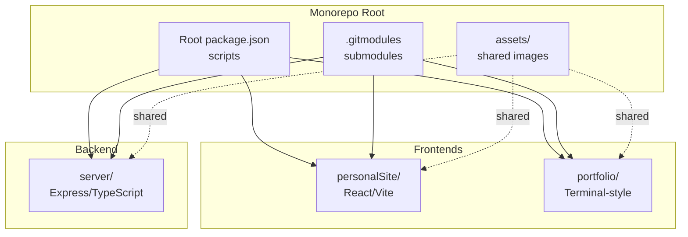
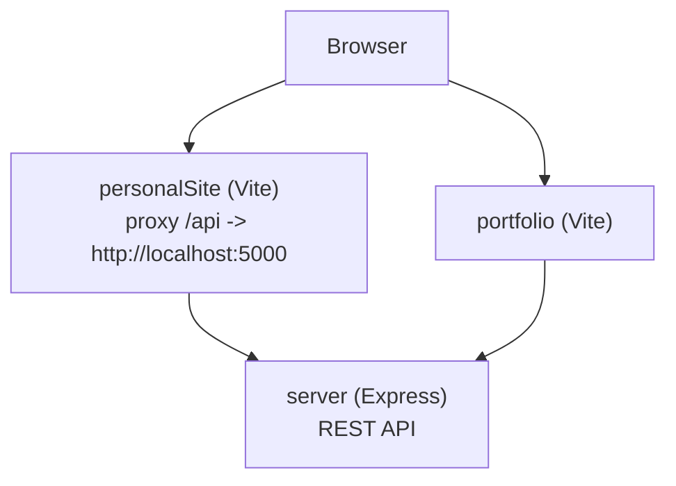
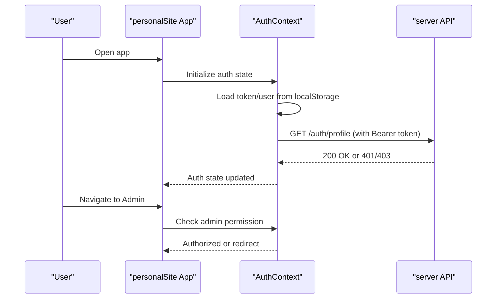
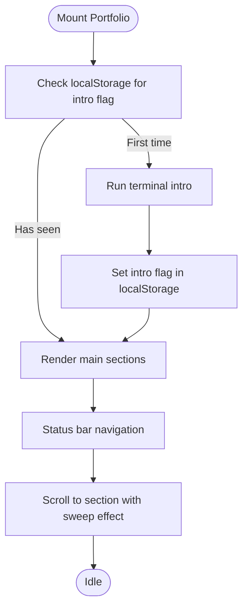
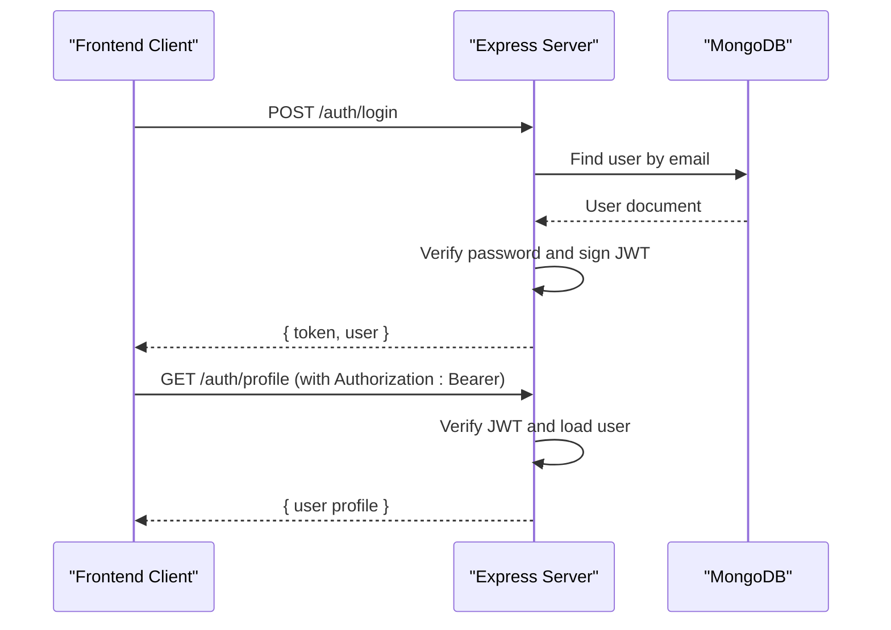
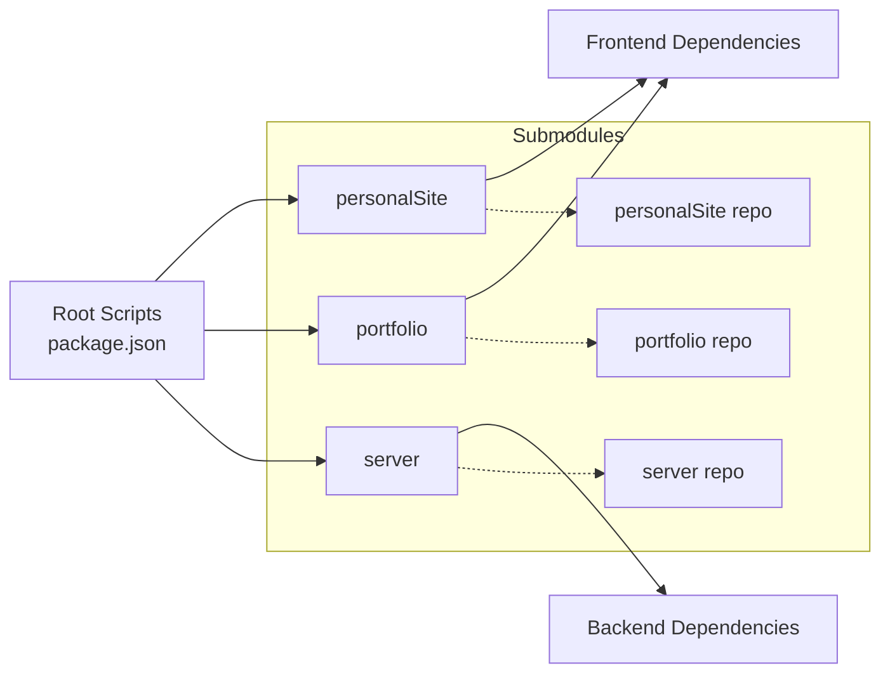

# Project Structure

<cite>
**Referenced Files in This Document**
- [README.md](file://README.md)
- [.gitmodules](file://.gitmodules)
- [package.json](file://package.json)
- [personalSite/package.json](file://personalSite/package.json)
- [portfolio/package.json](file://portfolio/package.json)
- [server/package.json](file://server/package.json)
- [personalSite/vite.config.ts](file://personalSite/vite.config.ts)
- [portfolio/vite.config.ts](file://portfolio/vite.config.ts)
- [personalSite/src/App.tsx](file://personalSite/src/App.tsx)
- [portfolio/src/App.tsx](file://portfolio/src/App.tsx)
- [personalSite/src/lib/apiConfig.ts](file://personalSite/src/lib/apiConfig.ts)
- [portfolio/src/lib/apiConfig.ts](file://portfolio/src/lib/apiConfig.ts)
- [personalSite/src/api/aboutApi.ts](file://personalSite/src/api/aboutApi.ts)
- [personalSite/src/contexts/AuthContext.tsx](file://personalSite/src/contexts/AuthContext.tsx)
- [server/src/index.ts](file://server/src/index.ts)
- [server/src/config/database.ts](file://server/src/config/database.ts)
- [server/src/controllers/articleController.ts](file://server/src/controllers/articleController.ts)
- [server/src/middleware/auth.ts](file://server/src/middleware/auth.ts)
</cite>

## Table of Contents
1. [Introduction](#introduction)
2. [Project Structure](#project-structure)
3. [Core Components](#core-components)
4. [Architecture Overview](#architecture-overview)
5. [Detailed Component Analysis](#detailed-component-analysis)
6. [Dependency Analysis](#dependency-analysis)
7. [Performance Considerations](#performance-considerations)
8. [Troubleshooting Guide](#troubleshooting-guide)
9. [Conclusion](#conclusion)
10. [Appendices](#appendices)

## Introduction
This document explains the Personal Portfolio Platform monorepo structure and how its three applications collaborate: personalSite (React/Vite modern frontend), portfolio (terminal-style alternative frontend), and server (Node.js/Express backend). It covers directory organization, naming conventions, build and deployment configurations, environment setup, inter-application communication, and the rationale for the monorepo design. It also documents the git submodule usage and external dependencies, and provides practical directory traversal examples.

## Project Structure
The repository is organized as a monorepo with three primary applications and shared assets:
- personalSite: Modern React/Vite frontend with components, pages, API clients, and contexts
- portfolio: Alternative terminal-style frontend with its own components and routing
- server: Node.js/Express backend with controllers, models, routes, and middleware
- assets: Shared static assets (e.g., favicon)
- Root scripts and configuration orchestrate development and builds across applications

**Diagram sources**
- [package.json](file://package.json#L6-L16)
- [.gitmodules](file://.gitmodules#L1-L10)

**Section sources**
- [README.md](file://README.md#L24-L46)
- [package.json](file://package.json#L1-L31)
- [.gitmodules](file://.gitmodules#L1-L10)

## Core Components
- personalSite
  - Purpose: Main React/Vite application with modern UI, admin dashboard, and SEO features
  - Key areas: src/components, src/pages, src/api, src/contexts, src/hooks, src/lib, src/types
  - Build: Vite with React SWC plugin, React Router, Tailwind CSS, and esbuild minification
  - Dev proxy: forwards /api to backend on localhost:5000
- portfolio
  - Purpose: Alternative terminal-style frontend with CRT overlays and shell navigation
  - Key areas: src/components, src/hooks, src/lib, src/types
  - Build: Vite with React plugin and Tailwind CSS
- server
  - Purpose: REST API backend with authentication, content management, and media handling
  - Key areas: src/controllers, src/models, src/routes, src/middleware, src/utils, src/config
  - Runtime: Express with Helmet, CORS, rate limiting, and MongoDB via Mongoose

**Section sources**
- [personalSite/package.json](file://personalSite/package.json#L1-L113)
- [portfolio/package.json](file://portfolio/package.json#L1-L74)
- [server/package.json](file://server/package.json#L1-L40)
- [personalSite/vite.config.ts](file://personalSite/vite.config.ts#L10-L60)
- [portfolio/vite.config.ts](file://portfolio/vite.config.ts#L1-L16)
- [server/src/index.ts](file://server/src/index.ts#L1-L158)

## Architecture Overview
The applications communicate via a centralized API:
- personalSite and portfolio both consume the server’s REST endpoints
- personalSite uses a Vite proxy to forward API calls to the backend during development
- Both frontends rely on environment-configured API base URLs
- The backend exposes routes for articles, projects, settings, authentication, and more

**Diagram sources**
- [personalSite/vite.config.ts](file://personalSite/vite.config.ts#L18-L25)
- [personalSite/src/lib/apiConfig.ts](file://personalSite/src/lib/apiConfig.ts#L6-L49)
- [portfolio/src/lib/apiConfig.ts](file://portfolio/src/lib/apiConfig.ts#L6-L16)
- [server/src/index.ts](file://server/src/index.ts#L102-L116)

## Detailed Component Analysis

### personalSite Application
- Routing and transitions
  - Uses React Router with route-based horizontal/vertical transitions and Suspense fallbacks
  - Admin routes are protected by a ProtectedRoute wrapper
- API clients and caching
  - Centralized API base URL resolution based on environment
  - Example: aboutApi aggregates timeline, tech categories, and interests in parallel with caching
- Authentication context
  - Stores tokens and user state in localStorage and validates against backend on mount
- Build and dev
  - Vite config sets aliases, proxy, chunk splitting, and history API fallback

**Diagram sources**
- [personalSite/src/App.tsx](file://personalSite/src/App.tsx#L254-L345)
- [personalSite/src/contexts/AuthContext.tsx](file://personalSite/src/contexts/AuthContext.tsx#L58-L76)
- [personalSite/src/contexts/AuthContext.tsx](file://personalSite/src/contexts/AuthContext.tsx#L78-L122)
- [server/src/index.ts](file://server/src/index.ts#L102-L116)

**Section sources**
- [personalSite/src/App.tsx](file://personalSite/src/App.tsx#L141-L356)
- [personalSite/src/contexts/AuthContext.tsx](file://personalSite/src/contexts/AuthContext.tsx#L1-L140)
- [personalSite/src/api/aboutApi.ts](file://personalSite/src/api/aboutApi.ts#L12-L85)
- [personalSite/src/lib/apiConfig.ts](file://personalSite/src/lib/apiConfig.ts#L1-L75)
- [personalSite/vite.config.ts](file://personalSite/vite.config.ts#L10-L60)

### portfolio Application
- Terminal UI and navigation
  - Status bar navigation, CRT overlays, and hero terminal intro
  - Local storage flag to skip intro on subsequent visits
- Data fetching
  - Uses a hook to load portfolio data and falls back to local data if server is unavailable
- Build and dev
  - Vite with React and Tailwind CSS; alias for @ resolves to src

**Diagram sources**
- [portfolio/src/App.tsx](file://portfolio/src/App.tsx#L41-L85)

**Section sources**
- [portfolio/src/App.tsx](file://portfolio/src/App.tsx#L1-L142)
- [portfolio/src/lib/apiConfig.ts](file://portfolio/src/lib/apiConfig.ts#L1-L19)
- [portfolio/vite.config.ts](file://portfolio/vite.config.ts#L1-L16)

### server Application
- Entry point and middleware
  - Loads environment, connects to MongoDB, applies Helmet, CORS, rate limiting, and registers routes
  - Determines allowed origins dynamically from environment variables
- Controllers and models
  - Example: articleController handles listing, creating, and validating articles with image upload support
- Authentication middleware
  - Validates JWT and enforces admin-only routes

**Diagram sources**
- [server/src/index.ts](file://server/src/index.ts#L102-L116)
- [server/src/middleware/auth.ts](file://server/src/middleware/auth.ts#L9-L30)
- [server/src/controllers/articleController.ts](file://server/src/controllers/articleController.ts#L90-L194)

**Section sources**
- [server/src/index.ts](file://server/src/index.ts#L1-L158)
- [server/src/config/database.ts](file://server/src/config/database.ts#L1-L61)
- [server/src/controllers/articleController.ts](file://server/src/controllers/articleController.ts#L1-L200)
- [server/src/middleware/auth.ts](file://server/src/middleware/auth.ts#L1-L37)

### Communication Patterns and Shared Resources
- API base URL configuration
  - Both frontends resolve API base URL from environment variables with development and production overrides
- Proxy and routing
  - personalSite uses Vite proxy to forward /api requests to the backend during development
- Data fetching and caching
  - personalSite’s aboutApi demonstrates parallel fetching and caching for improved UX
- Authentication flow
  - personalSite’s AuthContext coordinates login, registration, and profile validation with the backend

**Section sources**
- [personalSite/src/lib/apiConfig.ts](file://personalSite/src/lib/apiConfig.ts#L6-L75)
- [portfolio/src/lib/apiConfig.ts](file://portfolio/src/lib/apiConfig.ts#L6-L19)
- [personalSite/vite.config.ts](file://personalSite/vite.config.ts#L18-L25)
- [personalSite/src/api/aboutApi.ts](file://personalSite/src/api/aboutApi.ts#L12-L85)
- [personalSite/src/contexts/AuthContext.tsx](file://personalSite/src/contexts/AuthContext.tsx#L58-L122)

## Dependency Analysis
- Root orchestration
  - Root package.json scripts coordinate development and builds across personalSite, portfolio, and server
- Frontend dependencies
  - personalSite: React, Radix UI, Tailwind CSS, React Router, Three.js, React Query, etc.
  - portfolio: Similar UI toolkit subset optimized for terminal UI
- Backend dependencies
  - Express, Helmet, CORS, rate limiting, bcrypt, JWT, Mongoose, Multer, Nodemailer, etc.
- Submodules
  - personalSite, portfolio, and server are declared as git submodules pointing to external repositories

**Diagram sources**
- [package.json](file://package.json#L6-L16)
- [personalSite/package.json](file://personalSite/package.json#L15-L74)
- [portfolio/package.json](file://portfolio/package.json#L11-L60)
- [server/package.json](file://server/package.json#L12-L27)
- [.gitmodules](file://.gitmodules#L1-L10)

**Section sources**
- [package.json](file://package.json#L1-L31)
- [.gitmodules](file://.gitmodules#L1-L10)

## Performance Considerations
- Frontend bundling
  - personalSite config splits vendor and UI chunks and disables source maps in production to reduce bundle size and improve load times
- Parallel data fetching
  - personalSite’s aboutApi fetches related data concurrently to minimize latency
- Caching
  - personalSite caches aggregated about page data to reduce repeated network requests
- Backend resilience
  - server attempts automatic database reconnection and continues running even without persistent storage

**Section sources**
- [personalSite/vite.config.ts](file://personalSite/vite.config.ts#L40-L59)
- [personalSite/src/api/aboutApi.ts](file://personalSite/src/api/aboutApi.ts#L24-L58)
- [server/src/config/database.ts](file://server/src/config/database.ts#L32-L44)

## Troubleshooting Guide
- CORS issues
  - Ensure FRONTEND_URL or FRONTEND_URL_DEV/PROD and optional CORS_ORIGINS are set appropriately; server logs allowed origins at startup
- Authentication failures
  - Verify JWT_SECRET is configured; personalSite’s AuthContext validates tokens on mount and redirects on failure
- Database connectivity
  - server attempts retries and logs connection status; if unavailable, API continues running without persistence
- API base URL misconfiguration
  - Both frontends throw explicit errors if API base URL is not configured; confirm VITE_API_BASE_URL and VITE_API_BASE_URL_PROD

**Section sources**
- [server/src/index.ts](file://server/src/index.ts#L38-L83)
- [personalSite/src/contexts/AuthContext.tsx](file://personalSite/src/contexts/AuthContext.tsx#L58-L76)
- [server/src/config/database.ts](file://server/src/config/database.ts#L46-L55)
- [personalSite/src/lib/apiConfig.ts](file://personalSite/src/lib/apiConfig.ts#L22-L28)
- [portfolio/src/lib/apiConfig.ts](file://portfolio/src/lib/apiConfig.ts#L15-L16)

## Conclusion
The monorepo structure centralizes the portfolio platform’s frontend and backend while enabling independent development and deployment. The use of git submodules allows modular ownership and reuse of the individual applications. Clear separation of concerns—routing and UI in personalSite, terminal UI in portfolio, and REST APIs plus persistence in server—enables scalability and maintainability. Shared configuration via environment variables and centralized API clients ensures consistent behavior across applications.

## Appendices

### Directory Traversal Examples
- Start at repository root
  - cd personalSite && npm run dev
  - cd portfolio && npm run dev
  - cd server && npm run dev
- Build all apps
  - npm run build
  - npm run build:portfolio
- Run backend only
  - npm run start

**Section sources**
- [package.json](file://package.json#L6-L16)

### Environment Setup and Deployment Notes
- Environment variables
  - personalSite and portfolio read VITE_API_BASE_URL and VITE_API_BASE_URL_PROD from .env files
  - server reads MONGODB_URI, JWT_SECRET, CORS_ORIGINS, FRONTEND_URL(_DEV|_PROD), and PORT
- Deployment
  - personalSite and portfolio build artifacts are emitted to dist/ and served statically
  - server compiles TypeScript and runs the built index.js

**Section sources**
- [personalSite/src/lib/apiConfig.ts](file://personalSite/src/lib/apiConfig.ts#L6-L49)
- [portfolio/src/lib/apiConfig.ts](file://portfolio/src/lib/apiConfig.ts#L6-L16)
- [server/src/index.ts](file://server/src/index.ts#L22-L26)
- [server/src/config/database.ts](file://server/src/config/database.ts#L14-L18)