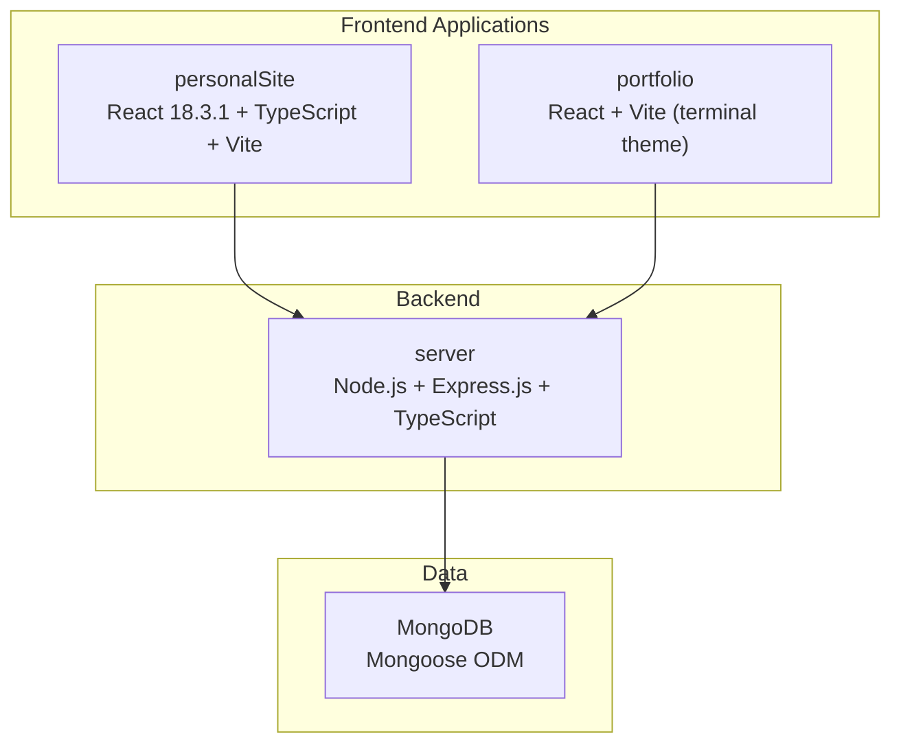
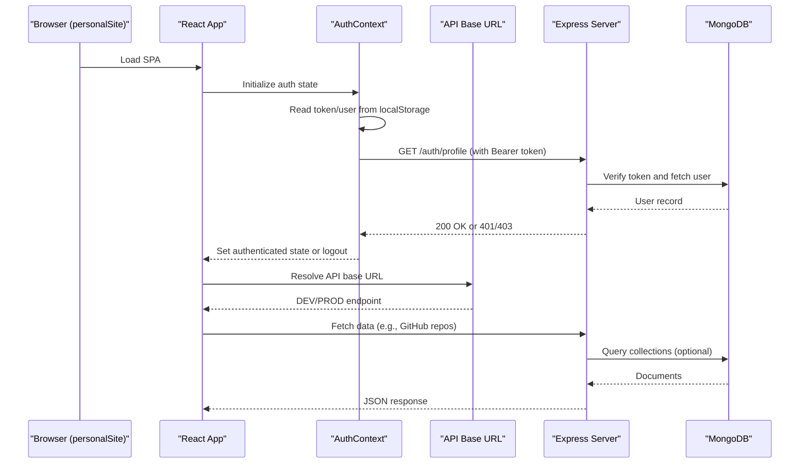
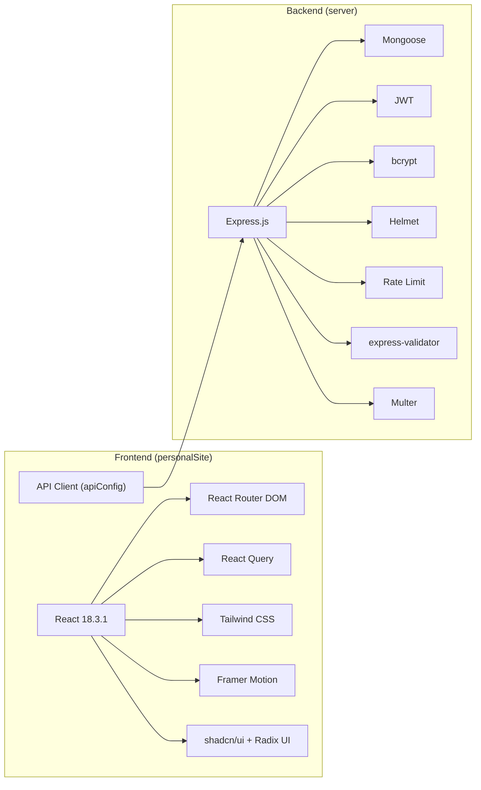

# Technology Stack

<cite>
**Referenced Files in This Document**
- [personalSite/package.json](file://personalSite/package.json)
- [server/package.json](file://server/package.json)
- [portfolio/package.json](file://portfolio/package.json)
- [personalSite/vite.config.ts](file://personalSite/vite.config.ts)
- [personalSite/tailwind.config.ts](file://personalSite/tailwind.config.ts)
- [personalSite/eslint.config.js](file://personalSite/eslint.config.js)
- [personalSite/components.json](file://personalSite/components.json)
- [personalSite/postcss.config.js](file://personalSite/postcss.config.js)
- [personalSite/tsconfig.json](file://personalSite/tsconfig.json)
- [personalSite/src/App.tsx](file://personalSite/src/App.tsx)
- [personalSite/src/lib/apiConfig.ts](file://personalSite/src/lib/apiConfig.ts)
- [personalSite/src/contexts/AuthContext.tsx](file://personalSite/src/contexts/AuthContext.tsx)
- [personalSite/src/api/githubApi.ts](file://personalSite/src/api/githubApi.ts)
- [server/tsconfig.json](file://server/tsconfig.json)
- [server/src/config/database.ts](file://server/src/config/database.ts)
- [server/src/controllers/authController.ts](file://server/src/controllers/authController.ts)
- [server/src/middleware/auth.ts](file://server/src/middleware/auth.ts)
- [server/src/routes/github.ts](file://server/src/routes/github.ts)
</cite>

## Table of Contents
1. [Introduction](#introduction)
2. [Project Structure](#project-structure)
3. [Core Components](#core-components)
4. [Architecture Overview](#architecture-overview)
5. [Detailed Component Analysis](#detailed-component-analysis)
6. [Dependency Analysis](#dependency-analysis)
7. [Performance Considerations](#performance-considerations)
8. [Troubleshooting Guide](#troubleshooting-guide)
9. [Conclusion](#conclusion)

## Introduction
This document provides comprehensive technology stack documentation for the Personal Portfolio Platform. It covers frontend technologies (React 18.3.1, TypeScript, Vite, Tailwind CSS, Framer Motion, React Router), backend technologies (Node.js, Express.js, TypeScript, MongoDB with Mongoose), authentication (JWT), build tooling, development dependencies, production optimizations, third-party integrations (React Query, shadcn/ui, GitHub API), version compatibility, upgrade paths, alternatives, and performance/scalability implications.

## Project Structure
The repository is organized into three primary applications:
- personalSite: Modern React 18 SPA with TypeScript, Vite, Tailwind CSS, Framer Motion, Radix UI, React Query, and shadcn/ui.
- server: Node.js/Express backend written in TypeScript, serving REST APIs, handling authentication, and connecting to MongoDB via Mongoose.
- portfolio: A secondary React application showcasing a retro terminal aesthetic with similar tooling.

**Diagram sources**
- [personalSite/package.json](file://personalSite/package.json#L1-L113)
- [server/package.json](file://server/package.json#L1-L40)
- [portfolio/package.json](file://portfolio/package.json#L1-L74)

**Section sources**
- [personalSite/package.json](file://personalSite/package.json#L1-L113)
- [server/package.json](file://server/package.json#L1-L40)
- [portfolio/package.json](file://portfolio/package.json#L1-L74)

## Core Components
- Frontend framework: React 18.3.1 with concurrent features, Suspense, and hooks.
- Build system: Vite 7.3.1 with esbuild minification and optimized chunk splitting.
- Styling: Tailwind CSS 3.4.17 with custom animations and theme variables.
- Animations: Framer Motion 12.26.2 for page transitions and micro-interactions.
- Routing: React Router DOM 6.30.1 with route-based code splitting and protected routes.
- State management: TanStack React Query 5.x for caching, invalidation, and optimistic updates.
- UI components: shadcn/ui with Radix UI primitives and custom Tailwind variants.
- Backend: Node.js runtime, Express.js 4.18.2, TypeScript strict compilation, MongoDB via Mongoose 8.0.3.
- Authentication: JWT-based authentication with bcrypt hashing and express-validator.
- Tooling: ESLint 9.x, TypeScript 5.8.3, PostCSS, autoprefixer, and react-snap for static generation.

**Section sources**
- [personalSite/package.json](file://personalSite/package.json#L15-L95)
- [server/package.json](file://server/package.json#L12-L38)
- [personalSite/vite.config.ts](file://personalSite/vite.config.ts#L10-L60)
- [personalSite/tailwind.config.ts](file://personalSite/tailwind.config.ts#L1-L117)
- [personalSite/src/App.tsx](file://personalSite/src/App.tsx#L1-L359)

## Architecture Overview
The frontend communicates with the backend via a centralized API base URL resolved from environment variables. Authentication tokens are stored in localStorage and validated against the backend on app load. GitHub repositories and details are fetched through the backend to avoid exposing API keys and to centralize rate limiting.

**Diagram sources**
- [personalSite/src/contexts/AuthContext.tsx](file://personalSite/src/contexts/AuthContext.tsx#L36-L140)
- [personalSite/src/lib/apiConfig.ts](file://personalSite/src/lib/apiConfig.ts#L6-L52)
- [server/src/controllers/authController.ts](file://server/src/controllers/authController.ts#L135-L142)
- [server/src/config/database.ts](file://server/src/config/database.ts#L6-L56)

## Detailed Component Analysis

### Frontend Technologies (personalSite)
- React 18.3.1: Concurrent rendering, automatic batching, and improved hydration. Used for declarative UI, Suspense-based code splitting, and route transitions.
- TypeScript: Strict compiler options, path aliases, and type-safe API clients.
- Vite 7.3.1: Fast dev server, esbuild minification, and optimized chunking. Includes proxy for API requests and history fallback for SPA routing.
- Tailwind CSS 3.4.17: Utility-first CSS with custom theme variables, animations, and shadcn/ui integration.
- Framer Motion 12.26.2: Page transition animations and micro-interactions for enhanced UX.
- React Router DOM 6.30.1: Route-based code splitting, protected routes, and programmatic navigation.
- React Query 5.x: Centralized caching, background refetching, and optimistic updates for data fetching.
- shadcn/ui + Radix UI: Accessible UI primitives with consistent design tokens and Tailwind CSS integration.

Build and development configuration highlights:
- Vite config sets base path, dev server host/port, proxy to backend, history API fallback, and manual chunking strategy.
- Tailwind config defines theme extensions, keyframes, animations, and plugin integration.
- ESLint 9.x with TypeScript rules and React-specific plugins.
- PostCSS pipeline with Tailwind and autoprefixer.
- Path aliases configured for clean imports.

**Section sources**
- [personalSite/package.json](file://personalSite/package.json#L15-L95)
- [personalSite/vite.config.ts](file://personalSite/vite.config.ts#L10-L60)
- [personalSite/tailwind.config.ts](file://personalSite/tailwind.config.ts#L1-L117)
- [personalSite/eslint.config.js](file://personalSite/eslint.config.js#L1-L27)
- [personalSite/postcss.config.js](file://personalSite/postcss.config.js#L1-L7)
- [personalSite/tsconfig.json](file://personalSite/tsconfig.json#L1-L17)
- [personalSite/components.json](file://personalSite/components.json#L1-L21)

### Backend Technologies (server)
- Node.js + Express.js 4.18.2: Minimal web framework for REST endpoints, middleware, and routing.
- TypeScript: Strict compiler options targeting ES2020 with source maps and declaration files.
- MongoDB + Mongoose 8.0.3: ODM for schema enforcement, connection pooling, and automatic reconnection logic.
- JWT Authentication: Token generation/verification with role-based access control.
- Security: Helmet, rate limiting, input validation, and bcrypt hashing.
- File uploads: Multer for handling multipart/form-data.

Key implementation details:
- Database connection establishes pool size, timeouts, and automatic reconnection with seeding logic.
- Auth controller validates input, checks uniqueness, hashes passwords, and issues JWT tokens.
- Auth middleware verifies tokens and enforces admin-only routes.
- GitHub routes delegate to controllers for fetching repositories and details.

**Section sources**
- [server/package.json](file://server/package.json#L12-L38)
- [server/tsconfig.json](file://server/tsconfig.json#L1-L20)
- [server/src/config/database.ts](file://server/src/config/database.ts#L6-L56)
- [server/src/controllers/authController.ts](file://server/src/controllers/authController.ts#L6-L142)
- [server/src/middleware/auth.ts](file://server/src/middleware/auth.ts#L9-L37)

### Third-Party Integrations
- React Query: Provides caching and data synchronization across the app. Used in conjunction with route-based code splitting and protected routes.
- shadcn/ui: Component library integrated with Tailwind CSS and Radix UI primitives. Configuration aligns aliases and theme variables.
- GitHub API: Fetched via backend endpoints to centralize rate limiting and avoid exposing tokens. Frontend uses a typed API client with caching.

**Section sources**
- [personalSite/src/App.tsx](file://personalSite/src/App.tsx#L32-L32)
- [personalSite/components.json](file://personalSite/components.json#L1-L21)
- [personalSite/src/api/githubApi.ts](file://personalSite/src/api/githubApi.ts#L6-L46)
- [server/src/routes/github.ts](file://server/src/routes/github.ts#L1-L9)

### Version Compatibility and Upgrade Paths
- React 18.3.1: Latest stable minor; upgrade path to newer minors requires testing Suspense and concurrent features. Consider migration guides for React 19+ if adopting.
- TypeScript 5.8.3: Align frontend and backend TS versions; ensure compatible decorators/targets and module resolutions.
- Vite 7.3.1: Keep aligned with React 18 ecosystem; watch for breaking changes in plugins and build targets.
- Tailwind CSS 3.4.17: New major releases may deprecate utilities; pin versions and test theme changes.
- Framer Motion 12.26.2: Major version upgrades may alter animation APIs; test transition logic.
- Express.js 4.18.2: Patch updates recommended; major upgrades require reviewing middleware signatures.
- Mongoose 8.0.3: Major version introduces stricter schema enforcement; review deprecations and connection options.
- JWT: Use long-lived secrets and refresh strategies; consider libraries like jsonwebtoken-compat if upgrading.

**Section sources**
- [personalSite/package.json](file://personalSite/package.json#L57-L73)
- [server/package.json](file://server/package.json#L19-L26)
- [server/tsconfig.json](file://server/tsconfig.json#L2-L16)

### Replacement Alternatives
- Build tooling: Vite can be replaced with Webpack or esbuild-based setups; trade-offs in DX and plugin ecosystems.
- Styling: Tailwind can be replaced with vanilla CSS modules, styled-components, or CSS-in-JS; evaluate bundle size and DX.
- Animations: Framer Motion can be replaced with React Spring or native CSS animations; assess performance and complexity.
- State management: React Query can be replaced with Redux Toolkit, Zustand, or custom hooks; consider caching and SSR needs.
- UI library: shadcn/ui can be replaced with Chakra UI, Ant Design, or custom components; maintain design consistency.
- Backend: Express can be replaced with NestJS, Koa, or Fastify; evaluate boilerplate and modularity.
- Database: Mongoose can be replaced with Prisma or Drizzle ORM; compare schema ergonomics and query builder capabilities.

**Section sources**
- [personalSite/package.json](file://personalSite/package.json#L15-L95)
- [server/package.json](file://server/package.json#L12-L38)

## Dependency Analysis
The frontend depends on React, React Router, React Query, Tailwind CSS, Framer Motion, and shadcn/ui components. The backend depends on Express, Mongoose, JWT, bcrypt, helmet, and multer. The frontend communicates with the backend via a centralized API base URL, while GitHub data is proxied through the backend.

**Diagram sources**
- [personalSite/package.json](file://personalSite/package.json#L15-L95)
- [server/package.json](file://server/package.json#L12-L38)

**Section sources**
- [personalSite/package.json](file://personalSite/package.json#L15-L95)
- [server/package.json](file://server/package.json#L12-L38)

## Performance Considerations
- Build optimizations:
  - esbuild minification and manual chunking reduce bundle sizes.
  - CSS code splitting and hashed asset filenames improve caching.
  - History API fallback prevents 404s for deep links in production.
- Runtime optimizations:
  - React Suspense with lazy-loaded routes reduces initial payload.
  - React Query caching reduces redundant network requests.
  - Tailwind JIT and minimal plugin usage keep CSS lean.
- Database performance:
  - Connection pooling and automatic reconnection improve resilience.
  - Indexing on frequently queried fields (e.g., email, username) recommended.
- Network:
  - Centralized API base URL enables CDN and proxy optimization.
  - GitHub API caching reduces external load and improves UX.

[No sources needed since this section provides general guidance]

## Troubleshooting Guide
Common issues and remedies:
- Authentication failures:
  - Verify JWT secret and expiration settings.
  - Ensure tokens are stored in localStorage and sent with Authorization headers.
- Database connectivity:
  - Check MongoDB URI and network accessibility.
  - Review connection pooling and retry logic.
- Build errors:
  - Validate Vite configuration and plugin versions.
  - Confirm TypeScript path aliases and compiler options.
- GitHub API errors:
  - Confirm backend routes and caching TTL.
  - Inspect error responses and adjust cache keys.

**Section sources**
- [server/src/middleware/auth.ts](file://server/src/middleware/auth.ts#L9-L37)
- [server/src/config/database.ts](file://server/src/config/database.ts#L6-L56)
- [personalSite/vite.config.ts](file://personalSite/vite.config.ts#L10-L60)
- [personalSite/src/api/githubApi.ts](file://personalSite/src/api/githubApi.ts#L6-L46)

## Conclusion
The Personal Portfolio Platform leverages a modern, efficient stack combining React 18, TypeScript, Vite, Tailwind CSS, Framer Motion, and React Router for the frontend, and Node.js, Express.js, TypeScript, MongoDB with Mongoose, and JWT for the backend. The stack emphasizes developer experience, performance, and maintainability through strong typing, optimized builds, and robust state management. Careful attention to version compatibility, upgrade paths, and security hardening ensures long-term sustainability.