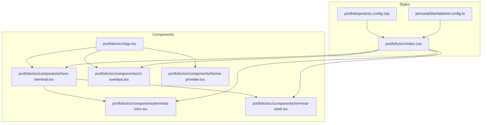
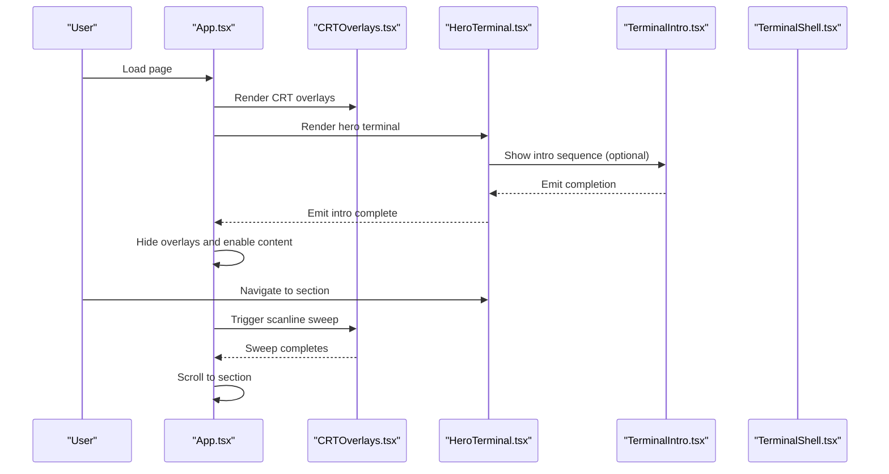
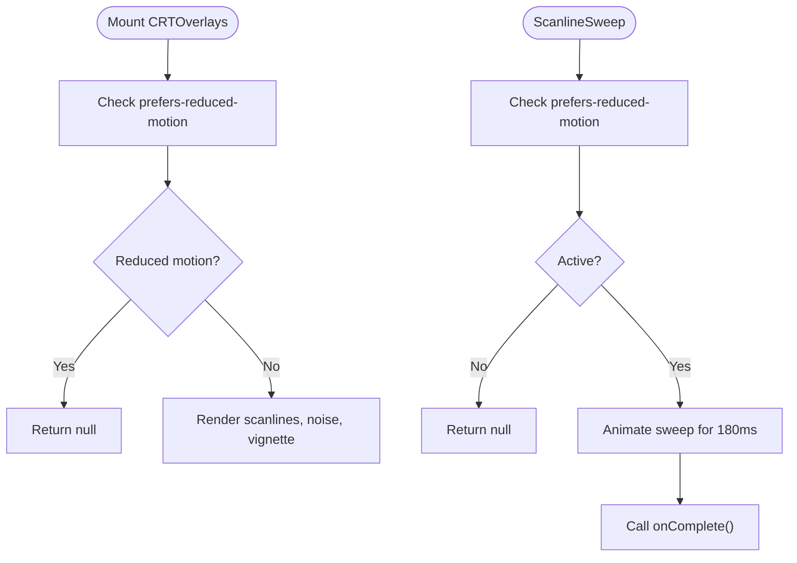
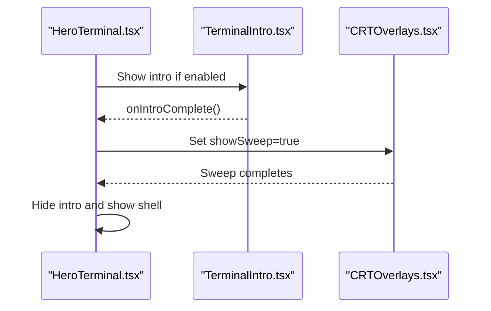
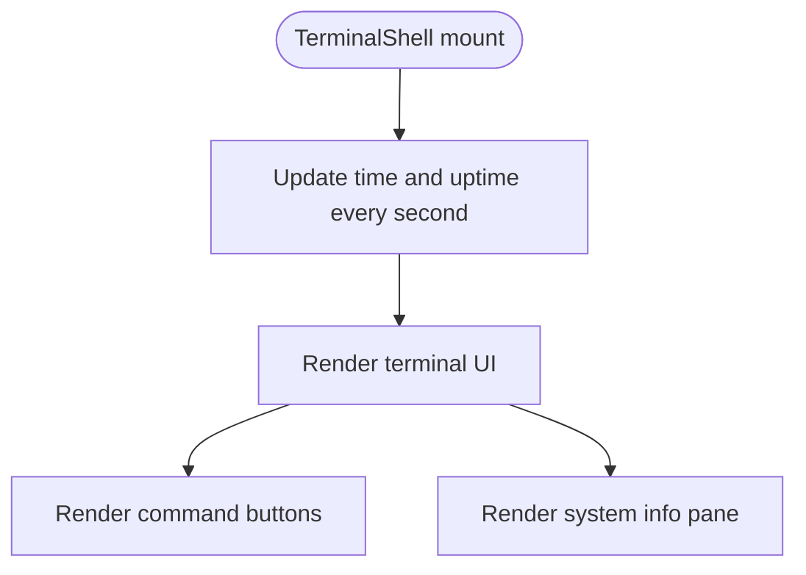
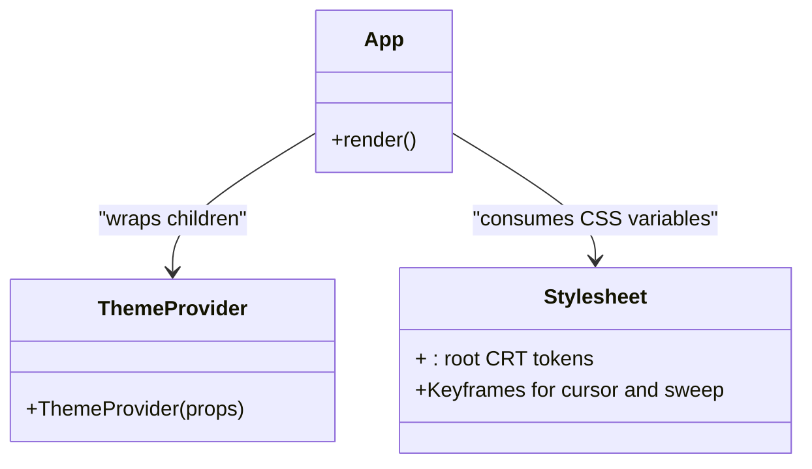
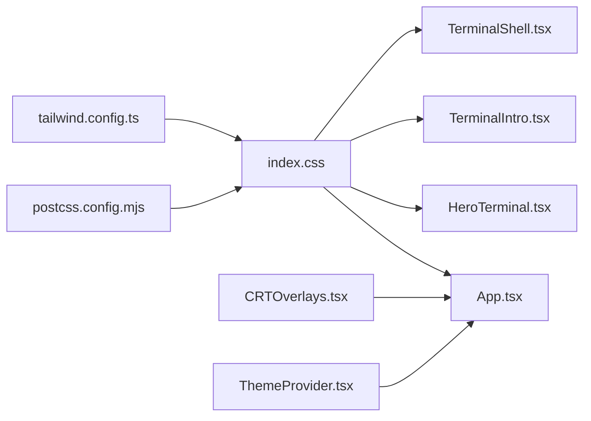

# CRT Styling System

<cite>
**Referenced Files in This Document**
- [index.css](file://portfolio/src/index.css)
- [crt-overlays.tsx](file://portfolio/src/components/crt-overlays.tsx)
- [hero-terminal.tsx](file://portfolio/src/components/hero-terminal.tsx)
- [terminal-intro.tsx](file://portfolio/src/components/terminal-intro.tsx)
- [terminal-shell.tsx](file://portfolio/src/components/terminal-shell.tsx)
- [App.tsx](file://portfolio/src/App.tsx)
- [theme-provider.tsx](file://portfolio/src/components/theme-provider.tsx)
- [postcss.config.mjs](file://portfolio/postcss.config.mjs)
- [tailwind.config.ts](file://personalSite/tailwind.config.ts)
- [package.json](file://portfolio/package.json)
</cite>

## Table of Contents
1. [Introduction](#introduction)
2. [Project Structure](#project-structure)
3. [Core Components](#core-components)
4. [Architecture Overview](#architecture-overview)
5. [Detailed Component Analysis](#detailed-component-analysis)
6. [Dependency Analysis](#dependency-analysis)
7. [Performance Considerations](#performance-considerations)
8. [Troubleshooting Guide](#troubleshooting-guide)
9. [Conclusion](#conclusion)
10. [Appendices](#appendices)

## Introduction
This document explains the CRT Styling System that recreates a vintage computer terminal aesthetic. It covers the CRT overlay components (scanline effects, screen flicker animations, and phosphor glow), the color scheme system with CRT-specific tokens and CSS custom properties, the hero terminal styling and character-based typography, and the theme provider and dynamic styling approach. It also provides practical examples for customization and guidance on browser compatibility and performance.

## Project Structure
The CRT styling system is implemented primarily in the portfolio application under the src directory. Key elements include:
- Global styles and CRT overlays in the main stylesheet
- React components for the hero terminal, intro sequence, and overlays
- Theme provider integration via next-themes
- Tailwind CSS configuration and PostCSS setup

**Diagram sources**
- [index.css](file://portfolio/src/index.css#L1-L226)
- [crt-overlays.tsx](file://portfolio/src/components/crt-overlays.tsx#L1-L54)
- [hero-terminal.tsx](file://portfolio/src/components/hero-terminal.tsx#L1-L330)
- [terminal-intro.tsx](file://portfolio/src/components/terminal-intro.tsx#L1-L166)
- [terminal-shell.tsx](file://portfolio/src/components/terminal-shell.tsx#L1-L184)
- [App.tsx](file://portfolio/src/App.tsx#L1-L142)
- [theme-provider.tsx](file://portfolio/src/components/theme-provider.tsx#L1-L12)
- [postcss.config.mjs](file://portfolio/postcss.config.mjs#L1-L9)
- [tailwind.config.ts](file://personalSite/tailwind.config.ts#L1-L117)

**Section sources**
- [index.css](file://portfolio/src/index.css#L1-L226)
- [crt-overlays.tsx](file://portfolio/src/components/crt-overlays.tsx#L1-L54)
- [hero-terminal.tsx](file://portfolio/src/components/hero-terminal.tsx#L1-L330)
- [terminal-intro.tsx](file://portfolio/src/components/terminal-intro.tsx#L1-L166)
- [terminal-shell.tsx](file://portfolio/src/components/terminal-shell.tsx#L1-L184)
- [App.tsx](file://portfolio/src/App.tsx#L1-L142)
- [theme-provider.tsx](file://portfolio/src/components/theme-provider.tsx#L1-L12)
- [postcss.config.mjs](file://portfolio/postcss.config.mjs#L1-L9)
- [tailwind.config.ts](file://personalSite/tailwind.config.ts#L1-L117)

## Core Components
- CRT Overlays: Provides scanline, noise, and vignette overlays and a scanline sweep animation triggered by user actions.
- Hero Terminal: Hosts the terminal UI, intro sequence, and navigation sweep.
- Terminal Intro: Implements a boot sequence with typing and output phases, plus a boot log phase.
- Terminal Shell: Alternative standalone terminal view with system info and command buttons.
- Theme Provider: Wraps the app with a theme provider for theme switching and persistence.

Key implementation patterns:
- CSS custom properties define CRT-specific tokens for background, panel, text, accent, borders, and glow.
- Overlay components use prefers-reduced-motion media queries to disable animations for accessibility.
- Terminal components use CSS keyframes for blinking cursor and scanline sweep.
- Typography leverages JetBrains Mono for a character-based terminal feel.

**Section sources**
- [crt-overlays.tsx](file://portfolio/src/components/crt-overlays.tsx#L1-L54)
- [hero-terminal.tsx](file://portfolio/src/components/hero-terminal.tsx#L1-L330)
- [terminal-intro.tsx](file://portfolio/src/components/terminal-intro.tsx#L1-L166)
- [terminal-shell.tsx](file://portfolio/src/components/terminal-shell.tsx#L1-L184)
- [theme-provider.tsx](file://portfolio/src/components/theme-provider.tsx#L1-L12)
- [index.css](file://portfolio/src/index.css#L6-L39)
- [index.css](file://portfolio/src/index.css#L102-L206)

## Architecture Overview
The CRT styling system integrates React components with global CSS and Tailwind configuration. The App component orchestrates the CRT overlays, navigation sweep, and hero terminal. Styles are defined in a single stylesheet with CRT-specific custom properties and keyframes. PostCSS and Tailwind process the styles, while next-themes manages theme state.

**Diagram sources**
- [App.tsx](file://portfolio/src/App.tsx#L41-L141)
- [crt-overlays.tsx](file://portfolio/src/components/crt-overlays.tsx#L5-L53)
- [hero-terminal.tsx](file://portfolio/src/components/hero-terminal.tsx#L14-L78)
- [terminal-intro.tsx](file://portfolio/src/components/terminal-intro.tsx#L28-L165)

## Detailed Component Analysis

### CRT Overlays and Scanline Sweep
The CRT overlays module renders three overlay layers and a scanline sweep animation. It respects reduced motion preferences and conditionally renders overlays and animations.

**Diagram sources**
- [crt-overlays.tsx](file://portfolio/src/components/crt-overlays.tsx#L5-L53)

**Section sources**
- [crt-overlays.tsx](file://portfolio/src/components/crt-overlays.tsx#L1-L54)
- [index.css](file://portfolio/src/index.css#L102-L139)
- [index.css](file://portfolio/src/index.css#L141-L175)
- [index.css](file://portfolio/src/index.css#L191-L201)

### Hero Terminal and Intro Sequence
The hero terminal composes the header, content area, and optional intro sequence. It coordinates the scanline sweep and transitions to the main terminal shell after intro completion.

**Diagram sources**
- [hero-terminal.tsx](file://portfolio/src/components/hero-terminal.tsx#L14-L78)
- [terminal-intro.tsx](file://portfolio/src/components/terminal-intro.tsx#L28-L165)
- [crt-overlays.tsx](file://portfolio/src/components/crt-overlays.tsx#L33-L53)

**Section sources**
- [hero-terminal.tsx](file://portfolio/src/components/hero-terminal.tsx#L1-L330)
- [terminal-intro.tsx](file://portfolio/src/components/terminal-intro.tsx#L1-L166)
- [crt-overlays.tsx](file://portfolio/src/components/crt-overlays.tsx#L1-L54)

### Terminal Shell and System Information
The terminal shell presents a static terminal layout with a message-of-the-day (MOTD), help text, a prompt, and a right pane with system information and technology tags.

**Diagram sources**
- [terminal-shell.tsx](file://portfolio/src/components/terminal-shell.tsx#L30-L183)

**Section sources**
- [terminal-shell.tsx](file://portfolio/src/components/terminal-shell.tsx#L1-L184)
- [index.css](file://portfolio/src/index.css#L203-L206)

### Theme Provider and Dynamic Styling
The theme provider wraps the application to support theme switching and persistence. The global stylesheet defines CRT-specific CSS custom properties and keyframes for animations.

**Diagram sources**
- [theme-provider.tsx](file://portfolio/src/components/theme-provider.tsx#L9-L11)
- [App.tsx](file://portfolio/src/App.tsx#L87-L141)
- [index.css](file://portfolio/src/index.css#L6-L39)
- [index.css](file://portfolio/src/index.css#L177-L189)

**Section sources**
- [theme-provider.tsx](file://portfolio/src/components/theme-provider.tsx#L1-L12)
- [App.tsx](file://portfolio/src/App.tsx#L1-L142)
- [index.css](file://portfolio/src/index.css#L1-L226)

## Dependency Analysis
The CRT styling system relies on:
- CSS custom properties for CRT tokens
- Tailwind CSS for utility classes and theme tokens
- PostCSS for processing
- next-themes for theme provider
- React components for orchestration

**Diagram sources**
- [postcss.config.mjs](file://portfolio/postcss.config.mjs#L1-L9)
- [tailwind.config.ts](file://personalSite/tailwind.config.ts#L1-L117)
- [index.css](file://portfolio/src/index.css#L1-L226)
- [App.tsx](file://portfolio/src/App.tsx#L1-L142)
- [crt-overlays.tsx](file://portfolio/src/components/crt-overlays.tsx#L1-L54)
- [hero-terminal.tsx](file://portfolio/src/components/hero-terminal.tsx#L1-L330)
- [terminal-intro.tsx](file://portfolio/src/components/terminal-intro.tsx#L1-L166)
- [terminal-shell.tsx](file://portfolio/src/components/terminal-shell.tsx#L1-L184)
- [theme-provider.tsx](file://portfolio/src/components/theme-provider.tsx#L1-L12)

**Section sources**
- [postcss.config.mjs](file://portfolio/postcss.config.mjs#L1-L9)
- [tailwind.config.ts](file://personalSite/tailwind.config.ts#L1-L117)
- [package.json](file://portfolio/package.json#L61-L72)
- [index.css](file://portfolio/src/index.css#L1-L226)
- [App.tsx](file://portfolio/src/App.tsx#L1-L142)

## Performance Considerations
- Animations: The scanline sweep and cursor blink use CSS keyframes and are disabled under reduced motion. The sweep duration is short (180 ms) to minimize perceived latency.
- Overlay rendering: The scanlines, noise, and vignette overlays are fixed-position and use minimal JavaScript; they rely on pure CSS for performance.
- Scroll behavior: Smooth scrolling is disabled when reduced motion is preferred to avoid unnecessary motion.
- Accessibility: Components check for reduced motion and adjust behavior accordingly.

Recommendations:
- Keep overlay animations short and lightweight.
- Prefer CSS transforms and opacity for animations.
- Avoid layout thrashing by batching DOM updates.
- Test on low-power devices and older browsers.

**Section sources**
- [crt-overlays.tsx](file://portfolio/src/components/crt-overlays.tsx#L8-L15)
- [crt-overlays.tsx](file://portfolio/src/components/crt-overlays.tsx#L36-L39)
- [index.css](file://portfolio/src/index.css#L191-L201)
- [index.css](file://portfolio/src/index.css#L90-L99)

## Troubleshooting Guide
Common issues and resolutions:
- Overlays not appearing:
  - Verify the CRT overlays component is rendered and not hidden by reduced motion settings.
  - Ensure the stylesheet is loaded and CSS custom properties are defined.
- Scanline sweep not triggering:
  - Confirm the sweep component receives the active prop and that reduced motion is not enabled.
  - Check the completion callback is invoked after the animation.
- Cursor not blinking:
  - Ensure the cursor element has the blink animation class and reduced motion is not enabled.
- Terminal colors not applying:
  - Verify CSS custom properties for CRT tokens are present in :root and referenced in components.
- Scroll behavior anomalies:
  - Check reduced motion media query overrides for scroll behavior and cursor animation.

**Section sources**
- [crt-overlays.tsx](file://portfolio/src/components/crt-overlays.tsx#L17-L25)
- [crt-overlays.tsx](file://portfolio/src/components/crt-overlays.tsx#L50-L53)
- [index.css](file://portfolio/src/index.css#L191-L201)
- [index.css](file://portfolio/src/index.css#L6-L39)
- [index.css](file://portfolio/src/index.css#L95-L99)

## Conclusion
The CRT Styling System achieves a nostalgic terminal aesthetic through a combination of CSS custom properties, overlays, and targeted animations. It integrates seamlessly with React components and Tailwind CSS, supports reduced motion preferences, and provides a foundation for further customization. By leveraging CSS keyframes and minimal JavaScript, the system balances visual fidelity with performance.

## Appendices

### Customization Examples
- Adjust scanline intensity:
  - Modify the scanline overlay gradient stops and opacity in the stylesheet.
  - Reference: [index.css](file://portfolio/src/index.css#L108-L114)
- Change phosphor glow color:
  - Update the CRT accent color and related glow tokens in :root.
  - Reference: [index.css](file://portfolio/src/index.css#L30-L39)
- Extend terminal color scheme:
  - Add new CRT tokens to :root and use them in components.
  - Reference: [index.css](file://portfolio/src/index.css#L6-L39)
- Customize scanline sweep:
  - Adjust the sweep animation duration and gradient stops.
  - Reference: [index.css](file://portfolio/src/index.css#L142-L175)

### Browser Compatibility Notes
- CSS custom properties are supported in modern browsers; ensure fallbacks if targeting legacy environments.
- CSS keyframes and transforms are broadly supported; test on older mobile browsers.
- prefers-reduced-motion media queries are widely supported and respected by major browsers.

**Section sources**
- [index.css](file://portfolio/src/index.css#L6-L39)
- [index.css](file://portfolio/src/index.css#L102-L175)
- [index.css](file://portfolio/src/index.css#L191-L201)