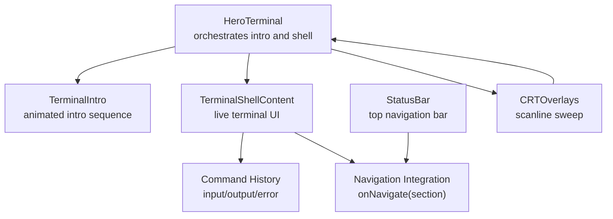
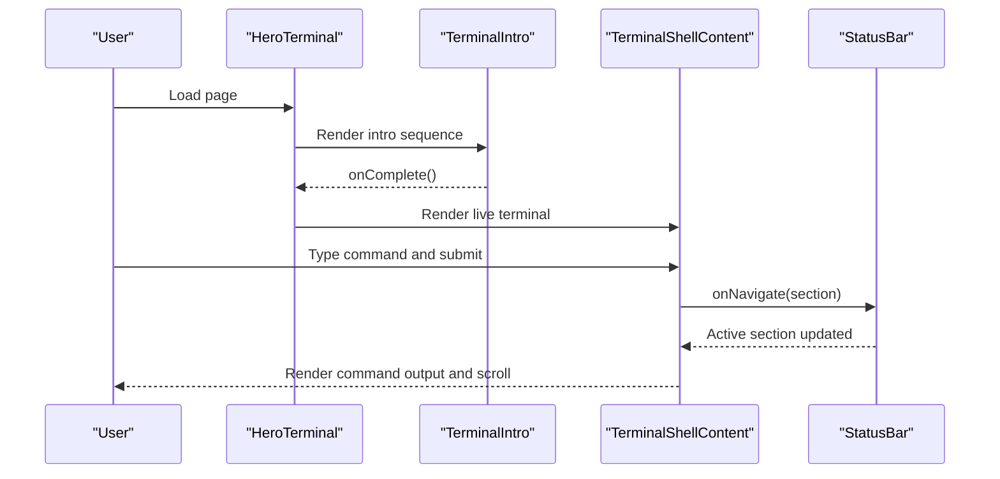
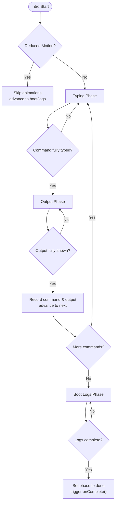
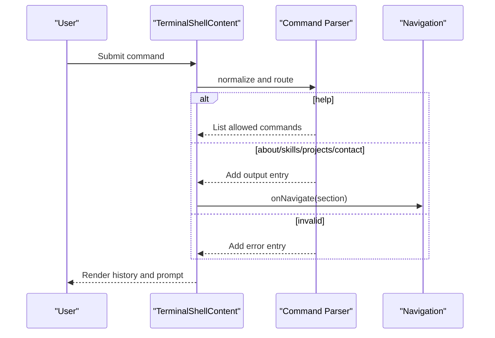
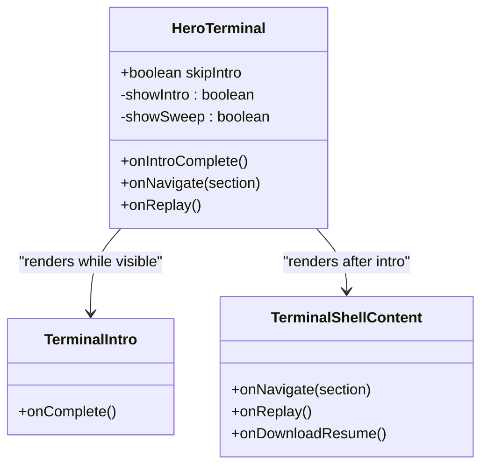
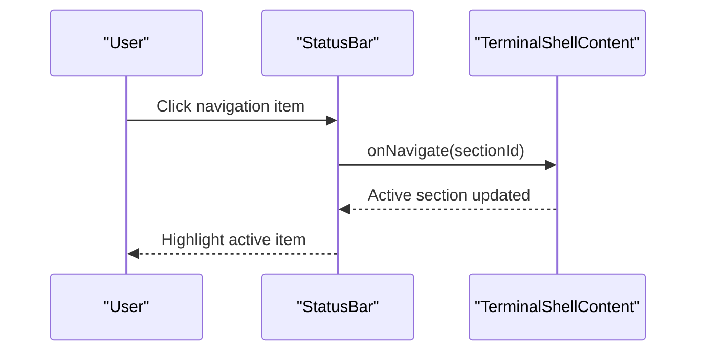
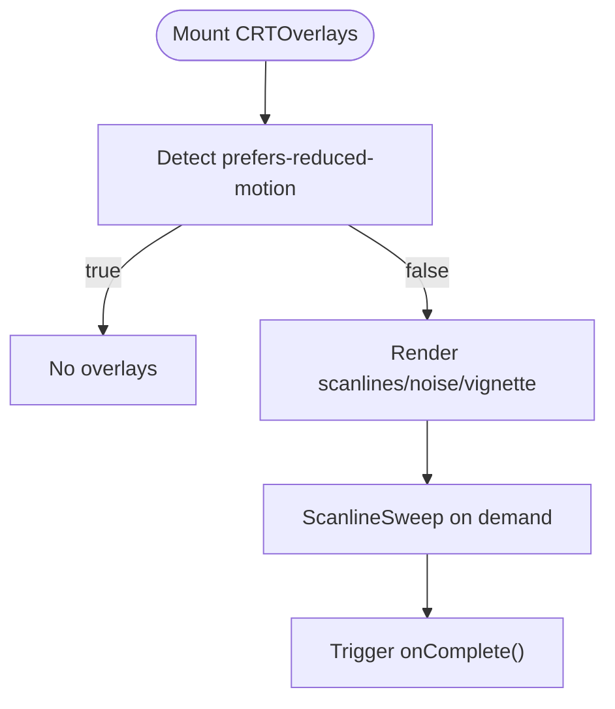
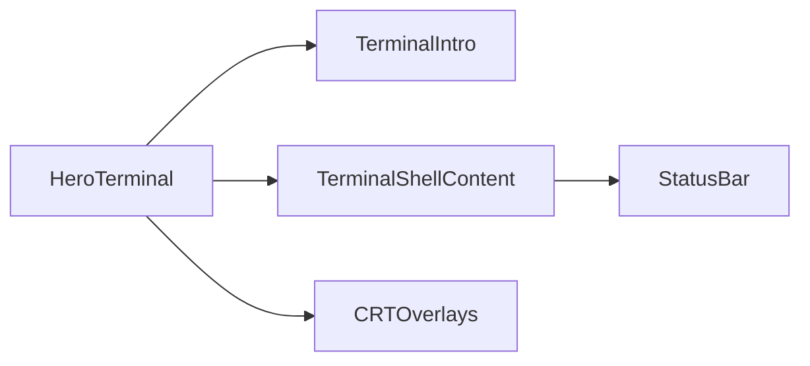

# Interactive Shell Functionality

<cite>
**Referenced Files in This Document**
- [terminal-shell.tsx](file://portfolio/src/components/terminal-shell.tsx)
- [terminal-intro.tsx](file://portfolio/src/components/terminal-intro.tsx)
- [hero-terminal.tsx](file://portfolio/src/components/hero-terminal.tsx)
- [status-bar.tsx](file://portfolio/src/components/status-bar.tsx)
- [crt-overlays.tsx](file://portfolio/src/components/crt-overlays.tsx)
</cite>

## Table of Contents
1. [Introduction](#introduction)
2. [Project Structure](#project-structure)
3. [Core Components](#core-components)
4. [Architecture Overview](#architecture-overview)
5. [Detailed Component Analysis](#detailed-component-analysis)
6. [Dependency Analysis](#dependency-analysis)
7. [Performance Considerations](#performance-considerations)
8. [Troubleshooting Guide](#troubleshooting-guide)
9. [Conclusion](#conclusion)
10. [Appendices](#appendices)

## Introduction
This document explains the Interactive Shell Functionality implemented in the portfolio application. It covers the terminal command interface, user interaction patterns, terminal introduction sequence, boot-up animations, and the onboarding flow. It also documents mobile-responsive design adaptations, touch and keyboard navigation, command parsing, command history, and integration with the main navigation system. Accessibility and cross-platform compatibility considerations are included.

## Project Structure
The interactive shell is composed of several cohesive components:
- HeroTerminal orchestrates the hero area, intro sequence, and shell content.
- TerminalIntro renders the animated introduction sequence with typing and boot logs.
- TerminalShellContent implements the live terminal with command parsing, history, and navigation integration.
- StatusBar provides a CRT-styled navigation bar synchronized with the shell’s commands.
- CRTOverlays adds optional scanline, noise, and vignette effects with reduced-motion awareness.

**Diagram sources**
- [hero-terminal.tsx](file://portfolio/src/components/hero-terminal.tsx#L14-L78)
- [terminal-intro.tsx](file://portfolio/src/components/terminal-intro.tsx#L28-L166)
- [terminal-shell.tsx](file://portfolio/src/components/terminal-shell.tsx#L30-L184)
- [status-bar.tsx](file://portfolio/src/components/status-bar.tsx#L24-L114)
- [crt-overlays.tsx](file://portfolio/src/components/crt-overlays.tsx#L5-L54)

**Section sources**
- [hero-terminal.tsx](file://portfolio/src/components/hero-terminal.tsx#L14-L78)
- [terminal-intro.tsx](file://portfolio/src/components/terminal-intro.tsx#L28-L166)
- [terminal-shell.tsx](file://portfolio/src/components/terminal-shell.tsx#L30-L184)
- [status-bar.tsx](file://portfolio/src/components/status-bar.tsx#L24-L114)
- [crt-overlays.tsx](file://portfolio/src/components/crt-overlays.tsx#L5-L54)

## Core Components
- HeroTerminal: Hosts the terminal container, manages intro visibility, and coordinates transitions to the live shell. It passes navigation and replay callbacks to child components.
- TerminalIntro: Implements a multi-phase intro sequence with typing animation, output display, and boot logs. Supports reduced-motion preferences.
- TerminalShellContent: Provides the live terminal experience with command input, history rendering, system info panel, and command buttons. Handles command parsing and navigation.
- StatusBar: Offers a top navigation bar with command labels and live time, integrating with the shell’s navigation.
- CRTOverlays: Adds CRT aesthetics via scanlines, noise, and vignette, with reduced-motion support.

**Section sources**
- [hero-terminal.tsx](file://portfolio/src/components/hero-terminal.tsx#L14-L78)
- [terminal-intro.tsx](file://portfolio/src/components/terminal-intro.tsx#L28-L166)
- [terminal-shell.tsx](file://portfolio/src/components/terminal-shell.tsx#L30-L184)
- [status-bar.tsx](file://portfolio/src/components/status-bar.tsx#L24-L114)
- [crt-overlays.tsx](file://portfolio/src/components/crt-overlays.tsx#L5-L54)

## Architecture Overview
The shell architecture separates concerns across presentation, animation, and navigation:
- Presentation: TerminalShellContent renders the terminal UI and handles user input.
- Animation: TerminalIntro drives the intro sequence and boot logs with controlled timing.
- Navigation: Both TerminalShellContent and StatusBar invoke onNavigate to synchronize page sections.
- Effects: CRTOverlays provides optional visual enhancements gated by reduced-motion preferences.

**Diagram sources**
- [hero-terminal.tsx](file://portfolio/src/components/hero-terminal.tsx#L29-L37)
- [terminal-intro.tsx](file://portfolio/src/components/terminal-intro.tsx#L28-L166)
- [terminal-shell.tsx](file://portfolio/src/components/terminal-shell.tsx#L30-L184)
- [status-bar.tsx](file://portfolio/src/components/status-bar.tsx#L24-L114)

## Detailed Component Analysis

### TerminalIntro: Animated Onboarding Sequence
TerminalIntro implements a four-phase animation:
- typing: Renders a single character per tick until the full command is shown.
- output: Renders a single character per tick for the command’s output.
- boot: Displays boot log entries sequentially.
- done: Completes the intro and signals completion.

It respects reduced-motion preferences by skipping animations and advancing directly to completion.

**Diagram sources**
- [terminal-intro.tsx](file://portfolio/src/components/terminal-intro.tsx#L28-L166)

**Section sources**
- [terminal-intro.tsx](file://portfolio/src/components/terminal-intro.tsx#L28-L166)

### TerminalShellContent: Live Terminal Experience
TerminalShellContent provides:
- Real-time system info (time, uptime) via periodic updates.
- Command input with normalization and parsing.
- Command history with distinct kinds: input, output, error.
- Navigation integration via onNavigate(section).
- Optional resume download and replay actions.
- Auto-scroll to bottom when new history entries are added.

Command parsing supports aliases and normalized whitespace to improve robustness.

**Diagram sources**
- [hero-terminal.tsx](file://portfolio/src/components/hero-terminal.tsx#L130-L173)
- [hero-terminal.tsx](file://portfolio/src/components/hero-terminal.tsx#L188-L193)

**Section sources**
- [hero-terminal.tsx](file://portfolio/src/components/hero-terminal.tsx#L92-L173)
- [hero-terminal.tsx](file://portfolio/src/components/hero-terminal.tsx#L188-L193)

### HeroTerminal: Container and Orchestration
HeroTerminal controls the hero area:
- Conditionally renders TerminalIntro or TerminalShellContent.
- Manages scanline sweep overlay lifecycle.
- Passes navigation and replay callbacks to child components.

**Diagram sources**
- [hero-terminal.tsx](file://portfolio/src/components/hero-terminal.tsx#L14-L78)

**Section sources**
- [hero-terminal.tsx](file://portfolio/src/components/hero-terminal.tsx#L14-L78)

### StatusBar: Navigation and Status
StatusBar synchronizes with the shell:
- Displays current time and online indicator.
- Shows navigation items mapped to shell commands.
- Emits onNavigate events to update active sections.
- Adapts labels based on viewport width.

**Diagram sources**
- [status-bar.tsx](file://portfolio/src/components/status-bar.tsx#L24-L114)

**Section sources**
- [status-bar.tsx](file://portfolio/src/components/status-bar.tsx#L24-L114)

### CRTOverlays: Visual Enhancements
CRTOverlays provides optional CRT aesthetics:
- Scanlines, noise, and vignette overlays.
- Detects reduced-motion preference and disables effects accordingly.
- ScanlineSweep animates a sweeping effect during intro transitions.

**Diagram sources**
- [crt-overlays.tsx](file://portfolio/src/components/crt-overlays.tsx#L5-L54)

**Section sources**
- [crt-overlays.tsx](file://portfolio/src/components/crt-overlays.tsx#L5-L54)

## Dependency Analysis
- HeroTerminal depends on TerminalIntro and TerminalShellContent, coordinating transitions and passing callbacks.
- TerminalShellContent depends on StatusBar for navigation synchronization and on HeroTerminal for replay/download actions.
- CRTOverlays is independent but integrated into HeroTerminal for visual effects.
- TerminalIntro is self-contained and communicates completion via callback.

**Diagram sources**
- [hero-terminal.tsx](file://portfolio/src/components/hero-terminal.tsx#L14-L78)
- [terminal-intro.tsx](file://portfolio/src/components/terminal-intro.tsx#L28-L166)
- [terminal-shell.tsx](file://portfolio/src/components/terminal-shell.tsx#L30-L184)
- [status-bar.tsx](file://portfolio/src/components/status-bar.tsx#L24-L114)
- [crt-overlays.tsx](file://portfolio/src/components/crt-overlays.tsx#L5-L54)

**Section sources**
- [hero-terminal.tsx](file://portfolio/src/components/hero-terminal.tsx#L14-L78)
- [terminal-intro.tsx](file://portfolio/src/components/terminal-intro.tsx#L28-L166)
- [terminal-shell.tsx](file://portfolio/src/components/terminal-shell.tsx#L30-L184)
- [status-bar.tsx](file://portfolio/src/components/status-bar.tsx#L24-L114)
- [crt-overlays.tsx](file://portfolio/src/components/crt-overlays.tsx#L5-L54)

## Performance Considerations
- Rendering optimization: TerminalShellContent is split into a separate component to prevent unnecessary re-renders of the hero container.
- Auto-scroll: Scroll position is updated only when history changes, minimizing DOM work.
- Reduced-motion: Animations are disabled when the user prefers reduced motion, improving performance and accessibility.
- Interval updates: System time and uptime updates occur at 1-second intervals; consider throttling if needed in heavy environments.

[No sources needed since this section provides general guidance]

## Troubleshooting Guide
- Commands not executing:
  - Verify command normalization and routing logic.
  - Ensure onNavigate is wired to the navigation system.
- History not appearing:
  - Confirm history array updates and render loop.
  - Check that auto-scroll runs after history updates.
- Intro stuck:
  - Ensure onComplete is called after boot logs finish.
  - Validate reduced-motion handling.
- Visual effects issues:
  - Confirm reduced-motion detection and overlay rendering.
  - Check that scanline sweep completes and triggers completion callback.

**Section sources**
- [hero-terminal.tsx](file://portfolio/src/components/hero-terminal.tsx#L130-L173)
- [terminal-intro.tsx](file://portfolio/src/components/terminal-intro.tsx#L28-L166)
- [crt-overlays.tsx](file://portfolio/src/components/crt-overlays.tsx#L33-L53)

## Conclusion
The Interactive Shell Functionality integrates an animated intro, a live terminal with command parsing, navigation synchronization, and CRT-style visual enhancements. It balances responsiveness, accessibility, and user experience across devices and motion preferences.

[No sources needed since this section summarizes without analyzing specific files]

## Appendices

### Adding New Terminal Commands
Steps to add a new command:
- Extend the command parser in TerminalShellContent to recognize the new command and produce appropriate output or navigation.
- Optionally add a command button in the commandButtons array.
- Ensure the command is reflected in the help listing and any navigation mapping.

Example reference paths:
- [Command parsing and routing](file://portfolio/src/components/hero-terminal.tsx#L130-L173)
- [Command buttons](file://portfolio/src/components/hero-terminal.tsx#L188-L193)

**Section sources**
- [hero-terminal.tsx](file://portfolio/src/components/hero-terminal.tsx#L130-L173)
- [hero-terminal.tsx](file://portfolio/src/components/hero-terminal.tsx#L188-L193)

### Implementing Command History
- Maintain a history array with entries of kind input, output, or error.
- Append new entries after command execution.
- Render history entries with appropriate styling and spacing.
- Auto-scroll to bottom when new entries are added.

Example reference paths:
- [History state and rendering](file://portfolio/src/components/hero-terminal.tsx#L102-L128)
- [History rendering loop](file://portfolio/src/components/hero-terminal.tsx#L224-L241)

**Section sources**
- [hero-terminal.tsx](file://portfolio/src/components/hero-terminal.tsx#L102-L128)
- [hero-terminal.tsx](file://portfolio/src/components/hero-terminal.tsx#L224-L241)

### Creating Interactive Demonstrations
- Use TerminalIntro to stage a guided walkthrough with typing and output phases.
- Combine with CRTOverlays for immersive visuals.
- Trigger replay via StatusBar or TerminalShellContent to re-run the demo.

Example reference paths:
- [Intro sequence phases](file://portfolio/src/components/terminal-intro.tsx#L28-L166)
- [Scanline sweep](file://portfolio/src/components/crt-overlays.tsx#L33-L53)

**Section sources**
- [terminal-intro.tsx](file://portfolio/src/components/terminal-intro.tsx#L28-L166)
- [crt-overlays.tsx](file://portfolio/src/components/crt-overlays.tsx#L33-L53)

### Mobile-Responsive Design and Interaction
- Responsive breakpoints:
  - System info panel hides on small screens.
  - Command labels in StatusBar adapt based on viewport width.
- Touch and keyboard:
  - Command input is focusable and submits on form submission.
  - Buttons are sized for touch targets.
- Reduced-motion:
  - All animations respect user preferences.

Example reference paths:
- [System info panel visibility](file://portfolio/src/components/terminal-shell.tsx#L114)
- [Command labels responsive behavior](file://portfolio/src/components/status-bar.tsx#L39-L46)
- [Reduced-motion handling](file://portfolio/src/components/terminal-intro.tsx#L37-L48)

**Section sources**
- [terminal-shell.tsx](file://portfolio/src/components/terminal-shell.tsx#L114)
- [status-bar.tsx](file://portfolio/src/components/status-bar.tsx#L39-L46)
- [terminal-intro.tsx](file://portfolio/src/components/terminal-intro.tsx#L37-L48)

### Accessibility and Cross-Platform Compatibility
- Screen reader support:
  - Proper aria-labels on inputs and buttons.
  - Structural markup for command history and prompts.
- Cross-platform:
  - Consistent keyboard navigation and input handling.
  - Reduced-motion compatibility ensures usability for motion-sensitive users.

Example reference paths:
- [Input accessibility attributes](file://portfolio/src/components/hero-terminal.tsx#L246-L254)
- [Button accessibility](file://portfolio/src/components/hero-terminal.tsx#L262-L268)
- [Reduced-motion detection](file://portfolio/src/components/crt-overlays.tsx#L8-L15)

**Section sources**
- [hero-terminal.tsx](file://portfolio/src/components/hero-terminal.tsx#L246-L254)
- [hero-terminal.tsx](file://portfolio/src/components/hero-terminal.tsx#L262-L268)
- [crt-overlays.tsx](file://portfolio/src/components/crt-overlays.tsx#L8-L15)