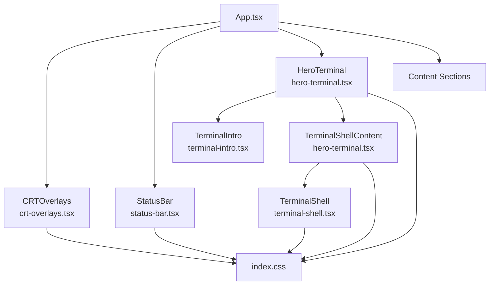
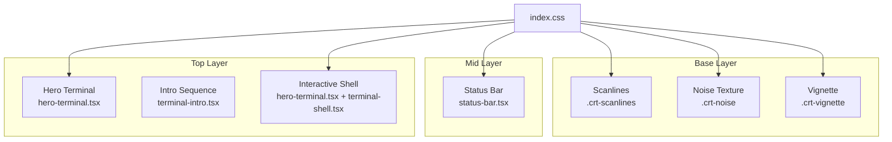
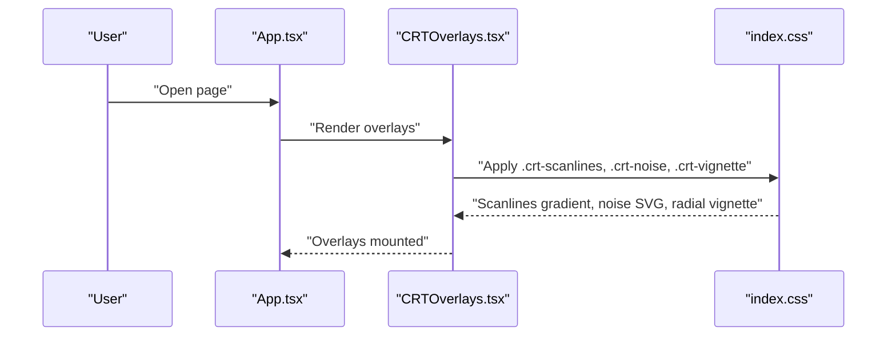
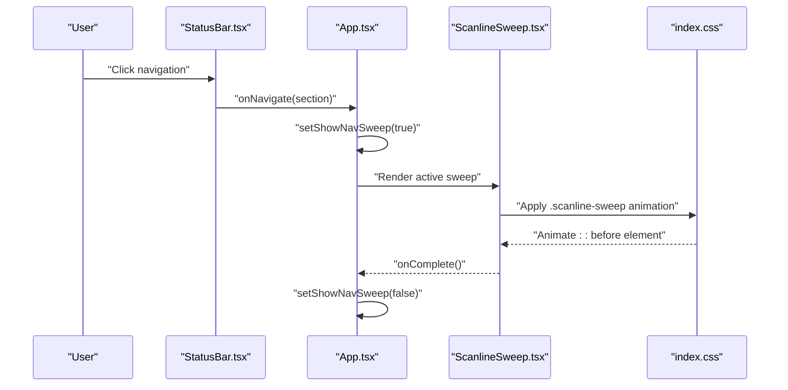
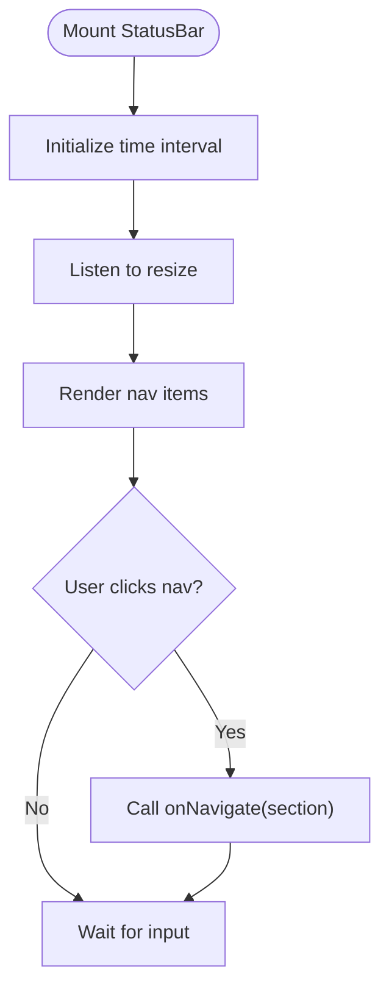
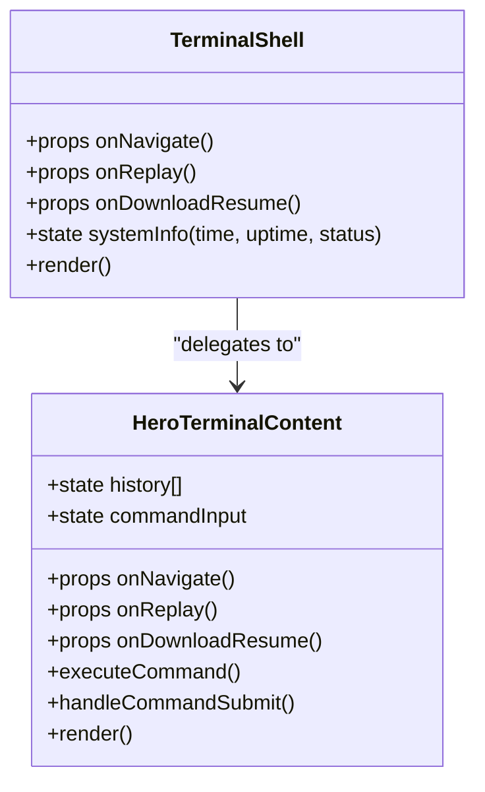
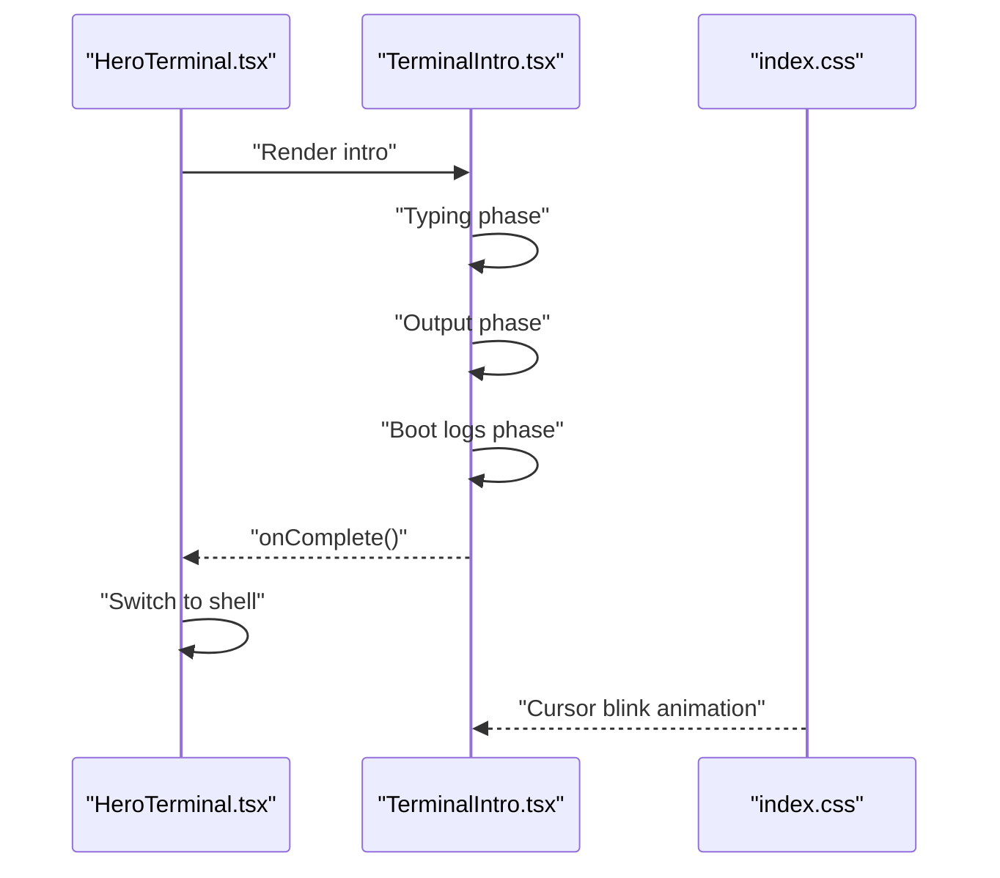
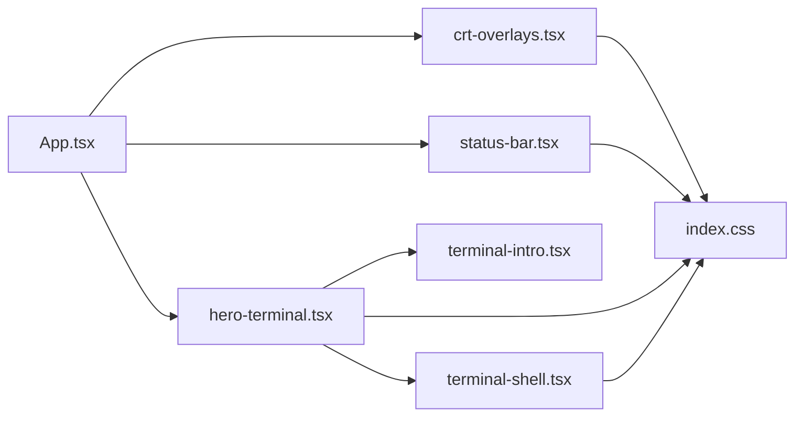

# Terminal Portfolio Application

<cite>
**Referenced Files in This Document**
- [App.tsx](file://portfolio/src/App.tsx)
- [main.tsx](file://portfolio/src/main.tsx)
- [index.css](file://portfolio/src/index.css)
- [crt-overlays.tsx](file://portfolio/src/components/crt-overlays.tsx)
- [status-bar.tsx](file://portfolio/src/components/status-bar.tsx)
- [hero-terminal.tsx](file://portfolio/src/components/hero-terminal.tsx)
- [terminal-intro.tsx](file://portfolio/src/components/terminal-intro.tsx)
- [terminal-shell.tsx](file://portfolio/src/components/terminal-shell.tsx)
</cite>

## Table of Contents
1. [Introduction](#introduction)
2. [Project Structure](#project-structure)
3. [Core Components](#core-components)
4. [Architecture Overview](#architecture-overview)
5. [Detailed Component Analysis](#detailed-component-analysis)
6. [Dependency Analysis](#dependency-analysis)
7. [Performance Considerations](#performance-considerations)
8. [Troubleshooting Guide](#troubleshooting-guide)
9. [Conclusion](#conclusion)
10. [Appendices](#appendices)

## Introduction
This document describes the Terminal Portfolio application, a retro-styled web experience that emulates vintage computer terminals. It focuses on the terminal UI architecture, including the shell interface, status bar functionality, navigation commands, CRT visual effects, typography and styling, responsive design, animated transitions, and customization/extensibility guidance. The goal is to help developers and designers understand how the terminal metaphor is implemented, how to adapt the visuals, and how to extend the interactive shell with new commands.

## Project Structure
The terminal experience is implemented as a React application with TypeScript and Tailwind CSS. The terminal UI is composed of several focused components:
- App orchestrates the page layout, CRT overlays, status bar, hero terminal, and content sections.
- CRT overlays provide scanline, noise, and vignette effects.
- Status bar displays navigation and system-like status indicators.
- Hero terminal hosts the animated intro and the interactive shell.
- Terminal intro renders a boot sequence with typing and output animations.
- Terminal shell provides the interactive command prompt and system info panel.

**Diagram sources**
- [App.tsx](file://portfolio/src/App.tsx#L87-L141)
- [crt-overlays.tsx](file://portfolio/src/components/crt-overlays.tsx#L5-L26)
- [status-bar.tsx](file://portfolio/src/components/status-bar.tsx#L24-L113)
- [hero-terminal.tsx](file://portfolio/src/components/hero-terminal.tsx#L14-L78)
- [terminal-intro.tsx](file://portfolio/src/components/terminal-intro.tsx#L28-L165)
- [terminal-shell.tsx](file://portfolio/src/components/terminal-shell.tsx#L30-L183)
- [index.css](file://portfolio/src/index.css#L102-L225)

**Section sources**
- [App.tsx](file://portfolio/src/App.tsx#L41-L141)
- [main.tsx](file://portfolio/src/main.tsx#L1-L11)

## Core Components
- CRT overlays: Provides scanlines, noise texture, and vignette via pure CSS and minimal React. Respects reduced-motion preferences.
- Status bar: Fixed header with navigation buttons, live clock, online indicator, and quick actions.
- Hero terminal: Hosts the intro sequence and the interactive shell; coordinates scanline sweep transitions.
- Terminal intro: Renders a boot sequence with animated typing and output, then proceeds to the shell.
- Terminal shell: Interactive command prompt with history, system info panel, and command buttons.

Key responsibilities:
- App.tsx manages global state for intro visibility, navigation sweep, and content opacity.
- index.css defines CRT color tokens, animations, and overlay styles.
- Components coordinate events (navigate, replay) and pass them up to App.tsx.

**Section sources**
- [crt-overlays.tsx](file://portfolio/src/components/crt-overlays.tsx#L5-L54)
- [status-bar.tsx](file://portfolio/src/components/status-bar.tsx#L24-L113)
- [hero-terminal.tsx](file://portfolio/src/components/hero-terminal.tsx#L14-L78)
- [terminal-intro.tsx](file://portfolio/src/components/terminal-intro.tsx#L28-L165)
- [terminal-shell.tsx](file://portfolio/src/components/terminal-shell.tsx#L30-L183)
- [index.css](file://portfolio/src/index.css#L6-L225)

## Architecture Overview
The terminal UI is a layered composition:
- Base layer: CRT overlays (scanlines, noise, vignette) rendered behind content.
- Mid layer: Status bar fixed at the top with navigation and status indicators.
- Top layer: Hero terminal containing either the intro or the interactive shell.
- Content layer: Sections become visible after intro completes.

**Diagram sources**
- [index.css](file://portfolio/src/index.css#L102-L225)
- [status-bar.tsx](file://portfolio/src/components/status-bar.tsx#L24-L113)
- [hero-terminal.tsx](file://portfolio/src/components/hero-terminal.tsx#L14-L78)
- [terminal-intro.tsx](file://portfolio/src/components/terminal-intro.tsx#L28-L165)
- [terminal-shell.tsx](file://portfolio/src/components/terminal-shell.tsx#L30-L183)

## Detailed Component Analysis

### CRT Effects Implementation
CRT overlays simulate phosphor glow, scanline refresh, noise texture, and subtle vignetting. They are implemented as lightweight React components that render static DOM elements with CSS-defined animations and filters. Reduced-motion support ensures accessibility.

**Diagram sources**
- [App.tsx](file://portfolio/src/App.tsx#L88-L93)
- [crt-overlays.tsx](file://portfolio/src/components/crt-overlays.tsx#L5-L26)
- [index.css](file://portfolio/src/index.css#L102-L139)

Implementation highlights:
- Scanlines: Repeating linear gradient with semi-transparent horizontal bands.
- Noise: SVG fractal noise overlay with low opacity.
- Vignette: Radial gradient for soft corner dimming.
- Reduced motion: Uses prefers-reduced-motion media query to disable animations.

**Section sources**
- [crt-overlays.tsx](file://portfolio/src/components/crt-overlays.tsx#L5-L54)
- [index.css](file://portfolio/src/index.css#L102-L139)

### Scanline Sweep Transition
The scanline sweep animates across the viewport during navigation to mimic CRT refresh. It is controlled by App.tsx state and respects reduced-motion preferences.

**Diagram sources**
- [App.tsx](file://portfolio/src/App.tsx#L64-L73)
- [status-bar.tsx](file://portfolio/src/components/status-bar.tsx#L48-L50)
- [crt-overlays.tsx](file://portfolio/src/components/crt-overlays.tsx#L33-L53)
- [index.css](file://portfolio/src/index.css#L141-L175)

Behavior:
- Triggered when navigating between sections.
- Duration is 180ms; disabled under reduced motion.
- Uses a pseudo-element (::before) to draw a glowing horizontal stripe.

**Section sources**
- [App.tsx](file://portfolio/src/App.tsx#L64-L73)
- [crt-overlays.tsx](file://portfolio/src/components/crt-overlays.tsx#L33-L53)
- [index.css](file://portfolio/src/index.css#L141-L175)

### Status Bar Functionality
The status bar provides quick navigation, live time, online indicator, and resume link. It adapts labels based on viewport width and highlights the active section.

**Diagram sources**
- [status-bar.tsx](file://portfolio/src/components/status-bar.tsx#L24-L113)

Features:
- Live clock updates every second.
- Responsive labels: command variants on small screens, full labels on larger.
- Active section highlighting with glow and blinking marker.
- Online indicator with pulse animation.
- Quick links: Resume download and Replay intro.

**Section sources**
- [status-bar.tsx](file://portfolio/src/components/status-bar.tsx#L24-L113)

### Terminal Shell Interface
The terminal shell presents a two-pane layout: command history/output area on the left and a system info panel on the right. It supports an interactive prompt, command history, and a set of command buttons.

**Diagram sources**
- [terminal-shell.tsx](file://portfolio/src/components/terminal-shell.tsx#L30-L183)
- [hero-terminal.tsx](file://portfolio/src/components/hero-terminal.tsx#L92-L329)

Interactive elements:
- Command prompt with blinking cursor.
- Command buttons: HELP, VIEW PROJECTS, DOWNLOAD CV, REPLAY.
- System info panel: TIME, UPTIME, STATUS, PROFILE, STACK.
- Auto-scroll to bottom of output history.

Command handling (selected):
- help: Lists allowed commands.
- cat about.txt / about: Navigate to About.
- skills --list / skills: Navigate to Skills.
- ls projects/ / projects: Navigate to Projects.
- ping pamod / contact: Navigate to Contact.
- Unknown commands: Show error in history.

**Section sources**
- [terminal-shell.tsx](file://portfolio/src/components/terminal-shell.tsx#L30-L183)
- [hero-terminal.tsx](file://portfolio/src/components/hero-terminal.tsx#L130-L178)

### Terminal Intro Sequence
The intro simulates a boot process with animated typing of commands and outputs, followed by boot logs and a transition to the shell.

**Diagram sources**
- [hero-terminal.tsx](file://portfolio/src/components/hero-terminal.tsx#L29-L37)
- [terminal-intro.tsx](file://portfolio/src/components/terminal-intro.tsx#L28-L165)
- [index.css](file://portfolio/src/index.css#L177-L189)

Phases:
- Typing: Animates command characters.
- Output: Animates response text.
- Boot logs: Displays system readiness messages.
- Done: Triggers completion callback.

Accessibility:
- Detects reduced-motion preference and skips animations.

**Section sources**
- [terminal-intro.tsx](file://portfolio/src/components/terminal-intro.tsx#L28-L165)

### Terminal Typography and Styling System
Typography and styling are centralized in index.css:
- CRT color tokens define background, borders, accents, and glows.
- JetBrains Mono is used for monospace rendering.
- Cursor blink animation and glow effects for text.
- Scrollbar styling with CRT palette.
- Reduced-motion overrides for accessibility.

Responsive adaptations:
- Status bar switches between compact and expanded labels based on viewport width.
- System info panel is hidden on small screens and shown on medium+.

**Section sources**
- [index.css](file://portfolio/src/index.css#L6-L225)
- [status-bar.tsx](file://portfolio/src/components/status-bar.tsx#L40-L46)
- [hero-terminal.tsx](file://portfolio/src/components/hero-terminal.tsx#L273-L274)

## Dependency Analysis
The terminal UI composes several modules with clear boundaries and minimal coupling.

**Diagram sources**
- [App.tsx](file://portfolio/src/App.tsx#L4-L12)
- [crt-overlays.tsx](file://portfolio/src/components/crt-overlays.tsx#L1-L3)
- [status-bar.tsx](file://portfolio/src/components/status-bar.tsx#L1-L3)
- [hero-terminal.tsx](file://portfolio/src/components/hero-terminal.tsx#L1-L5)
- [terminal-intro.tsx](file://portfolio/src/components/terminal-intro.tsx#L1-L3)
- [terminal-shell.tsx](file://portfolio/src/components/terminal-shell.tsx#L1-L3)
- [index.css](file://portfolio/src/index.css#L1-L225)

Observations:
- App.tsx depends on StatusBar, HeroTerminal, CRT overlays, and content sections.
- HeroTerminal depends on TerminalIntro and TerminalShellContent.
- CRT overlays depend on CSS for visual effects.
- All components depend on index.css for theming and animations.

**Section sources**
- [App.tsx](file://portfolio/src/App.tsx#L4-L12)
- [hero-terminal.tsx](file://portfolio/src/components/hero-terminal.tsx#L4-L5)
- [crt-overlays.tsx](file://portfolio/src/components/crt-overlays.tsx#L1-L3)

## Performance Considerations
- Animations:
  - CRT overlays and scanline sweep rely on CSS animations and transforms; they are GPU-friendly and respect reduced-motion.
  - Cursor blink uses a simple keyframes animation; disabled under reduced motion.
- Rendering:
  - HeroTerminal separates intro and shell content to avoid unnecessary re-renders.
  - Terminal history is appended and scrolled automatically; consider virtualization for very long histories.
- Accessibility:
  - Reduced-motion queries disable animations to prevent motion-induced discomfort.
- Browser compatibility:
  - CSS variables and modern animations are widely supported; ensure polyfills if targeting legacy browsers.
  - prefers-reduced-motion is supported in modern browsers; graceful degradation is handled by the components.

[No sources needed since this section provides general guidance]

## Troubleshooting Guide
Common issues and resolutions:
- Overlays not visible:
  - Verify CRT overlay components are rendered and CSS classes are applied.
  - Check that reduced-motion is not enabled in system settings.
- Scanline sweep not triggering:
  - Ensure onNavigate is called from StatusBar and that App.tsx sets showNavSweep.
  - Confirm the sweep animation duration matches the timeout.
- Status bar labels not adapting:
  - Confirm resize handler is attached and viewport width thresholds are met.
- Terminal prompt not blinking:
  - Ensure cursor-blink class is present and reduced-motion is not active.
- Intro not completing:
  - Check media query handling for reduced motion and that onComplete is invoked after boot logs.

**Section sources**
- [crt-overlays.tsx](file://portfolio/src/components/crt-overlays.tsx#L8-L15)
- [crt-overlays.tsx](file://portfolio/src/components/crt-overlays.tsx#L36-L48)
- [status-bar.tsx](file://portfolio/src/components/status-bar.tsx#L40-L46)
- [terminal-intro.tsx](file://portfolio/src/components/terminal-intro.tsx#L37-L48)
- [index.css](file://portfolio/src/index.css#L177-L189)

## Conclusion
The Terminal Portfolio application demonstrates a cohesive, accessible, and visually consistent retro terminal experience. Its modular architecture enables easy customization of CRT aesthetics, interactive commands, and responsive behavior. By leveraging CSS variables, media queries, and minimal React state, the system balances nostalgic fidelity with modern performance and accessibility.

[No sources needed since this section summarizes without analyzing specific files]

## Appendices

### Customizing Terminal Appearance
- Color scheme:
  - Adjust CRT tokens in the root and theme blocks to change backgrounds, borders, and glows.
  - Example tokens: --crt-bg, --crt-panel, --crt-text, --crt-accent, --crt-glow.
- Typography:
  - Modify --font-sans and --font-mono to change terminal fonts.
- Effects:
  - Tune scanline thickness/opacity, noise intensity, and vignette radius.
  - Adjust scanline sweep timing and glow strength.

**Section sources**
- [index.css](file://portfolio/src/index.css#L6-L80)
- [index.css](file://portfolio/src/index.css#L102-L175)

### Adding New Interactive Commands
Steps:
- Extend command parsing in TerminalShellContent:
  - Add a new branch in executeCommand for the new command.
  - Push appropriate history entries (input, output, error).
  - Trigger navigation or external actions as needed.
- Update command buttons:
  - Add a new button mapped to the command handler.
- Optional:
  - Add a new pane or widget to display results if needed.

**Section sources**
- [hero-terminal.tsx](file://portfolio/src/components/hero-terminal.tsx#L130-L178)
- [hero-terminal.tsx](file://portfolio/src/components/hero-terminal.tsx#L188-L193)

### Extending Retro Styling System
- New CRT effect:
  - Define a new CSS class in index.css with overlay semantics.
  - Wrap it in a React component similar to CRTOverlays for lifecycle control.
- Enhanced animations:
  - Introduce new keyframes and apply to existing or new elements.
  - Respect reduced-motion by duplicating logic similar to existing components.
- Theming:
  - Add new tokens to the root/theme blocks and consume them via CSS variables.

**Section sources**
- [crt-overlays.tsx](file://portfolio/src/components/crt-overlays.tsx#L5-L26)
- [index.css](file://portfolio/src/index.css#L102-L225)