# Terminal UI Architecture

<cite>
**Referenced Files in This Document**
- [App.tsx](file://portfolio/src/App.tsx)
- [hero-terminal.tsx](file://portfolio/src/components/hero-terminal.tsx)
- [terminal-intro.tsx](file://portfolio/src/components/terminal-intro.tsx)
- [terminal-shell.tsx](file://portfolio/src/components/terminal-shell.tsx)
- [status-bar.tsx](file://portfolio/src/components/status-bar.tsx)
- [crt-overlays.tsx](file://portfolio/src/components/crt-overlays.tsx)
- [use-section-spy.ts](file://portfolio/src/hooks/use-section-spy.ts)
- [use-portfolio-data.ts](file://portfolio/src/hooks/use-portfolio-data.ts)
</cite>

## Table of Contents
1. [Introduction](#introduction)
2. [Project Structure](#project-structure)
3. [Core Components](#core-components)
4. [Architecture Overview](#architecture-overview)
5. [Detailed Component Analysis](#detailed-component-analysis)
6. [Dependency Analysis](#dependency-analysis)
7. [Performance Considerations](#performance-considerations)
8. [Troubleshooting Guide](#troubleshooting-guide)
9. [Conclusion](#conclusion)

## Introduction
This document describes the Terminal UI Architecture for the portfolio application. It focuses on the terminal-style interface design, the integration of CRT overlays, the status bar navigation, and the content sections. It explains how the terminal shell interface works, how the status bar provides navigation controls, and how the section spy mechanism tracks viewport positions. It also covers data fetching hooks, local storage integration for intro completion tracking, and smooth scrolling navigation with scanline sweep effects. Finally, it outlines component composition patterns, state management for navigation states, and the relationships between UI layers, along with responsive design and performance optimizations.

## Project Structure
The terminal UI lives in the portfolio application and is composed of several focused components:
- App container orchestrates the terminal experience and manages intro visibility and navigation.
- HeroTerminal hosts the animated intro and the terminal shell content.
- TerminalIntro renders a boot sequence with typing and output animations.
- TerminalShell provides the main terminal interface with system info and command buttons.
- StatusBar displays navigation controls and live status indicators.
- CRTOverlays adds retro visual effects (scanlines, noise, vignette) and a scanline sweep effect.
- use-section-spy tracks active sections via intersection observers and provides smooth scrolling.
- use-portfolio-data fetches and caches portfolio data with fallback logic.

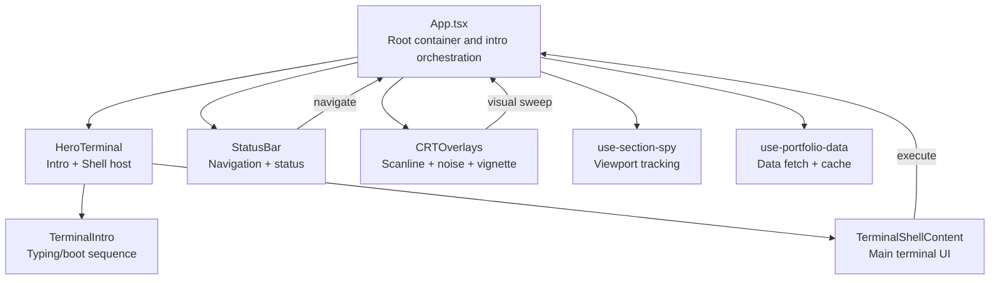

**Diagram sources**
- [App.tsx](file://portfolio/src/App.tsx#L41-L141)
- [hero-terminal.tsx](file://portfolio/src/components/hero-terminal.tsx#L14-L78)
- [terminal-intro.tsx](file://portfolio/src/components/terminal-intro.tsx#L28-L165)
- [terminal-shell.tsx](file://portfolio/src/components/terminal-shell.tsx#L30-L183)
- [status-bar.tsx](file://portfolio/src/components/status-bar.tsx#L24-L113)
- [crt-overlays.tsx](file://portfolio/src/components/crt-overlays.tsx#L5-L53)
- [use-section-spy.ts](file://portfolio/src/hooks/use-section-spy.ts#L11-L81)
- [use-portfolio-data.ts](file://portfolio/src/hooks/use-portfolio-data.ts#L136-L224)

**Section sources**
- [App.tsx](file://portfolio/src/App.tsx#L41-L141)

## Core Components
- App.tsx: Hosts the entire terminal experience. Manages intro completion state, scroll prevention during intro, navigation sweep effects, and passes callbacks to child components. It also coordinates the CRT overlays and status bar.
- HeroTerminal: Renders either the intro sequence or the terminal shell content. Handles intro completion and triggers the scanline sweep before transitioning out of the intro.
- TerminalIntro: Implements a multi-phase intro with typing animation, output display, and boot log progression. Respects reduced motion preferences and completes automatically when motion is disabled.
- TerminalShell: Provides the main terminal interface with system info, command history, prompt, and command buttons. Includes a command interpreter that maps simple commands to navigation actions.
- StatusBar: Fixed header with navigation buttons, live time, online indicator, and a resume link. Controls visibility of command labels based on screen size.
- CRTOverlays: Adds CRT-like visual overlays and a scanline sweep effect. Respects reduced motion preferences.
- use-section-spy: Tracks active sections using IntersectionObserver with debouncing and provides smooth scrolling to sections.
- use-portfolio-data: Fetches portfolio settings, skills, and projects from the server with caching and fallback to local defaults.

**Section sources**
- [App.tsx](file://portfolio/src/App.tsx#L41-L141)
- [hero-terminal.tsx](file://portfolio/src/components/hero-terminal.tsx#L14-L78)
- [terminal-intro.tsx](file://portfolio/src/components/terminal-intro.tsx#L28-L165)
- [terminal-shell.tsx](file://portfolio/src/components/terminal-shell.tsx#L30-L183)
- [status-bar.tsx](file://portfolio/src/components/status-bar.tsx#L24-L113)
- [crt-overlays.tsx](file://portfolio/src/components/crt-overlays.tsx#L5-L53)
- [use-section-spy.ts](file://portfolio/src/hooks/use-section-spy.ts#L11-L81)
- [use-portfolio-data.ts](file://portfolio/src/hooks/use-portfolio-data.ts#L136-L224)

## Architecture Overview
The terminal UI follows a layered composition:
- Layer 1: App orchestrates intro lifecycle, navigation sweep, and global state.
- Layer 2: HeroTerminal hosts the intro and shell content, coordinating transitions.
- Layer 3: StatusBar provides navigation and status indicators.
- Layer 4: CRTOverlays adds visual polish and sweep effects.
- Layer 5: use-section-spy monitors viewport and drives navigation state.
- Layer 6: use-portfolio-data supplies content and settings with caching.

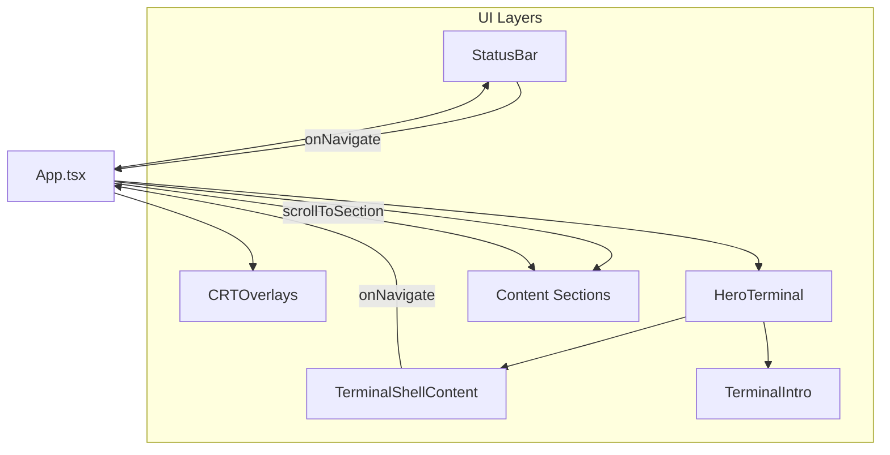

**Diagram sources**
- [App.tsx](file://portfolio/src/App.tsx#L41-L141)
- [status-bar.tsx](file://portfolio/src/components/status-bar.tsx#L24-L113)
- [crt-overlays.tsx](file://portfolio/src/components/crt-overlays.tsx#L5-L53)
- [hero-terminal.tsx](file://portfolio/src/components/hero-terminal.tsx#L14-L78)
- [terminal-shell.tsx](file://portfolio/src/components/terminal-shell.tsx#L30-L183)
- [terminal-intro.tsx](file://portfolio/src/components/terminal-intro.tsx#L28-L165)

## Detailed Component Analysis

### App.tsx: Terminal Experience Orchestration
Responsibilities:
- Manages intro completion state and prevents scrolling while the intro is active.
- Coordinates scanline sweep during navigation and transitions HeroTerminal content.
- Passes navigation callbacks to StatusBar and HeroTerminal.
- Integrates CRT overlays globally.

Key behaviors:
- Intro lifecycle: reads local storage to decide whether to skip intro; disables body scroll until intro completes.
- Navigation sweep: toggles a flag to trigger ScanlineSweep before scrolling to a section.
- Smooth scrolling: uses the section spy’s scrollToSection to navigate with smooth behavior.

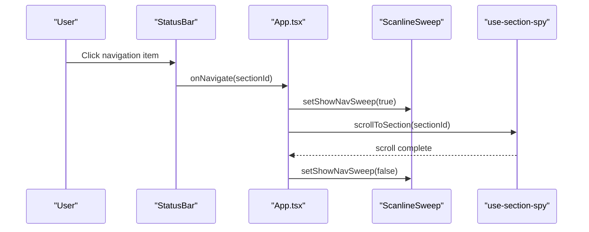

**Diagram sources**
- [App.tsx](file://portfolio/src/App.tsx#L64-L73)
- [status-bar.tsx](file://portfolio/src/components/status-bar.tsx#L48-L50)
- [crt-overlays.tsx](file://portfolio/src/components/crt-overlays.tsx#L33-L53)
- [use-section-spy.ts](file://portfolio/src/hooks/use-section-spy.ts#L72-L78)

**Section sources**
- [App.tsx](file://portfolio/src/App.tsx#L41-L141)

### HeroTerminal: Intro and Shell Host
Responsibilities:
- Conditionally renders TerminalIntro or TerminalShellContent based on intro completion.
- Triggers scanline sweep after intro completion and then signals App to finalize the intro.

Behavior:
- Intro skip logic respects the skipIntro prop.
- After intro completion, sets sweep state and invokes onIntroComplete callback.

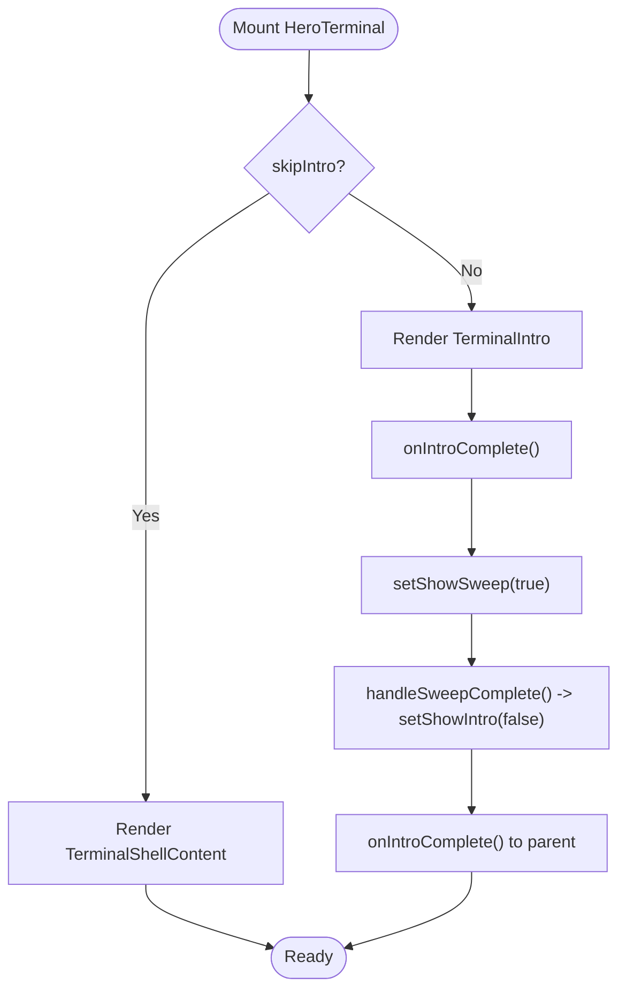

**Diagram sources**
- [hero-terminal.tsx](file://portfolio/src/components/hero-terminal.tsx#L14-L78)
- [terminal-intro.tsx](file://portfolio/src/components/terminal-intro.tsx#L28-L165)
- [crt-overlays.tsx](file://portfolio/src/components/crt-overlays.tsx#L33-L53)

**Section sources**
- [hero-terminal.tsx](file://portfolio/src/components/hero-terminal.tsx#L14-L78)

### TerminalIntro: Animated Boot Sequence
Responsibilities:
- Renders a multi-line typing animation for commands, followed by output display, then boot logs.
- Supports reduced motion by skipping animations and completing immediately.
- Emits completion callback when finished.

Phases:
- typing: progressively types the next command.
- output: progressively prints the associated output.
- boot: displays boot log entries.
- done: signals completion.

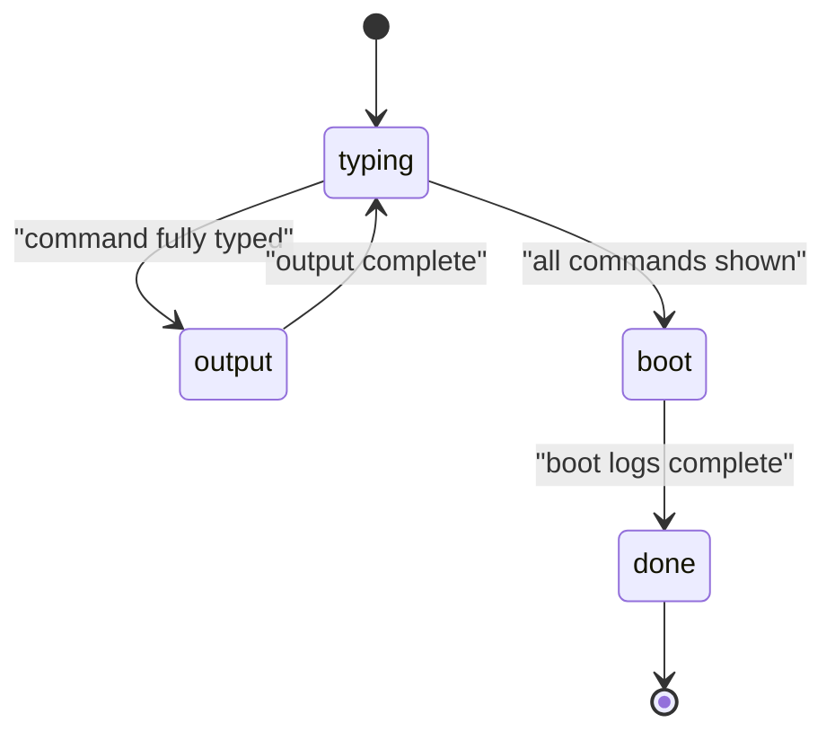

**Diagram sources**
- [terminal-intro.tsx](file://portfolio/src/components/terminal-intro.tsx#L28-L165)

**Section sources**
- [terminal-intro.tsx](file://portfolio/src/components/terminal-intro.tsx#L28-L165)

### TerminalShell: Main Terminal Interface
Responsibilities:
- Displays system info (time, uptime, status), profile, and stack details.
- Provides command buttons mapped to navigation actions.
- Includes a command interpreter that recognizes simple commands and navigates accordingly.

Command mapping:
- help: lists allowed commands.
- cat about.txt or about: navigates to the about section.
- skills --list or skills: navigates to the skills section.
- ls projects/ or projects: navigates to the projects section.
- ping pamod or contact: navigates to the contact section.
- Unknown commands: produce an error in the terminal history.

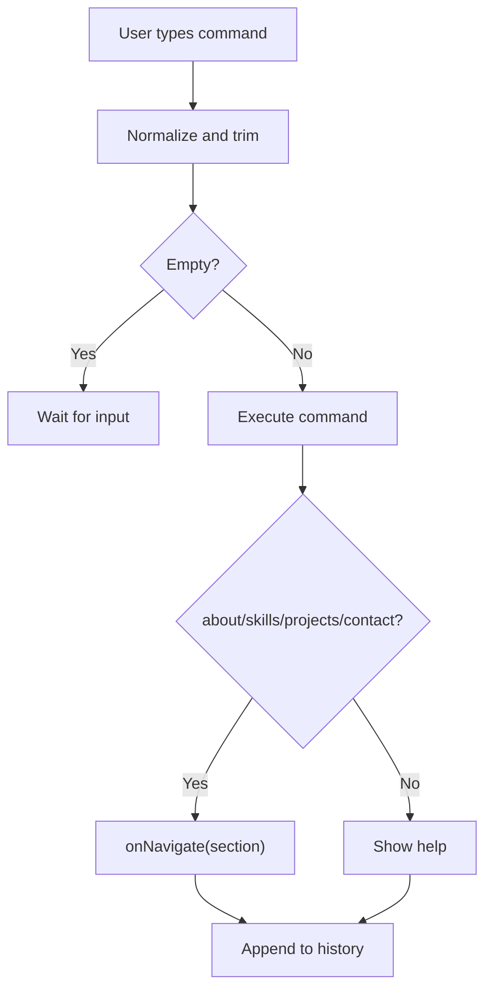

**Diagram sources**
- [terminal-shell.tsx](file://portfolio/src/components/terminal-shell.tsx#L30-L183)
- [hero-terminal.tsx](file://portfolio/src/components/hero-terminal.tsx#L92-L178)

**Section sources**
- [terminal-shell.tsx](file://portfolio/src/components/terminal-shell.tsx#L30-L183)

### StatusBar: Navigation and Status
Responsibilities:
- Displays navigation items with labels and command equivalents.
- Shows live time and online status indicator.
- Provides a resume link and a replay button.

Responsive behavior:
- Command labels are hidden on small screens; only short labels are shown.
- Time updates every second.

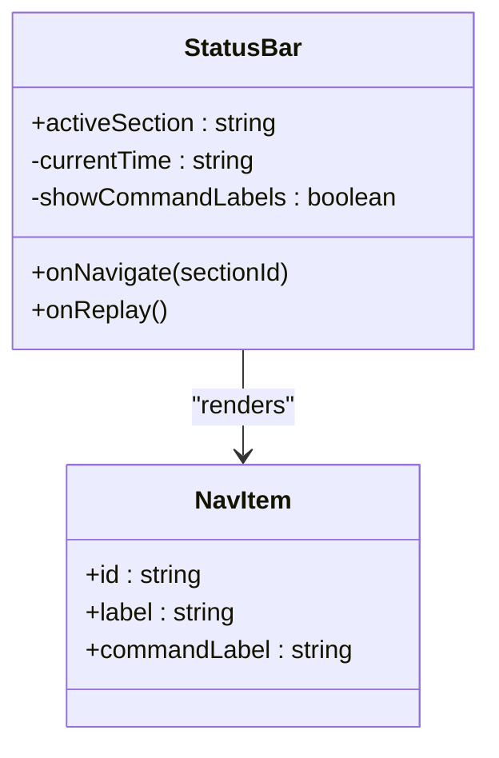

**Diagram sources**
- [status-bar.tsx](file://portfolio/src/components/status-bar.tsx#L24-L113)

**Section sources**
- [status-bar.tsx](file://portfolio/src/components/status-bar.tsx#L24-L113)

### CRTOverlays and Scanline Sweep
Responsibilities:
- CRTOverlays: Adds scanlines, noise, and vignette effects; respects reduced motion.
- ScanlineSweep: Provides a sweeping overlay during navigation with a configurable delay.

Integration:
- App.tsx toggles the sweep state before calling scrollToSection.
- HeroTerminal triggers sweep after intro completion.

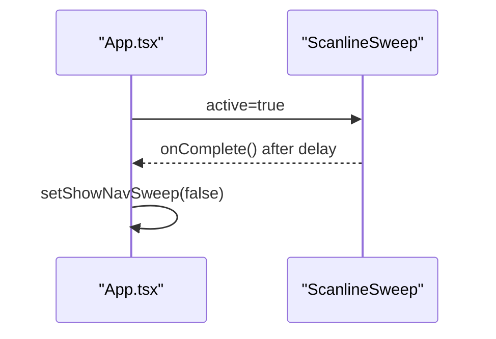

**Diagram sources**
- [crt-overlays.tsx](file://portfolio/src/components/crt-overlays.tsx#L33-L53)
- [App.tsx](file://portfolio/src/App.tsx#L64-L73)

**Section sources**
- [crt-overlays.tsx](file://portfolio/src/components/crt-overlays.tsx#L5-L53)

### Section Spy Mechanism
Responsibilities:
- Tracks which section is currently in view using IntersectionObserver.
- Debounces updates to avoid frequent re-renders.
- Provides scrollToSection with smooth behavior and updates active section.

Configuration:
- sectionIds: array of section identifiers.
- offset: intersection observer root margin to trigger earlier.
- debounceMs: throttles active section updates.

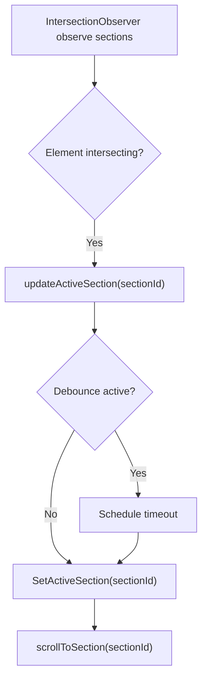

**Diagram sources**
- [use-section-spy.ts](file://portfolio/src/hooks/use-section-spy.ts#L39-L78)

**Section sources**
- [use-section-spy.ts](file://portfolio/src/hooks/use-section-spy.ts#L11-L81)

### Data Fetching and Local Storage Integration
Responsibilities:
- use-portfolio-data: fetches settings, skills, and projects from the server concurrently.
- Uses caching with TTL and max stale thresholds; falls back to defaults when offline.
- Applies partial server payloads by merging with cached or default values.

Local storage:
- App.tsx checks a dedicated key to decide whether to skip the intro.
- On intro completion, marks the intro as seen in local storage.

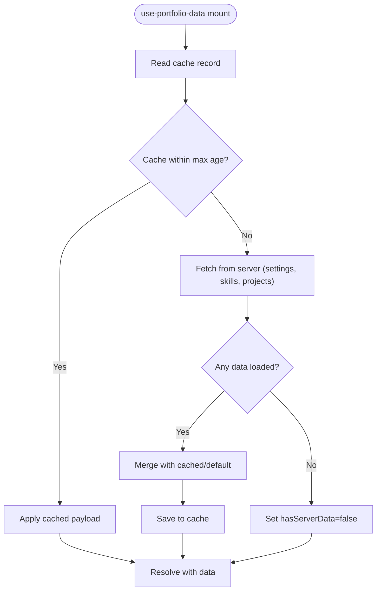

**Diagram sources**
- [use-portfolio-data.ts](file://portfolio/src/hooks/use-portfolio-data.ts#L136-L224)
- [App.tsx](file://portfolio/src/App.tsx#L17-L39)

**Section sources**
- [use-portfolio-data.ts](file://portfolio/src/hooks/use-portfolio-data.ts#L136-L224)
- [App.tsx](file://portfolio/src/App.tsx#L17-L39)

## Dependency Analysis
Component relationships:
- App.tsx depends on StatusBar, CRTOverlays, HeroTerminal, use-section-spy, and use-portfolio-data.
- HeroTerminal depends on TerminalIntro and TerminalShellContent.
- StatusBar and TerminalShell both call onNavigate passed by App.tsx.
- CRTOverlays is rendered unconditionally by App.tsx but conditionally animated.
- use-section-spy is used by App.tsx to compute activeSection and to scroll to sections.

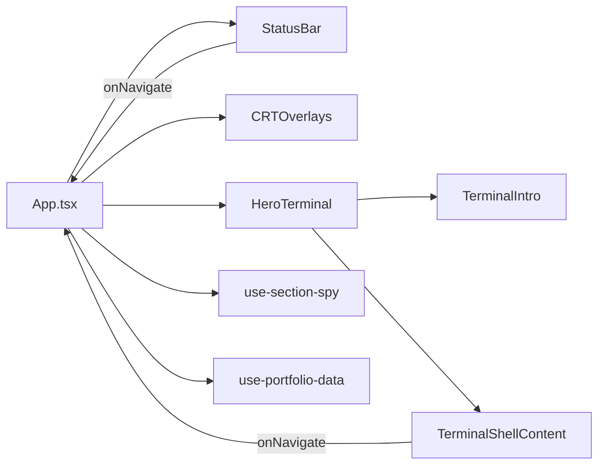

**Diagram sources**
- [App.tsx](file://portfolio/src/App.tsx#L41-L141)
- [status-bar.tsx](file://portfolio/src/components/status-bar.tsx#L24-L113)
- [crt-overlays.tsx](file://portfolio/src/components/crt-overlays.tsx#L5-L53)
- [hero-terminal.tsx](file://portfolio/src/components/hero-terminal.tsx#L14-L78)
- [terminal-shell.tsx](file://portfolio/src/components/terminal-shell.tsx#L30-L183)
- [terminal-intro.tsx](file://portfolio/src/components/terminal-intro.tsx#L28-L165)
- [use-section-spy.ts](file://portfolio/src/hooks/use-section-spy.ts#L11-L81)
- [use-portfolio-data.ts](file://portfolio/src/hooks/use-portfolio-data.ts#L136-L224)

**Section sources**
- [App.tsx](file://portfolio/src/App.tsx#L41-L141)

## Performance Considerations
- Reduced motion support: All animations respect reduced motion preferences and disable transitions/animations when enabled.
- Debounced section tracking: use-section-spy debounces updates to minimize re-renders and layout thrashing.
- IntersectionObserver: Efficiently detects viewport changes without polling the DOM.
- Local storage and caching: Intro completion and portfolio data caching reduce network usage and improve perceived performance.
- Smooth scrolling: Uses native smooth scrolling to avoid heavy animation libraries.
- Conditional rendering: Intro is hidden after completion; content sections fade in after intro to avoid layout shifts.

[No sources needed since this section provides general guidance]

## Troubleshooting Guide
Common issues and resolutions:
- Intro does not complete:
  - Verify local storage availability and permissions.
  - Ensure the intro completion callback is invoked and the sweep effect completes.
- Navigation does not scroll:
  - Confirm section IDs match HTML element IDs.
  - Check that use-section-spy is initialized with the correct sectionIds and offset.
- Scanline sweep not visible:
  - Ensure the sweep state is toggled before scrolling and cleared after completion.
  - Verify reduced motion settings are not forcing instant completion.
- Terminal commands not working:
  - Confirm command normalization logic matches user input.
  - Ensure onNavigate is wired correctly from TerminalShell to App.tsx.
- Data not loading:
  - Check network connectivity and server endpoints.
  - Verify cache expiration and max stale thresholds.
  - Confirm fallback logic sets hasServerData appropriately.

**Section sources**
- [App.tsx](file://portfolio/src/App.tsx#L52-L85)
- [use-section-spy.ts](file://portfolio/src/hooks/use-section-spy.ts#L39-L78)
- [crt-overlays.tsx](file://portfolio/src/components/crt-overlays.tsx#L33-L53)
- [terminal-shell.tsx](file://portfolio/src/components/terminal-shell.tsx#L130-L178)
- [use-portfolio-data.ts](file://portfolio/src/hooks/use-portfolio-data.ts#L166-L207)

## Conclusion
The terminal UI architecture combines a nostalgic CRT aesthetic with modern React patterns. App.tsx orchestrates the intro, navigation, and global state, while HeroTerminal bridges the intro and shell experiences. StatusBar and CRTOverlays provide navigation and visual polish, respectively. The section spy ensures accurate viewport tracking, and the data hook delivers robust content with caching and fallbacks. Together, these components deliver a responsive, accessible, and performant terminal-style interface.