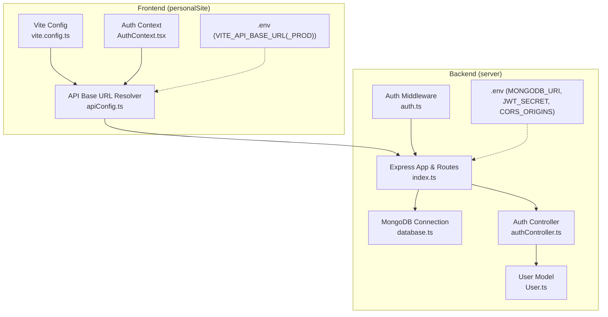
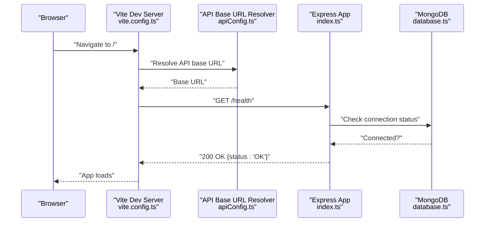
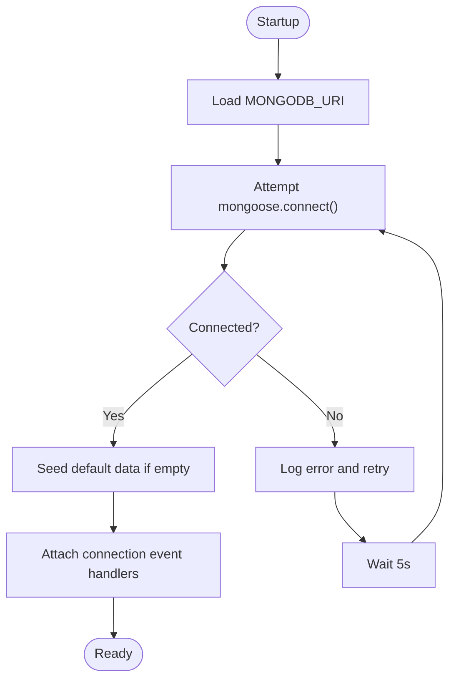
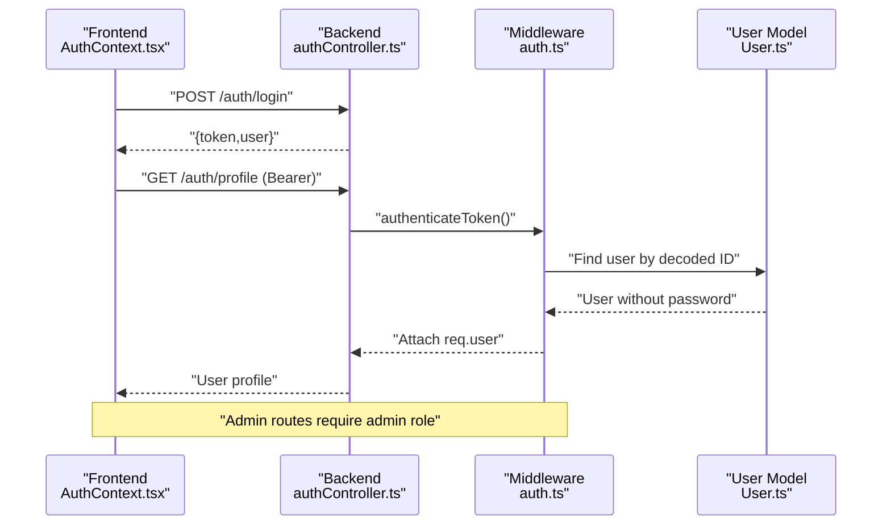
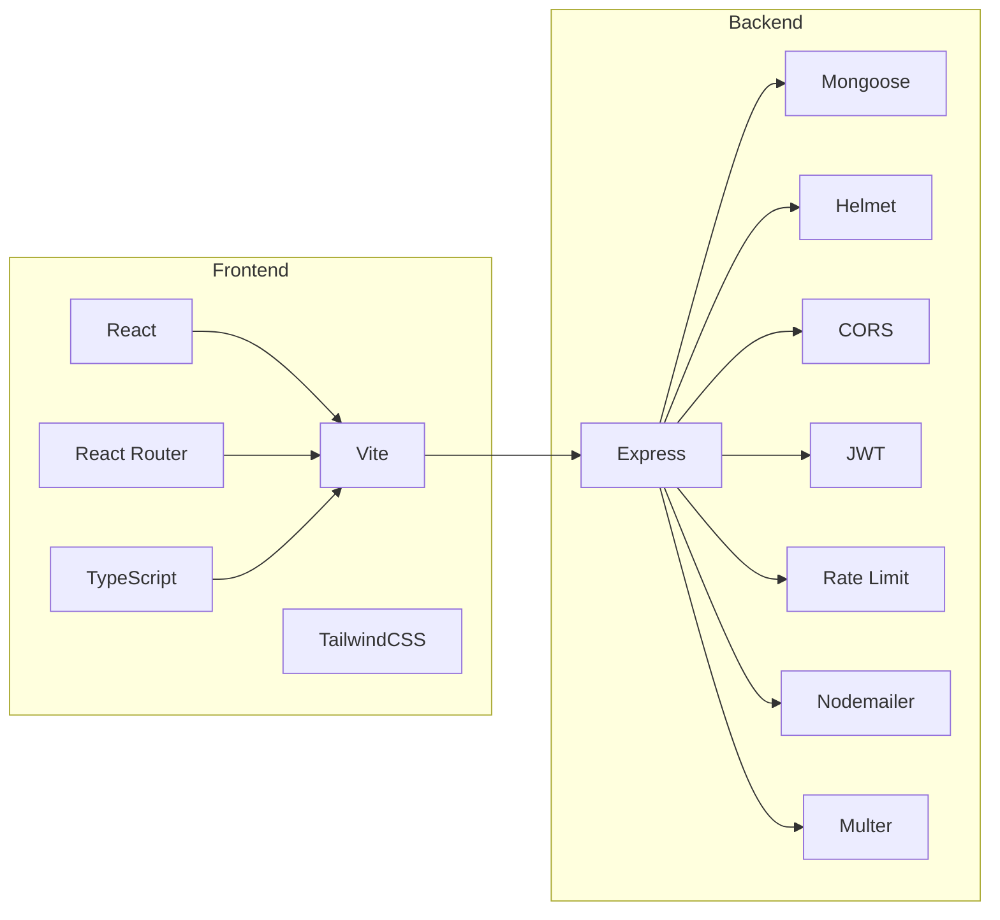

# Troubleshooting and FAQ

<cite>
**Referenced Files in This Document**
- [personalSite/.env](file://personalSite/.env)
- [server/.env](file://server/.env)
- [personalSite/vite.config.ts](file://personalSite/vite.config.ts)
- [personalSite/src/lib/apiConfig.ts](file://personalSite/src/lib/apiConfig.ts)
- [personalSite/src/contexts/AuthContext.tsx](file://personalSite/src/contexts/AuthContext.tsx)
- [server/src/config/database.ts](file://server/src/config/database.ts)
- [server/src/controllers/authController.ts](file://server/src/controllers/authController.ts)
- [server/src/middleware/auth.ts](file://server/src/middleware/auth.ts)
- [server/src/models/User.ts](file://server/src/models/User.ts)
- [server/src/index.ts](file://server/src/index.ts)
- [personalSite/package.json](file://personalSite/package.json)
- [server/package.json](file://server/package.json)
- [personalSite/tsconfig.json](file://personalSite/tsconfig.json)
- [server/tsconfig.json](file://server/tsconfig.json)
- [personalSite/public/CNAME](file://personalSite/public/CNAME)
</cite>

## Table of Contents
1. [Introduction](#introduction)
2. [Project Structure](#project-structure)
3. [Core Components](#core-components)
4. [Architecture Overview](#architecture-overview)
5. [Detailed Component Analysis](#detailed-component-analysis)
6. [Dependency Analysis](#dependency-analysis)
7. [Performance Considerations](#performance-considerations)
8. [Troubleshooting Guide](#troubleshooting-guide)
9. [Conclusion](#conclusion)
10. [Appendices](#appendices)

## Introduction
This document provides comprehensive troubleshooting guidance and FAQs for the Personal Portfolio Platform. It focuses on:
- Database connectivity (MongoDB), authentication (JWT), and build/deployment issues
- Authentication troubleshooting (tokens, sessions, permissions)
- Build errors (Vite, TypeScript, dependencies)
- Deployment pitfalls (environment variables, SSL, domains)
- Performance optimization (caching, indexing, API tuning, bundles)
- Debugging, logging, and monitoring strategies

## Project Structure
The platform consists of:
- Frontend (React + Vite + TypeScript) under personalSite/
- Backend (Express + TypeScript + Mongoose) under server/
- Shared environment configuration (.env files) and deployment artifacts (public/CNAME, dist)

**Diagram sources**
- [personalSite/vite.config.ts](file://personalSite/vite.config.ts#L10-L35)
- [personalSite/src/lib/apiConfig.ts](file://personalSite/src/lib/apiConfig.ts#L6-L49)
- [personalSite/src/contexts/AuthContext.tsx](file://personalSite/src/contexts/AuthContext.tsx#L36-L76)
- [server/src/index.ts](file://server/src/index.ts#L22-L117)
- [server/src/config/database.ts](file://server/src/config/database.ts#L6-L56)
- [server/src/controllers/authController.ts](file://server/src/controllers/authController.ts#L22-L78)
- [server/src/middleware/auth.ts](file://server/src/middleware/auth.ts#L9-L30)
- [server/src/models/User.ts](file://server/src/models/User.ts#L14-L56)
- [personalSite/.env](file://personalSite/.env#L4-L7)
- [server/.env](file://server/.env#L3-L14)

**Section sources**
- [personalSite/vite.config.ts](file://personalSite/vite.config.ts#L10-L35)
- [personalSite/src/lib/apiConfig.ts](file://personalSite/src/lib/apiConfig.ts#L6-L49)
- [server/src/index.ts](file://server/src/index.ts#L22-L117)
- [server/src/config/database.ts](file://server/src/config/database.ts#L6-L56)

## Core Components
- API base URL resolution determines whether frontend communicates with local or production backend via environment variables.
- Authentication context persists tokens and user state, validates tokens against backend, and navigates on success/failure.
- Backend connects to MongoDB with retry logic and emits connection events; exposes auth endpoints guarded by middleware.
- Environment variables drive frontend/backend behavior, including API endpoints, secrets, CORS, and ports.

**Section sources**
- [personalSite/src/lib/apiConfig.ts](file://personalSite/src/lib/apiConfig.ts#L6-L49)
- [personalSite/src/contexts/AuthContext.tsx](file://personalSite/src/contexts/AuthContext.tsx#L36-L76)
- [server/src/config/database.ts](file://server/src/config/database.ts#L6-L56)
- [server/src/middleware/auth.ts](file://server/src/middleware/auth.ts#L9-L30)

## Architecture Overview
The frontend proxies API calls to the backend and resolves the base URL from environment variables. The backend enforces CORS, rate limits, and JWT-based authentication. MongoDB connection is established at startup with automatic retries.

**Diagram sources**
- [personalSite/vite.config.ts](file://personalSite/vite.config.ts#L10-L35)
- [personalSite/src/lib/apiConfig.ts](file://personalSite/src/lib/apiConfig.ts#L6-L49)
- [server/src/index.ts](file://server/src/index.ts#L129-L131)
- [server/src/config/database.ts](file://server/src/config/database.ts#L59-L61)

## Detailed Component Analysis

### Database Connectivity (MongoDB)
Common issues:
- Incorrect URI or credentials
- Network restrictions (e.g., IP whitelist, VPN)
- Connection pool exhaustion or timeouts
- Reconnection loops causing intermittent availability

Resolution steps:
1. Verify MONGODB_URI correctness and accessibility from host.
2. Confirm network/firewall allows outbound to MongoDB Atlas.
3. Adjust connection options (pool size, timeouts) if needed.
4. Monitor logs for reconnection attempts and errors.
5. Ensure environment variables are loaded in production.

**Diagram sources**
- [server/src/config/database.ts](file://server/src/config/database.ts#L6-L56)

**Section sources**
- [server/src/config/database.ts](file://server/src/config/database.ts#L6-L56)
- [server/.env](file://server/.env#L3-L3)

### Authentication (JWT, Sessions, Permissions)
Common issues:
- Missing Authorization header
- Invalid/expired token
- Role-based access denied
- Frontend token/session desync

Resolution steps:
1. Ensure frontend sends Authorization: Bearer <token>.
2. Validate token against backend profile endpoint.
3. Confirm JWT_SECRET matches backend environment.
4. Check admin role assignment logic and user roles.
5. Clear stale localStorage tokens on logout.

**Diagram sources**
- [personalSite/src/contexts/AuthContext.tsx](file://personalSite/src/contexts/AuthContext.tsx#L78-L99)
- [server/src/controllers/authController.ts](file://server/src/controllers/authController.ts#L135-L142)
- [server/src/middleware/auth.ts](file://server/src/middleware/auth.ts#L9-L30)
- [server/src/models/User.ts](file://server/src/models/User.ts#L14-L56)

**Section sources**
- [personalSite/src/contexts/AuthContext.tsx](file://personalSite/src/contexts/AuthContext.tsx#L58-L76)
- [server/src/middleware/auth.ts](file://server/src/middleware/auth.ts#L9-L30)
- [server/src/controllers/authController.ts](file://server/src/controllers/authController.ts#L135-L142)
- [server/src/models/User.ts](file://server/src/models/User.ts#L14-L56)

### Build Errors (Vite, TypeScript, Dependencies)
Common issues:
- Vite proxy misconfiguration
- Missing environment variables
- TypeScript strictness or path mapping
- Dependency conflicts or missing peer deps
- Prerender/sitemap generation failures

Resolution steps:
1. Confirm VITE_API_BASE_URL(_PROD) present and reachable.
2. Ensure Vite proxy target matches backend port.
3. Check tsconfig path aliases and strictness settings.
4. Run clean install and resolve peer dependency warnings.
5. Validate prerender script and react-snap configuration.

**Section sources**
- [personalSite/vite.config.ts](file://personalSite/vite.config.ts#L10-L35)
- [personalSite/src/lib/apiConfig.ts](file://personalSite/src/lib/apiConfig.ts#L6-L49)
- [personalSite/tsconfig.json](file://personalSite/tsconfig.json#L4-L15)
- [personalSite/package.json](file://personalSite/package.json#L6-L14)
- [personalSite/package.json](file://personalSite/package.json#L96-L111)

### Deployment Issues (Environment, SSL, Domains)
Common issues:
- Incorrect FRONTEND_URL or CORS_ORIGINS
- Missing or incorrect CNAME
- GitHub Pages routing for SPA
- Mixed content or HTTPS redirects

Resolution steps:
1. Set FRONTEND_URL and CORS_ORIGINS to match deployment origin(s).
2. Add CNAME pointing to GitHub Pages domain.
3. Ensure Vite base path and history API fallback are configured.
4. Test health endpoint and static site rendering.
5. Verify SSL termination and HSTS policies if applicable.

**Section sources**
- [server/src/index.ts](file://server/src/index.ts#L38-L83)
- [personalSite/public/CNAME](file://personalSite/public/CNAME#L1-L1)
- [personalSite/vite.config.ts](file://personalSite/vite.config.ts#L10-L35)

## Dependency Analysis
Key runtime dependencies and their roles:
- Frontend: React, React Router, Radix UI, TailwindCSS, Vite, TypeScript
- Backend: Express, Mongoose, Helmet, CORS, JWT, Rate Limit, Nodemailer, Multer

**Diagram sources**
- [personalSite/package.json](file://personalSite/package.json#L15-L74)
- [personalSite/package.json](file://personalSite/package.json#L75-L95)
- [server/package.json](file://server/package.json#L12-L27)
- [server/package.json](file://server/package.json#L28-L38)

**Section sources**
- [personalSite/package.json](file://personalSite/package.json#L15-L95)
- [server/package.json](file://server/package.json#L12-L38)

## Performance Considerations
- Caching strategies:
  - Frontend: Persist validated tokens and user profiles; invalidate on logout.
  - Backend: Cache non-sensitive reads with appropriate TTL; avoid caching PII.
- Database indexing:
  - Ensure unique indexes on email and username; consider compound indexes for frequent queries.
- API performance tuning:
  - Apply rate limiting; compress responses; paginate heavy lists.
- Bundle optimization:
  - Split vendor chunks; enable esbuild minification; remove unused assets.

[No sources needed since this section provides general guidance]

## Troubleshooting Guide

### Database Connection Problems
Symptoms:
- Application starts but reports “Database connection unavailable”
- Intermittent timeouts or disconnects
- Reconnection attempts logged repeatedly

Steps:
1. Confirm MONGODB_URI is correct and reachable from host.
2. Check firewall and network ACLs for MongoDB Atlas.
3. Review connection options (pool size, timeouts) and adjust as needed.
4. Inspect backend logs for connection errors and reconnection events.
5. Validate environment loading in production (process.env vs. dotenv).

Preventive measures:
- Use dedicated secrets management in production.
- Monitor connection events and alert on repeated disconnections.
- Keep MongoDB driver and Node.js versions aligned.

**Section sources**
- [server/src/config/database.ts](file://server/src/config/database.ts#L6-L56)
- [server/.env](file://server/.env#L3-L3)

### Authentication Failures (JWT, Sessions, Permissions)
Symptoms:
- 401 Access token required
- 403 Invalid or expired token
- 403 Admin access required
- Login/register succeeds but navigation fails

Steps:
1. Verify Authorization header presence and format.
2. Confirm JWT_SECRET matches backend environment.
3. Validate token by calling profile endpoint.
4. Check admin role assignment logic and user roles.
5. Clear localStorage tokens and restart session.

Preventive measures:
- Rotate JWT_SECRET regularly.
- Implement token refresh strategy if needed.
- Enforce role checks on protected routes.

**Section sources**
- [server/src/middleware/auth.ts](file://server/src/middleware/auth.ts#L9-L30)
- [server/src/controllers/authController.ts](file://server/src/controllers/authController.ts#L135-L142)
- [server/src/models/User.ts](file://server/src/models/User.ts#L14-L56)
- [personalSite/src/contexts/AuthContext.tsx](file://personalSite/src/contexts/AuthContext.tsx#L58-L76)

### Build Errors (Vite, TypeScript, Dependencies)
Symptoms:
- Vite proxy returns 404 or CORS errors
- TypeScript compile errors or path mapping issues
- Dependency conflicts or missing peer dependencies
- Prerender fails with sitemap generation

Steps:
1. Ensure VITE_API_BASE_URL(_PROD) is defined and correct.
2. Confirm Vite proxy target equals backend port and origin.
3. Align tsconfig path aliases and strictness with project expectations.
4. Resolve peer dependency warnings and align versions.
5. Run SEO sitemap generation and prerender steps separately.

Preventive measures:
- Pin dependency versions in lockfiles.
- Use pre-commit hooks to lint and type-check.
- Validate build locally before pushing.

**Section sources**
- [personalSite/src/lib/apiConfig.ts](file://personalSite/src/lib/apiConfig.ts#L6-L49)
- [personalSite/vite.config.ts](file://personalSite/vite.config.ts#L10-L35)
- [personalSite/tsconfig.json](file://personalSite/tsconfig.json#L4-L15)
- [personalSite/package.json](file://personalSite/package.json#L6-L14)
- [personalSite/package.json](file://personalSite/package.json#L96-L111)

### Deployment Issues (Environment, SSL, Domains)
Symptoms:
- CORS blocked for origin
- 404 on deep links after refresh
- Wrong domain or mixed content errors
- Health endpoint unreachable

Steps:
1. Set FRONTEND_URL and CORS_ORIGINS to include deployment origin(s).
2. Add CNAME file with correct domain.
3. Enable history API fallback and ensure SPA routing works.
4. Test health endpoint and static rendering.
5. Verify SSL termination and redirect policies.

Preventive measures:
- Automate environment validation in CI.
- Use canonical URLs and proper meta tags.
- Monitor uptime and error rates.

**Section sources**
- [server/src/index.ts](file://server/src/index.ts#L38-L83)
- [personalSite/public/CNAME](file://personalSite/public/CNAME#L1-L1)
- [personalSite/vite.config.ts](file://personalSite/vite.config.ts#L26-L32)

### Performance Optimization
Recommendations:
- Frontend caching: Persist validated tokens and user profiles; invalidate on logout.
- Backend caching: Cache non-sensitive reads; avoid caching sensitive data.
- Database: Create indexes on frequently queried fields; monitor slow queries.
- API: Apply rate limiting; compress responses; paginate large lists.
- Bundling: Split vendor chunks; enable esbuild minification; remove unused assets.

[No sources needed since this section provides general guidance]

### Debugging Techniques, Logging, Monitoring
Techniques:
- Frontend: Use browser devtools Network tab; inspect Authorization headers; check localStorage.
- Backend: Enable verbose logs for DB connection events; log request IDs; capture stack traces.
- Environment: Print effective CORS origins and API base URL at startup.

Monitoring:
- Health endpoint for uptime checks.
- Database connection status logs.
- Error boundaries and global error handlers.

**Section sources**
- [server/src/index.ts](file://server/src/index.ts#L129-L155)
- [server/src/config/database.ts](file://server/src/config/database.ts#L27-L44)

## Conclusion
By systematically validating environment variables, ensuring correct CORS and proxy configurations, managing JWT lifecycle, and optimizing builds and deployments, most issues can be resolved quickly. Adopt preventive measures such as secret rotation, automated validation, and robust logging to maintain a reliable platform.

[No sources needed since this section summarizes without analyzing specific files]

## Appendices

### Environment Variables Reference
- Frontend (personalSite):
  - VITE_API_BASE_URL: Local backend URL
  - VITE_API_BASE_URL_PROD: Production backend URL
- Backend (server):
  - MONGODB_URI: MongoDB connection string
  - JWT_SECRET: Secret for signing tokens
  - PORT: Backend listening port
  - FRONTEND_URL: Allowed frontend origin
  - CORS_ORIGINS: Comma-separated allowed origins

**Section sources**
- [personalSite/.env](file://personalSite/.env#L4-L7)
- [server/.env](file://server/.env#L3-L14)