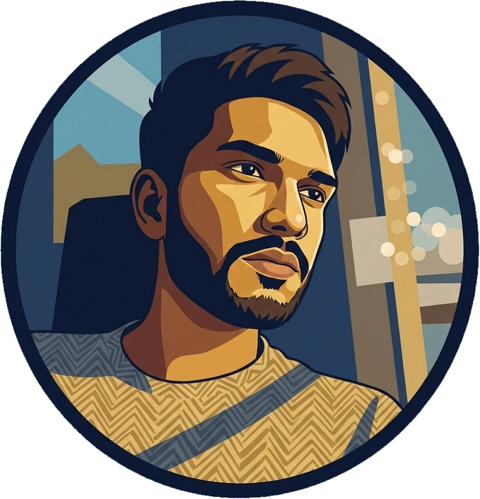

<div align="center">

# Personal Portfolio Platform



Full-stack portfolio platform with admin dashboard and CMS capabilities.

</div>

## Tech Stack

- Frontend: React, TypeScript, Vite, Tailwind CSS, Framer Motion, React Router
- Backend: Node.js, Express, TypeScript, MongoDB, Mongoose
- Database: MongoDB
- Other: REST API, JWT Authentication, Multer (file upload), Nodemailer

## Why This Project Exists

- Problem: Need for a professional portfolio website with content management capabilities
- Goal: Create a customizable portfolio platform with admin dashboard for easy content updates
- Outcome: Fully functional portfolio site with blog, project showcase, and admin panel

## Project Structure

```
.
├── personalSite/           # Main frontend application (React/Vite)
│   ├── src/
│   │   ├── components/     # Reusable UI components
│   │   ├── pages/          # Page components
│   │   ├── api/            # API clients
│   │   └── contexts/       # React contexts
│   └── package.json
├── server/                 # Backend API (Express/Node.js)
│   ├── src/
│   │   ├── controllers/    # Request handlers
│   │   ├── models/         # Database models
│   │   ├── routes/         # API routes
│   │   └── middleware/     # Custom middleware
│   └── package.json
├── portfolio/              # Alternative portfolio frontend
│   └── src/
├── assets/                 # Static assets
└── README.md
```

## Screenshots

Screenshots will be added soon.

## Key Features

- Responsive portfolio website with modern UI
- Admin dashboard for content management
- Blog/article publishing system
- Project showcase with detailed views
- Timeline and experience tracking
- Technology skills management
- Contact form with email notifications
- File upload capabilities
- User authentication and authorization
- RESTful API architecture
